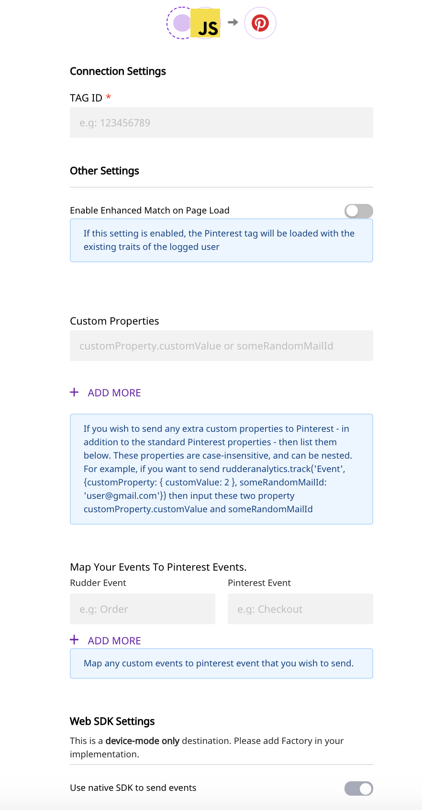

# Pinterest Tag

The [Pinterest Ads Tag](https://ads.pinterest.com/) is a piece of code that, when added to your website, allows Pinterest to track your visitors as well as their actions. It gives you a detailed conversion report related to any and all customer activities like signups or buying a product.

RudderStack supports Pinterest as a destination to which you can send your customer events in real-time, through Pinterest's `pintrk` conversion tag.

<div class="infoBlock">

Find the implementation of this integration on our <a href="https://github.com/rudderlabs/rudder-sdk-js/tree/production/integrations/PinterestTag">GitHub</a>.

</div>

## Getting Started

To enable sending data to **Pinterest**, you will first need to add it as a destination to the source from which you are sending your event data. Once the destination is enabled, events from RudderStack will start flowing to Pinterest.

Before configuring your source and destination on the RudderStack, please verify if the source platform is supported by Pinterest Tag, by referring to the table below:

| **Connection Mode** | Web           | Mobile | Server |
| :------------------ | :------------ | :----- | :----- |
| **Device Mode**     | **Supported** | **-**  | **-**  |
| **Cloud Mode**      | **-**         | **-**  | **-**  |

<div class="infoBlock">

To know more about the difference between Cloud mode and Device mode in RudderStack, read the <a href="https://rudderstack.com/docs/connections/rudderstack-connection-modes/">RudderStack connection modes</a> guide.

</div>

Once you have confirmed that the platform supports sending events to Pinterest, perform the steps below:

- Choose a source to which you would like to add Pinterest as a destination.

<div class="infoBlock">

Please follow our <a href="https://rudderstack.com/docs/connections/adding-source-and-destination-rudderstack/">Adding a Source and Destination</a> guide to add a source in RudderStack.

</div>

- After configuring your source, select the destination as **Pinterest Tag**. Give this destination a name and then click on **Next**.
- On the **Connection Settings** page, enter the relevant settings in the fields - including the **Pinterest Tag ID** - and then click on **Next**.



## Enable Enhanced Match

Rudderstack supports Pinterest Enhanced Match in the following two scenarios:

- Where a user is identified every time they visit your site.
- When a user visits your site anonymously but is identified at some later point by making an `identify()` call.

To support Pinterest Enhanced Match, go to the Pinterest Tag destination settings in the RudderStack dashboard and turn on the **Enable Enhanced Match on Page Load** option.

### Enable Enhanced Match on Page Load

When enabled, this configuration will attach the hashed email address on the initial page load. Now any call made to Pinterest will be an Enhanced Match.

If this setting is not enabled, all the visits made to your site will be anonymous. But you can still identify any user by making the `identify()` call.

If you use Rudderstack's `identify()` method to enable Pinterest’s Enhanced Match, you can only collect this information for successive events. Pinterest does not update the values for the past events retroactively.

## Identify

When you make an `identify()` call with the user’s email address and traits, RudderStack triggers a Pinterest `set()` method. This saves the identification parameters to be sent with the next events, so it’s important to set the values as early as possible.

If you make an `identify` call without the email, then the identification parameter will not be set.

```javascript
rudderanalytics.identify("sample_user_id", {
  name: "Test name",
  email: "test@email.com",
})
```

This call will set the identification parameters to `test@email.com` and any successive calls made will be an Enhanced Match.

<div class="infoBlock">

Nothing appears in the network tab in your browser or in the tag helper extension after <code class="inline-code">identify()</code> is called. However, a hashed value for an <code class="inline-code">em</code> parameter is added in the next event call, in a JSON object encoded in the URL.

</div>

## Track

The `track` call allows you to capture any action that the user might perform, along with any properties that are associated with that action. Each action is considered to be an event.

A sample `track` call looks like the following:

```javascript
rudderanalytics.track("Track me")
```

RudderStack's SDK will send the `track` event name and any properties as custom properties to Pinterest.

## E-Commerce

RudderStack supports E-Commerce conversion tracking for Pinterest. Use the [RudderStack eCommerce Specification](https://rudderstack.com/docs/rudderstack-api/api-specification/rudderstack-ecommerce-events-specification/) for sending the events while instrumenting your site with the RudderStack SDK.

Below are some examples of the `track` event names that are passed to the Pinterest event:

| RudderStack event name | Pinterest event name |
| :--------------------- | :------------------- |
| Order Completed        | `Checkout`           |
| Product Added          | `AddToCart`          |
| Products Searched      | `Search`             |
| Product List Filtered    | `Search`             |

You can also track a custom event that you want to include in your conversion reporting. This will get mapped to a custom Pinterest event. An example is as shown:

```javascript
rudderanalytics.track("custom")
```

If you wish to map your event to a specific Pinterest event, you can do so by adding it in the **Map Your Events To Pinterest Events** section while configuring your Pinterest destination in RudderStack.

### Map Your Events To Pinterest Events

Pinterest supports following 9 standard events that one can map and track them for reporting.

- `Checkout`
- `AddToCart`
- `PageVisit`
- `SignUp`
- `WatchVideo`
- `Lead`
- `Search`
- `ViewCategory`
- `Custom`

Apart from that if the event sent is not found in our list we pass those events and Pinterest treats them as user-defined events. Note, these events aren’t available for conversion reporting.

## Properties Mapping

Rudderstack automatically binds the following properties to the Pinterest event properties:

| RudderStack property name | Pinterest property name |
| :------------------------ | :---------------------- |
| query                     | `search_query`          |
| value                     | `value`                 |
| order_quantity            | `order_quantity`        |
| currency                  | `currency`              |
| order_id                  | `order_id`              |
| promo_code                | `promo_code`            |
| property                  | `property`              |
| video_title               | `video_title`           |
| lead_type                 | `lead_type`             |
| coupon                    | `coupon`                |

The following properties are nested within the E-Commerce products array:

| RudderStack Property Name | Pinterest Property Name |
| :------------------------ | :---------------------- |
| product_id                | `product_id`            |
| sku                       | `product_id`            |
| name                      | `product_name`          |
| price                     | `product_price`         |
| category                  | `product_category`      |
| variant                   | `product_variant`       |
| quantity                  | `product_quantity`      |
| brand                     | `product_brand`         |

<div class="successBlock">

  If you wish to pass any extra properties other than what we support, you can
  use our **Custom Properties** section while configuring your
  Pinterest destination in RudderStack.
</div>

### Custom Properties

If you wish to send your defined properties to Pinterest, you can do so by using the **Custom Properties** section. Just add those properties in the given field and you are good to go.

Here is an example of how it all works:

```javascript
rudderanalytics.track("Event", {
  customProperty: {
    customValue: 2,
  },
  someRandomMailId: "user@gmail.com",
})
```

For streaming the above properties in Pinterest, you will need to add the following two properties:

- `customProperty.customValue`
- `someRandomMailId`

## Page

Pinterest's `pintrk` sends any one following of two events every time you make a `page` call.

When making a `page` call you can provide the name, category, and any other additional properties. RudderStack sends the `ViewCategory` event if both the name and category fields are present. In case only name is present, RudderStack sends a `PageVisit` event and drops any additional properties.

In case you want to send any additional properties to Pinterest, you need to mention them in the **Custom Properties** section while configuring the Pinterest destination in the RudderStack dashboard.

```javascript
rudderanalytics.page("I am new page", "new page category", {
  path: "path",
  url: "url",
  title: "title",
  search: "search",
  referrer: "referrer",
  testDimension: "true",
})
```

This above example will map to Pinterest `ViewCategory` event.

```javascript
rudderanalytics.page("I am new page with no name", {
  path: "path",
})
```

The above example will map the event to Pinterest `PageVisit` event.

## FAQs

### **How do I get the Pinterest Tag ID?**

- Login to your Pinterest Ads dashboard.
- Click on the **Ads** dropdown and go to **Conversions**. It will open the Pinterest Tag Manager.
- Now click on Generate Pinterest Tag and you will see your Tag ID.
- This Tag ID should be 10-15 digit number.

## Contact Us

If you come across any issues while configuring Pinterest with RudderStack, please feel free to [contact us](mailto:%20docs@rudderstack.com) or start a conversation in our [Slack](https://rudderstack.com/join-rudderstack-slack-community) community. We will be happy to help you.
