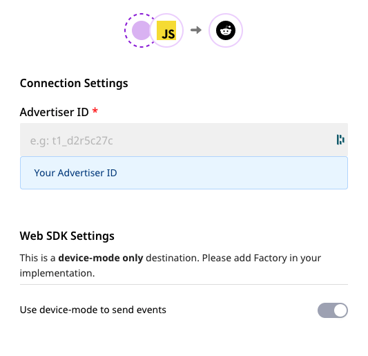
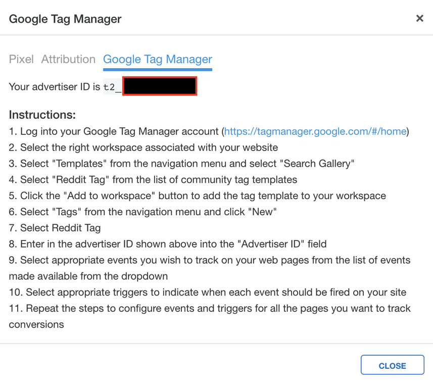

# Reddit Pixel

[Reddit Pixel](https://ads.reddit.com/) is a simple JavaScript snippet that you can add to your website and track actions that users take after viewing or engaging with advertisers’ ads and enables conversion reporting within our interface. Brands can also leverage the Reddit Pixel to retarget redditors who have already visited their website, and drive them further down the conversion funnel.

You can now send your event data directly to Reddit Pixel through RudderStack.


**Find the open-source transformer code for this destination in our** [**GitHub repo**](https://github.com/rudderlabs/rudder-sdk-js/tree/production-staging/integrations)**.**


## Getting Started

To enable sending your event data to Reddit Pixel, you will first need to add it as a destination to the source from which you are sending your event data.

Before configuring your source and destination on the RudderStack, please verify if the source platform is supported by Reddit Pixel, by referring to the table below:
̦
| **Connection Mode** | **Web** | **Mobile** | **Server** |
| :------------------ | :------------ | :--------- | :--------- |
| **Device mode** | **Supported** | - | - |
| **Cloud mode** | - | - | - |


To know more about the difference between Cloud mode and Device mode in RudderStack, read the [RudderStack connection modes](https://docs.rudderstack.com/get-started/rudderstack-connection-modes) guide.


Once you have confirmed that the platform supports sending events to Reddit, perform the steps below:

- From your [RudderStack dashboard](https://app.rudderlabs.com/), add the source. From the list of destinations, select **Reddit Pixel**.


Please follow our guide on [How to Add a Source and Destination in RudderStack](https://docs.rudderstack.com/how-to-guides/adding-source-and-destination-rudderstack) to add a source and destination in RudderStack.


- Give a name to the destination and click on **Next**. You should then see the following screen:



The connection settings are:

- Enter your **Reddit Pixel Advertiser ID**.


More information on how to find your Reddit Pixel Advertise ID can be found in our FAQs below.


## Identify

In Reddit Pixel, the `identify` call updates the Reddit Pixel with the user's `SignUp` information.

The following snippet highlights the use of the `identify` call:

```javascript
rudderanalytics.identify();
```

## Page

When the `page` call is made, the `track` event is sent as `PageVisit` to `rdt('track,'PageVisit')`. Any parameter sent to `rudderanalytics.page()` is ignored by RudderStack.

A sample `page` call is as shown:

```javascript
rudderanalytics.page();
```

## Track

The `track` call lets you track custom events as they occur in your web application.

A sample call looks like the following code snippet:

```javascript
rudderanalytics.track("Product Added");
```

RudderStack transforms the following events to Reddit Pixel's Standard Events, as shown in the table below:

| RudderStack Event Name      | Reddit Pixel Standard Event |
| :-------------------------- | :-------------------------- |
| `Product Added`             | `Add to Cart`               |
| `Product Added to Wishlist` | `Add to Wishlist`           |
| `Order Completed`           | `Purchase`                  |

RudderStack also supports mapping the following custom events.

| RudderStack Event Name | Reddit Pixel Standard Event |
| :--------------------- | :-------------------------- |
| `Lead`                 | `Lead`                      |
| `View Content`         | `ViewContent`               |
| `Search`               | `Search`                    |


Custom events other than shown above are not supported by RedditPixel.


## FAQs

**Where can I find the Reddit Pixel Advertiser ID?**

To get your Reddit Pixel Advertiser ID, go to your Reddit Ads Manager account. On the left side, select the blue Reddit Pixel button, and the advertiser ID can be found in `rdt('init', <advertiserID>)` as shown below.



## Contact Us

If you come across any issues while configuring Reddit Pixel with RudderStack, please feel free to [contact us](mailto:%20docs@rudderstack.com). You can also start a conversation on our [Slack](https://resources.rudderstack.com/join-rudderstack-slack) channel; we will be happy to talk to you!
