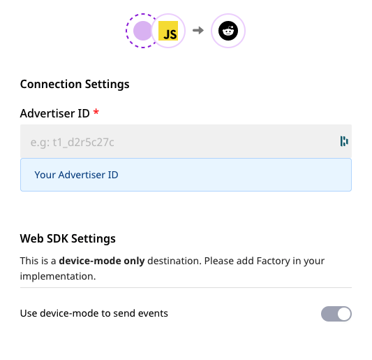
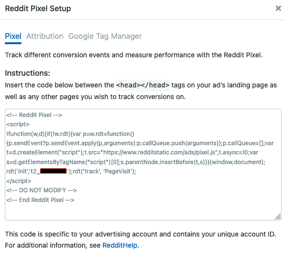

# Reddit Pixel

[**Reddit Pixel**](https://ads.reddit.com/) is a JavaScript snippet that, once added to your website, lets you track user actions on your website after interacting with your ad on Reddit. You can also leverage Reddit Pixel to retarget your visitors and boost your conversions.

You can now seamlessly send your event data to Reddit Pixel by adding it as a destination in RudderStack.

## Getting Started

Before configuring Reddit Pixel as a destination in RudderStack, verify if the source platform is supported by Reddit Pixel by referring to the table below: ̦

| **Connection Mode** | **Web**       | **Mobile** | **Server** |
| :------------------ | :------------ | :--------- | :--------- |
| **Device mode**     | **Supported** | -          | -          |
| **Cloud mode**      | -             | -          | -          |

<div class="infoBlock">

To know more about the difference between Cloud mode and Device mode in RudderStack, refer to the <a href="https://rudderstack.com/docs/connections/rudderstack-connection-modes/">RudderStack connection modes</a> guide.

</div>

Once you have confirmed that the source supports sending events to Reddit Pixel, perform the steps below:

- From your [**RudderStack dashboard**](https://app.rudderstack.com/), add the source. From the list of destinations, select **Reddit Pixel**.

<div class="infoBlock">

Follow our guide on <a href="https://rudderstack.com/docs/connections/adding-source-and-destination-rudderstack/">How to Add a Source and Destination in RudderStack</a> for more information.

</div>

- Give a name to the destination and click on **Next**. You should then see the following screen:



- Enter your **Reddit Pixel Advertiser ID**.

<div class="infoBlock">

For more information on how to find your Reddit Pixel Advertiser ID, refer to the FAQs below.

</div>

## Identify

In Reddit Pixel, the `identify` call updates the Reddit Pixel with the user's signup information.

For more information on the `identify` call, check out the [**RudderStack API spec**](https://rudderstack.com/docs/rudderstack-api/api-specification/rudderstack-spec/identify/).

A sample `identify` call is as shown:

```javascript
rudderanalytics.identify()
```

## Page

When the `page` call is made, the `track` event is sent as `PageVisit` to `rdt('track,'PageVisit')`. RudderStack ignores any parameter sent to `rudderanalytics.page()`.

For more information on the `page` call, check out the [**RudderStack API spec**](https://rudderstack.com/docs/rudderstack-api/api-specification/rudderstack-spec/page).

A sample `page` call is as shown:

```javascript
rudderanalytics.page()
```

## Track

The `track` call lets you track custom events in your website.

A sample call looks like the following code snippet:

```javascript
rudderanalytics.track("Product Added")
```

RudderStack transforms the following events to Reddit Pixel's Standard Events:

| **RudderStack Event Name**  | **Reddit Pixel Standard Event** |
| :-------------------------- | :------------------------------ |
| `Product Added`             | `Add to Cart`                   |
| `Product Added to Wishlist` | `Add to Wishlist`               |
| `Order Completed`           | `Purchase`                      |

In addition, RudderStack also supports mapping the following custom events:

| **RudderStack Event Name** | **Reddit Pixel Standard Event** |
| :------------------------- | :------------------------------ |
| `Lead`                     | `Lead`                          |
| `View Content`             | `ViewContent`                   |
| `Search`                   | `Search`                        |

<div class="warningBlock">

Reddit Pixel does not support any other custom events apart from the ones mentioned above.

</div>

## FAQs

**Where can I find the Reddit Pixel Advertiser ID?**

To get your Reddit Pixel Advertiser ID, go to your Reddit Ads Manager account. Under **Reddit Pixel Setup**, select the Reddit **Pixel** button. Here, you can find the advertiser ID in the `rdt('init', <advertiserID>)` line of the snippet code, as shown below.



## Contact Us

If you come across any issues while configuring Reddit Pixel with RudderStack, feel free to [**contact us**](mailto:%20docs@rudderstack.com). You can also start a conversation in our [**Slack**](https://rudderstack.com/join-rudderstack-slack-community) community.
