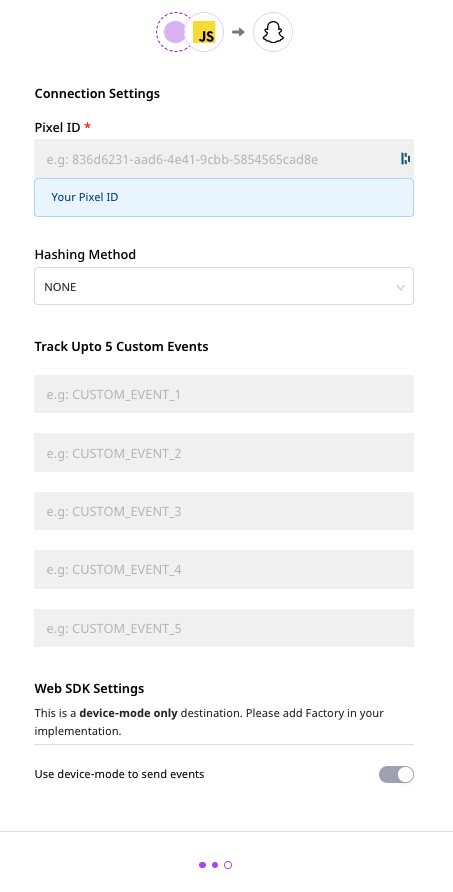

# Snap Pixel

The [**Snap Pixel**](https://ads.snapchat.com/) is a piece of JavaScript code that lets you measure the cross-device impact of your advertising campaigns. It lets you understand how many Snapchat users interact with your website after seeing the ads.

RudderStack supports Snap Pixel as a destination to which you can seamlessly send your event data.

## Getting Started

Before configuring Snap Pixel as a destination in RudderStack, verify if the source platform is supported by Snap Pixel by referring to the table below: ̦

| **Connection Mode** | **Web**       | **Mobile** | **Server** |
| :------------------ | :------------ | :--------- | :--------- |
| **Device mode**     | **Supported** | -          | -          |
| **Cloud mode**      | -             | -          | -          |


To know more about the difference between Cloud mode and Device mode in RudderStack, refer to the [**RudderStack connection modes**](https://docs.rudderstack.com/get-started/rudderstack-connection-modes) guide.


Once you have confirmed that the source platform supports sending events to Snap Pixel, perform the steps below:

* From your [**RudderStack dashboard**](https://app.rudderstack.com/), add the source. From the list of destinations, select **Snap Pixel**.


Follow our guide on [**How to Add a Source and Destination in RudderStack**](https://docs.rudderstack.com/how-to-guides/adding-source-and-destination-rudderstack) for more information.


* Assign a name to the destination and click on **Next**. You should then see the following screen:



### Configuration Settings

To successfully configure Snap Pixel as a destination, you will need to configure the following settings:

* **Snap Pixel ID:** Enter your Snap Pixel ID here. To get your Snap Pixel ID, go to your [**Snap Ads Manager**](https://ads.snapchat.com/) account. Under **Events Manager**, select **View Pixel Details** then **Setup Pixel**. You can find the Pixel ID under **Pixel Code**, as shown:


* **Hashing Method:** Snap Pixel lets you pass a user parameter (email or phone number) in both hashed and non-hashed format during intialization. If **SHA-256** is chosen as an option, RudderStack will hash-encode the provided user parameter.

## Identify


The Snap Pixel will not be initialized unless the `identify` call is fired.



RudderStacks checks the cookies for the user parameter (email or phone number) before loading the Snap Pixel snippet. If found, the snippet is loaded. Otherwise, an `identify` call with the user's email or phone number is required to load the snippet.


In Snap Pixel, the `identify` call initializes the Snap Pixel code.


For more information on the `identify` call, check out the [**RudderStack API spec**](https://docs.rudderstack.com/rudderstack-api/rudderstack-spec/identify).


A sample `identify` call is as shown:

```javascript
    rudderanalytics.identify({
        email: "sample@sample.com",
        phone: "8787857564"
    });
```

Either or both of the user parameters should be passed in the `identify` call. The following table lists the parameters along with the relative mapping to the Snap Pixel parameters:

| **RudderStack User Parameter**  | **Snap Pixel User Parameter** |
| :------------------------------ | :---------------------------- |
| `email`                         | `user_email`                  |
| `phone`                         | `user_phone_number`           |

## Page

When the `page` call is made, RudderStack sends the following: 

`snaptr("track", "PAGE_VIEW")`.

You can make the `page` call with or without the event payload.


For more information on the `page` call, check out the [**RudderStack API spec**](https://docs.rudderstack.com/rudderstack-api/rudderstack-spec/page).


A sample `page` call is as shown:

```javascript
    rudderanalytics.page();
```

## Track

The `track` call lets you send Snap Pixel events.


For more information on the `track` call, check out the [**RudderStack API spec**](https://docs.rudderstack.com/rudderstack-api/rudderstack-spec/track).


A sample `track` call is as shown below:

```javascript
    rudderanalytics.track('PURCHASE', {
        'currency': 'USD',
        'price': 333.33,
        'transaction_id': '11111111'
    });
```

You can also send the following RudderStack E-Commerce Events:

| **RudderStack Event Name**  | **Snap Pixel Standard Event** |
| :-------------------------- | :---------------------------- |
| `Order Completed`           | `PURCHASE`                    |
| `Checkout Started`          | `START_CHECKOUT`              |
| `Product Added`             | `ADD_CART`                    |
| `Payment Info Entered`      | `ADD_BILLING`                 |
| `Promotion Clicked`         | `AD_CLICK`                    |
| `Promotion Viewed`          | `AD_VIEW`                     |
| `Product Added To Wishlist` | `ADD_TO_WISHLIST`             |


For more information on the Snap Pixel events, visit this [**Snapchat page**](https://businesshelp.snapchat.com/s/article/pixel-website-install?language=en_US)


Snap Pixel supports upto 5 custom events. They are listed in the table below:

| **Custom Events**  |
| :-------------------------- |
| `CUSTOM_EVENT_1` |
| `CUSTOM_EVENT_2` |
| `CUSTOM_EVENT_3` |
| `CUSTOM_EVENT_4` |
| `CUSTOM_EVENT_5` |

## FAQs

**Where can I find the Snap Pixel ID?**

To get your Snap Pixel ID, go to your [**Snap Ads Manager**](https://ads.snapchat.com/) account. Under **Events Manager**, select **View Pixel Details** then **Setup Pixel**. You can find the Pixel ID under **Pixel Code**, as shown:


## Contact Us

In case of any issues while configuring or using Snap Pixel with RudderStack, you can [**contact us**](mailto:%20docs@rudderstack.com) or start a conversation on our [**Slack**](https://resources.rudderstack.com/join-rudderstack-slack) channel.
