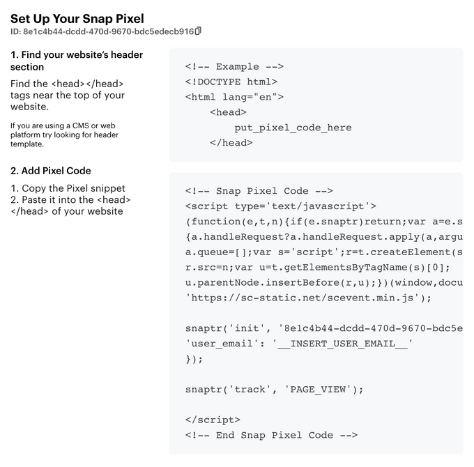

# Snapchat Conversion

[Snapchat Conversion](https://businesshelp.snapchat.com/s/article/conversions-api?language=en_US) is 

RudderStack supports Snapchat Conversion as a destination where you can send your event data seamlessly.

<div class="successBlock">

Find the open-source transformer code for this destination in our <a href="https://github.com/rudderlabs/rudder-transformer/tree/master/v0/destinations/">GitHub repository</a>.
</div>

## Getting started

Before configuring Snapchat Conversion as a destination in RudderStack, verify if the source platform is supported by Snapchat Conversion by referring to the table below:

| **Connection Mode** | **Web**       | **Mobile**    | **Server**    |
| :------------------ | :------------ | :------------ | :------------ |
| **Device mode**     |  -            | -             | -             |
| **Cloud mode**      | **Supported** | **Supported** | **Supported** |

<div class="infoBlock">

To know more about the difference between cloud mode and device mode in RudderStack, refer to the <a href="https://rudderstack.com/docs/rudderstack-cloud/rudderstack-connection-modes/">RudderStack Connection Modes</a> guide.
</div>

Once you have confirmed that the source platform supports sending events to Snapchat Conversion, follow these steps:

- From your [**RudderStack dashboard**](https://app.rudderstack.com/), add the source. Then, from the list of destinations, select **Snapchat Conversion**.

## Connection settings

To successfully configure Snapchat Conversion as a destination, you will need to configure the following settings:


- **API Token**: Enter your API token generated via Snapchat dashboard. Go to your [Snap Ads Manager](https://ads.snapchat.com/) account. Click on **Generate Token** in the **Conversions API Tokens** section of the **Business Details** option to generate the **API Token**, as shown:

- **Pixel ID**: Enter your Snap Pixel ID. Go to your [Snap Ads Manager](https://ads.snapchat.com/) account. Select **Events Manager** > **Setup Snap Pixel** > **Pixel Code** and click on continue to obtain the **Pixel ID**, as shown:



Pixel Id is required for Web and Offline events

- **Snap App ID**: Enter your Snap App ID which can be generated by clicking on **Business** > **Apps** > **Add an App** in the Snapchat dashboard.

Refer to the <a href="https://ads.tiktok.com/marketing_api/docs?id=1701890914536450">Generate your Snap App ID</a> guide for more information on generating the Snap App ID.

- **App ID**: 

### Track

The [`track`](https://www.rudderstack.com/docs/rudderstack-api/api-specification/rudderstack-spec/track/) call lets you capture user events along with the properties associated with them.


A sample `track` call is shown below:

```javascript
rudderanalytics.track(
  "Checkout Started", {
    eventId: "1616318632825_357",
    context: {
      ad: {
        callback: "123ATXSfe"
      }
    },
    currency: "USD",
    value: 46.0
  }, {
    externalId: [{
      type: "tiktokExternalId",
      id: "1234"
    }]
  }
);
```
RudderStack maps the following E-Commerce event names to the corresponding Snapchat Conversion event names:

| **RudderStack Event Name** | **Snapchat conversion Event Name** |
|:--------------------------------|:--------------------------|
| Products Searched | `SEARCH` |
| Product List Viewed | `VIEW_CONTENT` |
| Promotion Viewed | `AD_VIEW` |
| Promotion Clicked | `AD_CLICK` |
| Product Viewed | `VIEW_CONTENT` |
| Product Added | `ADD_CART` |
| Checkout Started | `START_CHECKOUT` |
| Payment Info Entered | `ADD_BILLING` |
| Order Completed | `PURCHASE` |
| Product Added to Wishlist | `ADD_TO_WISHLIST` |

The following table lists the RudderStack and Snapchat Conversion properties mappings based on the specific RudderStack events:

<table>
  <tr>
    <th>RudderStack event</th>
    <th>Web parameters</th>
    <th>Mobile app parameters</th>
    <th>Offline parameters</th>
  </tr>
  <tr>
    <td>Products Searched</td>
    <td><code class="inline-code">search_string</code><br /><code class="inline-code">pixel_id</code>(Required)<br /><code class="inline-code">page_url</code></td>
    <td><code class="inline-code">snap_app_id</code>(Required)<br /><code class="inline-code">app_id</code>(Required)<br /><code class="inline-code">search_string</code></td>
    <td><code class="inline-code">pixel_id</code>(Required)<br /><code class="inline-code">search_string</code></td>
  </tr>
  <tr>
    <td>Product List Viewed<br />Promotion Viewed<br />Promotion Clicked<br />Promotion Viewed<br />Product Viewed<br />Checkout Started<br />Payment Info Entered<br />Product Added to Wishlist</td>
    <td><code class="inline-code">pixel_id</code>(Required)<br /><code class="inline-code">page_url</code></td>
    <td><code class="inline-code">snap_app_id</code>(Required)<br /><code class="inline-code">app_id</code>(Required)</td>
    <td><code class="inline-code">pixel_id</code>(Required)</td>
  </tr>
  <tr>
    <td>Product Added</td>
   <td><code class="inline-code">pixel_id</code>(Required)<br /><code class="inline-code">page_url</code><br /><code class="inline-code">item_category</code><br /><code class="inline-code">item_ids</code><br /><code class="inline-code">number_items</code><br /><code class="inline-code">price</code><code class="inline-code">currency</code></td>
     <td><code class="inline-code">snap_app_id</code>(Required)<br /><code class="inline-code">app_id</code>(Required)<br /><code class="inline-code">item_category</code><br /><code class="inline-code">item_ids</code><br /><code class="inline-code">number_items</code><br /><code class="inline-code">price</code></td>
    <td><code class="inline-code">pixel_id</code>(Required)<br /><code class="inline-code">item_category</code><br /><code class="inline-code">item_ids</code><br /><code class="inline-code">number_items</code><br /><code class="inline-code">price</code><code class="inline-code">currency</code></td>
  </tr>
   <tr>
    <td>Order Completed</td>
  <td><code class="inline-code">pixel_id</code>(Required)<br /><code class="inline-code">page_url</code><br /><code class="inline-code">transaction_id</code><br /><code class="inline-code">item_category</code><br /><code class="inline-code">item_ids</code><br /><code class="inline-code">number_items</code><br /><code class="inline-code">price</code><code class="inline-code">currency</code></td>
     <td><code class="inline-code">snap_app_id</code>(Required)<br /><code class="inline-code">app_id</code>(Required)<br /><code class="inline-code">transaction_id</code><br /><code class="inline-code">item_category</code><br /><code class="inline-code">item_ids</code><br /><code class="inline-code">number_items</code><br /><code class="inline-code">price</code></td>
    <td><code class="inline-code">pixel_id</code>(Required)<br /><code class="inline-code">page_url</code><br /><code class="inline-code">transaction_id</code><code class="inline-code">item_category</code><br /><code class="inline-code">item_ids</code><br /><code class="inline-code">number_items</code><br /><code class="inline-code">price</code><code class="inline-code">currency</code></td>
  </tr>
</table>

The following table lists the RudderStack and Snapchat Conversion properties mappings based on the specific RudderStack events:

<table>
  <tr>
    <th>RudderStack event</th>
    <th>RudderStack property</th>
    <th>Snapchat Conversion property</th>
  </tr>
  <tr>
    <td>Products Searched</td>
    <td><code class="inline-code">query</code></td>
    <td><code class="inline-code">search_string</code></td>
  </tr>
  <tr>
    <td>Product Added<br/>Order Completed</td>
    <td><code class="inline-code">currency</code></td>
    <td><code class="inline-code">currency</code></td>
  </tr>
   </table>


## FAQ

### I see a 40002 response code with ‘No permission to operate pixel code’ error message, what can I do?

This error code is related to the authentication of your TikTok account. For more information, refer <a href="https://ads.tiktok.com/gateway/docs/index?identify_key=2b9b4278e47b275f36e7c39a4af4ba067d088e031d5f5fe45d381559ac89ba48&language=ENGLISH&doc_id=1701890979375106#item-link-FAQ">TikTok documentation</a>.

## Contact us

For queries on any of the sections covered in this guide, you can [contact us](mailto:%20docs@rudderstack.com) or start a conversation in our [Slack](https://rudderstack.com/join-rudderstack-slack-community) community.
