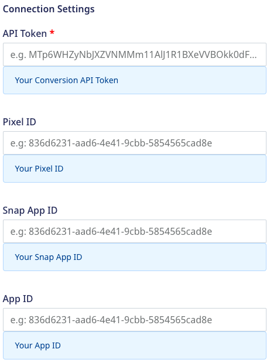
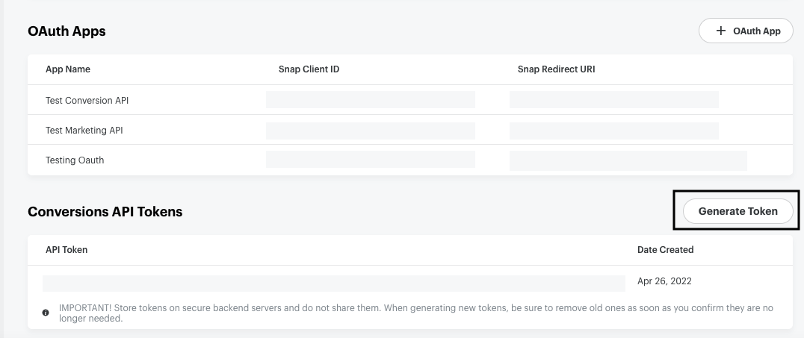
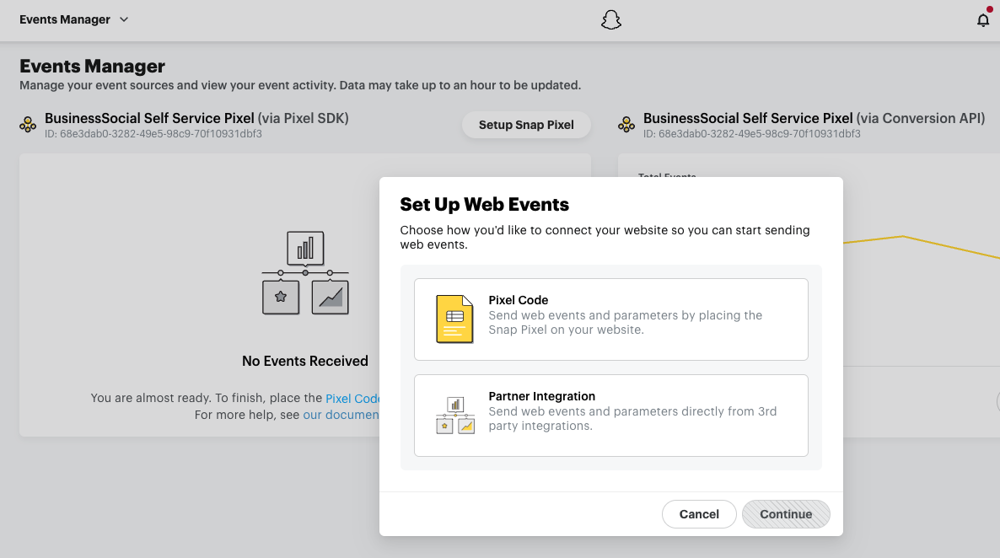
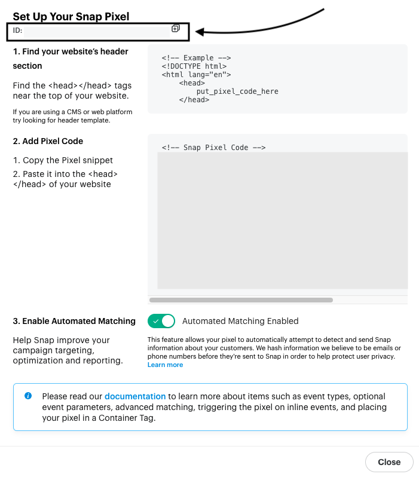
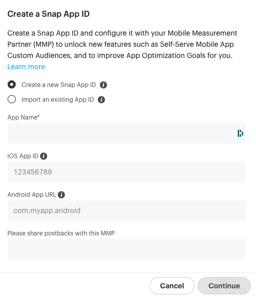

# Snapchat Conversion

Snapchat's [Conversions API](https://businesshelp.snapchat.com/s/article/conversions-api?language=en_US) lets you send your web, mobile, and offline events to Snapchat via a S2S (server-to-server) integration. You can then leverage this data to optimize your Snapchat ad campaigns and measure user conversions effectively.

RudderStack supports Snapchat Conversion as a destination where you can send your event data seamlessly.

<div class="warningBlock">

The events should be generated at least 28 days before to be eligible for reporting via the Conversions API.
</div>

<div class="successBlock">

Find the open source transformer code for this destination in the <a href="https://github.com/rudderlabs/rudder-transformer/tree/master/v0/destinations/">GitHub repository</a>.
</div>

## Getting started

Before configuring Snapchat Conversion as a destination in RudderStack, verify if the source platform is supported by referring to the table below:

| **Connection Mode** | **Web**       | **Mobile**    | **Server**    |
| :------------------ | :------------ | :------------ | :------------ |
| **Device mode**     |  -            | -             | -             |
| **Cloud mode**      | **Supported** | **Supported** | **Supported** |

<div class="infoBlock">

To know more about the difference between cloud mode and device mode in RudderStack, refer to the <a href="https://rudderstack.com/docs/rudderstack-cloud/rudderstack-connection-modes/">RudderStack Connection Modes</a> guide.
</div>

Once you have confirmed that the source platform supports sending events to Snapchat Conversion, follow these steps:

1. From your [RudderStack dashboard](https://app.rudderstack.com/), add the source. Then, from the list of destinations, select **Snapchat Conversion**.
2. Assign a name to your destination and click on **Next**.

## Connection settings

To successfully configure Snapchat Conversion as a destination, configure the following settings:



- **API Token**: Enter your API token generated from your Snapchat dashboard.

<div class="infoBlock">

For more information on getting your API token, refer to the <a href="#faq">FAQ</a> section below.
</div>

- **Pixel ID**: Enter your Snap Pixel ID.

<div class="infoBlock">

<strong>The Snap Pixel ID is required for sending the web and offline events. </strong>

For more information on getting your Snap Pixel ID, refer to the <a href="#faq">FAQ</a> section below.
</div>

- **Snap App ID**: Enter your Snapchat App ID. 

Refer to the <a href="https://ads.tiktok.com/marketing_api/docs?id=1701890914536450">Generate your Snap App ID</a> guide for more information on generating the Snap App ID.

- **App ID**: Enter the unique ID associated with your application. This is required for sending your app events.

<div class="warningBlock">

Your <strong>App ID</strong> is different from the <strong>Snap App ID</strong>. It should be numeric for iOS and in the human-interpretable string format in case of Android.

For more information, refer to the <a href="https://marketingapi.snapchat.com/docs/conversion.html#conversion-parameters">Conversions API reference</a>.
</div>

## Track

The [`track`](https://www.rudderstack.com/docs/rudderstack-api/api-specification/rudderstack-spec/track/) event lets you capture user events along with the properties associated with them.

RudderStack tracks and sends the web, mobile, and offline events to Snapchat via the [`conversion`](https://tr.snapchat.com/v2/conversion) endpoint.

<div class="warningBlock">

RudderStack uses Bearer authentication leveraging the Snap API token for authenticating all the requests. OAuth is not supported currently.
</div>

A sample `track` call is shown below:

```javascript
rudderanalytics.track("Order Completed", {
  order_id: "1234",
  currency: "USD",
  products: [{
      product_id: "345676543",
      price: 7.99
    },
  ],
}, {
  context: {
    traits: {
      email: "alex@example.com",
      phone: "+1-202-555-0146"

    }
  }
})
```

RudderStack tracks the following e-commerce events and the corresponding platform-specific properties:

#### Browsing

<table>
  <tr>
    <th>RudderStack event</th>
    <th>Web parameters</th>
    <th>Mobile app parameters</th>
    <th>Offline parameters</th>
  </tr>
  <tr>
    <td>Product Searched</td>
    <td><code class="inline-code">search_string</code><br /><code class="inline-code">pixel_id</code>(Required)<br /><code class="inline-code">page_url</code></td>
    <td><code class="inline-code">snap_app_id</code>(Required)<br /><code class="inline-code">app_id</code>(Required)<br /><code class="inline-code">search_string</code></td>
    <td><code class="inline-code">pixel_id</code>(Required)<br /><code class="inline-code">search_string</code></td>
  </tr>
  <tr>
  <td>Product List Viewed</td>
    <td><code class="inline-code">pixel_id</code>(Required)<br /><code class="inline-code">page_url</code></td>
    <td><code class="inline-code">snap_app_id</code>(Required)<br /><code class="inline-code">app_id</code>(Required)</td>
    <td><code class="inline-code">pixel_id</code>(Required)</td>
  </tr>
</table>

#### Promotions

<table>
  <tr>
    <th>RudderStack event</th>
    <th>Web parameters</th>
    <th>Mobile app parameters</th>
    <th>Offline parameters</th>
  </tr>
  <tr>
  <td><ul><li>Promotion Viewed</li><li>Promotion Clicked</li></ul></td>
    <td><code class="inline-code">pixel_id</code>(Required)<br /><code class="inline-code">page_url</code></td>
    <td><code class="inline-code">snap_app_id</code>(Required)<br /><code class="inline-code">app_id</code>(Required)</td>
    <td><code class="inline-code">pixel_id</code>(Required)</td>
    </tr>
</table>

#### Ordering

<table>
  <tr>
    <th>RudderStack event</th>
    <th>Web parameters</th>
    <th>Mobile app parameters</th>
    <th>Offline parameters</th>
  </tr>
  <tr>
  <td><ul><li>Product Viewed</li><li>Checkout Started</li><li>Payment Info Entered</li></ul></td>
    <td><code class="inline-code">pixel_id</code>(Required)<br /><code class="inline-code">page_url</code></td>
    <td><code class="inline-code">snap_app_id</code>(Required)<br /><code class="inline-code">app_id</code>(Required)</td>
    <td><code class="inline-code">pixel_id</code>(Required)</td>
    </tr>
    <tr>
    <td>Product Added</td>
   <td><code class="inline-code">pixel_id</code>(Required)<br /><code class="inline-code">page_url</code><br /><code class="inline-code">item_category</code><br /><code class="inline-code">item_ids</code><br /><code class="inline-code">number_items</code><br /><code class="inline-code">price</code><code class="inline-code">currency</code></td>
     <td><code class="inline-code">snap_app_id</code>(Required)<br /><code class="inline-code">app_id</code>(Required)<br /><code class="inline-code">item_category</code><br /><code class="inline-code">item_ids</code><br /><code class="inline-code">number_items</code><br /><code class="inline-code">price</code></td>
    <td><code class="inline-code">pixel_id</code>(Required)<br /><code class="inline-code">item_category</code><br /><code class="inline-code">item_ids</code><br /><code class="inline-code">number_items</code><br /><code class="inline-code">price</code><br /><code class="inline-code">currency</code></td>
  </tr>
   <tr>
    <td>Order Completed</td>
  <td><code class="inline-code">pixel_id</code>(Required)<br /><code class="inline-code">page_url</code><br /><code class="inline-code">transaction_id</code><br /><code class="inline-code">item_category</code><br /><code class="inline-code">item_ids</code><br /><code class="inline-code">number_items</code><br /><code class="inline-code">price</code><code class="inline-code">currency</code></td>
     <td><code class="inline-code">snap_app_id</code>(Required)<br /><code class="inline-code">app_id</code>(Required)<br /><code class="inline-code">transaction_id</code><br /><code class="inline-code">item_category</code><br /><code class="inline-code">item_ids</code><br /><code class="inline-code">number_items</code><br /><code class="inline-code">price</code></td>
    <td><code class="inline-code">pixel_id</code>(Required)<br /><code class="inline-code">page_url</code><br /><code class="inline-code">transaction_id</code><code class="inline-code">item_category</code><br /><code class="inline-code">item_ids</code><br /><code class="inline-code">number_items</code><br /><code class="inline-code">price</code><br /><code class="inline-code">currency</code></td>
  </tr>
</table>

#### Wishlisting

<table>
  <tr>
    <th>RudderStack event</th>
    <th>Web parameters</th>
    <th>Mobile app parameters</th>
    <th>Offline parameters</th>
  </tr>
  <tr>
  <td>Product Added to Wishlist</td>
   <td><code class="inline-code">pixel_id</code>(Required)<br /><code class="inline-code">page_url</code></td>
  <td><code class="inline-code">snap_app_id</code>(Required)<br /><code class="inline-code">app_id</code>(Required)</td>
    <td><code class="inline-code">pixel_id</code>(Required)</td>
    </tr>
</table>

### Event mapping

RudderStack maps the following e-commerce events to the corresponding Snapchat Conversion events:

| **RudderStack event** | **Snapchat Conversion event** |
|:--------------------------------|:--------------------------|
| Product Searched | `SEARCH` |
| Product List Viewed | `VIEW_CONTENT` |
| Promotion Viewed | `AD_VIEW` |
| Promotion Clicked | `AD_CLICK` |
| Product Viewed | `VIEW_CONTENT` |
| Product Added | `ADD_CART` |
| Checkout Started | `START_CHECKOUT` |
| Payment Info Entered | `ADD_BILLING` |
| Order Completed | `PURCHASE` |
| Product Added to Wishlist | `ADD_TO_WISHLIST` |

### Property mapping

RudderStack maps the following event properties to the Snapchat Conversion properties based on specific events:

<table>
  <tr>
    <th>RudderStack event</th>
    <th>RudderStack property</th>
    <th>Snapchat Conversion property</th>
  </tr>
  <tr>
    <td>Products Searched</td>
    <td><code class="inline-code">query</code></td>
    <td><code class="inline-code">search_string</code></td>
  </tr>
  <tr>
    <td>Product Added<br/>Order Completed</td>
    <td><code class="inline-code">currency</code></td>
    <td><code class="inline-code">currency</code></td>
  </tr>
   </table>

## FAQ

### Where can I find the Conversions API token?

To get your Snap Conversions API token, follow these steps:

1. Go to your [Snap Ads Manager](https://ads.snapchat.com/) account.
2. Click on **Create Ads** option in the top left section of the dashboard and go to **Business Details** > **Conversions API Tokens**. You will find all the API tokens associated with your account listed here.
3. To generate a new Conversions API token, click on **Generate Token**.



### Where can I find the Pixel ID associated with my account?

To get your Snap Conversions Pixel ID, follow these steps:

1. Go to your [Snap Ads Manager](https://ads.snapchat.com/) account.
2. Click on **Create Ads** option in the top left section of the dashboard and go to **Events Manager**.
3. Then, click on **Setup Snap Pixel**. You will see the following options:



4. Select **Pixel Code** and click on **Continue**.
5. You will see the Snap Pixel ID at the top left of the resulting window, as shown:



### Where can I find the App ID associated with my application?

To get your Snap Conversions Pixel ID, follow these steps:

1. Go to your [Snap Ads Manager](https://ads.snapchat.com/) account.
2. Click on **Create Ads** option in the top left section of the dashboard and go to **Apps**. You will find the **App ID** associated with all your apps listed here.

To add a new app, follow these steps:

1. Click on **Add an App**. 
2. You can either create a new Snap App ID or importing an existing App ID. 
3. Then, enter your **App Name** and the relevant app ID/URL depending on your app's platform.
4. Finally, add any postbacks and click on **Continue** to finish the setup.



## Contact us

For queries on any of the sections covered in this guide, you can [contact us](mailto:%20docs@rudderstack.com) or start a conversation in our [Slack](https://rudderstack.com/join-rudderstack-slack-community) community.
