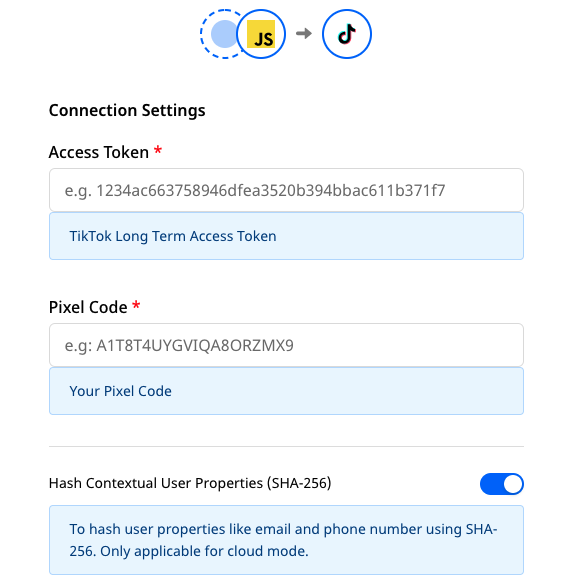

# TikTok Ads

[TikTok Ads](https://www.tiktok.com/business/en/apps/tiktok?tt4b_lang_redirect=1") is TikTok's online advertising platform. It lets marketers run product ads to target custom audiences and optimize their campaigns.

RudderStack supports TikTok Ads as a destination where you can send your event data seamlessly.

<div class="successBlock">

  <strong>Find the open-source transformer code for this destination in our <a href="https://github.com/rudderlabs/rudder-transformer/tree/master/v0/destinations/tiktok_ads">GitHub repo</a></strong>.
</div>

## Getting started

Before configuring TikTok Ads as a destination in RudderStack, verify if the source platform is supported by TikTok Ads by referring to the table below:

| **Connection Mode** | **Web**       | **Mobile**    | **Server**    |
| :------------------ | :------------ | :------------ | :------------ |
| **Device mode**     |  -            | -             | -             |
| **Cloud mode**      | **Supported** | **Supported** | **Supported** |

<div class="infoBlock">

To know more about the difference between cloud mode and device mode in RudderStack, refer to the <a href="https://rudderstack.com/docs/rudderstack-cloud/rudderstack-connection-modes/">RudderStack Connection Modes</a> guide.
</div>

Once you have confirmed that the source platform supports sending events to TikTok Ads, follow these steps:

- From your [**RudderStack dashboard**](https://app.rudderstack.com/), add the source. Then, from the list of destinations, select **TikTok Ads**.

<div class="infoBlock">

Follow our guide on <a href="https://rudderstack.com/docs/rudderstack-cloud/destinations/#adding-a-destination">Adding a Destination</a> for more information.
</div>

## Connection settings

To successfully configure TikTok Ads as a destination, you will need to configure the following settings:


- **Access Token**: You need to generate the Access Token (also known as long-term access token) by following the steps mentioned in <a href="https://ads.tiktok.com/marketing_api/docs?id=1701890912382977">Authorization</a> and <a href="https://ads.tiktok.com/marketing_api/docs?id=1701890914536450">Authentication</a> topics in TikTok documentation.

- **Pixel Code**: You can find the Pixel Code by referring to <a href="https://ads.tiktok.com/gateway/docs/index?identify_key=2b9b4278e47b275f36e7c39a4af4ba067d088e031d5f5fe45d381559ac89ba48&language=ENGLISH&doc_id=1701890979375106#item-link-Where%20to%20Find%20pixel_code">TikTok documentation</a>.

- **Hash Contextual User Properties (SHA-256)**: If this setting is enabled, RudderStack will hash the contextual user properties like `external_id`, `email`, `phone_number` from the raw format to the SHA-256 format.

### Track

The `track` call lets you capture user events along with the properties associated with them.

A sample `track` call is shown below:

```javascript
rudderanalytics.track(
  "Checkout Started", {
    eventId: "1616318632825_357",
    context: {
      ad: {
        callback: "123ATXSfe"
      }
    },
    currency: "USD",
    value: 46.0
  }, {
    externalId: [{
      type: "tiktokExternalId",
      id: "1234"
    }]
  }
);
```
RudderStack maps the following E-Commerce event names to the corresponding TikTok Ads event names:

| **RudderStack Event Name** | **TikTok Ads Event Name** |
|:--------------------------------|:--------------------------|
| `Product Added to Wishlist` | `AddToWishlist` |
| `Product Added` | `AddToCart` |
| `Checkout Started` | `InitiateCheckout` |
| `Payment Info Entered` | `AddPaymentInfo` |
| `Checkout Step Completed` | `CompletePayment` |
| `Order Completed` | `PlaceAnOrder` |

## FAQ

### I see a 40002 response code with ‘No permission to operate pixel code’ error message, what can I do?

This error code is related to the authentication of your TikTok account. For more information, refer <a href="https://ads.tiktok.com/gateway/docs/index?identify_key=2b9b4278e47b275f36e7c39a4af4ba067d088e031d5f5fe45d381559ac89ba48&language=ENGLISH&doc_id=1701890979375106#item-link-FAQ">TikTok documentation</a>.

## Contact us

For queries on any of the sections covered in this guide, you can [**contact us**](mailto:%20docs@rudderstack.com) or start a conversation in our [**Slack**](https://rudderstack.com/join-rudderstack-slack-community) community.
