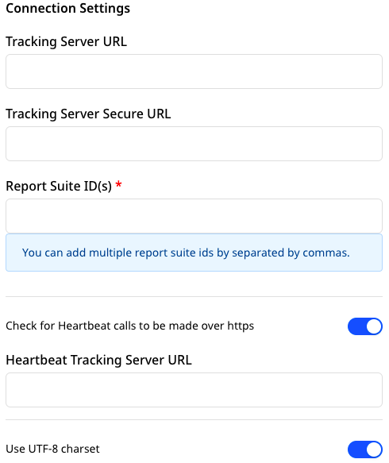

# Setting Up Adobe Analytics in RudderStack

To enable sending data to Adobe Analytics, you will first need to add it as a destination in RudderStack. Once the destination is configured and enabled, events from RudderStack will start flowing to Adobe Analytics.

Before configuring Adobe Analytics as a destination, verify if the source platform supports sending events to RudderStack, by referring to the table below:

| **Connection Mode** | **Web**       | **Mobile**    | **Server** |
| :------------------ | :------------ | :---------    | :--------- |
| **Device Mode**     | **Supported** | **Supported** | **-**      |
| **Cloud Mode**      | **Supported** | **Supported** | **Supported** |

<div class="infoBlock">

To know more about the difference between Cloud mode and Device mode in RudderStack, read the <a href="https://rudderstack.com/docs/connections/rudderstack-connection-modes/">RudderStack connection modes</a> guide.
</div>

Once you've confirmed that the source platform supports sending data to Adobe Analytics, follow these steps:

- Choose a source for which you would like to add Adobe Analytics as a destination.

<div class="infoBlock">

Follow the guide on <a href="https://rudderstack.com/docs/connections/adding-source-and-destination-rudderstack/">How to Add a Source and Destination in RudderStack</a> for more details.
</div>

- From the list of destinations, select **Adobe Analytics**. Assign a name to the destination and click on **Next**.
- Enter the relevant **Connection Settings** by referring to the following section.

## Connection Settings

This section lists all the relevant connection settings to successfully set up Adobe Analytics as a destination in RudderStack.



- **Tracking Server URL**: The `trackingServer` variable determines the location an image request is sent. Eg: If url is [`http://abc.a.b`](http://abc.a.b) ,the tracking server URL will be `abc.a.b`.

<div class="warningBlock">

**If this variable is defined incorrectly, your implementation may experience data loss.**
</div>

<div class="infoBlock">

For more information on this setting, refer to the <a href="https://experienceleague.adobe.com/docs/analytics/implementation/vars/config-vars/trackingserver.html?lang=en">Adobe Analytics documentation</a>.
</div>

- **Tracking Server Secure URL**: The `trackingServerSecure` variable determines the location an image request is sent over HTTPS. If this variable is not defined correctly, your implementation can experience data loss.

<div class="infoBlock">

For more information on this setting, refer to the <a href="https://experienceleague.adobe.com/docs/analytics/implementation/vars/config-vars/trackingserversecure.html?lang=en">Adobe Analytics documentation</a>.
</div>

- **Report Suite ID**\(s\): The Report Suite ID can be found in your Adobe Analytics Settings page. Multiple IDs can be separated by commas. For example: `ab.cd`,`ef.gh`,`ij.kl`.
- **Check for Heartbeat calls to be made over HTTPS**: If this setting is enabled and the Heartbeat Tracking Server URL is present, the SSL value will be set to `true` so that the calls go over HTTPs.
- **Heartbeat Tracking Server URL**: If assigned, this will be used as tracking server URL instead of the URL assigned in the **Tracking Server URL** field. RudderStack will set all heartbeat configurations if this URL is present.

<div class="infoBlock">

For more information on this setting, refer to the <a href="https://experienceleague.adobe.com/docs/media-analytics/using/sdk-implement/setup/setup-overview.html?lang=en">Adobe Analytics documentation</a>.
</div>

- **Adobe Heartbeat Settings**: This setting is used to map your RudderStack video events to Adobe Heartbeat Events. Find more information on how this mapping is done in the [**Adobe Analytics Heartbeat Measurement**](https://rudderstack.com/docs/destinations/analytics/adobe-analytics/adobe-analytics-heartbeat/) page.
- **Adobe Analytics Javascript SDK URL/Heartbeat SDK URL**: Add your proxy URL where you will be hosting the `adobe-analytics-js.js` and `adobe-analytics-js-heartbeat.js`. By default, we host them at [https://cdn.rudderlabs.com/adobe-analytics-js/adobe-analytics-js.js](https://cdn.rudderlabs.com/adobe-analytics-js/adobe-analytics-js.js) and [https://cdn.rudderlabs.com/adobe-analytics-js/adobe-analytics-js-heartbeat.js](https://cdn.rudderlabs.com/adobe-analytics-js/adobe-analytics-js-heartbeat.js) respectively.

### Identity Resolution


- **Marketing Cloud Organization ID**: If you want to use `visitorAPI.js`, enter this field. For example: `99887766ABC@AdobeOrg`.
- **Drop Visitor ID**: If enabled, RudderStack does not assign the `userId` to `visitorID`.

<div class="infoBlock">

For more information on this setting, refer to the <a href="https://experienceleague.adobe.com/docs/id-service/using/implementation/setup-analytics.html?lang=en#section-6053a6b7c16c466a9f9fdbf9cb9db3df">Adobe Analytics documentation</a>.
</div>

### Timestamps

- **Timestamp Option**: Adobe Analytics has Report Suites that accepts timestamped, non-timestamped or hybrid data. Note that `window.s.timestamp` will be affected. Also depending on this value, `visitorID` will be set if the drop visitor id is off.

<div class="infoBlock">
  <ul>
    <li>
      If the timestamp option is disabled, then
      <code class="inline-code">visitorID</code> will be set.
    </li>
    <li>
      If timestamp option is set to hybrid and the Prefer Visitor ID setting is
      on, then <code class="inline-code">visitorID</code> will be set.
    </li>
    <li>
      For all other cases, RudderStack does not set a
      <code class="inline-code">visitorID</code>.
    </li>
  </ul>
  Also note the following regarding timestamps:
  <ul>
    <li>If the timestamp option is enabled, then timestamp will be set.</li>
    <li>
      If the timestamp option is hybrid and Prefer Visitor ID is off, then
      timestamp will be set.
    </li>
  </ul>
</div>

- **Prefer Visitor ID**: Adobe does not allow sending both `visitorID` and timestamp. Hence, this option is used when the timestamp option is set as hybrid. Also, note that if this option is enabled, `visitorID` will be set. If disabled, the timestamp value will be set.

<div class="infoBlock">

For more information on this setting, refer to the <a href="https://experienceleague.adobe.com/docs/analytics/implementation/vars/page-vars/timestamp.html?lang=en">Adobe Analytics documentation</a>.
</div>

- **Enable pageName for Track Events**: When enabled, RudderStack only tracks events by sending a `pageName`.

### Mappings


- **Map Rudder Events to Adobe Custom Events**: This setting allows you to add one or multiple custom Adobe events separated by comma.
- **Map Rudder Context data to Adobe Context Data**: Context data variables allow you to you define custom variables on each page that the processing rules apply and can read. Instead of explicitly assigning values to the analytics variables, you can send your data in via these context data variables. The processing rules take the values from the context data variables and pass them into the respective analytics variables.

This setting allows you to map the key present under the context/properties of the RudderStack message to the property name you want to send to the Adobe context data. An example is as shown below:

```javascript
"context": {
  "contextProperties": {
    "prop1": "val1",
    "prop2": "val2"
  }
}
```

If you want to set `prop1` to Adobe's context data `property1`, then map with `contextProperties.prop1` --&gt; `property1`.

If you want to send top level properties `anonymousId`, `messageId`, `event` then simply enter the key.

<div class="infoBlock">

For more information on this setting, refer to the <a href="https://experienceleague.adobe.com/docs/analytics/implementation/vars/page-vars/contextdata.html?lang=en">Adobe Analytics documentation</a>.
</div>

- **Add Prefix for Context Data**: If you would like to prefix your RudderStack properties before sending them as `contextData`, you can enter a prefix here which will be automatically appended.
- **Map Rudder Properties to Adobe eVars**: eVars are custom variables that you can use as per your requirement. Each eVar is a string containing custom values specific to your organization, with a maximum length of 255 bytes. Note that values longer than 255 bytes are automatically truncated when sent to Adobe.

This setting lets you map any RudderStack property with the eVar you want.

<div class="infoBlock">

Only enter the index number of the eVar you want to set.
</div>

<div class="infoBlock">

For more information on this setting, refer to the <a href="https://experienceleague.adobe.com/docs/analytics/implementation/vars/page-vars/evar.html?lang=en">Adobe Analytics documentation</a>.
</div>


- **Map Rudder Properties to Adobe Hierarchy properties**: Hierarchy variables are the custom variables that allow you to see a site’s structure. By default, Adobe supports up to 5 hierarchy variables in your implementation.

This setting lets you map any RudderStack property with the hierarchy variable you want.

<div class="infoBlock">

Only enter the index number of the hierarchy variable that you want to set.
</div>

<div class="infoBlock">

For more information on this setting, refer to the <a href="https://experienceleague.adobe.com/docs/analytics/implementation/vars/page-vars/hier.html?lang=en">Adobe Analytics documentation</a>.
</div>

- **Map Rudder Properties to Adobe list properties**: List variables are custom variables that you can use as per your requirement. They work similarly to eVars, except they can contain multiple values. Also, list variables do not have a character limit.

This setting lets you map any RudderStack property with the list you want.

<div class="infoBlock">

Enter only the index number of the list you want to set to. The list properties should be an array/string separated by commas. Otherwise, they will be dropped.

For more information, refer to the <a href="https://experienceleague.adobe.com/docs/analytics/implementation/vars/page-vars/list.html?lang=en">Adobe Analytics documentation</a>.
</div>

- **Map Rudder Property with Delimiters for list properties**: The list variables need to be sent as a string. So if there is a list of properties, it needs to be delimited. RudderStack lets you set any of the delimiters from `, ; / : |`.


- **Map Rudder Properties to Adobe Custom properties**: Props are custom variables that you can use as per your requirement. This setting lets you map any RudderStack property with the prop you want to set it to.

<div class="infoBlock">

Enter only the index number of the prop you want to set.

For more information, refer to the <a href="https://experienceleague.adobe.com/docs/analytics/implementation/vars/page-vars/prop.html?lang=en">Adobe Analytics documentation</a>.
</div>

- **Map Rudder Property with Delimiters for Adobe Custom properties**: The property variables need to be sent as a string. So if there is a list of properties, it needs to be delimited. RudderStack lets you set any of the delimiters from `, ; / : |`.

### Merchandise Event Level Settings

- **Map Rudder Events to Adobe Merchandise events**: This setting lets you map the RudderStack event with the currency/purchase type of the Adobe event. For example: `event5`.
- **Increment or Currency Properties to add to merchandise events at event level**: The RudderStack property that has a currency/counter value should be added here. This will then be used to create the event string like `purchase,event5=19.9`. RudderStack automatically sets the `currencyCode` value. \(The default value is USD\).

<div class="infoBlock">

For more information, refer to the <a href="https://experienceleague.adobe.com/docs/analytics/implementation/vars/page-vars/events/events-overview.html?lang=en">Adobe Analytics documentation</a>.
</div>

### Merchandise Product Level Settings


- **Map Rudder Events to Adobe Merchandise events**: This setting lets you map a RudderStack event with a currency/purchase type of an Adobe event.
- **Properties to add to merchandise events at product level**: With this setting, the RudderStack property that has a currency/counter value should be added. This will be used to create a product string like `[category][item][quantity][total][incrementor][merchString]`.


- **Map Rudder Properties to eVars at product level**: Lets you map the RudderStack properties you want to set to eVars.

<div class="infoBlock">

Set only the index. The eVars will be appended with <code class="inline-code">|</code> and sent along with the product string.

For more information, refer to the <a href="https://experienceleague.adobe.com/docs/analytics/implementation/vars/page-vars/evar-merchandising.html?lang=en">Adobe Analytics documentation</a>.
</div>

- **Product Identifier**: Adobe Analytics accepts only a single product identifier. This setting lets you choose from a SKU/ID/Name of the product.

## Contact Us

For more information on any of the sections covered in this guide, you can [**contact us**](mailto:%20docs@rudderstack.com) or start a conversation in our [**Slack**](https://rudderstack.com/join-rudderstack-slack-community) community.
