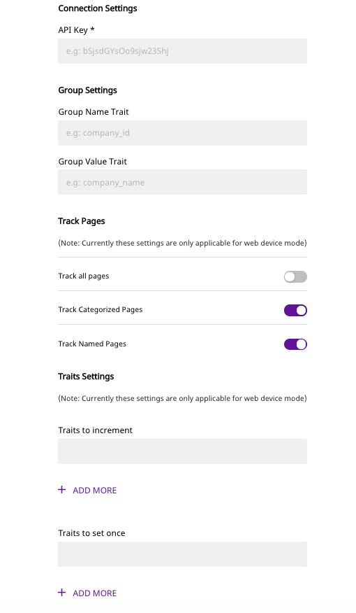
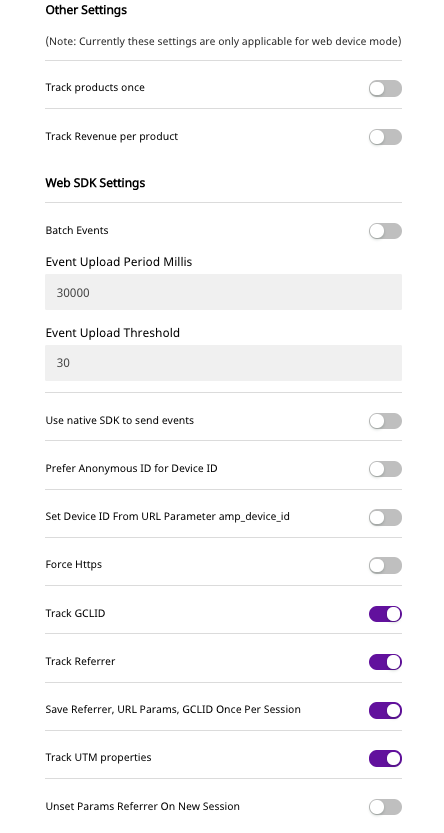

# Amplitude

[Amplitude](https://amplitude.com/) is a comprehensive product analytics platform for the web as well as mobile platforms. Over 12,000 companies use Amplitude to get useful marketing insights that drive product strategy and conversion and retention of their customers.

RudderStack supports sending events from the RudderStack SDKs to Amplitude through our data plane and Web connection mode.

<div class="successBlock">

  <strong>Find the open-source transformer code for this destination in our <a href="https://github.com/rudderlabs/rudder-transformer/tree/master/v0/destinations/am">GitHub repo</a></strong>.
</div>

## Getting started

Before configuring your source and destination on the RudderStack app, please check whether Amplitude supports the platform you are working on. Refer to the table below:

| **Connection Mode** | **Web**       | **Mobile**    | **Server**    |
| :------------------ | :------------ | :------------ | :------------ |
| **Device mode**     | **Supported** | **Supported** | -             |
| **Cloud mode**      | **Supported** | **Supported** | **Supported** |

<div class="infoBlock">

To know more about the difference between Cloud mode and Device mode in RudderStack, read the <a href="https://rudderstack.com/docs/connections/rudderstack-connection-modes/">RudderStack connection modes</a> guide.

</div>

Once you have confirmed that the platform supports sending events to Amplitude, perform the steps below:

- To enable sending data to Amplitude, you will need to add it to the source you send the event data.

<div class="infoBlock">

Please follow our guide on <a href="https://rudderstack.com/docs/connections/adding-source-and-destination-rudderstack/">How to Add a Source and Destination in RudderStack</a> to add a source and destination in RudderStack.

</div>

- Once the destination is enabled, events from our servers will start flowing to Amplitude as shown in the following screenshot:





## Amplitude Configuration Settings on the RudderStack Dashboard

To successfully configure Amplitude as a destination, you will need to configure the following settings:

- **API Key:** You will find the Amplitude API key in the [Amplitude dashboard](https://analytics.amplitude.com/apitestorg/settings/profile?redirect=1).
- **Group Settings:**
  - **Group name trait:** The trait that we will use as `groupType` in the `group` call.
  - **Group value trait:** The trait that we will use as `groupValue` in the `group` call.
- **Track Pages:** This setting is for tracking web pages, but is currently available only in the web and mobile SDK's only.
  - **Track all pages:** If this setting is enabled, an event named `Loaded a page` / `Loaded a Screen` will be sent to Amplitude.
  - **Track Categorized pages:** If this setting is enabled and if `category` is present in a `page` / `screen` call, then an event named `Viewed {category} page` / `Viewed {category} Screen` will be sent to Amplitude.
  - **Track Named pages:** If this setting is on and the `name` is present in a `page` call, then an event named `Viewed {name} page` will be sent to Amplitude.
  - If this setting is on and the `name` is present in a `screen` call, then an event named `Viewed {name} Screen` will be sent to Amplitude but if `name` is absent then an event named `Loaded a Screen` will be sent to Amplitude.

<div class="warningBlock">

**Note**: If multiple settings are enabled, then multiple events may be sent for a single <code class="inline-code">page/screen</code> call. For example, if both <code class="inline-code">Track categorized page</code> and <code class="inline-code">Track named page</code>settings are enabled, for a single <code class="inline-code">page/screen</code> call one <code class="inline-code">Viewed &#123;name&#125; page/Viewed &#123;name&#125; Screen</code>and one <code class="inline-code">Viewed &#123;category&#125; page/Viewed &#123;category&#125; Screen</code> events will be generated.

</div>

- **Traits Settings:** This setting is for configuring the traits to Amplitude in `identify` call.
  - **Traits to increment:** If this setting is enabled, the value of the corresponding trait will be incremented at Amplitude, with the value provided against the trait in an `identify` call.
  - **Traits to Set Once:** If this setting is enabled, the value of the corresponding trait will be set once at Amplitude with the value provided against the trait in an `identify` call.
  - **Traits to Append:** If this setting is enabled, the value of the corresponding trait will be appended to the corresponding trait array at Amplitude. **If the corresponding trait does not have a value set yet, it will be initialized to an empty list before the new values are appended. If the corresponding trait has an existing value and it is not a list, it will be converted into a list with the new value appended.**

<div class="infoBlock">

This feature is not applicable for RudderStack web device mode integrations.

</div>

- **Traits to Prepend:** If this setting is enabled, the value of the corresponding trait will be prepended to the corresponding trait array at Amplitude. **If the corresponding trait does not have a value set yet, it will be initialized to an empty list before the new values are prepended. If the corresponding trait has an existing value and it is not a list, it will be converted into a list with the new value prepended.**

<div class="infoBlock">

This feature is not applicable for RudderStack web device mode integrations.

</div>

- **Track Products once:** If this setting is on, and if the event payload contains an array of products, the event is tracked with the original event name and all the products as its property, else each product is tracked with event `Product purchase` .
- **Track Revenue per product:** If this setting is on, and if the event payload contains multiple products, each product's revenue is tracked individually.
- **Batch events:** If this setting is enabled, the events are batched together and uploaded by the Amplitude SDK only when the number of queued events is greater than or equal to `eventUploadThreshold` or `eventUploadPeriodMillis` milliseconds, since the first unsent event is queued.
- **Event upload period millis:** If the `batch events` settings is enabled, this is the amount of time that the SDK waits to upload the events.
- **Event upload threshold:** If the `batch events` settings is enabled, this is the minimum number of events to batch together by the Amplitude SDK.
- **Use Native SDK to send events:** Enable this flag to send the events through Amplitude web SDK. The other web SDK-supported settings will also work if you enable this option.
- **Prefer Anonymous ID for Device ID:** If this setting is enabled, the `Device ID` will be set as the `anonymousId` generated by RudderStack SDK or by the value if you set the `anonymousId` using RudderStack's`setAnonymousId()` method.
- **Set Device ID from the URL parameter:** If this setting is enabled, the Amplitude SDK will parse the URL parameter and set `Device ID` from `amp_device_id` from the same.
- **Force HTTPS:** If this setting is enabled, the events will always be uploaded by the Amplitude SDK to the `HTTPS` endpoint, otherwise it will use the embedding site's protocol.
- **Track GCLID:** If this setting is enabled, the Amplitude SDK will capture the `gclid` URL parameters along with the user's `initial_gclid` parameters.
- **Track Referrer:** If this setting is enabled, the Amplitude SDK will capture the `referrer` and `referring_domain` for each session along with the user's `initial_referrer` and `initial_referring_domain`.
- **Track UTM properties:** If this setting is enabled, the Amplitude SDK parses the UTM parameters in the query string or `_utmz` cookie and includes them as user properties in all uploaded events.
- **Save Referrer, URL Params, GCLID once per session:** If this setting is enabled, the corresponding tracking of `gclid`, referrer, UTM parameters will be done once per session. If you always want to capture new values, please set this to False.
- **Unset param referrer on new session:** If this setting is disabled, the existing `referrer` and `utm_parameter` values will be passed to each new session. If enabled, `referrer` and `utm_parameter` properties will be set to `null` upon instantiating new session. This only works if `Track referrer` and `Track UTM properties` are enabled.
- **Enable location listening \(Android only\):** If the user grants your app location permissions, the SDK will also grab the user's location. Amplitude will never prompt the user for location permissions, and this will have to be done by your app.
- **Track session events \(Mobile only\):** If this setting is enabled, `[Amplitude] Start Session` and `[Amplitude] End Session` events will be sent to the Amplitude at the starting and end of the session.
- **Use advertising id as device id \(Android only\):** If this setting is enabled, the `advertising id` assigned by Google Play Store to a user device will be sent as `device id` to the Amplitude.
- **Use IDFA as device id \(iOS only\):** If this setting is enabled, the `Identifier for Advertisers (IDFA)` assigned by Apple to a user device will be sent as `device id` to the Amplitude.

## Adding Device Mode Integration

<!--

Follow these steps to add Amplitude to your iOS project:

- In your `Podfile` and add the `Rudder-Amplitude` extension

```ruby
pod 'Rudder-Amplitude'

# for using IDFA as device id, location listening only
pod 'Amplitude', '~> 7.2.0'
```

- After adding the dependency followed by `pod install` , you can add the imports to your `AppDelegate.m` file as shown:

```objectivec
#import <Rudder/Rudder.h>
#import "RudderAmplitudeFactory.h"
// for using IDFA as device id, location listening only
#import <Amplitude/Amplitude.h>
```

- and also add the initialization of your `RSClient` as shown:

```objectivec
RSConfigBuilder *builder = [[RSConfigBuilder alloc] init];
[builder withDataPlaneUrl:DATA_PLANE_URL];
[builder withFactory:[RudderAmplitudeFactory instance]];
[RSClient getInstance:WRITE_KEY config:[builder build]];
```

- Add the below logic just after initializing `RudderClient` in `AppDelegate.m` if you would like to send `IDFA` of iOS device as `device id` to Amplitude

<div class="warningBlock">

Make sure that you enable <code class="inline-code">use IDFA as device id</code> under <code class="inline-code">iOS SDK settings</code> on dashboard.

</div>

```javascript
// for using IDFA as device id only
[Amplitude instance].adSupportBlock = ^{
    return [[ASIdentifierManager sharedManager] advertisingIdentifier];
};
```

- and then add the below logic if you would like to `track location` \(latitude, longitude\)

```javascript
[Amplitude instance].locationInfoBlock = ^{
        return @{
                @"lat" : @37.7,
                @"lng" : @122.4
              };
};
```




To add Amplitude to your Android Project please follow these steps :

- Open your `app/build.gradle` \(Module: app\) file, and add the following under the `dependencies` section :

```javascript
implementation 'com.rudderstack.android.sdk:core:1.+'
implementation 'com.rudderstack.android.integration:amplitude:1.+'
implementation 'com.google.code.gson:gson:2.8.6'

// Amplitude
implementation 'com.amplitude:android-sdk:2.25.2'
implementation 'com.squareup.okhttp3:okhttp:4.2.2'

// For using Google Advertising Id as device id
implementation 'com.google.android.gms:play-services-ads:18.3.0'
```

- Add the following under `compileOptions` in the android tag :

```groovy
compileOptions {
    sourceCompatibility JavaVersion.VERSION_1_8
    targetCompatibility JavaVersion.VERSION_1_8
}
```

- Initialize the Rudder SDK in the `Application` class's `onCreate()` method as following:

```kotlin
// initializing Rudder SDK
val rudderClient = RudderClient.getInstance(
    this,
    WRITE_KEY,
    RudderConfig.Builder()
        .withDataPlaneUrl(DATA_PLANE_URL)
        .withFactory(AmplitudeIntegrationFactory.FACTORY)
        .build()
)
```

- If you would like to send `Google Advertising Id` of the device as `device id` to the Amplitude then add the below code in the `AndroidManifest.xml` of your app under `<application>` tag:

<div class="infoBlock">

Make sure that you enable <code class="inline-code">Use Advertising ID for Device ID</code> under <code class="inline-code">Android SDK settings</code> on the <a href="https://app.rudderstack.com">dashboard</a>

</div>

```javascript
<meta-data
  android:name="com.google.android.gms.ads.AD_MANAGER_APP"
  android:value="true"
/>
```


-->

<Tabs>
  <TabList>
    <Tab>iOS</Tab>
    <Tab>Android</Tab>
    <Tab>React Native</Tab>
  </TabList>
    <TabPanels>
      <TabPanel>
        Follow these steps to add Amplitude to your iOS project:
<ul>
<li>In your <code class="inline-code">Podfile</code> and add the <code class="inline-code">Rudder-Amplitude</code> extension
<span>

```ruby
pod 'Rudder-Amplitude'

# for using IDFA as device id, location listening only
pod 'Amplitude', '~> 7.2.0'
```
</span>
</li>
<li>After adding the dependency followed by <code class="inline-code">pod install</code> , you can add the imports to your <code class="inline-code">AppDelegate.m</code> file as shown:
<span>

```objectivec
#import <Rudder/Rudder.h>
#import "RudderAmplitudeFactory.h"
// for using IDFA as device id, location listening only
#import <Amplitude/Amplitude.h>
```
</span>
</li>
<li>and also add the initialization of your <code class="inline-code">RSClient</code> as shown:
<span>

```objectivec
RSConfigBuilder *builder = [[RSConfigBuilder alloc] init];
[builder withDataPlaneUrl:DATA_PLANE_URL];
[builder withFactory:[RudderAmplitudeFactory instance]];
[RSClient getInstance:WRITE_KEY config:[builder build]];
```
</span>
</li>
<li>Add the below logic just after initializing <code class="inline-code">RudderClient</code> in <code class="inline-code">AppDelegate.m</code> if you would like to send <code class="inline-code">IDFA</code> of iOS device as <code class="inline-code">device id</code> to Amplitude

<div class="warningBlock">

Make sure that you enable <code class="inline-code">use IDFA as device id</code> under <code class="inline-code">iOS SDK settings</code> on dashboard.
</div>
<span>

```javascript
// for using IDFA as device id only
[Amplitude instance].adSupportBlock = ^{
    return [[ASIdentifierManager sharedManager] advertisingIdentifier];
};
```
</span>
</li>
<li>and then add the below logic if you would like to <code class="inline-code">track location</code> (latitude, longitude)
<span>

```javascript
[Amplitude instance].locationInfoBlock = ^{
        return @{
                @"lat" : @37.7,
                @"lng" : @122.4
              };
};
```
</span>
</li>
</ul>
      </TabPanel>
      <TabPanel>
        To add Amplitude to your Android Project please follow these steps :
<ul>
<li>Open your <code class="inline-code">app/build.gradle</code> (Module: app) file, and add the following under the <code class="inline-code">dependencies</code> section :
<span>

```javascript
implementation 'com.rudderstack.android.sdk:core:1.+'
implementation 'com.rudderstack.android.integration:amplitude:1.+'
implementation 'com.google.code.gson:gson:2.8.6'

// Amplitude
implementation 'com.amplitude:android-sdk:2.25.2'
implementation 'com.squareup.okhttp3:okhttp:4.2.2'

// For using Google Advertising Id as device id
implementation 'com.google.android.gms:play-services-ads:18.3.0'
```
</span>
</li>
<li>Add the following under <code class="inline-code">compileOptions</code> in the android tag :
<span>

```groovy
compileOptions {
    sourceCompatibility JavaVersion.VERSION_1_8
    targetCompatibility JavaVersion.VERSION_1_8
}
```
</span>
</li>
<li>Initialize the Rudder SDK in the <code class="inline-code">Application</code> class's <code class="inline-code">onCreate()</code> method as following:
<span>

```kotlin
// initializing Rudder SDK
val rudderClient = RudderClient.getInstance(
    this,
    WRITE_KEY,
    RudderConfig.Builder()
        .withDataPlaneUrl(DATA_PLANE_URL)
        .withFactory(AmplitudeIntegrationFactory.FACTORY)
        .build()
)
```
</span>
</li>
<li>If you would like to send <code class="inline-code">Google Advertising Id</code> of the device as <code class="inline-code">device id</code> to the Amplitude then add the below code in the <code class="inline-code">AndroidManifest.xml</code> of your app under <code class="inline-code">&lt;application&gt;</code> tag:

<div class="infoBlock">

Make sure that you enable <code class="inline-code">Use Advertising ID for Device ID</code> under <code class="inline-code">Android SDK settings</code> on the <a href="https://app.rudderstack.com">dashboard</a>
</div>

<span>

```javascript
<meta-data
  android:name="com.google.android.gms.ads.AD_MANAGER_APP"
  android:value="true"
/>
```
</span>

</li>
</ul>
      </TabPanel>
      <TabPanel>
        To add Amplitude to your React Native project:
<ul>
<li>Add the RudderStack-Amplitude module to your app using :
<span>

```bash
npm install @rudderstack/rudder-integration-amplitude-react-native
```
</span>
<span>

```bash
yarn add @rudderstack/rudder-integration-amplitude-react-native
```
</span>
</li>
<li>Open your <code class="inline-code">android/app/build.gradle</code> (Module: <code class="inline-code">app</code>) file, and add the following under <code class="inline-code">compileOptions</code> in the Android tag :
<span>

```groovy
compileOptions {
    sourceCompatibility JavaVersion.VERSION_1_8
    targetCompatibility JavaVersion.VERSION_1_8
}
```
</span>
</li>

<li>Import the module added above and add it to your SDK initialization code as shown:
<span>

```typescript
import rudderClient from "@rudderstack/rudder-sdk-react-native"
import amplitude from "@rudderstack/rudder-integration-amplitude-react-native"
const config = {
  dataPlaneUrl: DATA_PLANE_URL,
  trackAppLifecycleEvents: true,
  withFactories: [amplitude],
}
rudderClient.setup(WRITE_KEY, config)
```
</span>
</li>
</ul>
      </TabPanel>
    </TabPanels>
</Tabs>

## Page

The `page` call allows you to record information whenever a user sees a web page, along with the associated optional properties of that page. This method must be called at least once per page load.

A sample `page` call looks like the following:

```javascript
rudderanalytics.page({
  userId: "user_id",
  category: "Category",
  name: "Sample",
})
```

In the above sample, we capture information related to the page being viewed such as the category of the page \(`Category`\), as well as the name of the page \(`Sample`\) along with the unique user ID.

## Screen

The `screen` method allows you to record whenever a user sees the mobile screen, along with any associated optional properties. This call is similar to the `page` call, but is exclusive to your mobile device.

A sample `screen` call looks like the following code snippet:

```javascript
rudderanalytics.screen({
  userId: "user_id",
  category: "Category",
  name: "Sample",
})
```

In the above snippet, we capture information related to the screen being viewed, such as screen's name and category.

## Track

The `track` call allows you to capture any action that the user might perform, and the properties associated with that action. Each action is considered to be an event.

A sample `track` call looks like the following:

```javascript
rudderanalytics.track("Track me")
```

### Revenue Events

Amplitude allows for tracking of revenue events.

<div class="warningBlock">

To track a revenue event, you must include a <code class="inline-code">revenue</code> key in the event. This key is required to have the event counted as a revenue event to send data through the RudderStack cloud mode.

</div>

Additionally, if you send `price` and `quantity` with the revenue key, the revenue will be calculated in Amplitude as `price * quantity`

You can also set a `product_id`, but only if `revenue` has been set as well.

A sample revenue track call looks like the following:

```javascript
rudderanalytics.track("Item Purchased", {
  revenue: 30,
  revenue_type: "add-on purchase",
})
```

<div class="warningBlock">

To track revenue event in web device mode, we use Amplitude's <code class="inline-code">logRevenueV2()</code> api and also for an eCommerce event, we expect <code class="inline-code">revenue</code> as a top level attribute in properties. If <code class="inline-code">products</code> array is present in event payload, then to track product individually, at each product level <code class="inline-code">price</code> or <code class="inline-code">revenue</code>must be present, or else we will not track the revenue. As <code class="inline-code">logRevenueV2</code> uses both <code class="inline-code">price</code> and <code class="inline-code">quantity</code> to calculate the <code class="inline-code">revenue</code>, if no <code class="inline-code">quantity</code> is present, we will take default as <code class="inline-code">1</code>.

</div>

A sample eCommerce event \(`Order Completed`\) is as following:

```javascript
rudderanalytics.track("Order Completed", {
  checkoutId: "ABCD1234",
  orderId: "order1234",
  revenue: 50,
  products: [
    {
      productId: "product1",
      sku: "45790-32",
      name: "Monopoly: 3rd Edition",
      price: 20,
      quantity: 1,
      category: "Games",
    },
    {
      productId: "product2",
      sku: "46493-32",
      name: "Uno Card Game",
      price: 15,
      quantity: 2,
      category: "Games",
    },
  ],
})
```

The above call will generate one `Order Completed` event, 2 individual `Product purchased` events and 2 revenue events \(one with `$price` as `15` and `$quantity` as `2` and the other one with `$price` as `20` and `$quantity` as `1` \) at Amplitude, provided that in the destination settings dashboard: `Track revenue per product settings` is enabled. The two separate revenue events are generated for device mode. For cloud mode, revenue will be tracked along with the 2 `Product purchased` events.

<div class="infoBlock">

To know more about the difference between Cloud mode and Device mode in RudderStack, read the <a href="https://rudderstack.com/docs/connections/rudderstack-connection-modes/">RudderStack connection modes</a> guide.

</div>

<div class="infoBlock">

**(Mobile Only)** If a property with the name <code class="inline-code">optOutOfSession</code> and value <code class="inline-code">true</code>then this track call will be opted out of the current session if it exists or does not start a new session if there isn't any active session.

</div>

## Identify

The `identify` call lets you associate a user with their actions and capture all the relevant traits about them. This information includes unique `userid` as well as any optional information such as name, email address, etc.

A sample `identify` call looks like the following:

```javascript
rudderanalytics.identify(
    "userId", {
    email: "name@surname.com",
    name: "John Doe",
    phone: "2364556",
  })
```

A sample dashboard after making the above `identify`, `page`, and `track` calls is as follows:

<span class="imageTitle">Event dashboard</span>

<span class="imageTitle">User properties dashboard</span>

<div class="infoBlock">

**(Mobile Only)** If a trait with the name <code class="inline-code">optOutOfSession</code> and value <code class="inline-code">true</code> then this <code class="inline-code">identify</code> call will be opted out of the current session if it exists or does not start a new session if there isn't any active session.

</div>

## Group

<div class="infoBlock">

This feature is currently available as part of RudderStack Web SDK only.

</div>

<div class="warningBlock">

Groups are an enterprise-only feature in Amplitude and you need to purchase the Accounts add-on to use them.

</div>

The `group` call lets you associate a particular identified user with a group, such as a company, organization, or an account.

In order to use the Amplitude groups feature with RudderStack you need to define the `Group name trait` and `Group value trait` on the dashboard settings pane and you need to pass them as traits while making a group call.

Even if you are not having an enterprise account or groups add-on, RudderStack would add `groups`as a `User Property` on a user's profile with `Group name trait` as its type and `Group value trait` as its value.

Let' say you had defined `Group name trait` as `company_id` and `Group value trait` as `company_name` and made the above call then the user would be associated with a Group name : `RS` and a Group Value : `RudderStack` and you can also see that a user property with type `RS` and value `RudderStack` on user's profile.

## Alias

<div class="infoBlock">

This feature is currently only available as part of RudderStack Web SDK in Cloud Mode.

</div>

RudderStack supports the `alias` call from the Web SDK in Cloud Mode. Refer to [these docs](https://rudderstack.com/docs/stream-sources/rudderstack-sdk-integration-guides/rudderstack-javascript-sdk/#35-alias) for information and examples on how to call the `alias` event.

### Mapping

Amplitude's `alias` call simply creates a **mapping** or link between the `user_id` specified in the `from` parameter to the `global_user_id` specified in the `to` parameter of the `alias` call.

```javascript
rudderanalytics.alias("user_id", "global_user_id", options, callback)
```

### Unmapping

With Amplitude, it is possible to **unmap** an already established link, or `alias`. In order to trigger Amplitude to unmap a connection, follow the code snippet template below.

```javascript
rudderanalytics.alias("user_id_to_unmapped", {
  integrations: {
    Amplitude: {
      unmap: true,
    },
  },
})
```

In the snippet above, `user_to_be_unmapped`, will be unmapped or unlinked from the `global_user_id` it is currently linked to.

<div class="infoBlock">

For the **unmapping** call, it is not necessary to provide a <code class="inline-code">global_user_id</code> in the <code class="inline-code">to</code> parameter of the <code class="inline-code">alias</code> call. If it is included, RudderStack will dismiss it.

</div>

For more information on how the `alias` call works for Amplitude, visit [this link](https://help.amplitude.com/hc/en-us/articles/360002750712-Portfolio-Cross-Project-Analysis#h_76557c8b-54cd-4e28-8c82-2f6778f65cd4).

## Reset

<div class="infoBlock">

This feature is currently available as a part of RudderStack Mobile SDK's only

</div>

The reset method resets the previously identified user and related information. For more information, please refer to our [RudderStack API Specification](https://rudderstack.com/docs/rudderstack-api/api-specification/rudderstack-spec/) guide.

<!--


```objectivec
[[RSClient sharedInstance] reset];
```





```kotlin
rudderClient.reset();
```


 -->

<Tabs>
  <TabList>
    <Tab>iOS</Tab>
    <Tab>Android</Tab>
  </TabList>
    <TabPanels>
      <TabPanel>
<span>

```objectivec
[[RSClient sharedInstance] reset];
```
</span>
      </TabPanel>
      <TabPanel>
<span>

```kotlin
rudderClient.reset();
```
</span>
      </TabPanel>
    </TabPanels>
</Tabs>

## FAQs

### How do I get the Amplitude API Key?

You can find the Amplitude API key on the [Amplitude Settings Page](https://analytics.amplitude.com/apitestorg/settings/profile?redirect=1).

## Contact Us

If you come across any issues while configuring Amplitude with RudderStack, please feel free to [contact us](mailto:%20docs@rudderstack.com). You can also start a conversation in our [Slack](https://rudderstack.com/join-rudderstack-slack-community) community; we will be happy to talk to you!
