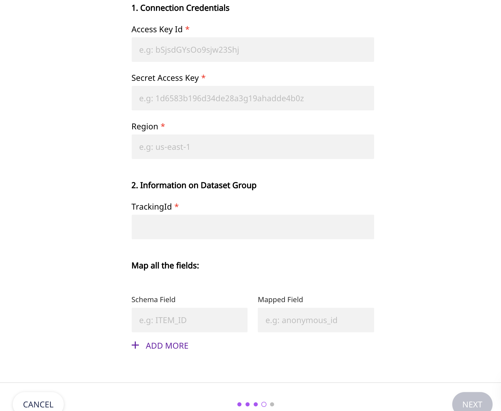

# AWS Personalize

[AWS Personalize](https://aws.amazon.com/personalize/), also called as AWS Personalize, is a machine learning service by Amazon. It enables you to create high-quality content recommendations, personalized product and marketing promotions, and much more. With AWS Personalize, you can boost your customer engagement and overall business revenue in no time at all.

RudderStack allows you to configure AWS Personalize as a destination to which you can send your event data seamlessly, for personalized recommendation and effective product marketing.


**Find the open-source transformer code for this destination in our** [**GitHub repo**](https://github.com/rudderlabs/rudder-transformer/tree/master/v0/destinations/personalize)**.**


## **Getting Started**

In order to enable dumping data to AWS Personalize, you will first need to add it as a destination to the source from which you are sending event data. Once the destination is enabled, events from RudderStack will start to flow to AWS Personalize.

Before configuring your source and destination on the RudderStack app, please check whether the platform you are working on is supported by AWS Personalize. Refer to the table below:

| **Connection Mode** | **Web** | **Mobile** | **Server** |
| :--- | :--- | :--- | :--- |
| **Device mode** | - | - | - |
| **Cloud mode** | **Supported** | **Supported** | **Supported** |


To know more about the difference between Cloud mode and Device mode in RudderStack, read the [RudderStack connection modes](https://docs.rudderstack.com/get-started/rudderstack-connection-modes) guide.


Once you have confirmed that the platform supports sending events to AWS Personalize, perform the steps below:

* Run the script by following the instructions included in the [readme.md](https://github.com/rudderlabs/rudder-transformer/tree/destination_personalize/v0/personalize/scripts) to generate a Tracking ID.


Keep this Tracking ID handy as it is used later to configure AWS Personalize as a destination.


* Next, go to the [RudderStack dashboard](https://app.rudderstack.com/), and choose a source to which you would like to add AWS Personalize as a destination.


Please follow our [Adding a Source and Destination](https://docs.rudderstack.com/getting-started/adding-source-and-destination-rudderstack) guide to know how to add a source in RudderStack.


* Select the destination as **AWS Personalize**. Give your destination a name and then click on **Next**. You should then see the following screen:



* Next, in the **Settings** section, fill all the fields with the relevant information and click **Next.** A brief description of each of these fields is mentioned below:
  * **Connection Credentials**
    * **Access Key ID**: The access key ID of your AWS account goes here.
    * **Secret Access Key**: Enter the secret access key of your AWS account.
    * **Region**: Please enter the region associated with your AWS account here.
  * **Information on Dataset Group**
    * **TrackingId**: Enter the tracking ID that you generated in the first step
    * **Dataset ARN**: Please enter the dataset ARN of the corresponding dataset from the chosen dataset group
  * **Operational Choice**
    * **Personalize Events**: Choose the type of personalize event you want to avail.
  * **Map all the fields**: In this section, enter the **Schema Field** you have used to create the schema in AWS Personalize \(for e.g. `USER_ID`, `TIMESTAMP`, `ITEM_ID`, etc.\). Also, enter the corresponding **Mapped Field** from which the value will be taken from your event payload.

  
  When using PutItems operation, you need to provide the path to the corresponding **Mapped Field** corresponding ITEM_ID in your personalize database schema.
  

## Track

The `track` call lets you use `PutEvents` and `PutItems` operation of AWS Personalize.



For `PutEvents` The value of the `event` field in the payload will be sent as `EVENT_TYPE`.



For `PutItems` and `PutEvents` operation, `Dataset ARN` and ` Tracking ID` respectively are mantaory information to provide.



The following snippet shows an example of sending track event, with mapped field specified in the [RudderStack dashboard](https://app.rudderstack.com/):

```javascript
rudderanalytics.track("PRODUCT ADDED", {
  typeOfSdk: "javascript",
  numberOfRatings: "12",
  X: "item 1",
});
```

  When using `PutItems` operation, with the above example `track` call, `X` is the corresponding mapping field for `ITEM_ID` in the database schema. And, the path can be specified as `properties.X`.
  
## Identify

The `identify` call lets you use `PutUsers` operation of AWS Personalize.


For `PutUsers`, the value of the `userId` or `anonymousId` field in the payload will be sent as `userId`.



For `PutUsers` operation, `Dataset ARN` is a mantaory information to provide.


The following snippet shows an example of sending identify event, with mapped field specified in the [RudderStack dashboard](https://app.rudderstack.com/):

```javascript
rudderanalytics.identify("userId", {
  name: "John",
  email: "john@xyz.com"
  });
```
## Contact Us

If you come across any issues while configuring AWS Personalize as a destination with RudderStack, please feel free to [contact us](mailto:%20docs@rudderstack.com). You can also start a conversation on our [Slack](https://resources.rudderstack.com/join-rudderstack-slack) channel; we will be happy to talk to you!

