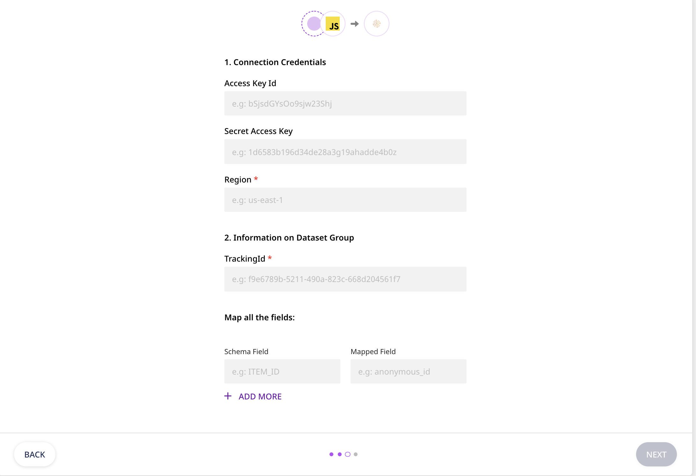
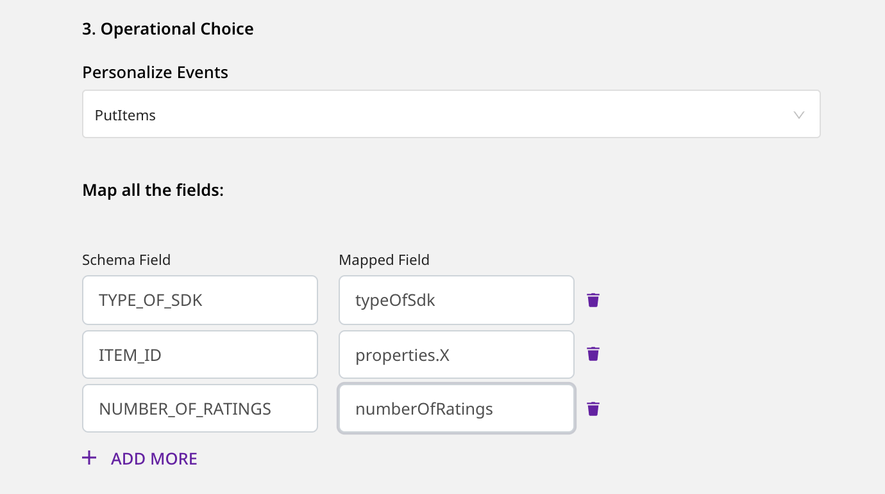
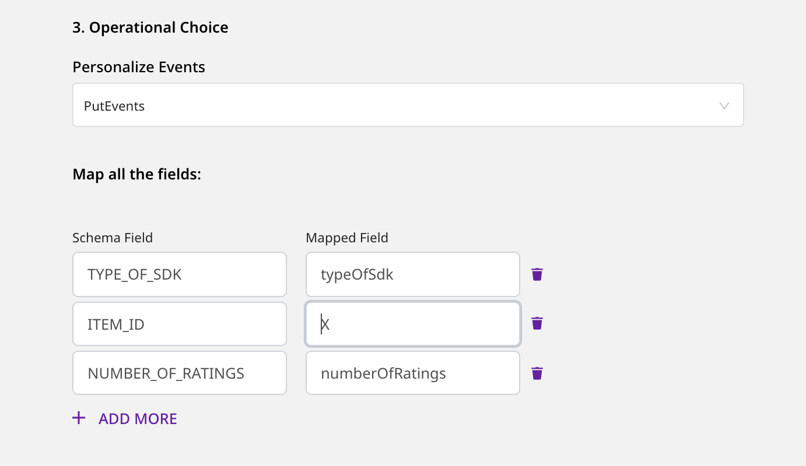

# AWS Personalize

[**Amazon Personalize**](https://aws.amazon.com/personalize/), also called as **AWS Personalize**, is a machine learning service by Amazon. It enables you to create high-quality content recommendations, personalized product and marketing promotions, and much more. With Personalize, you can boost your customer engagement and overall business revenue in no time at all.

RudderStack lets you configure AWS Personalize as a destination to which you can seamlessly send your event data for personalized recommendation and effective product marketing.

<div class="successBlock">

**Find the open-source transformer code for this destination in our** [**GitHub repo**](https://github.com/rudderlabs/rudder-transformer/tree/master/v0/destinations/personalize)**.**
</div>

<div class="infoBlock">

To use [**`PutUsers`**](https://docs.aws.amazon.com/personalize/latest/dg/API_UBS_PutUsers.html) and [**`PutItems`**](https://docs.aws.amazon.com/personalize/latest/dg/API_UBS_PutItems.html) for Personalize, use the latest images for [**`rudder-server`**](https://github.com/rudderlabs/rudder-server) and [**`rudder-transformer`**](https://github.com/rudderlabs/rudder-transformer) images.
</div>

## Getting started

To enable sending data to AWS Personalize, you will first need to add it as a destination in the RudderStack dashboard. Once the destination is enabled, events from RudderStack will start flowing to Personalize.

Before configuring your source and destination on the RudderStack app, check whether the source platform is supported by AWS Personalize by referring to the following table:

| **Connection Mode** | **Web** | **Mobile** | **Server** |
| :--- | :--- | :--- | :--- |
| **Device mode** | - | - | - |
| **Cloud mode** | **Supported** | **Supported** | **Supported** |

<div class="infoBlock">

To know more about the difference between cloud mode and device mode in RudderStack, read the [**RudderStack connection modes**](https://rudderstack.com/docs/connections/rudderstack-connection-modes/) guide.
</div>

Once you have confirmed that the source platform supports sending events to AWS Personalize, perform the steps below:

* Generate a Tracking ID by following the instructions [**here**](https://github.com/rudderlabs/rudder-transformer/tree/destination_personalize/v0/personalize/scripts).

<div class="successBlock">

**Keep this Tracking ID handy**. It is required to configure AWS Personalize as a destination.
</div>

* Next, go to the [**RudderStack dashboard**](https://app.rudderstack.com/), and configure the source.

<div class="infoBlock">

Follow our [**Adding a Source and Destination**](https://rudderstack.com/docs/connections/adding-source-and-destination-rudderstack/) guide for more information.
</div>

* From the list of destinations, select **AWS Personalize**. Assign a name to your destination and then click on **Next**. You should then see the following screen:

<!---->


<span class="imageTitle">Destination Settings for AWS Personalize</span>

* Next, in the **Connection Settings** page, fill all the fields with the relevant information and click on **Next**.

### Connection Settings

This section details all the fields you need to configure to set up Personalize as a destination.

* **Access Key ID**: Enter the access key ID of your AWS account here.

<div class="infoBlock">

The following actions need to be attached to the Access Key while setting up the AWS policy for it:

```text
"Action": [
           "personalize:PutEvents",
           "personalize:PutUsers",
           "personalize:PutItems"
          ]
```

You can use these actions based on the type of Personalize events you want to send. For example, to send only `putEvents` type of events, you can attach only `"personalize:PutEvents"`.
</div>

* **Secret Access Key**: Enter the secret access key of your AWS account.
* **Region**: Enter the region associated with your AWS account in this field.
* **Information on Dataset Group**:
  * **TrackingId**: Enter the Tracking ID that you generated in the first step.
  * **Dataset ARN**: Enter the dataset ARN of the dataset from the chosen dataset group.

<div class="warningBlock">

For `PutItems` and `PutEvents` operations, it is mandatory to specify the `Dataset ARN` and `Tracking ID` in the RudderStack dashboard.
</div>

* **Operational Choice**:
  * **Personalize Events**: Choose the type of Personalize event you want to avail.
  * **Map all the fields**: In this section, enter the **Schema Field** you have used to create the schema in AWS Personalize \(e.g. `USER_ID`, `TIMESTAMP`, `ITEM_ID`, etc.\). Also, enter the corresponding **Mapped Field** from which the value will be taken from your event payload.

<div class="infoBlock">

For more information on creating a schema in Personalize, refer to their [**documentation**](https://docs.aws.amazon.com/personalize/latest/dg/data-prep-creating-datasets.html).
</div>

<div class="infoBlock">

When using the `PutItems` operation, you need to provide the path to the corresponding **Mapped Field** corresponding to the `ITEM_ID` in your Personalize database schema.
</div>

## Track

The `track` call lets you use [**`PutEvents`**](https://docs.aws.amazon.com/personalize/latest/dg/API_UBS_PutEvents.html) and [**`PutItems`**](https://docs.aws.amazon.com/personalize/latest/dg/API_UBS_PutItems.html) operations of AWS Personalize.

<div class="infoBlock">

For `PutEvents`, RudderStack sends the value of the `event` field in the payload as `EVENT_TYPE`. Also, the value of the `timestamp` or `originalTimestamp` field in the payload will be sent as `sentAt`.
</div>

<div class="infoBlock">

For `PutItems` and `PutEvents` operations, it is mandatory to specify the `Dataset ARN` and `Tracking ID` in the RudderStack dashboard.
</div>

<div class="infoBlock">

To use the `PutUsers` and `PutItems` operations, use the latest images for [**`rudder-server`**](https://github.com/rudderlabs/rudder-server) and [**`rudder-transformer`**](https://github.com/rudderlabs/rudder-transformer) images.
</div>

The following snippet shows a sample `track` event with the mapped field specified in the [**RudderStack dashboard**](https://app.rudderstack.com/):

```javascript
rudderanalytics.track("PRODUCT ADDED", {
  typeOfSdk: "javascript",
  numberOfRatings: "12",
  X: "item 1",
});
```

<div class="infoBlock">

When using the `PutItems`, the **Schema Field** `ITEM_ID` must be mapped to a specific key inside the payload and you need to mention the path to the chosen key as the corresponding **Mapped Field**.
</div>

In the above example, if you map `ITEM_ID` to the payload field `X`, the corresponding **Mapped Field** will be `properties.X`.

<div class="infoBlock">

For any other **Schema Field** in your `ITEMS` dataset, it is **not** advised to specify the path - only the field name will be sufficient.
</div>

<div class="warningBlock">

While using `PutEvents`, the **Mapped Field** for `ITEM_ID` should **not** contain the path to the field. Only the name of the field will be sufficient. The same rule is applicable for any other **Schema Field** mapping.
</div>

The following image shows an example of the dashboard configuration for `PutItems`:

<!---->


<span class="imageTitle">Dashboard Configuration Based On The Above Example</span>

The following image shows an example of the dashboard configuration for `PutEvents`:

<!---->


<span class="imageTitle">Dashboard Configuration Based On The Above Example</span>

## Identify

The `identify` call lets you use `PutUsers` operation of AWS Personalize.

<div class="infoBlock">

To use `PutUsers` and `PutItems` for Personalize, use the latest images for [**`rudder-server`**](https://github.com/rudderlabs/rudder-server) and [**`rudder-transformer`**](https://github.com/rudderlabs/rudder-transformer) images.
</div>

<div class="infoBlock">

For the `PutUsers` operation, the value of the `userId` or `anonymousId` field in the payload will be sent as `userId`.
</div>

<div class="infoBlock">

For `PutUsers`, the **Dataset ARN** field in the RudderStack dashboard is required.
</div>

The following snippet highlights a sample `identify` event with the **Mapped Field** specified in the [**RudderStack dashboard**](https://app.rudderstack.com/):

```javascript
rudderanalytics.identify("userId", {
  name: "John",
  email: "john@xyz.com"
  });
```

## Contact Us

If you come across any issues while configuring AWS Personalize as a destination with RudderStack, please feel free to [contact us](mailto:%20docs@rudderstack.com). You can also start a conversation on our [Slack](https://rudderstack.com/join-rudderstack-slack-community) channel; we will be happy to talk to you!
