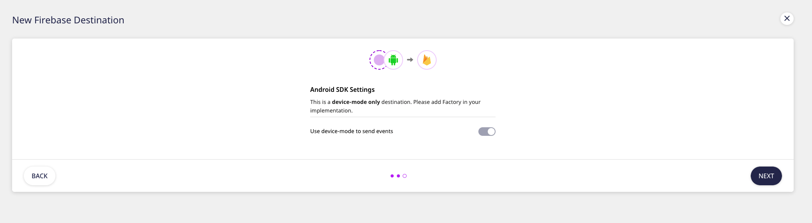

# Firebase

[**Firebase**](https://firebase.google.com/) is a popular mobile platform powered by Google. It helps you to quickly develop high-quality, enterprise-grade applications and grow your business.

Firebase is tightly integrated with Google Analytics and offers unlimited reporting for up to 500 events defined using the Firebase SDK. You can check the Firebase destination code on [**GitHub**](https://github.com/firebase/) for Android and iOS platforms.

RudderStack lets you send your event data from your mobile apps to Firebase through its Android, iOS, Unity, and ReactNative SDKs. This guide will help you set up, configure, and use Firebase for your project.

## Getting started

Before configuring Firebase as a destination in RudderStack, verify if the source platform is supported by Firebase, by referring to the following table:

| **Connection Mode** | **Web** | **Mobile**    | **Server** |
| :------------------ | :------ | :------------ | :--------- |
| **Device mode**     | -       | **Supported** | -          |
| **Cloud mode**      | -       | -             | -          |

<div class="warningBlock">
  
  Firebase is a device-mode only integration. To know more about the difference between cloud mode and device mode in RudderStack, refer to the <a href="https://rudderstack.com/docs/connections/rudderstack-connection-modes/">RudderStack connection modes</a> guide.
</div>

Once you have confirmed that the source platform supports sending events to Firebase, perform the steps below:

* From your [**RudderStack dashboard**](https://app.rudderstack.com), add the source. From the list of destinations, select **Firebase**.

<div class="infoBlock">

Refer to the <a href="https://rudderstack.com/docs/connections/adding-source-and-destination-rudderstack/">Adding a source and destination in RudderStack</a> guide for more information.
</div>

* Assign a name to your destination and click on **Next**.

* Then, connect this destination to your Android/iOS/Unity/React Native source. You should then see the following screen:



* As this is a device mode-only integration, click on **Next** to complete the destination setup.

* Next, depending on your platform of integration follow the steps below to enable Firebase in your project:

<Tabs>
  <TabList>
    <Tab>Android</Tab>
    <Tab>iOS</Tab>
    <Tab>Unity</Tab>
    <Tab>React Native</Tab>
  </TabList>
    <TabPanels>
      <TabPanel>
        Follow these steps to add Firebase to your Android project:
<ul>
<li>Register your mobile application in the <a href="https://console.firebase.google.com/">Firebase console</a>.</li>
<li>Once you have successfully created the application in the Firebase console, you will be prompted to download the <code class="inline-code">google-services.json</code> file.</li>
<li>Copy this file in the <code class="inline-code">app</code> folder of your project. It contains all the necessary information about the project and the integration.</li>
<li>Add the <code class="inline-code">classpath</code> under <code class="inline-code">dependencies</code> to your project level <code class="inline-code">build.gradle</code>
<span>

```groovy
buildscript {
  repositories {
    google()
  }
  dependencies {
    // add this line
    classpath 'com.google.gms:google-services:4.3.3'
  }
}
```
</span>
</li>
<li>Once you have completed the steps above, you can add the <code class="inline-code">plugins</code> and <code class="inline-code">dependencies</code> to your <code class="inline-code">app/build.gradle</code> file as shown:
<span>

```groovy
apply plugin: 'com.android.application'
apply plugin: 'com.google.gms.google-services'
```
</span>
</li>
<li>Then, add the repository as shown:

```groovy
repositories {
  mavenCentral()
}
```
</li>
<li>Add the RudderStack-Firebase SDK extension along with <code class="inline-code">core</code> SDK under <code class="inline-code">dependencies</code>:
<span>

```groovy
implementation 'com.rudderstack.android.sdk:core:1.+'
implementation 'com.rudderstack.android.integration:firebase:2.+'
```
</span>
</li>
<li>Then, add the necessary <code class="inline-code">permissions</code> under <code class="inline-code">AndroidManifest.xml</code> as shown:
<span>

```markup
<uses-permission android:name="android.permission.INTERNET" />
<uses-permission android:name="android.permission.ACCESS_NETWORK_STATE" />
```
</span>
</li>
<li>Finally, change the initialization of your <code class="inline-code">RudderClient</code> in your <code class="inline-code">Application</code> class.
<span>

```kotlin
val rudderClient = RudderClient.getInstance(
    this,
    <SOURCE_WRITE_KEY>,
    RudderConfig.Builder()
        .withDataPlaneUrl(<DATA_PLANE_URL>)
        .withFactory(FirebaseIntegrationFactory.FACTORY)
        .build()
)
```
</span>
</li>
</ul>
      </TabPanel>
      <TabPanel>
        Follow these steps to add Firebase to your iOS project:
<ul>
<li>Register your app to the <a href="https://console.firebase.google.com">Firebase console</a>. It will then prompt you to download the <code class="inline-code">GoogleServices-Info.plist</code> file.</li>
<li>Add the file to the root of your XCode project.</li>
<li>Go to your <code class="inline-code">Podfile</code> and add the <code class="inline-code">Rudder-Firebase</code> extension along with the core SDK using the following code:
<span>

```ruby
pod 'Rudder-Firebase'
```
</span>
</li>
<li>After adding the dependency followed by <code class="inline-code">pod install</code> ,you can add the imports to your <code class="inline-code">AppDelegate.m</code> file as shown:
<span>

```objectivec
#import "RudderFirebaseFactory.h"
```
</span>
</li>
<li>Finally, change the intialization of your `RudderClient` as shown:
<span>

```objectivec
RSConfigBuilder *builder = [[RSConfigBuilder alloc] init];
[builder withDataPlaneUrl:DATA_PLANE_URL];
[builder withFactory:[RudderFirebaseFactory instance]];
[builder withLoglevel:RSLogLevelDebug];
[RSClient getInstance:WRITE_KEY config:[builder build]];
```
</span>
</li>
</ul>
<div class="infoBlock">

RudderStack will bundle the <code class="inline-code">Firebase/Core</code> and <code class="inline-code">FirebaseAnalytics</code> by default with the <code class="inline-code">Rudder-Firebase</code> pod.

</div>
    </TabPanel>
    <TabPanel>
        Follow these steps to add Firebase to your Unity project:
<ul>
<li>Register your project in the <a href="https://console.firebase.google.com">Firebase Console</a>. Currently, RudderStack supports only Android and iOS for Unity.</li>
<li>After adding the project, Firebase will prompt you to download the <code class="inline-code">google-services.json</code> for Android and <code class="inline-code">GoogleServices-Info.plist</code> for iOS.</li>
<li>Add those two files to your <code class="inline-code">Assets</code> folder.</li>
<li>Integrate the RudderStack core SDK with your project. To know more, refer to the <a href="https://rudderstack.com/docs/stream-sources/rudderstack-sdk-integration-guides/getting-started-with-unity-sdk">Getting Started with Unity SDK</a> guide.</li>
<li>Download and import the Firebase Unity SDK and follow these instructions on <a href="https://firebase.google.com/docs/unity/setup">adding the Firebase SDK to your project</a>. Specifically, <code class="inline-code">FirebaseAnalytics.unitypackage</code>.</li>
<li>Download the <a href="https://github.com/rudderlabs/rudder-sdk-unity/raw/master/Integrations/Firebase/rudder-integration-firebase-unity.unitypackage">Firebase extension for RudderStack</a> from the GitHub page and import it into your project.</li>
<li>Attach the <code class="inline-code">RudderPreferbs.prefab</code> file from <code class="inline-code">Rudder</code> to your main <code class="inline-code">GameObject</code></li>
<li>Finally, change the SDK initialization using the following code snippet:
<span>

```groovy

// Build your config
RudderConfigBuilder configBuilder = new RudderConfigBuilder()
    .WithEndPointUrl(<DATA_PLANE_URL>)
    .WithFactory(RudderFirebaseIntegrationFactory.GetFactory());

// get instance for RudderClient
RudderClient rudderClient = RudderClient.GetInstance(
    <SOURCE_WRITE_KEY>,
    configBuilder.Build()
);
```
</span>
</li>
</ul>
    </TabPanel>
    <TabPanel>
        Follow these steps to add Firebase to your React Native project:
<ul>
<li>Register your Android and iOS applications in the <a href="https://console.firebase.google.com/">Firebase console</a>.</li>
<li>Once you have successfully created the applications in the Firebase console, you will be prompted to download the <code class="inline-code">google-services.json</code> and <code class="inline-code">GoogleServices-Info.plist</code> files.</li>
<li>Add the RudderStack React Native SDK to your app by referring to the <a href="https://rudderstack.com/docs/stream-sources/rudderstack-sdk-integration-guides/rudderstack-react-native-sdk">Getting Started with the ReactNative SDK</a> guide.</li>
<li>Add the RudderStack-Firebase react native module to your app using the following command:
<span>

  ```bash
  npm install @rudderstack/rudder-integration-firebase-react-native
  // OR //
  yarn add @rudderstack/rudder-integration-firebase-react-native
  ```
</span>
</li>
<li>Next, import the module you added above and add it to your SDK initialization code as shown:
<span>

  ```javascript
  import rudderClient from '@rudderstack/rudder-sdk-react-native';
  import firebase from "@rudderstack/rudder-integration-firebase-react-native";

  const config = &#123;
      dataPlaneUrl: <DATA_PLANE_URL>,
      trackAppLifecycleEvents: true,
      withFactories: [firebase]
  &#125;;

  rudderClient.setup(<SOURCE_WRITE_KEY>, config);
  ```
</span>
</li>
<li>Navigate to your app's <code class="inline-code">android</code> folder and follow the following steps:
    <ul>
  <li>Copy the <code class="inline-code">google-services.json</code> file in the <code class="inline-code">app</code> folder of your android project. The file contains all the necessary information about the project and the integration.</li>
  <li>Add the <code class="inline-code">classpath</code> under <code class="inline-code">dependencies</code> to your project level <code class="inline-code">build.gradle</code>
<span>

  ```groovy
  buildscript {
    repositories {
      google()
    }
    dependencies {
      // add this line
      classpath 'com.google.gms:google-services:4.3.3'
    }
  }
  ```
</span>
</li>
<li>Once you have completed the steps above, you can add the plugins and dependencies to your <code class="inline-code">app/build.gradle</code> file as shown:
<span>

  ```groovy
  apply plugin: 'com.android.application'
  apply plugin: 'com.google.gms.google-services'
  ```
</span>
</li>
<li>Then, add the necessary permissions under <code class="inline-code">AndroidManifest.xml</code> as shown:
<span>

  ```markup
  <uses-permission android:name="android.permission.INTERNET" />
  <uses-permission android:name="android.permission.ACCESS_NETWORK_STATE" />
  ```
</span>
</li>
</ul>
</li>
<li>Finally, navigate to your app's <code class="inline-code">iOS</code> folder and follow these steps:
    <ul>
  <li>Install all the required pods using <code class="inline-code">pod install</code></li>
  <li>Add the <code class="inline-code">GoogleServices-Info.plist</code> file to the root of your XCode project.</li>
  </ul>
</li>
</ul>
    </TabPanel>
    </TabPanels>
</Tabs>

## Identify

The `identify` call sets the `userId` through the `setUserId` method from `FirebaseAnalytics`. RudderStack sets the other user properties from `RudderTraits` to Firebase using the `setUserProperty` method. RudderStack ignores `age`, `gender` and `interest` as these are reserved by Google.

```objectivec
[[RSClient sharedInstance] identify:@"test_user_id"
                             traits:@{@"foo": @"bar",
                                      @"foo1": @"bar1",
                                      @"email": @"test@gmail.com",
                                      @"key_1" : @"value_1",
                                      @"key_2" : @"value_2"
                             }
];
```

## Track

The `track` call from RudderStack is mapped to the standard events of Firebase wherever possible. RudderStack maps the events as per the following table:

| RudderStack Event           | Firebase Event       |
| :-------------------------- | :------------------- |
| `Payment Info Entered`      | `add_payment_info`   |
| `Product Added`             | `add_to_cart`        |
| `Product Added to Wishlist` | `add_to_wishlist`    |
| `Application Opened`        | `app_open`           |
| `Checkout Started`          | `begin_checkout`     |
| `Order Completed`           | `purchase`           |
| `Order Refunded`            | `refund`             |
| `Products Searched`         | `search`             |
| `Cart Shared`               | `share`              |
| `Product Shared`            | `share`              |
| `Product Viewed`            | `view_item`          |
| `Product List Viewed`       | `view_item_list`     |
| `Product Removed`           | `remove_from_cart`   |
| `Product Clicked`           | `select_content`     |
| `Promotion Viewed`          | `view_promotion`     |
| `Promotion Clicked`         | `select_promotion`   |
| `Cart Viewed`               | `view_cart`          |

Apart from the above-mentioned events, the following Firebase standard events are not mapped to any RudderStack event. You can mention the exact names from the following list to be perceived as a standard event in Firebase.

- `number_of_nights`
- `number_of_rooms`
- `number_of_passengers`
- `origin`
- `destination`
- `start_date`
- `end_date`
- `travel_class`
- `item_list_name`
- `creative_slot`
- `location_id`
- `screen_class`

<div class="infoBlock">
  
  RudderStack passes all the `properties` from the event to Firebase. The nested value in the properties is converted to JSON using <a href="https://github.com/google/gson">GSON</a>.
</div>

RudderStack modifies the event property parameter names as per the following table:

| Standard RudderStack Name        | Standard Firebase Name   |
| :------------------------------- | :---------------------   |
| `category`                       | `item_category`          |
| `cart_id`,`product_id`           | `item_id`                |
| `share_via`                      | `method`                 |
| `query`                          | `search_term`            |
| `revenue`, `value`, `total`      | `value`                  |
| `currency`                       | `currency`               |
| `order_id`                       | `transaction_id`         |
| `tax`                            | `tax`                    |
| `shipping`                       | `shipping`               |
| `coupon`                         | `coupon`                 |
| `name`                           | `name`, `promotion_name` |
| `quantity`                       | `quantity`               |
| `price`                          | `price`                  |
| `payment_method`                 | `payment_type`           |
| `list_id`                        | `item_list_id`           |
| `promotion_id`                   | `promotion_id`           |
| `creative`                       | `creative_name`          |
| `affiliation`                    | `affiliation`            |


Along with the above list of the standard property names, RudderStack does the following in case of an Android source:

- Converts the names to lower case.
- Trims the white spaces from the start and the end.
- Replaces `space` with `underscore`.
- If the length of the key is more than 40, takes the substring of length 40 from the beginning.

Firebase enforces to have the value of length less than 100. RudderStack takes the substring of length 100 from the beginning if the length exceeds the permitted value.

A sample `track` call from the iOS SDK is shown below:

```objectivec
[[RSClient sharedInstance] track:@"simple_track_with_props" properties:@{
    @"key_1" : @"value_1",
    @"key_2" : @"value_2"
}];
```

## Screen

The `screen` method allows you to record whenever a user sees the mobile screen along with any optional properties.

A sample `screen` call looks like the following:

<Tabs>
  <TabList>
    <Tab>iOS</Tab> // this is the first tab's title
    <Tab>Android</Tab>       // this is the second tab's title
  </TabList>
    <TabPanels>
      <TabPanel>
<span>
 
```objectivec
[[RSClient sharedInstance] screen:@"Home Screen"
                              properties:@{
                                  @"Width" : @"13"
                              }];
```
</span>
      </TabPanel>
      <TabPanel>
<span>
 
```kotlin
MainApplication.rudderClient.screen("Home Screen",
            RudderProperty()
                .putValue("Width",12)
        )
```
</span>
      </TabPanel>
    </TabPanels>
</Tabs>


# Reset

The `reset` method removes the user ID.
        
A sample `reset` call is shown in the following snippets:

<Tabs>
  <TabList>
    <Tab>iOS</Tab> // this is the first tab's title
    <Tab>Android</Tab>       // this is the second tab's title
  </TabList>
    <TabPanels>
      <TabPanel>
<span>
 
```objectivec

[[RSClient sharedInstance] reset];
</span>
      </TabPanel>
      <TabPanel>
<span>
 
```kotlin

MainApplication.rudderClient.reset()
```
</span>
      </TabPanel>
    </TabPanels>
</Tabs>

## Debugging

You can check the events and the properties along with it in the Firebase Debug View. To enable it for Android, fire the command below from your terminal:

```bash
$ adb shell setprop debug.firebase.analytics.app <your_package_name>
```

For iOS, specify the following in your command line argument in XCode:

```objectivec
-FIRAnalyticsDebugEnabled
```

## FAQs

### How do I disable automatic screen tracking while using this SDK?

* For Android, nest the following setting within the `<application>` tag of the `AndroidManifest.xml` file:
        
```xml
<meta-data android:name="google_analytics_automatic_screen_reporting_enabled" android:value="false" />
```

* In case of iOS, set `FirebaseAutomaticScreenReportingEnabled` to `NO` (Boolean) in the `Info.plist`.
        
For more information, visit the [**Firebase docs**](https://firebase.google.com/docs/analytics/screenviews#automatically_track_screens) on this topic.

## Contact us

If you come across any issues while configuring Firebase with RudderStack, you can [**contact us**](mailto:%20docs@rudderstack.com). You can also start a conversation on our [**Slack**](https://rudderstack.com/join-rudderstack-slack-community) channel.
