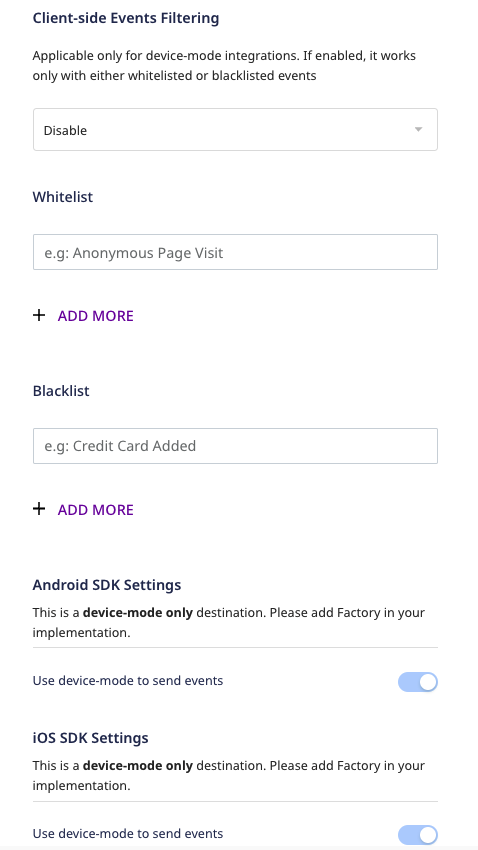

# Firebase

[Firebase](https://firebase.google.com/) is a popular mobile platform powered by Google. It helps you to quickly develop high-quality, enterprise-grade applications and grow your business.

RudderStack supports Firebase as a [mobile device mode destination](https://www.rudderstack.com/docs/rudderstack-cloud/rudderstack-connection-modes/#device-mode) to which you can seamlessly send your customer data for analytics.

<div class="dangerBlock">

Firebase device mode support is not available for the <a href="https://www.rudderstack.com/docs/stream-sources/rudderstack-sdk-integration-guides/rudderstack-cordova-sdk/">Cordova</a> and <a href="https://www.rudderstack.com/docs/stream-sources/rudderstack-sdk-integration-guides/rudderstack-flutter-sdk/">Flutter</a> SDKs.
</div>

## Getting started

Before configuring Firebase as a destination in RudderStack, verify if the source platform is supported by Firebase by referring to the table below:

| **Connection Mode** | **Web** | **Mobile**    | **Server** |
| :------------------ | :------ | :------------ | :--------- |
| **Device mode**     | -       | **Supported** | -          |
| **Cloud mode**      | -       | -             | -          |

<div class="warningBlock">

Firebase is a device mode-only integration. To know more about the difference between cloud mode and device mode in RudderStack, refer to the <a href="https://rudderstack.com/docs/rudderstack-cloud/rudderstack-connection-modes/">RudderStack Connection Modes</a> guide.
</div>

Once you have confirmed that the source platform supports sending events to Firebase, follow these steps:

1. From your [RudderStack dashboard](https://app.rudderstack.com/), add a source. Then, from the list of destinations, select **Firebase**.
2. Assign a name to the destination and click on **Next**.

### Connection settings

Connect this destination to your Android/iOS/Unity/React Native source. You should then see the following screen:



- **Client-side Events Filtering**: Refer to the [Client-side Events Filtering](https://www.rudderstack.com/docs/stream-sources/rudderstack-sdk-integration-guides/event-filtering/) guide for more information on this setting.

As this is a device mode-only integration, click on **Next** to complete the destination setup.

### Adding device mode integration

Depending on your platform of integration, follow the steps below to add Firebase to your project:

<Tabs>
  <TabList>
    <Tab>Android</Tab>
    <Tab>iOS</Tab>
    <Tab>Unity</Tab>
    <Tab>React Native</Tab>
  </TabList>
    <TabPanels>
      <TabPanel>
        <div class="infoBlock">
          Use the <a href="https://search.maven.org/artifact/com.rudderstack.android.integration/firebase">latest version</a> of the Firebase Android device mode to get the latest updates, bug fixes, and performance enhancements.
        </div>
        Follow these steps to add Firebase to your Android project:
<ol>
<li>Register your mobile app in the <a href="https://console.firebase.google.com/">Firebase console</a>.</li>
<li>Once you have successfully created the app in the Firebase console, you will be prompted to download the <code class="inline-code">google-services.json</code> file.</li>
<li>Copy this file in the <code class="inline-code">app</code> folder of your project. It contains all the necessary information about the project and the integration.</li>
<li>Add the <code class="inline-code">classpath</code> under <code class="inline-code">dependencies</code> to your project level <code class="inline-code">build.gradle</code>, as shown:
<span>

```groovy
buildscript {
  repositories {
    google()
  }
  dependencies {
    // add this line
    classpath 'com.google.gms:google-services:4.3.3'
  }
}
```
</span>
</li>
<li>Now, you can add the <code class="inline-code">plugins</code> and <code class="inline-code">dependencies</code> to your <code class="inline-code">app/build.gradle</code> file, as shown:
<span>

```groovy
apply plugin: 'com.android.application'
apply plugin: 'com.google.gms.google-services'
```
</span>
</li>
<li>Then, add the <code class="inline-code">mavenCentral</code> repository, as shown:

```groovy
repositories {
  mavenCentral()
}
```
</li>
<li>Add the RudderStack-Firebase SDK extension along with the <code class="inline-code">core</code> SDK under <code class="inline-code">dependencies</code>, as shown:
<span>

```groovy
implementation 'com.rudderstack.android.sdk:core:1.+'
implementation 'com.rudderstack.android.integration:firebase:2.+'

//Firebase
implementation platform('com.google.firebase:firebase-bom:28.4.2')
implementation 'com.google.firebase:firebase-analytics'

```
</span>
</li>
<li>Next, add the necessary <code class="inline-code">permissions</code> under <code class="inline-code">AndroidManifest.xml</code>, as shown:
<span>

```markup
<uses-permission android:name="android.permission.INTERNET" />
<uses-permission android:name="android.permission.ACCESS_NETWORK_STATE" />
```
</span>
</li>
<li>Finally, change the SDK initialization in your <code class="inline-code">Application</code> class, as shown:
<span>

```kotlin
val rudderClient = RudderClient.getInstance(
    this,
    <SOURCE_WRITE_KEY>,
    RudderConfig.Builder()
        .withDataPlaneUrl(<DATA_PLANE_URL>)
        .withFactory(FirebaseIntegrationFactory.FACTORY)
        .build()
)
```
</span>
</li>
</ol>
      </TabPanel>
      <TabPanel>
        <div class="infoBlock">
          If you're using the Firebase iOS device mode v1.0.2, update to the <a href="https://cocoapods.org/pods/Rudder-Firebase">latest version</a> to get the latest updates, bug fixes, and performance enhancements.
        </div>
        Follow these steps to add Firebase to your iOS project:
<ol>
<li>Register your app in the <a href="https://console.firebase.google.com">Firebase console</a>. It will then prompt you to download the <code class="inline-code">GoogleServices-Info.plist</code> file.</li>
<li>Add the file to the root of your XCode project.</li>
<li>Go to your <code class="inline-code">Podfile</code> and add the <code class="inline-code">Rudder-Firebase</code> extension along with the core SDK using the following code:
<span>

```ruby
pod 'Rudder-Firebase', '~> 2.0.5'
```
</span>
</li>
<div class="infoBlock">

<code class="inline-code">Rudder-Firebase</code> version <code class="inline-code">2.0.5</code> is tested and fully compatible with <code class="inline-code">Firebase/Analytics</code> version <code class="inline-code">8.15.0</code>.
</div>
<li>After adding the dependency followed by the <code class="inline-code">pod install</code> command, you can add the imports to your <code class="inline-code">AppDelegate.m</code> file, as shown:
<span>

```objectivec
#import "RudderFirebaseFactory.h"
```
</span>
</li>
<li>Finally, change the SDK initialization, as shown in the following snippet:
<span>

```objectivec
RSConfigBuilder *builder = [[RSConfigBuilder alloc] init];
[builder withDataPlaneUrl:<DATA_PLANE_URL>];
[builder withFactory:[RudderFirebaseFactory instance]];
[builder withLoglevel:RSLogLevelDebug];
[RSClient getInstance:<WRITE_KEY> config:[builder build]];
```
</span>
</li>
</ol>
    </TabPanel>
    <TabPanel>
        Follow these steps to add Firebase to your Unity project:
<ol>
<li>Register your project in the <a href="https://console.firebase.google.com">Firebase Console</a>. Currently, RudderStack supports only Android and iOS platforms for Unity.</li>
<li>After adding the project, Firebase will prompt you to download the <code class="inline-code">google-services.json</code> for Android and <code class="inline-code">GoogleServices-Info.plist</code> for iOS.</li>
<li>Add those two files to your project's <code class="inline-code">Assets</code> folder.</li>
<li>Integrate the RudderStack core SDK with your project. For more information, refer to the <a href="https://rudderstack.com/docs/stream-sources/rudderstack-sdk-integration-guides/getting-started-with-unity-sdk">RudderStack Unity SDK</a> documentation.</li>
<li>Download and import the Firebase Unity SDK and follow the <a href="https://firebase.google.com/docs/unity/setup">instructions</a> to add the Firebase SDK (specifically, <code class="inline-code">FirebaseAnalytics.unitypackage</code>) to your project. </li>
<li>Download the <a href="https://github.com/rudderlabs/rudder-sdk-unity/raw/master/Integrations/Firebase/rudder-integration-firebase-unity.unitypackage">RudderStack Firebase Extension</a> from the GitHub page and import it in your project.</li>
<li>Attach the <code class="inline-code">RudderPreferbs.prefab</code> file from <code class="inline-code">Rudder</code> to your main <code class="inline-code">GameObject</code></li>
<li>Finally, change the SDK initialization using the following code snippet:
<span>

```groovy

// Build your config
RudderConfigBuilder configBuilder = new RudderConfigBuilder()
    .WithEndPointUrl(<DATA_PLANE_URL>)
    .WithFactory(RudderFirebaseIntegrationFactory.GetFactory());

// get instance for RudderClient
RudderClient rudderClient = RudderClient.GetInstance(
    <SOURCE_WRITE_KEY>,
    configBuilder.Build()
);
```
</span>
</li>
</ol>
    </TabPanel>
    <TabPanel>
<div class="infoBlock">
           
Use the <a href="https://www.npmjs.com/package/@rudderstack/rudder-integration-firebase-react-native">latest version</a> of the Firebase React Native device mode to get the latest updates and performance enhancements.
</div>
Follow these steps to add Firebase to your React Native project:
<ol>
<li>Register your Android and iOS applications in the <a href="https://console.firebase.google.com/">Firebase console</a>.</li>
<li>Once you have successfully created the applications in the Firebase console, you will be prompted to download the <code class="inline-code">google-services.json</code> and <code class="inline-code">GoogleServices-Info.plist</code> files.</li>
<li>Add the RudderStack React Native SDK to your app by referring to the <a href="https://rudderstack.com/docs/stream-sources/rudderstack-sdk-integration-guides/rudderstack-react-native-sdk">RudderStack ReactNative SDK</a> documentation.</li>
<li>Add the RudderStack-Firebase React Native module to your app using the following command:
<span>

  ```bash
  npm install @rudderstack/rudder-integration-firebase-react-native
  // OR //
  yarn add @rudderstack/rudder-integration-firebase-react-native
  ```
</span>
</li>
<li>Next, import the module you added above and add it to your SDK initialization code as shown:
<span>

  ```javascript
  import rudderClient from '@rudderstack/rudder-sdk-react-native';
  import firebase from "@rudderstack/rudder-integration-firebase-react-native";

  const config = {
      dataPlaneUrl: <DATA_PLANE_URL>,
      trackAppLifecycleEvents: true,
      withFactories: [firebase]
  };

  rudderClient.setup(<SOURCE_WRITE_KEY>, config);
  ```
</span>
</li>
<li>Navigate to your app's <code class="inline-code">android</code> folder and follow the steps below:
  <ul>
  <li>Copy the <code class="inline-code">google-services.json</code> file in the <code class="inline-code">app</code> folder of your Android project. This file contains all the necessary information about the project and the integration.</li>
  <li>Add the <code class="inline-code">classpath</code> under <code class="inline-code">dependencies</code> to your project level <code class="inline-code">build.gradle</code> file, as shown:
<span>

  ```groovy
  buildscript {
    repositories {
      google()
    }
    dependencies {
      // add this line
      classpath 'com.google.gms:google-services:4.3.3'
    }
  }
  ```
</span>
</li>
<li>Once you have completed the steps above, you can add the plugins and dependencies to your <code class="inline-code">app/build.gradle</code> file, as shown:
<span>

  ```groovy
  apply plugin: 'com.android.application'
  apply plugin: 'com.google.gms.google-services'
  ```
</span>
</li>
<li>Then, add the necessary permissions under <code class="inline-code">AndroidManifest.xml</code>, as shown:
<span>

  ```markup
  <uses-permission android:name="android.permission.INTERNET" />
  <uses-permission android:name="android.permission.ACCESS_NETWORK_STATE" />
  ```
</span>
</li>
</ul>
</li>
<li>Finally, navigate to your app's <code class="inline-code">iOS</code> folder and follow these steps:
    <ul>
  <li>Install all the required pods using the <code class="inline-code">pod install</code> command.</li>
  <li>Add the <code class="inline-code">GoogleServices-Info.plist</code> file to the root of your XCode project.</li>
  </ul>
</li>
</ol>
    </TabPanel>
    </TabPanels>
</Tabs>

## Identify

The [`identify`](https://www.rudderstack.com/docs/rudderstack-api/api-specification/rudderstack-spec/identify/) call sets the `userId` through the `setUserId` method from `FirebaseAnalytics`. RudderStack sets the other user properties from `RudderTraits` to Firebase using the `setUserProperty` method. 

<div class="infoBlock">

RudderStack ignores <code class="inline-code">age</code>, <code class="inline-code">gender</code>, and <code class="inline-code">interest</code>, as these properties are reserved by Google.
</div>

```objectivec
[[RSClient sharedInstance] identify:@"test_user_id"
                             traits:@{@"foo": @"bar",
                                      @"foo1": @"bar1",
                                      @"email": @"test@gmail.com",
                                      @"key_1" : @"value_1",
                                      @"key_2" : @"value_2"
                             }
];
```

## Track

RudderStack's [`track`](https://www.rudderstack.com/docs/rudderstack-api/api-specification/rudderstack-spec/track/) events are mapped to the standard Firebase events wherever possible.

### Event mapping

RudderStack maps the following events to the standard Firebase events:

| RudderStack Event           | Firebase Event       |
| :-------------------------- | :------------------- |
| `Payment Info Entered`      | `add_payment_info`   |
| `Product Added`             | `add_to_cart`        |
| `Product Added to Wishlist` | `add_to_wishlist`    |
| `Application Opened`        | `app_open`           |
| `Checkout Started`          | `begin_checkout`     |
| `Order Completed`           | `purchase`           |
| `Order Refunded`            | `refund`             |
| `Products Searched`         | `search`             |
| `Cart Shared`               | `share`              |
| `Product Shared`            | `share`              |
| `Product Viewed`            | `view_item`          |
| `Product List Viewed`       | `view_item_list`     |
| `Product Removed`           | `remove_from_cart`   |
| `Product Clicked`           | `select_content`     |
| `Promotion Viewed`          | `view_promotion`     |
| `Promotion Clicked`         | `select_promotion`   |
| `Cart Viewed`               | `view_cart`          |

The following Firebase events are **not** mapped to any RudderStack event:

- `number_of_nights`
- `number_of_rooms`
- `number_of_passengers`
- `origin`
- `destination`
- `start_date`
- `end_date`
- `travel_class`
- `item_list_name`
- `creative_slot`
- `location_id`
- `transaction_id`
- `screen_class`

<div class="infoBlock">

RudderStack passes all the event-related properties to Firebase. The nested values in the properties are converted to JSON using <a href="https://github.com/google/gson">GSON</a>.
</div>

### Property mapping

RudderStack maps the following event properties to the standard Firebase properties:

| RudderStack property        | Firebase property   |
| :------------------------------- | :---------------------   |
| `category`                       | `item_category`          |
| `cart_id`,`product_id`           | `item_id`                |
| `share_via`                      | `method`                 |
| `query`                          | `search_term`            |
| `revenue`, `value`, `total`      | `value`                  |
| `currency`                       | `currency`               |
| `tax`                            | `tax`                    |
| `shipping`                       | `shipping`               |
| `coupon`                         | `coupon`                 |
| `name`                           | `name`, `promotion_name` |
| `quantity`                       | `quantity`               |
| `price`                          | `price`                  |
| `payment_method`                 | `payment_type`           |
| `list_id`                        | `item_list_id`           |
| `promotion_id`                   | `promotion_id`           |
| `creative`                       | `creative_name`          |
| `affiliation`                    | `affiliation`            |

Along with mapping the above list of the standard property names, RudderStack exhibits the following behavior:

- Converts the event names to the lower case.
- Trims the whitespaces at the start and the end.
- Replaces a space with an underscore.

<div class="infoBlock">

Firebase enforces a <a href="https://firebase.google.com/docs/reference/cpp/group/event-names#summary">strict event name length limit</a> of 40 characters. RudderStack takes a substring of 40 characters (from the beginning) if the event names exceed this permitted value.
</div>

A sample `track` call sent from the iOS SDK is shown below:

```objectivec
[[RSClient sharedInstance] track:@"simple_track_with_props" properties:@{
    @"key_1" : @"value_1",
    @"key_2" : @"value_2"
}];
```

## Screen

The [`screen`](https://www.rudderstack.com/docs/rudderstack-api/api-specification/rudderstack-spec/screen/) method lets you record whenever a user sees their mobile screen along with any optional properties about the viewed screen.

A sample `screen` call is as shown:

```objectivec
[[RSClient sharedInstance] screen:@"Home Screen"
                              properties:@{
                                  @"Width" : @"13"
                              }];
```

## Reset

The `reset` method resets the user identification.

A sample `reset` call is shown below:

<Tabs>
  <TabList>
    <Tab>iOS</Tab>
    <Tab>Android</Tab>
  </TabList>
    <TabPanels>
      <TabPanel>
<span>

```objectivec
[[RSClient getInstance] reset];
```
</span>
      </TabPanel>
      <TabPanel>
<span>

```kotlin
RudderClient.getInstance()?.reset()
```
</span>
      </TabPanel>
    </TabPanels>
</Tabs>

## Debugging

You can check the events and their properties in the [Firebase DebugView](https://firebase.google.com/docs/analytics/debugview). To enable it for Android, run the following command from your terminal:

```bash
$ adb shell setprop debug.firebase.analytics.app <your_package_name>
```

For iOS, specify the following in your command line argument in XCode:

```objectivec
-FIRAnalyticsDebugEnabled
```

## FAQ

### How do I disable automatic screen tracking while using the RudderStack SDKs?

* For Android, nest the following setting within the `<application>` tag of your `AndroidManifest.xml` file:

```xml
<meta-data android:name="google_analytics_automatic_screen_reporting_enabled" android:value="false" />
```

* For iOS, set `FirebaseAutomaticScreenReportingEnabled` to `NO` (Boolean) in your `Info.plist`.

For more information, refer to the [Firebase documentation](https://firebase.google.com/docs/analytics/screenviews#automatically_track_screens).

## Contact us

For queries on any of the sections covered in this guide, you can [contact us](mailto:%20docs@rudderstack.com) or start a conversation in our [Slack](https://rudderstack.com/join-rudderstack-slack-community) community.
