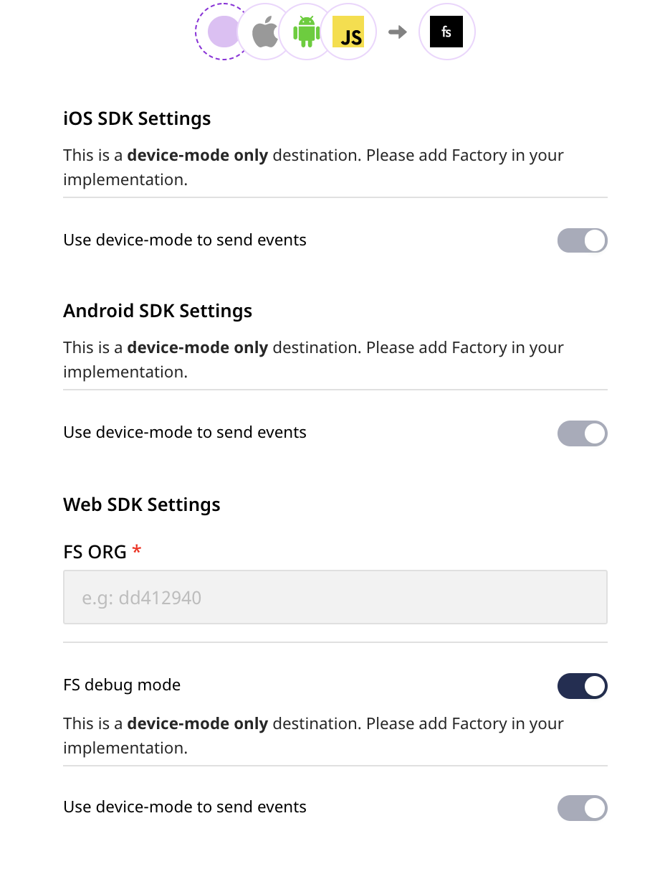
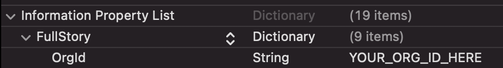

# FullStory

[**FullStory**](https://www.fullstory.com/) is a platform for analyzing user interactions, data recording and searching, and much more. FullStory's Digital Experience Intelligence (DXI) capability lets you measure and improve your users' overall digital experience.

RudderStack supports FullStory as a destination to which you can send your event data seamlessly.

## Getting started

To send your events to FullStory via RudderStack, you will first need to add it as a destination in the RudderStack dashboard. Before you get started, check if the source platform supports sending events to FullStory by referring to the table below:

| **Connection Mode** | **Web**       | **Mobile**    | **Server** |
| :------------------ | :------------ | :------------ | :--------- |
| **Device mode**     | **Supported** | **Supported** | -          |
| **Cloud mode**      | -             | -             | -          |

<div class="infoBlock">

To know more about the difference between cloud mode and device mode in RudderStack, read the <a href="https://rudderstack.com/docs/connections/rudderstack-connection-modes/">RudderStack connection modes</a> guide.
</div>

Once you have confirmed that the platform supports sending events to FullStory, perform the steps below:

- From your [**RudderStack dashboard**](https://app.rudderstack.com/), add the source. Then, select **FullStory** from the list of destinations.

<div class="infoBlock">

Follow our guide on <a href="https://rudderstack.com/docs/connections/adding-source-and-destination-rudderstack/">Adding a Source and Destination in RudderStack</a> for more information.
</div>

- Assign a name to your destination and click on **Next**. You should be able to see the following screen:



### Connection settings

To configure the destination, you will need to enter the following settings:

- **FS ORG**: To get this value, log into your FullStory account and navigate to **Settings** - **General**. Then, copy the value present in the following line:

```
window['_fs_org'] = 'some_value';
```

In the above snippet, `some_value` represents the value for the **FS ORG** field.

- To enable FullStory debugging, you can enable the **FS debug mode** option.

## Adding device mode integration

To add FullStory to your project, follow the steps below depending on your platform of integration.

<Tabs>
  <TabList>
    <Tab>iOS</Tab>
    <Tab>Android</Tab>
    <Tab>React Native</Tab>
  </TabList>
    <TabPanels>
      <TabPanel>
        To add FullStory to your iOS project, follow these steps:
<ul>
    <li>In your <code class="inline-code">Podfile</code>, add the following extension:
<span>

```ruby
pod 'FullStory', :http => 'https://ios-releases.fullstory.com/fullstory-1.18.0-xcframework.tar.gz'
pod 'Rudder-FullStory'
```
</span>
</li>
<li>After adding the dependencies followed by a <code class="inline-code">pod install</code> command, add the following imports to your <code class="inline-code">AppDelegate.m</code> file:
<span>

```objectivec
#import <Rudder/Rudder.h>
#import <RudderFullStoryFactory.h>
```
</span>
</li>
<li>Then, initialize your <code class="inline-code">RSClient</code> as shown:
<span>

```objectivec
RSConfigBuilder *configBuilder = [[RSConfigBuilder alloc] init];
[configBuilder withDataPlaneUrl:dataPlaneUrl];
[configBuilder withFactory:[RudderFullStoryFactory instance]];
RSClient *rudderClient = [RSClient getInstance:writeKey config:[configBuilder build]];
```
</span>
</li>
</ul>
    To complete the FullStory integration, you need to specify which FullStory organization to record to. To do so, follow these steps:
<ul>
    <li>Open your app's <code class="inline-code">Info.plist</code>. </li>
    <li>From the menu, choose <b>Editor</b> - <b>Add Item</b>. Set the key name to <code class="inline-code">FullStory</code>, and the type to <code class="inline-code">Dictionary</code>.</li>
    <li>Right-click on the FullStory row, and choose <b>Add Row</b>. Set the key name to <code class="inline-code">OrgId</code>, and the type to <code class="inline-code">String</code>. For the value, paste your assigned organization ID.</li>
    <li>When configured correctly, the <code class="inline-code">Info.plist</code> entry should look as follows:
 </li>
    
    

</ul>
    
    <div class="infoBlock">
        
        For more information, refer to the <a href="https://help.fullstory.com/hc/en-us/articles/360042772333-Getting-Started-with-iOS-Recording">FullStory iOS documentation</a>.
    </div>
      </TabPanel>
      <TabPanel>
        To add FullStory to your Android project, follow these steps:
<ul>
<li>Open your <code class="inline-code">app/build.gradle</code> \(Module: app\) file and add the following under the <code class="inline-code">dependencies</code> section:
<span>

```groovy
implementation 'com.rudderstack.android.sdk:core:1.0.22'
implementation 'com.rudderstack.android.integration:fullstory:1.0.0'
implementation 'com.google.code.gson:gson:2.8.6'
// FullStory
repositories
  maven { url "https://maven.fullstory.com" }
}
implementation 'com.fullstory:instrumentation-full:1.18.0@aar'
```
</span>
</li>
<li>Then, add the FullStory Maven plugin to your build script. To do so, add the following snippet into the <code class="inline-code">Gradle Scripts</code> section of your root <code class="inline-code">build.gradle</code>:
<span>

```groovy
buildscript {
  repositories {
    google()
    jcenter()
    maven { url "https://maven.fullstory.com" }
  }
  dependencies {
    classpath 'com.fullstory:gradle-plugin-local:PLUGIN_VERSION'
    // NOTE: Do not place your application dependencies here; they belong
    // in the individual module build.gradle files
  }
}
```
</span>
</li>
<li> Make sure that you replace <code class="inline-code">PLUGIN_VERSION</code> with the correct version of the FullStory Android plugin. You can find the latest release notes <a href="https://docs.google.com/document/d/e/2PACX-1vRBDZpgGoLz2IdHntpXtS_1HWGMwlf6n1J1SurkcyguQB9Liv9OCQ1LHnNmfhxwcZ-ZQSl7QUgcMIR5/pub">here</a> (this is currently 1.18.0).
    </li>
    
<li>To apply the FullStory plugin, add the following snippet into your app-specific <code class="inline-code">build.gradle</code> (if your Gradle file adds plugins via plugin ID):
<span>

```groovy
plugins {
  id 'com.android.application'
  id 'fullstory'
}
fullstory {
  org 'YOUR_ORG_ID_HERE'
}
android {
  ...
```
</span>
</li>
<li>If your Gradle file applies plugins, use the following snippet instead:
<span>
    
```groovy
apply plugin: 'com.android.application'
apply plugin: 'fullstory'
fullstory {
 org 'YOUR_ORG_ID_HERE'
}
android {
 ...
```
</span>
</li>
<div class="infoBlock">

    Replace <code class="inline-code">YOUR_ORG_ID_HERE</code> with your organization ID.
</div>
<li>To apply FullStory to all variants, including those used at debug time, add the following line below the org line:
    <span>
        
```groovy
org 'YOUR_ORG_ID_HERE'
enabledVariants 'all'
```
        </span>
        </li>
<li>Add the following permissions, if not added already, to your <code class="inline-code">AndroidManifest.xml</code>:
    <span>

```markup
<uses-permission android:name="android.permission.INTERNET"/>
<uses-permission android:name="android.permission.ACCESS_NETWORK_STATE"/>
```
    </span>
    </li>
<li>Finally, initialize the RudderStack SDK in your <code class="inline-code">Application</code> class' <code class="inline-code">onCreate()</code> method as shown:
    <span>
        
```kotlin
// initializing Rudder SDK
val rudderClient = RudderClient.getInstance(
  this,
  <WRITE_KEY>,
  RudderConfig.Builder()
          .withDataPlaneUrl(DATA_PLANE_URL)
          .withFactory(FullStoryIntegrationFactory.FACTORY)
          .build()
)
```
    </span>
        </li>
</ul>
    <div class="infoBlock">

        For more information, refer to the <a href="https://help.fullstory.com/hc/en-us/articles/360040596093-Getting-Started-with-Android-Recording">FullStory Android documentation</a>.
</div>
      </TabPanel>
    </TabPanels>
</Tabs>

## Identify

The `identify` call is used to uniquely identify a user in FullStory.

A sample `identify` call looks like the following snippet:

```javascript
rudderanalytics.identify("userId", {
  name: "John",
  email: "john@xyz.com",
});
```

The above call is translated to a FullStory `identify` call as follows:

- `userId` is sent as the `uid` .
- The remaining traits are passed on as is.

<div class="infoBlock">

In the web device mode, if the <code class="inline-code">userId</code> is not explicitly provided, then the <code class="inline-code">anonymousId</code> of the user is sent as the <code class="inline-code">uid</code> instead.
</div>

### `displayName` and `email`

`displayName` and `email` are both **optional** traits that can passed on to FullStory and are treated specially. Once these traits are specified in the `identify` call, they will show up automatically the next time the user list is browsed in FullStory.

A sample `identify` call using the `displayName` and `email` is as shown:

```javascript
rudderanalytics.identify("1234", {
  displayName: "John Falko",
  email: "john@xyz.com",
  country: "UK",
});
```

<div class="infoBlock">

For more information on the <code class="inline-code">displayName</code> and <code class="inline-code">email</code> traits, refer to the <a href="https://help.fullstory.com/hc/en-us/articles/360020828113">FullStory documentation</a>.
</div>

## Track

A `track` call lets you track custom events as they occur in your web application.

A sample `track` call looks like the following snippet:

```javascript
rudderanalytics.track("Order Completed", {
  orderId: "1234567",
  price: "567",
  currency: "USD",
});
```

A `track` call is directly passed on to FullStory via its [**FS.event**](https://help.fullstory.com/hc/en-us/articles/360020623274-FS-event-API-Sending-custom-event-data-into-FullStory) method. All the associated event properties are also passed to FullStory via this call.

## Page

A `page` call contains information such as the URL or the name of the web page visited by the user.

By default, all `page` calls are sent to FullStory as events. A sample `page` call looks like the following:

```javascript
rudderanalytics.page("homepage");
```

The above call sends an event to FullStory with a name `Viewed a Page`. It also sends the following properties with the event:

- `name` \*if provided \(`homepage` in the sample example above\)
- `path`
- `referrer`
- `search`
- `title`
- `url`

Any additional properties passed to the `page` call are also passed on to FullStory.

## Screen

The `screen` method allows you to record whenever a user sees the mobile screen, along with any associated optional properties. This call is similar to the `page` call, but exclusive to your mobile device.

A sample `screen` call looks like the following code snippet:

```kotlin
MainApplication.rudderClient.screen("Sample Screen Name",
            RudderProperty()
                .putValue("prop_key","prop_value"));
```

In the above snippet, RudderStack captures all the information related to the viewed screen, along with any additional info associated with that event. In FullStory, the above `screen` call will be shown as - `Screen Viewed` along with the properties.

<div class="infoBlock">

Note that the <code class="inline-code">screen</code> call will be sent to FullStory as a custom event.
</div>

# Reset

The `reset` method calls will release the identity of the current user and create a new anonymous session. It should be called when the users log out. For more information, refer to the [**FullStory Reset API**](https://developer.fullstory.com/anonymize?lang=ObjectiveC).

A sample `reset` call is as shown below:

<Tabs>
  <TabList>
    <Tab>iOS</Tab> 
    <Tab>Android</Tab>
  </TabList>
    <TabPanels>
      <TabPanel>
<span>

```objectivec

[[RSClient sharedInstance] reset];
</span>
      </TabPanel>
      <TabPanel>
<span>

```kotlin

MainApplication.rudderClient.reset()
````
</span>
      </TabPanel>
    </TabPanels>
</Tabs>

## FAQs

### How do I get the value for the field FS ORG?

To get the value for the **FS ORG \*** field in the RudderStack **Connection Settings**, please follow these steps:

1. Login to your FullStory dashboard.
2. Navigate to **Settings** - **General**.
3. Go to the following line and copy the value present there: `window['_fs_org'] = 'fullstory_org';`
    
In this case, `fullstory_org` is your **FS ORG** value.

### How do I prevent FullStory from automatically recording on startup?

By default, FullStory will automatically request a session and start recording on the app's startup. If you need to start recording the app only when certain conditions are met, then you can use the new `RecordOnStart` feature. Configuring FullStory to disable `RecordOnStart` will prevent any recording until you explicitly invoke `FS.restart`. 

To prevent FullStory from recording on start, follow these steps:

In your iOS app’s `Info.plist`'s FullStory dictionary, add a `RecordOnStart` key of type `Boolean` with a value of `NO`. Refer to the [**FullStory iOS documentation**](https://help.fullstory.com/hc/en-us/articles/360042772333-Getting-Started-with-iOS-Recording#01ER0FEDVJS9RJ843477QPRYS6) for more information.

In case of Android, go to your FullStory plugin configuration (where you set your organiation ID) and set the following:

```groovy
fullstory {
org 'YOUR_ORG_ID_HERE'
recordOnStart false
}
```

Refer to the [**FullStory Android documentation**](https://help.fullstory.com/hc/en-us/articles/360040596093-Getting-Started-with-Android-Recording#01F5E7XY5HJYV5ZWCCSYNQ8TXC) for more information.

### How to subclass from an application in Android

FullStory requires that you enable MultiDex. If your minSdkVersion is set to 21 or higher, Multidex is enabled by default. In this case, you will need to extend `android.app.Application`, otherwise there will be a build error. If your minSdkVersion is lower than 21, you will need to subclass from `androidx.multidex.MultiDexApplication` instead.

If you're using Java and if you do not have an application class, you will need to create one. In your `App.java`, add the following:

```java
import android.app.Application;
public class App extends Application {
...
}
```

If you're using Kotlin and if you do not have an application class, you will need to create one, and add the following in your `App.kt`:

```kotlin
import android.app.Application
class App: Application() {
...
}
```

Then, set `android:name="App"` in your `AndroidManifest.xml` under the `<application>` tag as shown:

```xml
<application
android:name="App" ….
```

For more information, refer to the [**FullStory documentation**](https://help.fullstory.com/hc/en-us/articles/360040596093-Getting-Started-with-Android-Recording#01F5E7X1NYJY51ME0PEWSM0KBJ).

## Contact us

If you come across any issues while configuring FullStory with RudderStack, you can [**contact us**](mailto:%20docs@rudderstack.com) or start a conversation on our [**Slack**](https://rudderstack.com/join-rudderstack-slack-community) channel.
