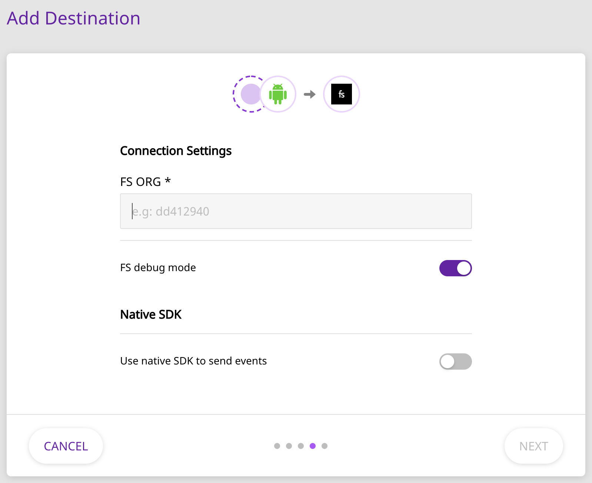

# FullStory

[FullStory](https://www.fullstory.com/) is a platform for analyzing user interactions, data recording and searching, and much more. It is the perfect platform to measure and improve your overall mobile app experience.

RudderStack lets you configure FullStory as a destination to which you can send your event data directly.

## Getting Started

Before configuring your source and destination on the RudderStack, please check whether the platform you are sending the events from is supported by FullStory. Please refer to the following table to do so:

| **Connection Mode** | **Web**       | **Mobile**    | **Server** |
| :------------------ | :------------ | :------------ | :--------- |
| **Device mode**     | **Supported** | **Supported** | -          |
| **Cloud mode**      | -             | -             | -          |

<div class="infoBlock">

To know more about the difference between Cloud mode and Device mode in RudderStack, read the <a href="https://rudderstack.com/docs/connections/rudderstack-connection-modes/">RudderStack connection modes</a> guide.

</div>

Once you have confirmed that the platform supports sending events to FullStory, perform the steps below:

- From your [RudderStack dashboard](https://app.rudderlabs.com/), add the source and select **FullStory** from the list of destinations.

<div class="infoBlock">

Please follow our guide on <a href="https://rudderstack.com/docs/connections/adding-source-and-destination-rudderstack/">How to Add a Source and Destination in RudderStack</a> to add a source and destination in RudderStack.

</div>

- Name your destination, and click on **Next**. You should be able to see the following screen:



Enter the relevant details and click on **Next**. To get the **FS ORG** field, please login to FullStory and navigate to **Settings** - **General**. Here, copy the value present on the following line: `window['_fs_org'] = 'fullstory_org_id';`

- In this example **FS ORG** would be `fullstory_org_id`

<div class="infoBlock">

To enable FullStory debugging, you can enable the **FS debug mode** option.

</div>

## Adding Device Mode Integration



To add FullStory to your iOS project, follow these steps:

- In your `Podfile`, add the following extension as shown:

```ruby
pod 'FullStory', :http => 'https://ios-releases.fullstory.com/fullstory-1.18.0-xcframework.tar.gz'
pod 'Rudder-FullStory'
```

- After adding the dependencies followed by a `pod install` command, add the following imports to your `AppDelegate.m` file:

```objectivec
#import <Rudder/Rudder.h>
#import <RudderFullStoryFactory.h>
```

- Then, add the initialization of your `RSClient` as shown:

```objectivec
    RSConfigBuilder *configBuilder = [[RSConfigBuilder alloc] init];
    [configBuilder withDataPlaneUrl:dataPlaneUrl];
    [configBuilder withFactory:[RudderFullStoryFactory instance]];
    RSClient *rudderClient = [RSClient getInstance:writeKey config:[configBuilder build]];
```

- Configure FullStory:

- To complete the FullStory integration, you need to tell the framework which FullStory organization to record to.
- Open your app's Info.plist
- From the menu, choose Editor > Add Item. Set the key name to FullStory, and the type to "Dictionary".
- Right-click on the FullStory row, and choose "Add Row". Set the key name to OrgId, and the type to "String". For the value, paste in your assigned organization ID.
- When configured correctly, the Info.plist entry should look as follows:
  

<div class="infoBlock">

For more information, refer to the [**FullStory iOS documentation**](https://help.fullstory.com/hc/en-us/articles/360042772333-Getting-Started-with-iOS-Recording).

</div>




To add FullStory to your Android project, follow these steps:

- Open your `app/build.gradle` \(Module: app\) file and add the following under the `dependencies` section:

```groovy
implementation 'com.rudderstack.android.sdk:core:1.0.22'
implementation 'com.rudderstack.android.integration:fullstory:1.0.0'
implementation 'com.google.code.gson:gson:2.8.6'

// FullStory
repositories
  maven { url "https://maven.fullstory.com" }
}
implementation 'com.fullstory:instrumentation-full:1.18.0@aar'
```

- Add the FullStory maven plugin to your build script

Add the following snippet into the `Gradle Scripts` section of your root `build.gradle`, ensure that you replace <THE PLUGIN VERSION> with the correct version of the FullStory Android plugin. You can find the latest release notes [**here**](https://docs.google.com/document/d/e/2PACX-1vRBDZpgGoLz2IdHntpXtS_1HWGMwlf6n1J1SurkcyguQB9Liv9OCQ1LHnNmfhxwcZ-ZQSl7QUgcMIR5/pub) (this is currently 1.18.0):

```groovy
buildscript {
  repositories {
    google()
    jcenter()
    maven { url "https://maven.fullstory.com" }
  }
  dependencies {
    classpath 'com.fullstory:gradle-plugin-local:<THE PLUGIN VERSION>'
    // NOTE: Do not place your application dependencies here; they belong
    // in the individual module build.gradle files
  }
}
```

- Apply the FullStory plugin

Add the following snippet into your app-specific `build.gradle`:

If your gradle file adds plugins via plugin id:

```groovy
plugins {
  id 'com.android.application'
  id 'fullstory'
}
fullstory {
  org '<YOUR ORG ID HERE>'
}
android {
  ...
```

If your gradle file applies plugins:

```groovy
apply plugin: 'com.android.application'
apply plugin: 'fullstory'
fullstory {
 org '<YOUR ORG ID HERE>'
}
android {
 ...
```

Replace <YOUR ORG ID HERE> with your ORG ID.

- To apply FullStory to all variants, including those used at debug time, add the following line below the org line:

```groovy
org '<YOUR ORG ID HERE>'
enabledVariants 'all'
```

- Add the following permissions, if not already added to your `AndroidManifest.xml`:

```markup
<uses-permission android:name="android.permission.INTERNET"/>
<uses-permission android:name="android.permission.ACCESS_NETWORK_STATE"/>
```

- Initialize the RudderStack SDK in your `Application` class' `onCreate()` method as shown:

```kotlin
// initializing Rudder SDK
val rudderClient = RudderClient.getInstance(
  this,
  <SOURCE_WRITE_KEY>,
  RudderConfig.Builder()
          .withDataPlaneUrl(DATA_PLANE_URL)
          .withFactory(FullStoryIntegrationFactory.FACTORY)
          .build()
)
```

<div class="infoBlock">

For more information, refer to the [**FullStory Android documentation**](https://help.fullstory.com/hc/en-us/articles/360040596093-Getting-Started-with-Android-Recording).

</div>




## Identify

The `identify` call is used to uniquely identify a user in FullStory. For more information on the `identify` call, please refer to the [RudderStack API Specification](https://rudderstack.com/docs/rudderstack-api/api-specification/rudderstack-spec/) documentation.

A sample `identify` call looks like the following snippet:

```javascript
rudderanalytics.identify("userId", {
  name: "John",
  email: "john@xyz.com",
});
```

The above call is translated to a FullStory `identify` call as follows:

- `userId` is sent as the `uid` .
- The remaining traits are passed on as is.

<div class="infoBlock">

In the Web Device mode, if the <code class="inline-code">userId</code> is not explicitly provided, the <code class="inline-code">anonymousId</code> of the user is sent as the <code class="inline-code">uid</code> instead.

</div>

### `displayName` and `email`

`displayName` and `email` are both **optional** traits that can passed on to FullStory, and are treated specially. Once these traits are specified in the `identify` call, they will show up automatically the next time the user list is browsed in FullStory.

A sample `identify` call using the above traits is as shown:

```javascript
rudderanalytics.identify("1234", {
  displayName: "John Falko",
  email: "john@xyz.com",
  country: "UK",
});
```

<div class="infoBlock">

For more information on the <code class="inline-code">displayName</code> and <code class="inline-code">email</code> traits, please refer to the <a href="https://help.fullstory.com/hc/en-us/articles/360020828113">FullStory documentation</a>.

</div>

## Track

A `track` call lets you track custom events as they occur in your web application. For more information on the `track` call, please refer to the [RudderStack API Specification](https://rudderstack.com/docs/rudderstack-api/api-specification/rudderstack-spec/) documentation.

A sample `track` call looks like the following snippet:

```javascript
rudderanalytics.track("Order Completed", {
  orderId: "1234567",
  price: "567",
  currency: "USD",
});
```

A `track` call is directly passed on to FullStory via its [FS.event](https://help.fullstory.com/hc/en-us/articles/360020623274-FS-event-API-Sending-custom-event-data-into-FullStory) method. All the associated properties are also passed on this method.

## Page

A page call contains information such as the URL or the name of the web page visited by the user. For more information, please refer to the [RudderStack API Specification](https://rudderstack.com/docs/rudderstack-api/api-specification/rudderstack-spec/) documentation.

By default, all `page` calls are sent to FullStory as events. A sample `page` call looks like the following:

```javascript
rudderanalytics.page("homepage");
```

The above call sends an event to FullStory with a name `Viewed a Page`. It also sends the following properties with the event:

- `name` \*if provided \(`homepage` in the sample example above\)
- `path`
- `referrer`
- `search`
- `title`
- `url`

Any additional properties passed to the `page` call are also passed on to FullStory.

## Screen

The `screen` method allows you to record whenever a user sees the mobile screen, along with any associated optional properties. This call is similar to the `page` call, but exclusive to your mobile device.

A sample `screen` call looks like the following code snippet:

```kotlin
MainApplication.rudderClient.screen("Sample Screen Name",
            RudderProperty()
                .putValue("prop_key","prop_value"));
```

In the above snippet, RudderStack captures all the information related to the viewed screen, along with any additional info associated with that event. In FullStory, the above `screen` call will be shown as - `Screen Viewed` along with the properties.

<div class="infoBlock">

Note that <code class="inline-code">screen</code> call will be sent to FullStory as a custom event.

</div>

# Reset

The `reset` method calls will release the identity of the current user and create a new anonymous session. It should be called when users log out. For more information, please refer to [**FullStory Reset API**](https://developer.fullstory.com/anonymize?lang=ObjectiveC).

A sample `reset` call is shown in the following snippets:

<Tabs>
  <TabList>
    <Tab>iOS</Tab> // this is the first tab's title
    <Tab>Android</Tab>       // this is the second tab's title
  </TabList>
    <TabPanels>
      <TabPanel>
<span>

````objectivec

[[RSClient sharedInstance] reset];
</span>
      </TabPanel>
      <TabPanel>
<span>

```kotlin

MainApplication.rudderClient.reset()
````

</span>
      </TabPanel>
    </TabPanels>
</Tabs>

## FAQs

### How do I get the value for the field FS ORG \*?

To get the value for the **FS ORG \*** field in the RudderStack **Connection Settings**, please follow these steps:

1. Login to your FullStory dashboard.
2. Navigate to Settings - General.
3. Go to the following line and copy the value present there: `window['_fs_org'] = 'fullstory_org_here';`

### How to prevent FullStory from automatically recording on startup

By default, FullStory will automatically request a session and start recording on app startup. If you need to only start recording the app once certain conditions are met, then you can use the new RecordOnStart feature. Configuring FullStory to not RecordOnStart will prevent recording until you explicitly invoke FS.restart. To prevent FullStory from recording on start:

In your `iOS` app’s Info.plist's FullStory dictionary, add a RecordOnStart key, of type `Boolean`, with a value of `NO`. Refer [**FullStory iOS documentation**](https://help.fullstory.com/hc/en-us/articles/360042772333-Getting-Started-with-iOS-Recording#01ER0FEDVJS9RJ843477QPRYS6) for more information.

In your `Android` app, go to your FullStory plugin configuration (where you set your org id), set the following:

```groovy
fullstory {
org '<YOUR ORG ID HERE>'
recordOnStart false
}
```

Refer [**FullStory Android documentation**](https://help.fullstory.com/hc/en-us/articles/360040596093-Getting-Started-with-Android-Recording#01F5E7XY5HJYV5ZWCCSYNQ8TXC) for more information.

### How to Subclass from Application in Android

FullStory requires that you enable MultiDex. If your minSdkVersion is set to 21 or higher, Multidex is enabled by default. Subclass from application class android.app.Application. If your minSdkVersion is lower than 21, you will need to subclass from androidx.multidex.MultiDexApplication instead.

If you're using Java and if you do not have an Application class, create one, and in your App.java:

```java
import android.app.Application;
public class App extends Application {
...
}
```

If you're using Kotlin and if you do not have an Application class, create one, and in your App.kt:

```kotlin
import android.app.Application
class App: Application() {
...
}
```

And set android:name="App" in your AndroidManifest.xml for <application> tag:

```xml
<application
android:name="App" ….
```

For more information refer [FullStory documentation](https://help.fullstory.com/hc/en-us/articles/360040596093-Getting-Started-with-Android-Recording#01F5E7X1NYJY51ME0PEWSM0KBJ)

## Contact Us

If you come across any issues while configuring FullStory with RudderStack, please feel free to [contact us](mailto:%20docs@rudderstack.com). You can also start a conversation on our [Slack](https://rudderstack.com/join-rudderstack-slack-community) channel; we will be happy to talk to you!
