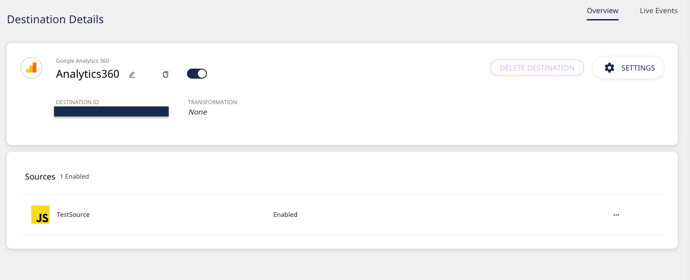

# Google Analytics 360

[Google Analytics 360](https://marketingplatform.google.com/about/analytics-360/) is the enterprise version of Google Analytics that allows you to get actionable insights from your data. It provides enterprise teams with all the standard Google Analytics features along with more sophisticated analytics capabilities and the ability to export your data and insights to BigQuery. You also get SLA obligations, guaranteed uptime, extended support, and a lot more.

RudderStack supports sending real-time customer events to Google Analytics 360.

  **Find the open-source transformer code for this destination in our <a href="https://github.com/rudderlabs/rudder-transformer/tree/master/v0/destinations/ga360">GitHub repo</a>.**

## Getting Started

To enable sending data to Google Analytics 360, you will first need to add it as a destination in the RudderStack dashboard. Once the destination is configured and enabled, events from RudderStack will start flowing to Google Analytics 360.

Before configuring Google Analytics 360 as a destination, verify if the source platform supports sending events to RudderStack, by referring to the table below:

| **Connection Mode** | **Web**       | **Mobile**    | **Server**    |
| :------------------ | :------------ | :------------ | :------------ |
| **Device Mode**     | **Supported** | -             | -             |
| **Cloud Mode**      | **Supported** | **Supported** | **Supported** |

To know more about the difference between Cloud mode and Device mode in RudderStack, read the <a href="https://rudderstack.com/docs/rudderstack-connection-modes/">RudderStack connection modes</a> guide.

Then, perform the steps below:

- Choose a source for which you would like to add Google Analytics 360 as a destination.

Follow the guide on <a href="https://rudderstack.com/docs/rudderstack-cloud/connections/">How to Add a Source and Destination in RudderStack</a> for more details.

- From the list of destinations, select **Google Analytics 360**. Then, assign a name to the destination and click on **Next**.
- You should then see the following **Connection Settings** page:

- **Tracking ID** is a required field to configure the destination. You can configure the other options as per your preference.
- To add a transformation, click on **Create New Transformation**. Otherwise, click on **Next**.

See the <a href="https://rudderstack.com/docs/transformations">Transformations</a> guide for more details on this feature.

- The destination is now configured and enabled.

You can now start sending your real-time events and view them in Google Analytics 360 by going to your Google Analytics 360 dashboard and navigating to **Realtime** - **Events**.

  For details on the supported events and other additional features refer to the
  <a href="https://rudderstack.com/docs/destinations/analytics/google-analytics-ga/">Google Analytics documentation</a>.

## FAQs

### Can I anonymize an IP Address in Google Analytics 360?

Yes, you can. Turn on the **Anonymize IP Addresses** setting under the **Other Settings** option in the RudderStack dashboard while configuring Google Analytics 360.

This setting lets Google Analytics anonymize the address at the earliest possible stage of the data collection.

For more information and other FAQs, refer to the <a href="https://rudderstack.com/docs/destinations/analytics/google-analytics-ga/">Google Analytics documentation</a>.

## Contact Us

If you come across any issues while configuring Google Analytics 360 with RudderStack, please feel free to [contact us](mailto:%20docs@rudderstack.com). You can also start a conversation in our [Slack](https://rudderstack.com/join-rudderstack-slack-community) community; we will be happy to talk to you!
