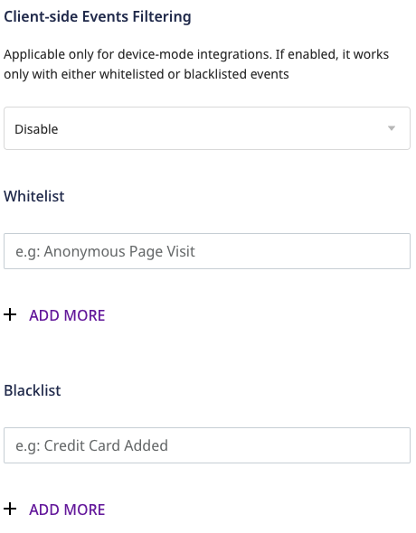

# Setting up Google Analytics 4

Before configuring Google Analytics 4 as a destination in RudderStack, verify if the source platform is supported by Google Analytics 4 by referring to the table below:

| **Connection Mode** | **Web**           | **Mobile** | **Server** |
| :------------------ | :------------ | :----- | :----- |
| **Device Mode**     | **Supported** | **-**  | **-**  |
| **Cloud Mode**      | **Supported** | **Supported**  | **Supported**  |

To know more about the difference between Cloud mode and Device mode in RudderStack, read the <a href="https://rudderstack.com/docs/rudderstack-cloud/rudderstack-connection-modes/">RudderStack connection modes</a> guide.

Once you have confirmed that the source platform supports sending events to Google Analytics 4, follow these steps:

1. From your [RudderStack dashboard](https://app.rudderstack.com/), add the source. Then, from the list of destinations, select **Google Analytics 4**.
2. Assign a name to your destination and click on Next.

## Connection settings

To successfully configure Google Analytics 4 as a destination, configure the following settings:

- **API Secret**: This field is required only for the cloud mode setup where you can enter the API Secret generated through the Google Analytics dashboard. It can be created in the Google Analytics dashboard under **Admin > Data Streams > Choose your stream > Measurement Protocol > Create**.

- **Client Type**: Select the client type as `gtag` or `Firebase` from the dropdown:
  - **`gtag`** - Supported for the cloud and device mode both. If you select `gtag`, enter the below:
    - **Measurement Id**: Enter the Measurement Id which is the identifier for a data stream. It can be found in the Google Analytics dashboard under **Admin > Data Streams > Choose your stream > Measurement ID**.
  - **`Firebase`** - Supported only for the cloud mode. If you select `Firebase`, enter the below:
    - **Firebase App Id**: Enter the Firebase App ID which is the identifier for Firebase app. It can be found in the Firebase dashboard under **Project Settings > General**.
 

  
 Refer to the <a href="#faq">FAQ</a> section for more information on how to obtain the API Secret, Measurement Id and Firebase App Id.
  

  

### Native SDK

  
All the settings mentioned below are applicable only for the device mode.

  
- **Block a Page View Event**: Enable this setting to disable sending `page_view` events on load. However, you can explicitly send a `page_view` event by calling the `page()` API.
- **Extend Page View Property**: Enable this setting to send the following properties along with any other custom property to the `page` call of the RudderStack SDK:
  - `url`
  - `search`
 

  
Google Analytics 4 has a limit on the number of unique properties per event name. The default `page_view` event supports the properties mentioned in <a href="https://support.google.com/analytics/answer/9234069?hl=en&ref_topic=6317484">Automatically collected events</a> guide.

  
- **Send userId to GA**: This setting exhibits the following behavior:
  - If enabled, user ID is set to the identified visitors and sent as explained in the [Cookies and user identification](https://developers.google.com/tag-platform/devguides/cookies#set_user_id) guide.
  - If disabled, userId is not sent and Rudderstack only sends the user traits set as `user_properties` to Google Analytics. The user properties are set on the `gtag` client as explained in the [Set user properties](https://developers.google.com/analytics/devguides/collection/ga4/user-properties?technology=websites) guide.

### Client-side events filtering

This option is applicable only if you're sending events to Google Analytics 4 via the web device mode. Refer to the <a href="https://www.rudderstack.com/docs/stream-sources/rudderstack-sdk-integration-guides/event-filtering/">Client-side Event Filtering</a> guide for more information on this feature.

### Web SDK settings

**Use device mode to send events**: Enable this setting to send events via the [RudderStack device mode](https://www.rudderstack.com/docs/rudderstack-cloud/rudderstack-connection-modes/#device-mode).

Finally, click on **Next** to enable Google Analytics 4 as a destination in Rudderstack.

## FAQ

### How do I obtain the Measurement Id?

1. Login to [Google Analytics](https://analytics.google.com/analytics/web/) dashboard.
2. Go to the **Admin** section in the left sidebar.
3. Select the relevant account and property.
4. Click on **Data Streams** and select the stream to get the Measurement Id as shown:

### How do I obtain the API Secret?

1. Login to [Google Analytics](https://analytics.google.com/analytics/web/) dashboard.
2. Go to the **Admin** section in the left sidebar.
3. Select the relevant account and property.
4. Click on **Data Streams** and select the stream.
5. Click on **Measurement Protocol API secrets** to get the API Secret as shown:

### How do I obtain the Firebase App ID?

1. Login to [Google Analytics](https://analytics.google.com/analytics/web/) dashboard.
2. Go to the **Admin** section in the left sidebar.
3. Select the relevant account and property.
4. Click on **Data Streams** and select the stream to get the **Firebase App Id** as shown:

## Contact us

For queries on any of the sections covered in this guide, you can [contact us](mailto:%20docs@rudderstack.com) or start a conversation in our [Slack](https://rudderstack.com/join-rudderstack-slack-community) community.
