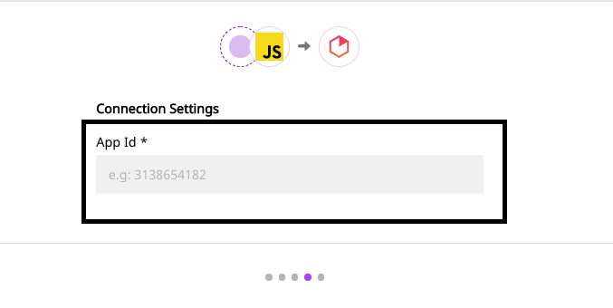

# Heap.io

[Heap.io](https://heap.io/) is a popular analytics platform built for marketers, product managers, and customer success teams. With Heap, you can track every clip, tap or screen swipe action of your customers. With this data, and combining Heap's cutting-edge analytics capabilities, you can segment your users based on their behavior, and offer them unique digital experiences. If boosting your conversion rates and customer engagement is your goal, then Heap.io is a great tool to have in your marketing stack.

RudderStack supports Heap.io as a destination to which you can send your event data in real-time.

<div class="successBlock">

  **Find the open-source transformer code for this destination in our <a href="https://github.com/rudderlabs/rudder-transformer/tree/master/v0/destinations/heap">GitHub repo</a>.**
</div>

## Getting Started

To enable sending data to Heap.io, you will first need to add it as a destination to the source from which you are sending your event data. Once the destination is enabled, events from our SDK will start flowing to Heap.

Before configuring your source and destination on the RudderStack, verify if the source platform is supported by Heap, by referring to the table below:

| **Connection Mode** | **Web**       | **Mobile**    | **Server**    |
| :------------------ | :------------ | :------------ | :------------ |
| **Device mode**     | **Supported** | -             | **-**         |
| **Cloud mode**      | **Supported** | **Supported** | **Supported** |

<div class="infoBlock">

To know more about the difference between Cloud mode and Device mode in RudderStack, read the <a href="https://rudderstack.com/docs/connections/rudderstack-connection-modes/">RudderStack connection modes</a> guide.

</div>

Once you have confirmed that the platform supports sending events to Heap.io, perform the steps below:

- From your [RudderStack dashboard](https://app.rudderstack.com/signup?type=freetrial), add the source. Then, from the list of destinations, select Heap.io**.**

<div class="infoBlock">

Follow our <a href="https://rudderstack.com/docs/connections/adding-source-and-destination-rudderstack/">Adding a Source and Destination</a> guide to add a source and destination in RudderStack.

</div>

- Give a name to the destination and click on **Next**. You should then see the following screen:

<span class="imageTitle">Heap.io Connection Settings on RudderStack dashboard</span>

To configure Heap.io as a destination, you need the Heap App ID. To get the App ID, login to your Heap account and navigate to [**App** - **Settings** - **Projects**](https://heapanalytics.com/app/settings/projects), and copy the development or production App ID.

- Once you've entered the Heap App ID, click on **Next**. Heap.io should now be configured as a destination on your RudderStack dashboard.

<div class="infoBlock">

The Heap destination currently supports only **<code class="inline-code">track</code>** and **<code class="inline-code">identify</code>** calls.

</div>

## Identify

RudderStack's `identify` method captures the relevant details about the visiting user.

<div class="infoBlock">

For more information on the <code class="inline-code">identify</code> call, refer to our guide on <a href="https://rudderstack.com/docs/rudderstack-api/">RudderStack API Specification</a>.

</div>

A sample `identify` payload is as shown in the snippet below:

```javascript
rudderanalytics.identify("user123", {
  name: "Name LastName",
  email: "example@domain.com",
})
```

## Track

With the `track` API, RudderStack makes a call to Heap.io to track your user actions as well as their associated properties.

<div class="infoBlock">

For more information on the <code class="inline-code">track</code> method, refer to our guide on <a href="https://rudderstack.com/docs/rudderstack-api/">RudderStack API Specification</a>.

</div>

A sample `track` call is as shown:

```javascript
rudderanalytics.track("Order Completed", {
  order_id: "12345",
  category: "clothing",
  revenue: 99.9,
  shipping: 13.99,
  tax: 10.99,
  promotion_id: "PROMO_NOW",
})
```

## FAQs

### How do I get my Heap App ID?

You can procure your Heap ID by logging into your Heap account and navigate to App - Settings - Projects, and copying the required development or production App ID. Click [here](https://heapanalytics.com/app/settings/projects) to go to your Heap dashboard and get the App ID.

## Contact Us

To know more about the Heap.io integration and how to use it, feel free to [contact us](mailto:%20docs@rudderstack.com). You can also start a conversation in our [Slack](https://rudderstack.com/join-rudderstack-slack-community) community, and we will be happy to help you.
