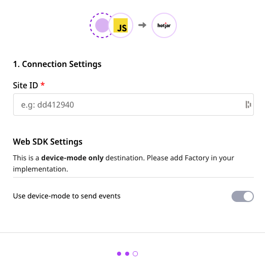

# Hotjar

[Hotjar](https://www.hotjar.com/) is a popular behavior analytics platform, suitable for marketing teams and product managers to better understand and improve their product. It allows them to understand the behavior of their website's visitors through heat maps, surveys and conversion funnels.

RudderStack helps you integrate your website with Hotjar to auto-track all your user data.

## Getting Started

Before configuring Hotjar as a destination in RudderStack, please make sure that the source platform is supported by Hotjar. You can refer to the following table to do so:

| **Connection Mode** | **Web**       | **Mobile** | **Server** |
| :------------------ | :------------ | :--------- | :--------- |
| **Device mode**     | **Supported** | -          | -          |
| **Cloud mode**      | -             | -          | -          |

<div class="infoBlock">

To know more about the difference between Cloud mode and Device mode in RudderStack, read the <a href="https://rudderstack.com/docs/connections/rudderstack-connection-modes/">RudderStack connection modes</a> guide.

</div>

Once you have confirmed that Hotjar supports the source type, perform the steps below:

- From your [RudderStack dashboard](https://app.rudderlabs.com/), add the source and select Hotjar as a destination.

<div class="infoBlock">

Please follow our guide on <a href="https://rudderstack.com/docs/connections/adding-source-and-destination-rudderstack/">How to Add a Source and Destination in RudderStack</a> to add a source and destination in RudderStack.

</div>

- Give a name to your destination, and then click on **Next**. You should see the following screen:

<span class="imageTitle">Hotjar Connection Settings in RudderStack</span>

- Please provide the `Site ID`. You will get your `Site ID` under **Settings** - **Sites & Organizations** after logging into your Hotjar account. Finally, click on **Next** to complete the configuration.

Hotjar will now be added and enabled as a destination in RudderStack.

## Sending events to Hotjar

There is **no need** to call any of `page` or `track` methods explicitly, as Hotjar auto-tracks your user data.

## Identify

<div class="warningBlock">

Before you can begin making calls to `identify`, <a href="https://insights.hotjar.com/settings/user-attributes">User Attributes</a> must be enabled in your Hotjar dashboard for each site.

</div>

`identify` allows you to pass data about your users to Hotjar, saving them as User Attributes.

<div class="infoBlock">

For more information on the `identify` call, check out the [**RudderStack API spec**](https://rudderstack.com/docs/rudderstack-api/api-specification/rudderstack-spec/identify/).

</div>

A sample `identify` call is as shown:

```javascript
rudderanalytics.identify("userId", { total_spend: 500 });
```

## Contact Us

In case of any issues while configuring or using Hotjar with RudderStack, you can [**contact us**](mailto:%20docs@rudderstack.com) or start a conversation on our [**Slack**](https://rudderstack.com/join-rudderstack-slack-community) channel.
