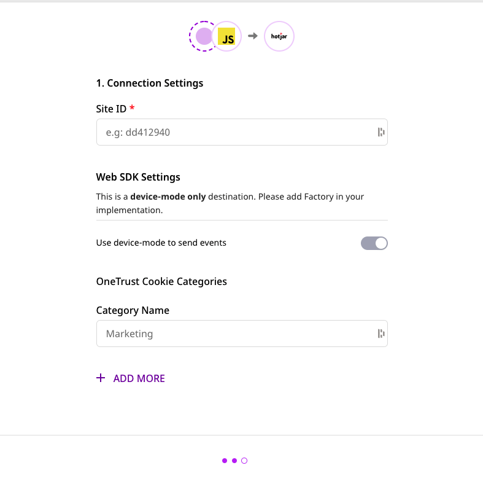

# Hotjar

[**Hotjar**](https://www.hotjar.com/) is a popular behavior analytics platform, suitable for marketing teams and product managers to better understand and improve their product. It allows them to understand the behavior of their website's visitors through heat maps, surveys, and conversion funnels.

RudderStack helps you integrate your website with Hotjar to auto-track your user data.

## Getting started

Before configuring Hotjar as a destination in RudderStack, make sure that the source platform supports sending events to Hotjar by referring to the following table:

| **Connection Mode** | **Web**       | **Mobile** | **Server** |
| :------------------ | :------------ | :--------- | :--------- |
| **Device mode**     | **Supported** | -          | -          |
| **Cloud mode**      | -             | -          | -          |

<div class="infoBlock">

To know more about the difference between cloud mode and device mode in RudderStack, read the <a href="https://rudderstack.com/docs/connections/rudderstack-connection-modes/">RudderStack Connection Modes</a> guide.
</div>

Once you have confirmed that Hotjar supports the source, perform the steps below:

- From your [**RudderStack dashboard**](https://app.rudderstack.com/), add the source. Then, select **Hotjar** from the list of destinations.

<div class="infoBlock">

Follow our guide on <a href="https://rudderstack.com/docs/connections/adding-source-and-destination-rudderstack/">Adding a Source and Destination in RudderStack</a> for more information.
</div>

- Assign a name to your destination and click on **Next**. You should see the following screen:



### Connection settings

To successfully configure Hotjar as a destination in RudderStack, enter the following connection settings:

- **Site ID**: Enter your Hotjar site ID. You can get your site ID by logging into your Hotjar account and navigating to **Settings** - **Sites & Organizations**.

- **OneTrust Cookie Category**: Specify the OneTrust category name for mapping the OneTrust consent settings to RudderStack's consent purposes.

<div class="infoBlock">

For more information on this setting, refer to the <a href="https://rudderstack.com/docs/stream-sources/rudderstack-sdk-integration-guides/rudderstack-javascript-sdk/consent-managers/onetrust/">OneTrust Consent Manager</a> guide.
</div>

Finally, click on **Next** to complete the configuration. Hotjar will now be added and enabled as a destination in RudderStack.

## Track

The `track` call leverages Hotjar's [**Events API**](https://help.hotjar.com/hc/en-us/articles/4405109971095) to track specific user actions.

A sample `track` call is as shown below:

```javascript
rudderanalytics.track("custom_event");
```

<div class="infoBlock">

To use the Hotjar Events API, you must be on Hotjar's Plus, Business, or Scale plans.
</div>

## Identify

The `identify` call lets you pass your user data to Hotjar, sending them as [**User Attributes**](https://help.hotjar.com/hc/en-us/articles/4402892526487-What-are-User-Attributes-).

<div class="warningBlock">

Before you start making `identify` calls, make sure that <a href="https://insights.hotjar.com/settings/user-attributes">User Attributes</a> are enabled in your Hotjar dashboard for each site. Refer to this <a href="https://help.hotjar.com/hc/en-us/articles/360033640653-Identify-API-Reference#making_calls_to_identify">Hotjar support page</a> for more information on enabling and disabling User Attributes.
</div>

A sample `identify` call is shown below:

```javascript
rudderanalytics.identify("userId", {
  total_spend: 500
});
```

## Contact us

For queries on any of the sections covered in this guide, you can [**contact us**](mailto:%20docs@rudderstack.com) or start a conversation in our [**Slack**](https://rudderstack.com/join-rudderstack-slack-community) community.
