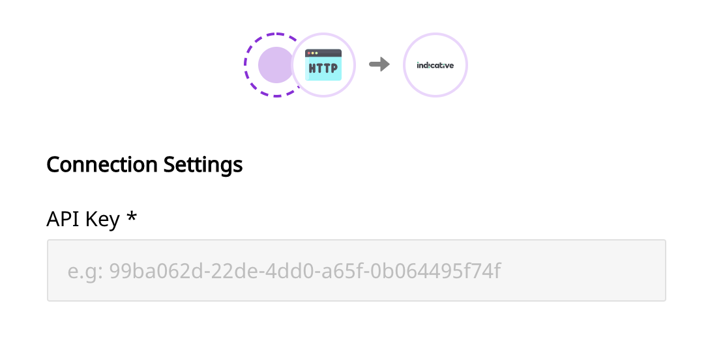

# Indicative

[Indicative](https://indicative.com) is a popular customer analytics platform, designed especially for product managers, marketers, and data analysts. Indicative allows you to have an easy access to your data by connecting directly to your data warehouse. As a result, you can also avoid any errors that arise due to duplication of data during the collection stage, or any form of data mismatch.

RudderStack allows you to seamlessly configure Indicative as a destination to which you can send your event data seamlessly.


**Find the open-source transformer code for this destination in our **[**GitHub repo**](https://github.com/rudderlabs/rudder-transformer/tree/master/v0/destinations/indicative)**.**


## Getting Started

To enable sending data to **Indicative**, you will first need to add it as a destination to the source from which you are sending your event data. Once the destination is enabled, events from RudderStack will start flowing to Indicative.

Before configuring your source and destination on the RudderStack, please verify if the source platform is supported by Indicative, by referring to the table below:

| **Connection Mode** | **Web**       | **Mobile**    | **Server**    |
| ------------------- | ------------- | ------------- | ------------- |
| **Device mode**     | **-**         | -             | -             |
| **Cloud mode**      | **Supported** | **Supported** | **Supported** |


To know more about the difference between Cloud mode and Device mode in RudderStack, read the [RudderStack connection modes](https://docs.rudderstack.com/get-started/rudderstack-connection-modes) guide.


Once you have confirmed that the platform supports sending events to Indicative, please perform the steps below:

* Choose a source to which you would like to add Indicative as a destination.


Please follow our [Adding a Source and Destination](https://docs.rudderstack.com/how-to-guides/adding-source-and-destination-rudderstack) guide to know how to add a source in RudderStack.


* Select the destination as **Indicative** to your source. Give your destination a name and then click on **Next**.
* On the **Connection Settings **page,** **fill all the fields with the relevant information and click **Next.**



### Configurable settings

The following are the settings to be configured:

* **Indicative API Key**: This API key can be found under **Project Settings** in your Indicative account.

## Identify

When an `identify` call is made, RudderStack calls the [Identify Users](https://support.indicative.com/hc/en-us/articles/360004147512-REST-API-Guide#IdentifyUsers2) API of Indicative and sends the data accordingly.


A user is identified by`userId`. If the field is not passed in the call, the event is not sent.


A sample `identify` call is as shown:

```objectivec
[[RSClient sharedInstance] identify:@"test_user_id"
                             traits:@{@"foo": @"bar",
                                      @"foo1": @"bar1",
                                      @"email": @"test@gmail.com",
                                      @"key_1" : @"value_1",
                                      @"key_2" : @"value_2"
                             }
];
```

We pass the user traits passed along with the `identify` call to Indicative as `properties`.

## Page

When the `page` method is called, the RudderStack server sends a track event to Indicative with the `userId`, and `eventName` parameters. 

A sample `page` call is as shown in the snippet below:

```javascript
rudderanalytics.page({
        path: "path",
        url: "url",
        title: "title",
        search: "search",
        referrer: "referrer"
 });
```

## Screen

The `screen` call is the mobile equivalent of the `page`. When called, it sends a `track` event to Indicative with a `userId` and `eventName` .

A sample `screen` call is as shown:

```objectivec
[[RSClient sharedInstance] screen:@"Main"];
```

## Track

When the `track` call is made, RudderStack calls the Indicative [Track Events](https://support.indicative.com/hc/en-us/articles/360004147512-REST-API-Guide#TrackEvents) API to send the events. The event properties are sent as data fields in the request, while the name of the event is sent as a custom event.

A sample`track` call is as shown in the snippet below:

```objectivec
[[RSClient sharedInstance] track:@"Accepted Terms of Service" 
                          properties:@{
                                  @"foo": @"bar",
                              @"foo_int": @134
}];
```

## FAQs

### Where can I get the Indicative API key?

You can get the Indicative API key under the **Project Settings** section in your Indicative account.

## Contact Us

If you come across any issues while configuring or using Indicative with RudderStack, please feel free to [contact us](mailto:%20docs@rudderstack.com). You can also start a conversation on our [Slack](https://resources.rudderstack.com/join-rudderstack-slack) channel; we will be happy to talk to you!
