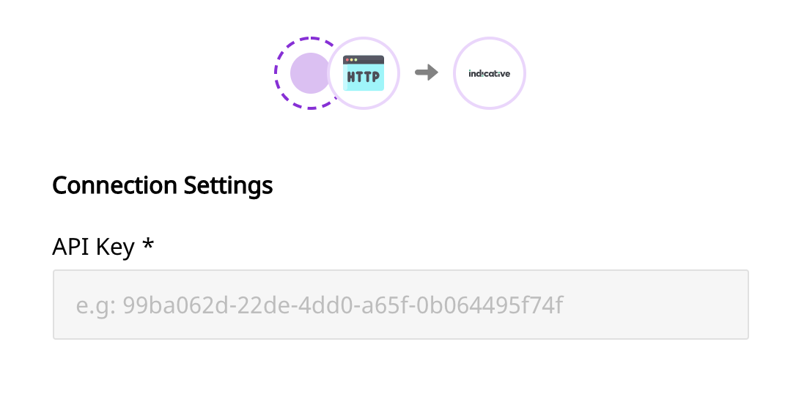

# Indicative

[**Indicative**](https://indicative.com) is a popular customer analytics platform designed especially for product managers, marketers, and data analysts. It connects directly to your data warehouse, allowing you to have an easy access to your data. As a result, you can also avoid any errors that arise due to data duplication during the collection stage or any form of data mismatch.

RudderStack supports Indicative as a destination to which you can send your event data seamlessly.

<div class="successBlock">

  **Find the open-source transformer code for this destination in our <a href="https://github.com/rudderlabs/rudder-transformer/tree/master/v0/destinations/indicative">GitHub repo</a>.**
</div>

## Getting started

Before configuring Indicative as a destination in RudderStack, verify if the source platform is supported by Indicative by referring to the table below:

| **Connection Mode** | **Web**       | **Mobile**    | **Server**    |
| :------------------ | :------------ | :------------ | :------------ |
| **Device mode**     | -             | -             | -             |
| **Cloud mode**      | **Supported** | **Supported** | **Supported** |

<div class="infoBlock">

To know more about the difference between cloud mode and device mode in RudderStack, read the <a href="https://rudderstack.com/docs/rudderstack-connection-modes/">**RudderStack connection modes**</a> guide.
</div>

Once you have confirmed that the platform supports sending events to Indicative, perform the steps below:

- From your [**RudderStack dashboard**](https://app.rudderstack.com/), add the source. From the list of destinations, select **Indicative**.

<div class="infoBlock">
 
 Follow our <a href="https://rudderstack.com/docs/rudderstack-cloud/connections/">**Connections**</a> guide for more information.
</div>

- Assign a name to your destination and click on **Next**. You should then see the following screen:

<span class="imageTitle">Indicative Connection Settings in RudderStack</span>

### Connection settings

This section lists the settings to be configured to set up Indicative as a destination in RudderStack.

- **Indicative API Key**: Enter the Indicative **API Key**. It can be found under **Project Settings** in your Indicative account.

## Identify

When an `identify` call is made, RudderStack leverages Indicative's [**Identify Users**](https://support.indicative.com/hc/en-us/articles/360004147512-REST-API-Guide#IdentifyUsers2) API and sends the data accordingly.

<div class="warningBlock">

 A user is identified by <code class="inline-code">userId</code>. If the field is not passed in the call, the event is not sent.
</div>

A sample `identify` call is as shown:

```javascript
rudderanalytics.identify("hashed_user_id", {
  name: "Name Surname",
  email: "sample@example.com",
});
```

<div class="infoBlock">

 RudderStack passes the user traits passed along with the <code class="inline-code">identify</code> call to Indicative as <code class="inline-code">properties</code>.
</div>

## Page

When the `page` method is called, RudderStack sends a track event to Indicative with the `userId` and `eventName` parameters.

A sample `page` call is as shown in the snippet below:

```javascript
rudderanalytics.page({
  path: "path",
  url: "url",
  title: "title",
  search: "search",
  referrer: "referrer",
});
```

## Screen

The `screen` call is the mobile equivalent of the `page`. When called, it sends a `track` event to Indicative with a `userId` and `eventName` .

A sample `screen` call is as shown:

```objectivec
[[RSClient sharedInstance] screen:@"Main"];
```

## Track

When the `track` call is made, RudderStack calls Indicative's [**Track Events**](https://support.indicative.com/hc/en-us/articles/360004147512-REST-API-Guide#TrackEvents) API to send the events. The event properties are sent as data fields in the request, while the name of the event is sent as a custom event.

A sample `track` call is as shown in the snippet below:

```javascript
rudderanalytics.track("Product Reviewed", {
  review_id: "12345",
  product_id: "123",
  rating: 3.0,
  review_body: "Average product, expected much more.",
});
```

## Alias

When the `alias` call is made, RudderStack calls Indicative's [**Alias Users**](https://support.indicative.com/hc/en-us/articles/360004147512-REST-API-Guide#AliasUsers2) API and sends the data accordingly.

A sample `alias` call is shown below:

```javascript
rudderanalytics.alias("12345");
```

<div class="successBlock">
 
  The RudderStack SDK automatically passes the user's <code class="inline-code">anonymousId</code> as <code class="inline-code">previousId</code> in the payload.
</div>

## FAQs

### Where can I get the Indicative API key?

You can get the Indicative API key under the **Project Settings** section in your Indicative account.

## Contact us

If you come across any issues while configuring or using Indicative with RudderStack, you can [**contact us**](mailto:%20docs@rudderstack.com) or start a conversation in our [**Slack**](https://rudderstack.com/join-rudderstack-slack-community) community.
