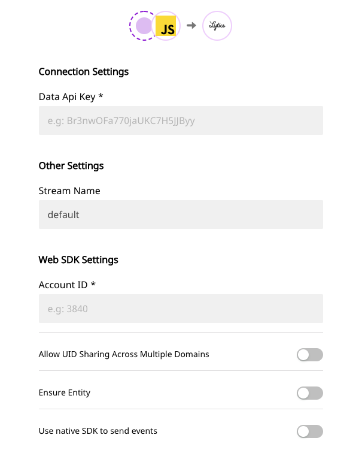

# Lytics

[Lytics](https://www.lytics.com/) is a popular customer data platform, built for marketers. It allows you to efficiently leverage your first-party customer data to deliver tailored customer journeys. With Lytics, you can better engage with your customers through personalized messages and automated, AI-driven marketing campaigns.

RudderStack supports Lytics as a destination to which you can send your event data in real-time.

<div class="successBlock">

  **Find the open-source transformer code for this destination in our <a href="https://github.com/rudderlabs/rudder-transformer/tree/master/v0/destinations/lytics">GitHub repo</a>.**
</div>

## Getting Started

To enable sending data to Lytics, you will first need to add it as a destination to the source from which you are sending your event data. Once the destination is enabled, events from our SDK will start flowing to Lytics.

Before configuring your source and destination on the RudderStack, verify if the source platform is supported by Lytics, by referring to the table below:

| **Connection Mode** | **Web**       | **Mobile**    | **Server**    |
| :------------------ | :------------ | :------------ | :------------ |
| **Device mode**     | **Supported** | -             | **-**         |
| **Cloud mode**      | **Supported** | **Supported** | **Supported** |

<div class="infoBlock">

To know more about the difference between Cloud mode and Device mode in RudderStack, read the <a href="https://rudderstack.com/docs/connections/rudderstack-connection-modes/">RudderStack connection modes</a> guide.

</div>

Once you have confirmed that the platform supports sending events to Lytics, perform the steps below:

- From your [RudderStack dashboard](https://app.rudderstack.com/signup?type=freetrial), add the source. Then, from the list of destinations, select Lytics**.**

<div class="infoBlock">

Follow our <a href="https://rudderstack.com/docs/connections/adding-source-and-destination-rudderstack/">Adding a Source and Destination</a> guide to add a source and destination in RudderStack.

</div>

- Give a name to the destination and click on **Next**. You should then see the following screen:

<span class="imageTitle">Lytics Destination Settings on the RudderStack dashboard</span>

The connection settings are explained in more detail as follows:

- **Account ID**: Enter the the Lytics account ID obtained from your Lytics dashboard. For more information, check out the [**Lytics support page**](https://support.lytics.com/hc/en-us/articles/115001231351-How-do-I-find-my-Lytics-account-ID-).
- **API Key**: Create an API key from Lytics dashboard and enter the details here.

<div class="infoBlock">

To get the API Key, go to your Lytics dashboard, and navigate to **Account** - **Manage Accounts** - **Account Settings** - **API Token**. You can create an API token here and use this information to configure Lytics as a destination.

</div>

- **Stream**: Assign a name for the stream where you want to send your data.
- **Ensure Entity\(Block Load\)**: When this option is enabled, RudderStack gets your most updated audience membership and profile data, before sending it to Lytics.
- **Allow UID Sharing Across Multiple Domains\(Load ID\)**: When enabled, this option lets you identify users across domains.

## Page

With the `page` method, RudderStack makes a call to Lytics to record a page view.

<div class="infoBlock">

For more information on the <code class="inline-code">page</code> method, refer to our guide on <a href="https://rudderstack.com/docs/rudderstack-api/api-specification/rudderstack-spec/page">RudderStack API Specification</a>.

</div>

A sample `page` call is as shown:

```javascript
rudderanalytics.page("new category", "page name", {
  url: "url",
  path: "/path",
})
```

Similarly, we can also make `screen` calls. However, this is supported only in the cloud-mode.

<div class="infoBlock">

To know more about how the <code class="inline-code">screen</code> call works, refer to our guide on <a href="https://rudderstack.com/docs/rudderstack-api/http-api#9-screen">RudderStack API Specification</a>.

</div>

<div class="infoBlock">

To know more about the difference between Cloud mode and Device mode in RudderStack, read the <a href="https://rudderstack.com/docs/connections/rudderstack-connection-modes/">RudderStack connection modes</a> guide.

</div>

A sample screen call is as shown:

```objectivec
[[RSClient sharedInstance] screen:@"Main"];
```

## Track

With the `track` API, RudderStack makes a call to Lytics to track user actions and their associated properties.

<div class="infoBlock">

For more information on the <code class="inline-code">track</code> method, refer to our guide on <a href="https://rudderstack.com/docs/rudderstack-api/api-specification/rudderstack-spec/track/">RudderStack API Specification</a>.

</div>

A sample `track` call is as shown:

```javascript
rudderanalytics.track("Order Completed", {
  order_id: "1a2b3c4d",
  category: "category",
  revenue: 99.9,
  shipping: 13.99,
  tax: 20.99,
  promotion_id: "PROMO_1234",
})
```

## Identify

The `identify` call captures the relevant details about the visiting user.

<div class="infoBlock">

For more information on the <code class="inline-code">identify</code> method, refer to our guide on <a href="https://rudderstack.com/docs/rudderstack-api/api-specification/rudderstack-spec/identify/">RudderStack API Specification</a>.

</div>

A sample `identify` payload is as shown in the snippet below:

```javascript
rudderanalytics.identify("abc123", {
  name: "FirstName LastName",
  email: "example@gmail.com",
})
```

## FAQs

### Where do I get the Lytics API Key?

Go to your Lytics dashboard, and navigate to **Account** - **Manage Accounts** - **Account Settings** - **API Token**. You can create an API token here, which can be used to configure the destination on the RudderStack dashboard.

## Contact Us

To know more about the Lytics integration and how to use it, feel free to [contact us](mailto:%20docs@rudderstack.com). You can also start a conversation in our [Slack](https://rudderstack.com/join-rudderstack-slack-community) community, and we will be happy to help you.
