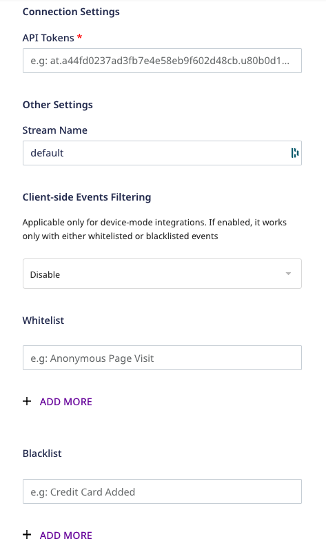

# Lytics

[Lytics](https://www.lytics.com/) is a popular customer data platform built for marketers. It allows you to efficiently leverage your first-party customer data to deliver tailored customer journeys.

RudderStack supports Lytics as a destination to which you can seamlessly send your event data.

<div class="successBlock">

Find the open-source transformer code for this destination in the <a href="https://github.com/rudderlabs/rudder-transformer/tree/master/v0/destinations/lytics">GitHub repository</a>.
</div>

## Getting started

Before configuring Lytics as a destination in RudderStack, verify if the source platform is supported by Lytics, by referring to the table below:

| **Connection Mode** | **Web**       | **Mobile**    | **Server**    |
| :------------------ | :------------ | :------------ | :------------ |
| **Device mode**     | **Supported** | -             | **-**         |
| **Cloud mode**      | **Supported** | **Supported** | **Supported** |

<div class="infoBlock">

To know more about the difference between cloud mode and device mode in RudderStack, refer to the <a href="https://rudderstack.com/docs/connections/rudderstack-connection-modes/">RudderStack Connection Modes</a> guide.
</div>

Once you have confirmed that the source platform supports sending events to Lytics, follow these steps:

1. From your [RudderStack dashboard](https://app.rudderstack.com/), add the source. Then, from the list of destinations, select **Lytics**.

<div class="infoBlock">

Follow our guide on <a href="https://rudderstack.com/docs/connections/adding-source-and-destination-rudderstack/" target="_blank">Adding a Source and Destination in RudderStack</a> for more information.
</div>

2. Assign a name to your destination and click on **Next**.

### Connection settings

To successfully configure Lytics as a destination, you need to configure the following settings:



- **API Token**: Create an API token in your Lytics dashboard and enter the details here.

<div class="infoBlock">

To get the API token, go to your Lytics dashboard and navigate to <strong>Account</strong> &gt; <strong>Account Settings</strong> &gt; <strong>API Token</strong>. You can create an API token here and use this information to configure Lytics as a destination.
</div>

- **Stream Name**: Enter the name of the Lytics stream where you want to send the events.
- **Client-side Event Filtering**: This setting is applicable **only if** you are sending events to Lytics via the device mode. 

<div class="infoBlock">
  
Refer to the <a href="https://www.rudderstack.com/docs/stream-sources/rudderstack-sdk-integration-guides/event-filtering/">Client-side Event Filtering</a> guide for more information on this setting.
</div>

If you are using the native web SDK to send the events to Lytics, enter the following settings:

- **Account ID**: Enter the the Lytics account ID obtained from your Lytics dashboard. For more information on obtaining the account ID, refer to the [Lytics support page](https://support.lytics.com/hc/en-us/articles/115001231351-How-do-I-find-my-Lytics-account-ID-). **This is a mandatory field**.
- **Allow UID Sharing Across Multiple Domains**: When enabled, this option lets you identify users across domains.
- **Ensure Entity**: When this option is enabled, RudderStack gets your most updated audience membership and profile data, before sending it to Lytics.

## Identify

The `identify` call captures the relevant details about the visiting user.

<div class="infoBlock">

For more information on the <code class="inline-code">identify</code> method, refer to the <a href="https://rudderstack.com/docs/rudderstack-api/api-specification/rudderstack-spec/identify/">RudderStack API Specification</a> guide.
</div>

A sample `identify` payload is as shown in the snippet below:

```javascript
rudderanalytics.identify("1hKOm4GRlm", {
  name: "Alex Keener",
  email: "alex@example.com",
})
```

## Page

With the `page` method, RudderStack makes a call to Lytics to record a page view.

<div class="infoBlock">

For more information on the <code class="inline-code">page</code> method, refer to the <a href="https://rudderstack.com/docs/rudderstack-api/api-specification/rudderstack-spec/page/">RudderStack API Specification</a> guide.
</div>

A sample `page` call is as shown:

```javascript
rudderanalytics.page("Popular", "Bestseller", {
  url: "https://www.estore.com/search/best-seller/1",
  path: "/best-seller/1",
})
```

Similarly, you can also make [`screen`](https://rudderstack.com/docs/rudderstack-api/api-specification/rudderstack-spec/screen/) calls. However, this is supported only in the [cloud mode](https://rudderstack.com/docs/connections/rudderstack-connection-modes/#cloud-mode).

A sample screen call is as shown:

```objectivec
[[RSClient sharedInstance] screen:@"Home"];
```

## Track

With the `track` API, RudderStack makes a call to Lytics to track user actions and their associated properties.

<div class="infoBlock">

For more information on the <code class="inline-code">track</code> method, refer to the <a href="https://rudderstack.com/docs/rudderstack-api/api-specification/rudderstack-spec/track/">RudderStack API Specification</a> guide.
</div>

A sample `track` call is as shown:

```javascript
rudderanalytics.track("Order Completed", {
  order_id: "1a2b3c4d",
  category: "category",
  revenue: 99.9,
  shipping: 13.99,
  tax: 20.99,
  promotion_id: "PROMO_1234",
})
```

## FAQs

### How do I obtain the Lytics API token?

Go to your Lytics dashboard, and navigate to **Account** > **Account Settings** > **API Token**. You can create an API token here, which can be used to configure the destination on the RudderStack dashboard.

For more information, refer to the [Lytics documentation](https://learn.lytics.com/documentation/product/features/account-management/managing-api-tokens#managing-api-tokens).

### How do I obtain the Lytics account ID?

To obtain your Lytics account ID, follow these steps:

1. Log into your Lytics dashboard.
2. Click on the account name on the top right and go to **Manage Accounts**.

Here, you will see the account ID associated with your Lytics account.

For more information, refer to this [Lytics support page](https://support.lytics.com/hc/en-us/articles/115001231351-How-do-I-find-my-Lytics-account-ID-).

## Contact us

For queries on any of the sections covered in this guide, you can [contact us](mailto:%20docs@rudderstack.com) or start a conversation in our [Slack](https://rudderstack.com/join-rudderstack-slack-community) community.