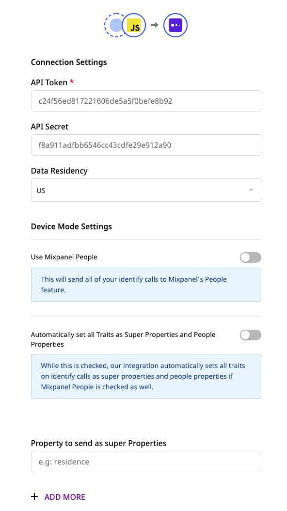
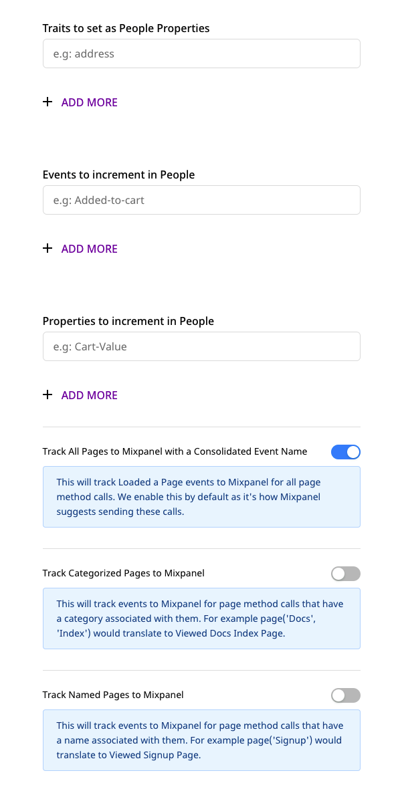
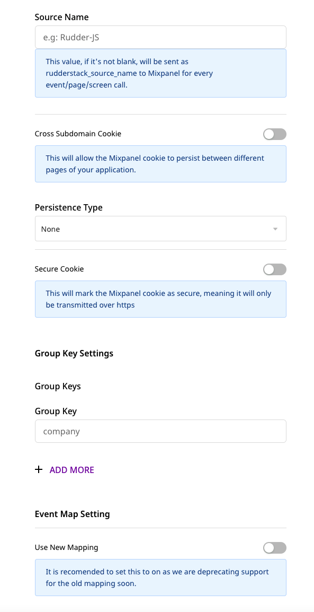
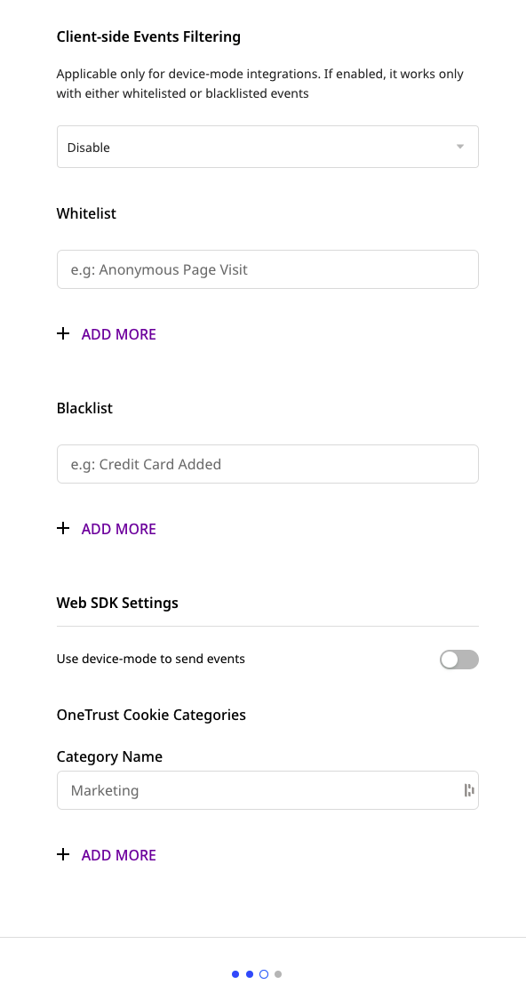
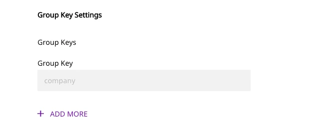
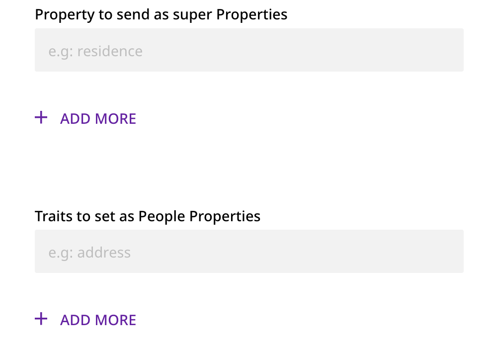

# Mixpanel

[**Mixpanel**](https://mixpanel.com/) is an analytics platform that lets you track user actions with your application. It offers features like in-app A/B testing, user survey forms, and custom reports to measure customer retention. It also provides specific tools for targeted business communication and engagement with your customers.

RudderStack supports Mixpanel as a destination to which you can seamlessly send your event data.

<div class="successBlock">

  **Find the open-source transformer code for this destination in our <a href="https://github.com/rudderlabs/rudder-transformer/tree/master/v0/destinations/mp">GitHub repo</a>.**
</div>

## Getting started

Before configuring your source and destination on the RudderStack, verify if the source platform is supported by Mixpanel by referring to the table below:

| **Connection Mode** | **Web**       | **Mobile**    | **Server**    |
| :------------------ | :------------ | :------------ | :------------ |
| **Device mode**     | **Supported** | -             | -             |
| **Cloud mode**      | **Supported** | **Supported** | **Supported** |

<div class="infoBlock">

To know more about the difference between cloud mode and device mode in RudderStack, read the <a href="https://rudderstack.com/docs/connections/rudderstack-connection-modes/">RudderStack Connection Modes</a> guide.
</div>

Once you have confirmed that the source supports sending events to Mixpanel, follow these steps:

- From your [**RudderStack dashboard**](https://app.rudderstack.com/), add the source. From the list of destinations, select **Mixpanel**.

<div class="infoBlock">

Follow our guide on <a href="https://rudderstack.com/docs/connections/adding-source-and-destination-rudderstack/">How to Add a Source and Destination in RudderStack</a> to add a source and destination in RudderStack.
</div>

- Assign a name to your destination and click on **Next**. You should then see the following screen:









### Connection settings

To successfully configure Mixpanel as a destination, you will need to configure the following settings:

- **API Token**: Enter your Mixpanel API token.
- **API Secret**: Enter your Mixpanel API secret.

<div class="infoBlock">

For more information on obtaining the Mixpanel API token and Secret, refer to this <a href="https://help.mixpanel.com/hc/en-us/articles/115004502806-Find-Project-Token-">Mixpanel Help Center</a> page.
</div>

- **Data Residency**: Select the relevant option among `US` and `EU`. RudderStack will send your event data to the Mixpanel server in that region.

The following settings are applicable if you are using this destination via the web device mode:

- **Use Mixpanel People**: This option sends all your `identify` calls to Mixpanel People. For more information, refer to the [**Mixpanel People**](https://rudderstack.com/docs/destinations/analytics/mixpanel#mixpanel-people) section below.
- **Automatically set all Traits as Super Properties and People properties**: Refer to the [**Explicitly setting People Properties and Super Properties**](https://rudderstack.com/docs/destinations/analytics/mixpanel#explicitly-setting-people-properties-and-super-properties) section below.
- **Events to increment in People**: Refer to the [**Incrementing events in Mixpanel People**](#incrementing-events-in-mixpanel-people) section below for more information on this field.
- **Properties to increment in People**: Refer to the [**Incrementing properties in Mixpanel People**](#incrementing-properties-in-mixpanel-people) section below for more information on this field.
- **Page Tracking Options**: For device mode, RudderStack offers three options for the `page` calls. Refer to the [**Page web device mode settings**](https://rudderstack.com/docs/destinations/analytics/mixpanel#page-web-device-mode-settings) section below for more information on these options.
- **Source Name**: If specified, RudderStack sends this source name to Mixpanel for every event/`page`/`screen` call.
- **Cross Subdomain Cookie**: If enabled, this option lets the Mixpanel cookie to persist between different pages of your application.
- **Persistence Type**: This option lets you choose the persistence type for your Mixpanel cookies.
- **Secure Cookie**: Enabling this option will mark the Mixpanel cookie as secure, i.e., it will only transmit over HTTPS.
- **Group Key Settings**: RudderStack sends the `group` calls to Mixpanel only if one or more group keys are specified here. For more information, refer to the [**Group**](https://rudderstack.com/docs/destinations/analytics/mixpanel#group) section below.
- **Client-side Events Filtering**: Refer to the [**Client-side Events Filtering](https://www.rudderstack.com/docs/stream-sources/rudderstack-sdk-integration-guides/event-filtering/) guide for more information on this feature.

The following event map setting is only applicable if you are sending events to Mixpanel via the cloud mode:

- **Use Old Mapping**: This option is enabled by default and sends the first name and last name as:

    `$firstName : "John"`
 
    `$lastName : "Keener"`
 
  If this option is disabled, RudderStack will map these fields to Mixpanel in the following way :
 
   `$first_name : "John"`
 
   `$last_name : "Keener"`

## Page

RudderStack passes all the page properties that you provide via the `page` call along with the properties to Mixpanel. RudderStack sets the event name as **Page** for a `page` call and **Screen** for a `screen` call. 

A sample `page` call is shown below:

```javascript
rudderanalytics.page();
```

### Page web device mode settings

Rudderstack will send 1 event to Mixpanel per `page` call.

For device mode, RudderStack offers the following three options for `page` calls:

- **Track All Pages with a Consolidated Event Name**: This setting is enabled by default. RudderStack sends all the `page` and `screen` calls with the name `Loaded a Page` with the corresponding properties of the call. This lets you leverage Mixpanel's reporting capabilities for page/screen analytics in the best possible way.

<div class="infoBlock">

This option is given the highest precedence even if the following two options are enabled in the RudderStack dashboard:
<ul>
<li>Track Categorized Pages to Mixpanel</li>
<li>Track Named Pages to Mixpanel</li>
</ul>
</div>

- **Track Categorized Pages to Mixpanel**: RudderStack tracks the categorized pages to Mixpanel. If you enable this setting in the dashboard, RudderStack sends a `Viewed [<category>] Page` event to Mixpanel. If the page name is also present in the event, then RudderStack sends a `Viewed [<category> <page_name>] Page` event.

- **Track Named Pages to Mixpanel**: RudderStack also tracks the named pages to Mixpanel. If you enable this setting in the dashboard, RudderStack will send a `Viewed [page_name] Page` event. Note that this option has the least precedence and comes to effect only if the above two options are disabled in the RudderStack dashboard.

<div class="warningBlock">

RudderStack expects atleast one of the three options listed above to be enabled for sending the <code class="inline-code">page</code> events to Mixpanel using device mode.
</div>

## Identify

To identify a user in Mixpanel, you need to call RudderStack's `identify` method. 

Mixpanel needs a unique identifier to identify a user. If you provide `userId` in your `identify` call, RudderStack will pass it to Mixpanel as `distinct_id` . If `userId` is not present, RudderStack sends an `anonymousId` and sets the traits as the properties corresponding to `distinct_id`.

After making this request, RudderStack merges `anonymousId` and `userId` as `distinct_id` and the new `userId` is mapped to `alias`, so that both of these users are mapped to a single entity in Mixpanel.

A sample `identify` call is as shown:

```javascript
rudderanalytics.identify("12345", {
  firstname: "Alex",
  city: "New Orleans",
  country: "USA",
  phone: "8005550100",
  email: "alex@example.com"
})
```

### Reserved Mixpanel properties

Mixpanel has some reserved properties:

- `$first_name`
- `$last_name`
- `$name`
- `$username`
- `$created`
- `$email`
- `$phone`
- `$avatar`
- `$city`
- `$country_code`
- `$region`
- `$unsubscribed`

<div class="warningBlock">

You should not create custom properties that begin with a <code class="inline-code">$</code> sign.
</div>

### Mixpanel People

Rudderstack does not send data to Mixpanel People by default, as it usually requires you to upgrade your Mixpanel account. If you want to use this feature, you can enable the **Use Mixpanel People** option in the Rudderstack dashboard.

We recommend identifying the user traits without the `userId` if you wish to add the people properties in Mixpanel before knowing the `userId`. To do so, refer to the following snippet:

```javascript
rudderanalytics.identify({
  email: 'alex@example.com',
  name: 'Alex Keener'
})
```

<div class="infoBlock">

Currently, RudderStack supports this feature only for the web device mode.
</div>

## Track

To track user events, use the `track` method with the event name and the associated properties. 

A sample `track` call is as shown:

```javascript
rudderanalytics.track("track event", {
    test_prop1: 50,
    test_prop2: "prop_value"
});
```

### Tracking revenue

Mixpanel lets you track revenue events. If you send `revenue` as a property in your `track` event, RudderStack tracks it as a revenue event.

Revenue tracking is done with a `distinct_id` \(`userId` that you provide in your `identify` call; if `userId` is not present then it will be associated with an `anonymousId`.\)

A sample revenue `track` call is as shown:

```javascript
rudderanalytics.track("Purchase", {
  revenue: 100,
  currency: "USD"
});
```

### Tracking charge

If **Use Mixpanel People** setting is enabled in your RudderStack dashboard and you include `revenue` as an event property, RudderStack will track a charge for the current user.

## Alias

The `alias` call lets you associate multiple identities of a known user. 

A sample `alias` call is as shown:

```javascript
analytics.alias('userId', `previousId`);
```

## Group

The `group` call lets you link an identified user with a group, such as a company, organization, or an account. It also lets you record any custom traits associated with that group like the name of the company, the number of employees, etc.

<div class="infoBlock">

For more information on how the <code class="inline-code">group</code> call works in Mixpanel, refer to Mixpanel's <a href="https://help.mixpanel.com/hc/en-us/articles/360025333632-Group-Analytics">Group Analytics documentation</a>.
</div>

RudderStack lets you record the custom traits associated with a user group and send this information to Mixpanel.

A sample `group` call is shown below:

```javascript
{
  "userId": "user123",
  "traits": {
    "name": "Tech group",
    "industry": "Technology",
    "employees": 100
  },
  "context": {
    "traits": {
       "trait1": "orgtrait"
    },
    "library": {
        "name": "http"
    }
  },
  "timestamp": "2020-01-21T00:21:34.208Z"
}
```

RudderStack sends the `group` calls to Mixpanel only if one or more group keys are specified during the destination configuration in RudderStack, as shown:



<div class="warningBlock">

You must create the group key/s of the same name in your Mixpanel <a href="https://help.mixpanel.com/hc/en-us/articles/360025333632-Group-Analytics#implementation">project settings</a>. To administer the group keys, navigate to your project settings and click on <strong>Add Group Key</strong> under <strong>Group Keys</strong>.

</div>

## Sending historic events

Mixpanel supports importing historical event data. However, note that the event timestamp should be within the **last 5 years**. Mixpanel rejects any data older than this duration. To send historic events, provide the timestamp in the `timestamp` field of the message. RudderStack will then send the event with the same timestamp to Mixpanel.

## Mapping RudderStack properties to Mixpanel properties

RudderStack maps the following properties to the Mixpanel properties before sending them over Mixpanel's HTTP API.

<div class="infoBlock">

RudderStack maps these fields only in the <code class="inline-code">identify</code> requests.
</div>

| Mixpanel property | RudderStack property |
| :--------------------- | :------------------------ |
| `$created`             | `traits.createdAt`        |
| `$email`               | `traits.email`            |
| `$firstName`           | `traits.firstName`        |
| `$lastName`            | `traits.lastName`         |
| `$name`                | `traits.name`             |
| `$username`            | `traits.username`         |
| `$phone`               | `traits.phone`            |
| `$avator`              | `traits.avator`           |
| `ip` or `$ip`          | `context.ip`              |
| `campaign_id`          | `context.campaign.name`   |
| `$current_url`         | `context.page.url`        |
| `$os`                  | `context.os.name`         |
| `$referrer`            | `context.page.referrer`   |
| `$carrier`             | `context.network.carrier` |
| `$city`                | `address.city`            |
| `$country_code`        | `address.country`         |
| `$region`              | `address.region`          |
| `$latitude`            | `context.location.latitude`|
| `$longitude`           | `context.location.longitude`|
| `$manufacturer`        | `context.page.manufacturer`|
| `$model`               | `context.device.model`     |
| `$screen_width`        | `context.screen.width`     |
| `$screen_height`       | `context.screen.height`    |
| `$wifi`                | `context.network.wifi`     |
| `$geoSource`           | `context.location.geoSource`|
| `$unsubscribed`        | `context.traits.unsubscribed`|
| `$unsubscribed`        | `traits.unsubscribed`|
| `$unsubscribed`        | `properties.unsubscribed` |
| `$timezone`            | `context.location.timezone` |

## Explicitly setting People Properties and Super Properties

You can set all of your traits as both **Super Properties** and **People Properties** \(If you have **Use Mixpanel People** option enabled\) by enabling the **Automatically set all Traits as Super Properties and People Properties** option in the Rudderstack dashboard.

You can also choose to filter your reports by both People Properties and Super Properties. This gives you better control over what traits you can set as a Super Property or People Property. To do this, disable the **Automatically set all Traits as Super Properties and People Properties** option in the dashboard and add the traits that you want to send to Mixpanel as Super Properties or People Properties in the **Properties to send as Super Properties** and **Traits to set as People Properties** fields respectively, as shown below:



<div class="infoBlock">

RudderStack will send all the Mixpanel <a href="#mixpanel-special-traits">special traits</a> as People Properties. Hence, you can only add the properties that are not in this list.
</div>

<div class="warningBlock">

This feature is available in the web device mode only.
</div>

## Mixpanel special traits

The following table lists all the properties that RudderStack sends to Mixpanel as special traits:

| Mixpanel Properties | RudderStack Properties |
| :------------------ | :--------------------- |
| `$created`           | `created`             |
| `$email`             | `email`               |
| `$first_name`        | `firstName`           |
| `$last_name`         | `lastName`            |
| `$last_seen`         | `lastSeen`            |
| `$name`              | `name`                |
| `$username`          | `username`            |
| `$phone`             | `phone`               |
| `$city`              | `city` / `address.city`     |
| `$region`            | `region` / `address.state`  |
| `$country_code`      | `country` / `address.country`|

## Incrementing events in Mixpanel People

To increment event counts in Mixpanel People, you can add the events in the **Events to increment in People** field.

<div class="warningBlock">

This feature is available in the web device mode only.
</div>

For each event name added, RudderStack automatically calls Mixpanel and sets a user trait as `Last + <event_name>`. For example, if you add `Logged In` to the list of increment events, RudderStack will increment a user trait called `Logged In` and set a trait called `Last Logged In` with the current date and time.

<div class="warningBlock">

Increment works for known users only. So, if you make a server-side <code class="inline-code">track</code> call, you must pass a <code class="inline-code">userId</code>. If you make a client-side <code class="inline-code">track</code> call, you must identify your user first.
</div>

## Incrementing properties in Mixpanel People

To increment properties in Mixpanel People, you can add them in the **Properties to Increment in People** field. RudderStack will call Mixpanel’s increment when you attach a number to the specified property. For example, `'items purchased': 5`.

<div class="warningBlock">

This feature is available in the web device mode only.
</div>

## Cross subdomain cookies

- **Cross Subdomain Cookie**: This option will let you persist the Mixpanel cookie between different pages of your application.
- **Persistence Type**: This option lets you choose the persistence type for your Mixpanel cookies.
- **Secure Cookie**: Enabling this option will mark the Mixpanel cookie as secure, i.e., it will only transmit over HTTPs.

## Contact us

For queries on any of the sections covered in this guide, you can [**contact us**](mailto:%20docs@rudderstack.com) or start a conversation in our [**Slack**](https://rudderstack.com/join-rudderstack-slack-community) community.
