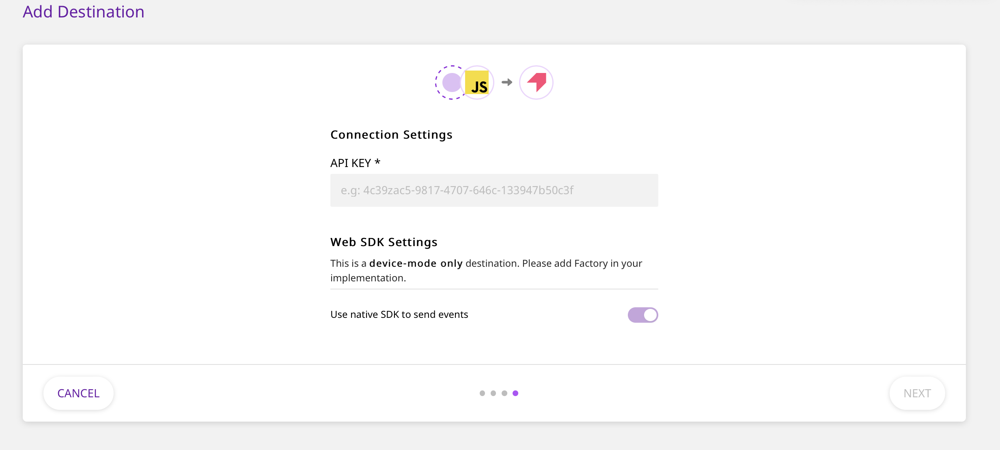

# Pendo

[Pendo](https://www.pendo.io/) is a popular product analytics platform that allows you to better understand your customers, and deliver personalized, guided product journeys for them. Some of the key features that Pendo offers include:

- [Insights](https://www.pendo.io/product/insights/)
- [Sentiment](https://www.pendo.io/product/sentiment/)
- [Guidance](https://www.pendo.io/product/guidance/)
- [Feedback](https://www.pendo.io/product/feedback/)
- [Roadmap](https://www.pendo.io/product/roadmap/)

With Pendo, your product teams can easily understand product usage, onboard your users, collect feedback, and roll out new features in-app - all without requiring any major engineering resources.

RudderStack allows you to configure Pendo as a destination to which you can send your event data seamlessly, for delivering personalized user experiences.

## Getting Started

To enable sending data to **Pendo**, you will first need to add it as a destination to the source from which you are sending your event data. Once the destination is enabled, events from RudderStack will start flowing to Pendo.

Before configuring your source and destination on the RudderStack, please verify if the source platform is supported by Pendo, by referring to the table below:

| **Connection Mode** | **Web**       | **Mobile** | **Server** |
| :------------------ | :------------ | :--------- | :--------- |
| **Device Mode**     | **Supported** | **-**      | **-**      |
| **Cloud Mode**      | **-**         | **-**      | **-**      |

<div class="infoBlock">

To know more about the difference between Cloud mode and Device mode in RudderStack, read the <a href="https://rudderstack.com/docs/connections/rudderstack-connection-modes/">RudderStack connection modes</a> guide.

</div>

Once you have ascertained that the platform is supported by Pendo, please follow these steps:

- Choose a source to which you would like to add Pendo as a destination.

<div class="infoBlock">

Please follow our guide on <a href="https://rudderstack.com/docs/connections/adding-source-and-destination-rudderstack/">How to Add a Source and Destination</a> in RudderStack to add a source and destination in RudderStack.

</div>

- Select the destination as **Pendo** to your source. Give your destination a name and then click on **Next**.
- On the **Connection Settings** page, fill all the fields with the relevant information and click **Next**.

<span class="imageTitle">Pendo Connection Settings in RudderStack</span>

<div class="infoBlock">

To get the Pendo **API Key**, follow these steps:
  <ul>
    <li>Login to Pendo dashboard.</li>
    <li>Go to the <strong>Settings</strong> on the left sidebar and click on <strong>Subscription Settings.</strong></li>
    <li>You will see an option called <strong>Apps</strong> and under that hover on the square box and click on <strong>view app details</strong>.</li>
    <li>Here you will find your <strong>API Key</strong> in <strong>App Details</strong> section.
    </li>
  </ul>
</div>

## Identify

To identify a user to Pendo, you need to call the `identify` API. When you send an `identify` call, RudderStack will pass that user’s information to Pendo with `userId` as Pendo’s visitor ID. The user traits that you pass are mapped to visitor metadata in Pendo.

A sample `identify` call is as shown:

```javascript
rudderanalytics.identify("name123", {
  name: "Name Surname",
  first_name: "Name",
  last_name: "Surname",
  email: "name@surname.com",
  createdAt: "Thu Mar 24 2020 17:46:45 GMT+0000 (UTC)",
})
```

## Group

You can use the `group` call to create or update an account in Pendo. When you send a Group call, RudderStack sends the `groupId` to Pendo as account ID. The group traits are mapped to account metadata in Pendo.

<div class="infoBlock">

If you are using your Pendo account data, the group calls (with fields <code class="inline-code">groupId</code> & <code class="inline-code">traits</code>) are required.

</div>

Here is a sample `group` call:

```javascript
rudderanalytics.group("groupId", {
    "name": "Company",
    "industry": "Industry",
    "employees": 123,
    "email": abc@xyz.com
  }
);
```

## Track

The `track` call allows you to capture any action that the user might perform, along with the properties that are associated with that action. Each action is considered to be an event.

Here is a sample `track` call:

```javascript
rudderanalytics.track("test track event", {
  revenue: 30,
  currency: "USD",
  userId: "12345",
})
```

## FAQs

### Where do I find the Pendo API Key?

- Login to Pendo dashboard.
- Go to the **Settings** on the left sidebar and click on **Subscription Settings.**
- You will see an option called **Apps** and under that hover on the square box and click on **view app details**.
- Here you will find your **API Key** in **App Details** section.

## Contact Us

If you come across any issues while configuring Pendo with RudderStack, please feel free to [contact us](mailto:%20docs@rudderstack.com). You can also start a conversation in our [Slack](https://rudderstack.com/join-rudderstack-slack-community) community; we will be happy to talk to you!
