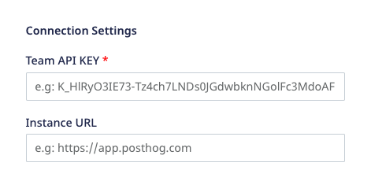
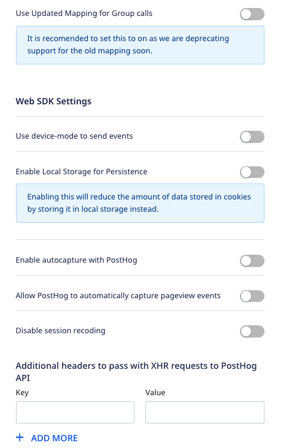

# PostHog

[PostHog](https://posthog.com/) is a complete product analytics stack built for data analysts and managers. It gives you easy access to scalable product analytics with full control over all your user data.

RudderStack supports PostHog as a destination to which you can seamlessly send your event data for analytics.

<div class="successBlock">

  <strong>Find the open-source transformer code for this destination in our <a href="https://github.com/rudderlabs/rudder-transformer/tree/master/v0/destinations/posthog">GitHub repository</a></strong>.
</div>

## Getting started

Before configuring PostHog as a destination in RudderStack, verify if the source platform is supported by PostHog by referring to the table below:

| **Connection Mode** | Web           | Mobile        | Server        |
| :------------------ | :------------ | :------------ | :------------ |
| **Device Mode**     | **Supported** | **-**         | **-**         |
| **Cloud Mode**      | **Supported** | **Supported** | **Supported** |

<div class="infoBlock">

To know more about the difference between cloud mode and device mode in RudderStack, refer to the <a href="https://rudderstack.com/docs/connections/rudderstack-connection-modes/">RudderStack Connection Modes</a> guide.
</div>

Once you have confirmed that the source platform supports sending events to PostHog, follow these steps:

1. From your [RudderStack dashboard](https://app.rudderstack.com/), add the source. Then, from the list of destinations, select **PostHog**.

<div class="infoBlock">

Follow our guide on <a href="https://rudderstack.com/docs/connections/adding-source-and-destination-rudderstack/">Adding a Source and Destination in RudderStack</a> for more information.
</div>

2. Assign a name to your destination and click on **Next**.

### Connection settings

To successfully configure PostHog as a destination, you will need to configure the following settings:



The settings are listed below:

- **Team API Key**: Enter your PostHog team API key. This is a mandatory field.

<div class="infoBlock">

For more information on obtaining your PostHog Team API Key, refer to the <a href="#faq">FAQ</a> section below.
</div>

- **Instance URL**: Enter your PostHog instance URL.

<div class="infoBlock">

If you’re hosting your own PostHog instance, add the URL of your instance without the trailing slash. So, the URL will look something like <code class="inline-code">https://[your-instance].com</code>.
</div>

- **Use updated mapping for Group calls**: This setting is disabled by default. When enabled, RudderStack sends the `group` traits as event properties to PostHog.

<div class="infoBlock">

For more information, refer to the <a href="#updated-group-mapping">Updated group mapping</a> section below.
</div>

### Web SDK settings

This section lists some of the other configurable settings while setting up the PostHog destination in RudderStack.



- **Use device mode to send events**: If enabled, RudderStack will send the events to PostHog via the [device mode](https://www.rudderstack.com/docs/connections/adding-source-and-destination-rudderstack/).
- **Enable Local Storage for Persistence**: Enable this option to reduce the amount of data stored in the cookies by storing it locally instead.
- **Enable autocapture with PostHog**: Enable this option to allow PostHog to send [auto-captured](https://posthog.com/docs/integrations/js-integration#usage) events.
- **Allow PostHog to automatically capture pageview events**: Enable this setting to allow the PostHog web SDK to send a page view event every time it is loaded on a page.
- **Disable session recoding**: Enable this setting to stop PostHog from recording the user sessions. 

<div class="infoBlock">

For more information on PostHog's session recording feature, refer to the <a href="https://posthog.com/docs/features/session-recording" target="_blank">PostHog documentation</a>.
</div>

- **Additional headers to pass with XHR requests to PostHog API**: Add a list of key-value pairs in this field. The RudderStack web SDK will then forward these headers on the event requests sent to PostHog.
- **Property black list** - Add a list of traits or event properties that you want the PostHog SDK to filter.

## Identify

To identify a user in PostHog, you need to call RudderStack's `identify` API.

<div class="infoBlock">

For information on the <code class="inline-code">identify</code> call, refer to the <a href="https://www.rudderstack.com/docs/rudderstack-api/api-specification/rudderstack-spec/identify/">RudderStack API Specification</a> guide.
</div>

A sample `identify` call is as shown below:

```javascript
rudderanalytics.identify("1hKOmRA4el9Zt1WSfVJIVo4GRlm", {
  name: "Alex Keener",
  first_name: "Alex",
  last_name: "Keener",
  email: "alex@example.com",
  createdAt: "2019-07-23T23:45:56.000Z",
})
```

<div class="infoBlock">

RudderStack passes the user traits within the <code class="inline-code">identify</code> call to PostHog under the <code class="inline-code">$set</code> key according to the <a href="https://posthog.com/docs/api/post-only-endpoints#identify" target="_blank">PostHog Identify API</a>.
</div>

## Page

The `page` call lets you record your app's page views with any additional relevant information about the viewed page.

<div class="infoBlock">

For information on the <code class="inline-code">page</code> call, refer to the <a href="https://www.rudderstack.com/docs/rudderstack-api/api-specification/rudderstack-spec/page/">RudderStack API Specification</a> guide.
</div>

```javascript
rudderanalytics.page({
  path: "/best-seller/1",
  url: "https://www.estore.com/best-seller/1",
  title: "EStore Bestsellers",
  search: "estore bestseller",
  referrer: "https://www.google.com/search?q=estore+bestseller",
})
```

In the above example, RudderStack captures information related to the viewed page such as its path, URL, referrer, etc.

<div class="infoBlock">

For the <code class="inline-code">page</code> call, RudderStack sends <code class="inline-code">$pageview</code> as an event to PostHog according to the <a href="https://posthog.com/docs/api/post-only-endpoints#page" target="_blank">PostHog Page API</a>.
</div>

## Screen

The `screen` call lets you record whenever your user views their mobile screen with any additional relevant information about the screen.

<div class="infoBlock">

For information on the <code class="inline-code">screen</code> call, refer to the <a href="https://www.rudderstack.com/docs/rudderstack-api/api-specification/rudderstack-spec/screen/">RudderStack API Specification</a> guide.
</div>

A sample `screen` call using RudderStack's iOS SDK is shown below:

```javascript
[[RudderClient sharedInstance] screen:@"Home Screen"
            properties:@{@"category" : @"launcher"}];
```

In the above snippet, RudderStack captures information related to the viewed screen such as its name and category.

<div class="infoBlock">

For the <code class="inline-code">screen</code> call, RudderStack sends <code class="inline-code">$screen</code> as an event to PostHog according to the <a href="https://posthog.com/docs/api/post-only-endpoints#screen" target="_blank">PostHog Screen API</a>.
</div>

## Track

The `track` call allows you to capture any user actions along with the properties that are associated with those actions. Each action is considered to be an event.

<div class="infoBlock">

For information on the <code class="inline-code">track</code> call, refer to the <a href="https://www.rudderstack.com/docs/rudderstack-api/api-specification/rudderstack-spec/track/">RudderStack API Specification</a> guide.
</div>

A sample `track` call is shown below:

```javascript
rudderanalytics.track("Order Completed", {
  checkout_id: "C324532",
  order_id: "T1230",
  value: 15.98,
  revenue: 16.98,
  shipping: 3.0,
  coupon: "FY21",
  currency: "INR",
  products: [
    {
      product_id: "product-mixedfruit-jam",
      sku: "sku-1",
      category: "Food",
      name: "Food/Drink",
      brand: "Sample",
      variant: "None",
      price: 10.0,
      quantity: 2,
      currency: "INR",
      position: 1,
      value: 6.0,
      typeOfProduct: "Food",
      url: "https://www.example.com/product/bacon-jam",
      image_url: "https://www.example.com/product/bacon-jam.jpg",
    },
  ],
})
```

<div class="infoBlock">

PostHog supports the RudderStack <code class="inline-code">track</code> call as type<code class="inline-code">capture.</code> and sends the user action as an event to PostHog according to the <a href="https://posthog.com/docs/api/post-only-endpoints#capture" target="_blank">PostHog Capture API</a>.
</div>

## Group

The `group` call lets you associate a particular identified user with a group, such as a company, organization, or an account.

<div class="infoBlock">

The group call sends <code class="inline-code">$group</code> as an event to PostHog according to the <a href="https://posthog.com/docs/api/post-only-endpoints#group">PostHog Group API</a>.

</div>

```javascript
rudderanalytics.group("sample_group_id", {
  name: "CompanyA",
  location: "USA",
})
```

### Updated group mapping

RudderStack lets you use the updated mapping feature for the `group` calls where it maps the group traits as event properties before sending them to PostHog. To use this feature, enable the **Use Updated Mapping for Group calls** setting in the RudderStack dashboard, as shown:

If this setting is disabled(default case), RudderStack sends the group traits to PostHog as received without any modifications, as shown in the following snippet:

```json
{
  "version": "1",
  "type": "REST",
  "method": "POST",
  "endpoint": "https://app.posthog.com/batch",
  "headers": {
    "Content-Type": "application/json"
  },
  "params": {},
  "body": {
    "JSON": {
      "groupId": "groupId27",
      "distinct_id": "sampleusrRudder7",
      "traits": {
        "groupType": "company",
        "KEY_3": {
          "CHILD_KEY_92": "value_95",
          "CHILD_KEY_102": "value_103"
        },
        "name_trait": "Company",
        "value_trait": "Company-ABC"
      },
      "messageId": "e5034df0-a404-47b4-a463-76df99934fea",
      "event": "$group",
      "api_key": "LNDs0JGdwbknNGolFc4HdoAE",
      "type": "group"
    },
  },
}
```

However, if this setting is enabled, RudderStack sends the group traits as event properties to PostHog, as shown below:

```json
{
  "version": "1",
  "type": "REST",
  "method": "POST",
  "endpoint": "https://app.posthog.com/batch",
  "headers": {
    "Content-Type": "application/json"
  },
  "params": {},
  "body": {
    "JSON": {
      "distinct_id": "sampleusrRudder7",
      "messageId": "e5034df0-a404-47b4-a463-76df99934fea",
      "properties": {
        "$group_key": "groupId27",
        "$group_type": "company",
        "$group_set": {
          "KEY_3": {
            "CHILD_KEY_92": "value_95",
            "CHILD_KEY_102": "value_103"
          },
          "name_trait": "Company",
          "value_trait": "Comapny-ABC"
        },
      },
      "event": "$group",
      "api_key": "LNDs0JGdwbknNGolFc4HdoAE",
      "type": "group"
    },
  },
}
```

## Alias

Calling `alias()` passes an `alias`call with `userId` and `previousId` to the PostHog queue.

<div class="infoBlock">

For information on the <code class="inline-code">alias</code> call, refer to the <a href="https://www.rudderstack.com/docs/rudderstack-api/api-specification/rudderstack-spec/alias/">RudderStack API Specification</a> guide.
</div>

A sample `alias` call in RudderStack is as shown:

```javascript
rudderanalytics.alias("user01", "previous01")
```

In the above example, `previous01` gets mapped to `distinct id` in PostHog, while `user01` gets mapped to `alias` in PostHog.

<div class="infoBlock">

For the <code class="inline-code">alias</code> call, RudderStack sends <code class="inline-code">$create_alias</code> as an event to PostHog according to <a href="https://posthog.com/docs/api/post-only-endpoints#alias" target="_blank">PostHog Alias API</a>.
</div>

## Passing super properties in the PostHog web SDK

To pass [super properties](https://posthog.com/docs/integrations/js-integration#super-properties) to the PostHog JavaScript SDK, you can pass the key-value pairs as shown:

- The following example will set `superKey1: "value1", superKey2: "value2"` as super properties to the PostHog web SDK:

```javascript
rudderanalytics.track("event", {prop: "value"}, {
  integrations: {
    POSTHOG: {
      superProperties: {
        superKey1: "value1",
        superKey2: "value2"
      }
    }
  }
})
```

- The following example will set `superKey3: "value3"` as super properties just once and pass on to the PostHog web SDK:

```javascript
// This will set {superKey3: "value3"} as set once super properties to PostHog SDK
rudderanalytics.track("event", {prop: "value"}, {
  integrations: {
    POSTHOG: {
      setOnceProperties: {
        superKey3: "value3"
      }
    }
  }
})
```

- The following example unsets the previously set super properties:

```javascript
// This will unset super properties superKey1, superKey2, superKey3 to PostHog SDK
rudderanalytics.track("event", {prop: "value"}, {
  integrations: {
    POSTHOG: {
      unsetProperties: [
        superKey1,
        superKey2,
        superKey3
      ]
    }
  }
})
```

<div class="infoBlock">

The super properties can be passed to any of <code class="inline-code">track</code>, <code class="inline-code">page</code>, or <code class="inline-code">identify</code> calls of the RudderStack JavaScript SDK.
</div>

## Property mapping

RudderStack maps the following `properties` sent to the Posthog standard contextual properties:

| RudderStack field           | PostHog field |
| :------------------------------ | :--------------------- |
| `context.os.name`               | `$os`                  |
| `context.page.url`              | `$current_url`         |
| `url`                           | `$host`                |
| `context.page.path`             | `$pathname`            |
| `context.screen.height`         | `$screen_height`       |
| `context.screen.width`          | `$screen_width`        |
| `context.library.name`          | `$lib`                 |
| `context.library.version`       | `$lib_version`         |
| `originalTimestamp`,`timestamp` | `$time`                |
| `context.device.id`             | `$device_id`           |
| `request_ip`,`context.ip`       | `$ip`                  |
| `timestamp`,`originalTimestamp` | `$timestamp`           |
| `anonymousId`                   | `$anon_distinct_id`    |
| `userId`,`anonymousId`          | `distinct_id`          |
| `context.screen.density`        | `$screen_density`      |
| `context.device.manufacturer`   | `$device_manufacturer` |
| `context.os.version`            | `$os_version`          |
| `context.timezone`              | `$timezone`            |
| `context.locale`                | `$locale`              |
| `context.userAgent`             | `$user_agent`          |
| `context.app.version`           | `$app_version`         |
| `context.device.name`           | `$device_name`         |
| `context.network.carrier`       | `$network_carrier`     |
| `context.app.name`              | `$app_name`            |
| `context.device.model`          | `$device_model`        |
| `context.app.namespace`         | `$app_namespace`       |
| `context.app.build`             | `$app_build`           |

<div class="warningBlock">

The PostHog SDK autogenerates the property <code class="inline-code">$insert_id</code> when you send event via the RudderStack device mode. However, when sending the events via the cloud mode, RudderStack does not map any value to this property.
</div>

## FAQs

### How do I obtain the PostHog Team API Key?

To get your PostHog Project API Key or Team API Key, follow the steps below:

1. Login to your PostHog dashboard.
2. Go to the **Settings** tab under the **Project** section in the left sidebar.
3. Find your key under **Project API Key** or **Team API Key**.

## Contact us

For queries on any of the sections covered in this guide, you can [contact us](mailto:%20docs@rudderstack.com) or start a conversation in our [Slack](https://rudderstack.com/join-rudderstack-slack-community) community.
