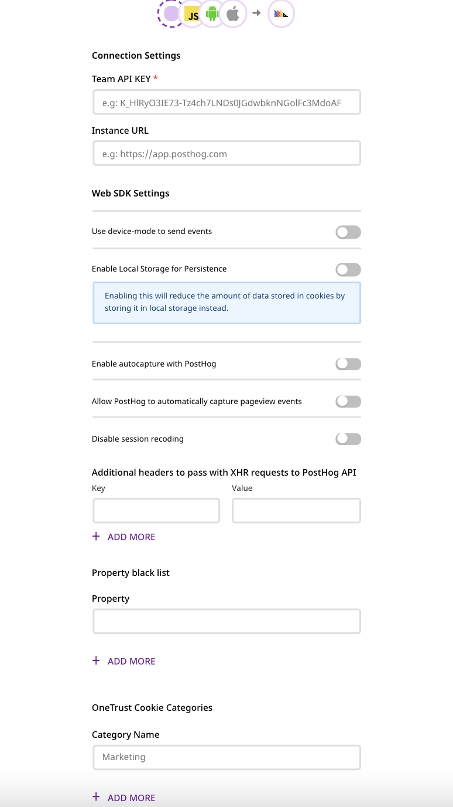

# PostHog

[**PostHog**](https://posthog.com/) is a complete product analytics stack that you can seamlessly deploy on your infrastructure. Built for both data analysts and managers, PostHog gives you easy access to product analytics which you can perform at scale. It also gives you full control over all your user data.

RudderStack allows you to seamlessly configure PostHog as a destination to which you can send your event data seamlessly.

<div class="successBlock">

  <strong>Find the open-source transformer code for this destination in our <a href="https://github.com/rudderlabs/rudder-transformer/tree/master/v0/destinations/posthog">GitHub repo</a></strong>.
</div>

## Getting started

To enable sending data to **PostHog**, you will first need to add it as a destination to the source from which you are sending your event data. Once the destination is enabled, events from RudderStack will start flowing to PostHog.

Before configuring your source and destination on the RudderStack, verify if the source platform is supported by PostHog, by referring to the table below:

| **Connection Mode** | Web           | Mobile        | Server        |
| :------------------ | :------------ | :------------ | :------------ |
| **Device Mode**     | **Supported** | **-**         | **-**         |
| **Cloud Mode**      | **Supported** | **Supported** | **Supported** |

<div class="infoBlock">

To know more about the difference between Cloud mode and Device mode in RudderStack, read the <a href="https://rudderstack.com/docs/connections/rudderstack-connection-modes/">RudderStack Connection Modes</a> guide.

</div>

Once you have confirmed that the platform supports sending events to PostHog, perform the steps below:

- Select a source to which you would like to add PostHog as a destination.

<div class="infoBlock">

Follow our <a href="https://rudderstack.com/docs/connections/adding-source-and-destination-rudderstack/">Adding a Source and Destination</a> for more information.
</div>

- Select the destination as **PostHog** to your source. Assign an name to your destination and then click on **Next**. You should then see the following settings page:

<span class="imageTitle">PostHog Connection Settings in RudderStack</span>

In the **Connection Settings**, please enter your **Team API Key** and **Your-Instance** URL as shown above.

<div class="infoBlock">

If you’re hosting your own PostHog instance, add the URL of your instance without the trailing slash in the **PostHog instance** setting. So, the URL will look something like **<code class="inline-code">https://[your-instance].com</code>**.

</div>

## Web Settings

<span class="imageTitle">PostHog Web Settings in RudderStack</span>

- **Use native SDK to send events** - This will send event data using the [Posthog JavaScript SDK](https://posthog.com/docs/integrations/js-integration).
- **Enable Local Storage for Persistence** - Enabling this option will reduce the amount of data stored in the cookies by storing it locally instead.
- **Enable autocapture with PostHog** - Enable this option to allow PostHog to send [auto-captured](https://posthog.com/docs/integrations/js-integration#usage) events.
- **Allow PostHog to automatically capture pageview events** - This allows PostHog Javascript SDK to send a pageview event each time it is loaded on page.
- **Disable session recoding** - Turning this to enabled will stop PostHog from recording user sessions. Find more info on this option [here](https://posthog.com/docs/features/session-recording).
- **Additional headers to pass with XHR requests to PostHog API** - Add a list of key-value pairs, RudderStack Javascript SDK will forward these headers on the event requests sent to PostHog server.
- **Property black list** - Add a list of traits or event properties that you want the PostHog SDK to filter.

## Identify

To identify a user to PostHog, you need to call the `identify` API.

<div class="infoBlock">

For information on the <code class="inline-code">identify</code> call, please refer to our <a href="https://rudderstack.com/docs/rudderstack-api/">RudderStack API Specification</a> guide.

</div>

A sample `identify` call is as shown below:

```javascript
rudderanalytics.identify("name123", {
  name: "Name Surname",
  first_name: "Name",
  last_name: "Surname",
  email: "name@surname.com",
  createdAt: "Thu Mar 24 2020 17:46:45 GMT+0000 (UTC)",
})
```

We pass the user traits passed along with the `identify` call to PostHog under the `$set` key according to the [PostHog Identify API](https://posthog.com/docs/api/post-only-endpoints#identify) .

## Page

The `page` call allows you to record information whenever a user sees a web page, along with the associated optional properties of that page.

```javascript
rudderanalytics.page({
  path: "path",
  url: "url",
  title: "title",
  search: "search",
  referrer: "referrer",
})
```

<div class="infoBlock">

For the <code class="inline-code">page</code> call, we send <code class="inline-code">$pageview</code> as an event to PostHog according to the <a href="https://posthog.com/docs/api/post-only-endpoints#page">PostHog Page API</a>.

</div>

In the above sample, we capture information related to the page being viewed such as the category of the page \(`Category`\), as well as the name of the page \(`Sample`\) along with the unique user ID.

## Screen

The `screen` method allows you to record whenever a user sees the mobile screen, along with any associated optional properties.

<div class="infoBlock">

The <code class="inline-code">screen</code> call is similar to the <code class="inline-code">page</code> call, but it is exclusive to your mobile device.

</div>

A sample `screen` call using RudderStack's iOS SDK is as shown:

```javascript
[[RudderClient sharedInstance] screen:@"Main"
            properties:@{@"prop_key" : @"prop_value"}];
```

<div class="infoBlock">

For screen call we send <code class="inline-code">$screen</code> as an event to PostHog according to <a href="https://posthog.com/docs/api/post-only-endpoints#screen">PostHog Screen API</a>.

</div>

In the above snippet, we capture information related to the screen being viewed, such as the name and category.

## Track

The `track` call allows you to capture any action that the user might perform, along with the properties that are associated with that action. Each action is considered to be an event.

A sample `track` call looks like the following:

```javascript
rudderanalytics.track("Order Completed", {
  checkout_id: "C324532",
  order_id: "T1230",
  value: 15.98,
  revenue: 16.98,
  shipping: 3.0,
  coupon: "FY21",
  currency: "INR",
  products: [
    {
      product_id: "product-mixedfruit-jam",
      sku: "sku-1",
      category: "Food",
      name: "Food/Drink",
      brand: "Sample",
      variant: "None",
      price: 10.0,
      quantity: 2,
      currency: "INR",
      position: 1,
      value: 6.0,
      typeOfProduct: "Food",
      url: "https://www.example.com/product/bacon-jam",
      image_url: "https://www.example.com/product/bacon-jam.jpg",
    },
  ],
})
```

<div class="infoBlock">

PostHog support <code class="inline-code">track</code> call as type<code class="inline-code">capture.</code> It sends the user behavior/action as an event. This information is sent to PostHog according to the <a href="https://posthog.com/docs/api/post-only-endpoints#capture">PostHog Capture API</a>.

</div>

## Alias

Calling `rudderanalytics.alias()` passes an `alias`call with `userId` and `previousId` to the PostHog queue.

The following code snippet shows a sample `alias` call in RudderStack:

```javascript
rudderanalytics.alias("newUserId")
```

<div class="infoBlock">

For alias call, we send $create_alias as an event to PostHog according to <a href="https://posthog.com/docs/api/post-only-endpoints#alias">PostHog Alias API</a>.

</div>

<div class="infoBlock">

Here, <code class="inline-code">previousUserId</code> gets mapped to _distinct id_ and <code class="inline-code">newUserId</code> to _alias_ in PostHog.

</div>

## Group

The `group` call lets you associate a particular identified user with a group, such as a company, organization, or an account.

<div class="infoBlock">

The group call sends <code class="inline-code">$group</code> as an event to PostHog according to the <a href="https://posthog.com/docs/api/post-only-endpoints#group">PostHog Group API</a>.

</div>

```javascript
rudderanalytics.group("sample_group_id", {
  name: "CompanyA",
  location: "USA",
})
```

## Super Properties in Web

To pass [super properties](https://posthog.com/docs/integrations/js-integration#super-properties) to PostHog JavaScript SDK, pass the key-value pairs as below:

```javascript
// This will set {superKey1: "value1", superKey2: "value2"} as super properties to PostHog SDK
rudderanalytics.track("event", {prop: "value"}, {
  integrations: {
    POSTHOG: {
      superProperties: {
        superKey1: "value1",
        superKey2: "value2"
      }
    }
  }
})
```

```javascript
// This will set {superKey3: "value3"} as set once super properties to PostHog SDK
rudderanalytics.track("event", {prop: "value"}, {
  integrations: {
    POSTHOG: {
      setOnceProperties: {
        superKey3: "value3"
      }
    }
  }
})
```

```javascript
// This will unset super properties superKey1, superKey2, superKey3 to PostHog SDK
rudderanalytics.track("event", {prop: "value"}, {
  integrations: {
    POSTHOG: {
      unsetProperties: [
        superKey1,
        superKey2,
        superKey3
      ]
    }
  }
})
```

<div class="infoBlock">

Super properties related info can be passed to any of <code class="inline-code">track</code>, <code class="inline-code">page</code> and <code class="inline-code">identify</code> calls to the RudderStack JavaScript SDK.

</div>

## Property Mapping

RudderStack maps the following `properties` sent to Posthog standard contextual properties:

| Standard Rudder Field           | Standard Posthog Field |
| :------------------------------ | :--------------------- |
| `context.os.name`               | `$os`                  |
| `context.page.url`              | `$current_url`         |
| `url`                           | `$host`                |
| `context.page.path`             | `$pathname`            |
| `context.screen.height`         | `$screen_height`       |
| `context.screen.width`          | `$screen_width`        |
| `context.library.name`          | `$lib`                 |
| `context.library.version`       | `$lib_version`         |
| `originalTimestamp`,`timestamp` | `$time`                |
| `context.device.id`             | `$device_id`           |
| `request_ip`,`context.ip`       | `$ip`                  |
| `timestamp`,`originalTimestamp` | `$timestamp`           |
| `anonymousId`                   | `$anon_distinct_id`    |
| `userId`,`anonymousId`          | `distinct_id`          |
| `context.screen.density`        | `$screen_density`      |
| `context.device.manufacturer`   | `$device_manufacturer` |
| `context.os.version`            | `$os_version`          |
| `context.timezone`              | `$timezone`            |
| `context.locale`                | `$locale`              |
| `context.userAgent`             | `$user_agent`          |
| `context.app.version`           | `$app_version`         |
| `context.device.name`           | `$device_name`         |
| `context.network.carrier`       | `$network_carrier`     |
| `context.app.name`              | `$app_name`            |
| `context.device.model`          | `$device_model`        |
| `context.app.namespace`         | `$app_namespace`       |
| `context.app.build`             | `$app_build`           |

<div class="warningBlock">

**Note**: Posthog has a property **$insert_id** which is auto generated by posthog sdk when using device-mode. But when using RudderStack cloud-mode we do not map any value to this property.

</div>

## FAQs

### **How do you get the PostHog Team API Key?**

- Login to PostHog dashboard.
- Go to the **Settings** tab under the **Project** section on the left sidebar.
- You will find your key written as **Project API Key** or **Team API Key**.

## Contact Us

If you come across any issues while configuring PostHog with RudderStack, please feel free to [contact us](mailto:%20docs@rudderstack.com) or start a conversation in our [Slack](https://rudderstack.com/join-rudderstack-slack-community) community. We will be happy to help you.
