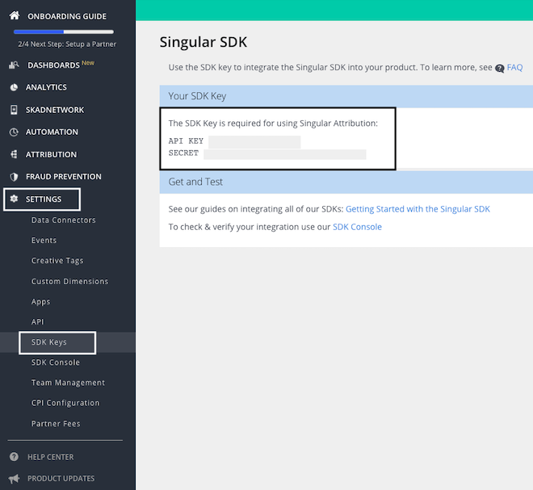

# Singular

[Singular](https://www.singular.net/) is a marketing intelligence platform to transform your marketing data into accurate, granular, and actionable insights that drive growth.

RudderStack supports Singular as a destination to which you can seamlessly send your event data.

## Getting started

Before configuring Singular as a destination in RudderStack, verify if the source platform is supported by Singular, by referring to the table below:

| **Connection Mode** | **Web**       | **Mobile**    | **Server** |
| :------------------ | :------------ | :------------ | :--------- |
| **Device mode**     | -             | **Supported** | -          |
| **Cloud mode**      | -             | -             | -          |

<div class="infoBlock">

To know more about the difference between cloud mode and device mode in RudderStack, refer to the <a href="https://rudderstack.com/docs/rudderstack-cloud/rudderstack-connection-modes/" target="_blank">RudderStack Connection Modes</a> guide.
</div>

Once you have confirmed that the source platform supports sending events to Singular, follow these steps:

1. From your [RudderStack dashboard](https://app.rudderstack.com/), add the source. Then, from the list of destinations, select **Singular**.

<div class="infoBlock">

Follow our guide on <a href="https://www.rudderstack.com/docs/rudderstack-cloud/destinations/#adding-a-destination" target="_blank">Adding a Destination</a> for more information.
</div>

2. Assign a name to your destination and click on **Next**.

### Connection settings

To successfully configure Singular as a destination, you need to configure the following settings:


- **API Key**: Enter your Singular API key here. This is a mandatory field. 
- **Secret**: Enter your Singular secret. This is a mandatory field and is required for the device mode integrations with the RudderStack iOS and Android SDKs.

<div class="infoBlock">

For more information on obtaining the Singular API key and secret, refer to the <a href="#faq">FAQ</a> section below.
</div>

<div class="successBlock">

When sending events via the device mode, RudderStack also lets you specify which events should be discarded or allowed to flow through. For more information, refer to the <a href="https://www.rudderstack.com/docs/stream-sources/rudderstack-sdk-integration-guides/event-filtering/"  target="_blank">Client-side Event Filtering</a>.
</div>

## Adding device mode integration

To add Singular to your application, follow the steps below depending on your platform of integration.

<Tabs>
  <TabList>
    <Tab>iOS</Tab>
    <Tab>Android</Tab>
    <Tab>React Native</Tab>
    <Tab>Cordova</Tab>
  </TabList>
    <TabPanels>
      <TabPanel>
        To add Singular to your iOS app, follow these steps:
<ol>
<li>In your <code class="inline-code">Podfile</code>, add the following dependencies:
<span>

```ruby
pod 'Singular-SDK', '11.0.4'
pod 'Rudder-Singular', '1.0.0'
```
</span>
</li>
<li>After adding the dependencies followed by <code class="inline-code">pod install</code> command, add the following imports to your <code class="inline-code">AppDelegate.m</code> file:
<span>

```objectivec
#import <Rudder/Rudder.h>
#import <RudderSingularFactory.h>
```
</span>
</li>
<li>Then, initialize your <code class="inline-code">RSClient</code>, as shown:
<span>

```objectivec
RSConfigBuilder *configBuilder = [[RSConfigBuilder alloc] init];
[configBuilder withDataPlaneUrl:<DATA_PLANE_URL>];
[configBuilder withFactory:[RudderSingularFactory instance]];
RSClient *rudderClient = [RSClient getInstance:<WRITE_KEY> config:[configBuilder build]];
```
</span>
</li>

<div class="infoBlock">

For more information, refer to the <a href="https://support.singular.net/hc/en-us/articles/360037950591-iOS-SDK-Basic-Integration?navigation_side_bar=true" target="_blank">Singular iOS documentation</a>.
</div>
</ol>
      </TabPanel>
      <TabPanel>
        To add Singular to your Android app, follow these steps :
<ol>
<li>Open your <code class="inline-code">app/build.gradle</code> (Module: <code class="inline-code">app</code>) file, and add the following under the <code class="inline-code">dependencies</code> section :
<span>

```groovy
implementation 'com.rudderstack.android.sdk:core:[1.0,2.0)'
implementation 'com.rudderstack.android.integration:singular:1.0.0'
implementation 'com.google.code.gson:gson:2.8.6'
```
</span>
</li>
<li>Then, add the Singular Maven plugin to your build script. To do this, add the following snippet into the <code class="inline-code">Gradle Scripts</code> section of your root <code class="inline-code">build.gradle</code>:
<span>

```groovy
buildscript {
    repositories {
        google()
        mavenCentral()
        maven {
          url 'https://maven.singular.net/' 
        }
    }
    dependencies {
        classpath 'com.android.tools.build:gradle:7.1.2'
        classpath 'org.jetbrains.kotlin:kotlin-gradle-plugin:1.6.10'
    }
}
allprojects {
    repositories {
        google()
        mavenCentral()
        maven {
          url 'https://maven.singular.net/' 
        }
    }
}
```
</span>
</li>
<li>Add the following permissions(if not present already) to your <code class="inline-code">AndroidManifest.xml</code>:
<span>

```markup
<uses-permission android:name="android.permission.INTERNET"/>
<uses-permission android:name="android.permission.ACCESS_NETWORK_STATE"/>
```
</span>
</li>
<li>Finally, initialize the RudderStack SDK in your <code class="inline-code">Application</code> class' <code class="inline-code">onCreate()</code> method, as shown:
<span>

```kotlin
// initializing Rudder SDK
val rudderClient = RudderClient.getInstance(
  this,
  <WRITE_KEY>,
  RudderConfig.Builder()
          .withDataPlaneUrl(<DATA_PLANE_URL>)
          .withFactory(SingularIntegrationFactory.FACTORY)
          .build()
  )
```
</span>
</li>

<div class="infoBlock">

For more information, refer to the <a href="https://support.singular.net/hc/en-us/articles/360037581952-Android-SDK-Basic-Integration?navigation_side_bar=true"  target="_blank">Singular Android documentation</a>.
</div>
</ol>
      </TabPanel>
      <TabPanel>
        To add Singular to your React Native app, follow these steps:
<ol>
<li>Add the RudderStack-Singular module to your app by running the following command:
<span>

```bash
npm install @rudderstack/rudder-integration-singular-react-native
// OR //
yarn add @rudderstack/rudder-integration-singular-react-native
```
</span>
</li>
<li>Open your project-level <code class="inline-code">android/build.gradle</code> file and add the following snippet:
<span>

```groovy
repositories {
  maven {
    url "https://maven.singular.net/"
  }
}
```

</span>
</li>
<li>Then, import the above module and add it to your SDK initialization, as shown:
<span>

```typescript
import rudderClient from "@rudderstack/rudder-sdk-react-native"
import singular from "@rudderstack/rudder-integration-singular-react-native"
const config = {
	dataPlaneUrl: <DATA_PLANE_URL>,
	trackAppLifecycleEvents: true,
	withFactories: [singular],
}
rudderClient.setup(<WRITE_KEY>, config)
```
</span>
</li>
</ol>
      </TabPanel>
      <TabPanel>
        To add Singular to your Cordova app, follow these steps:
<ol>
<li>Navigate to the root folder of your application and run the following command:
<span>

```bash
cordova plugin add rudder-integration-singular-cordova
```
</span>
</li>
<li>Then, add the following code in the <code class="inline-code">onDeviceReady()</code> function of your app's home page to initialize the SDK, as shown:
<span>

```javascript
RudderClient.initialize(<WRITE_KEY>, {
  dataPlaneUrl: <DATA_PLANE_URL>,
  factories: [RudderSingularFactory]
})
```
</span>
</li>
<div class="infoBlock">

Make sure you use the <code class="inline-code">await</code> keyword with the <code class="inline-code">initialize</code> call.
</div>
</ol>
      </TabPanel>
    </TabPanels>
</Tabs>

## Implementing SKAdNetwork (SKAN) support

Add the following code before the initialization of the iOS SDK to give the control to Singular for your SKAdNetwork integration:

```objectivec
[RudderSingularIntegration setSKANOptions:YES
        isManualSkanConversionManagementMode:YES
withWaitForTrackingAuthorizationWithTimeoutInterval:@0
        withConversionValueUpdatedHandler:^(NSInteger conversionValue){
    // Receive a callback whenever the Conversion Value is updated
    NSLog(@"SKAN handler %ld",conversionValue);
}];
```

<div class="infoBlock">

For more details, refer to the <a href="https://support.singular.net/hc/en-us/articles/360047454611" target="_blank">iOS SDK: Adding SKAdNetwork Support</a> section of the Singular documentation.
</div>

## Identify

For device mode destinations, the Singular SDK uses the [`identify`](https://www.rudderstack.com/docs/rudderstack-api/api-specification/rudderstack-spec/identify/) method to map the RudderStack user ID to their custom user ID. RudderStack uses Singular's [`setCustomUserId`](https://support.singular.net/hc/en-us/articles/360037581952-Android-SDK-Basic-Integration#Optional_Setting_the_User_ID) method to forward the identified user ID to Singular.

A sample `identify` call for both the Android and iOS SDKs is shown below:

<Tabs>
  <TabList>
    <Tab>iOS</Tab>
    <Tab>Android</Tab>
  </TabList>
    <TabPanels>
      <TabPanel>
<span>

```objectivec
[[RSClient getInstance] identify:@"1hKOmRA4el9Zt1WSfVJIVo4GRlm"];
```
</span>
      </TabPanel>
      <TabPanel>
<span>

```kotlin
RudderClient.getInstance()?.identify("1hKOmRA4el9Zt1WSfVJIVo4GRlm")
```
</span>
      </TabPanel>
    </TabPanels>
</Tabs>

## Track

The [`track`](https://www.rudderstack.com/docs/rudderstack-api/api-specification/rudderstack-spec/track/) call lets you capture any user actions and the properties associated with them. Each user action is considered to be an event.

### Tracking custom events

A custom `track` call lets you track custom events as they occur in your apps. RudderStack sends these calls to Singular where they are processed as custom post-install events and are made available in the relevant reports.

A sample custom `track` call for both the Android and iOS SDKs is shown below:

<Tabs>
  <TabList>
    <Tab>iOS</Tab>
    <Tab>Android</Tab>
  </TabList>
    <TabPanels>
      <TabPanel>
<span>

```objectivec
[[RSClient getInstance] track:@"Product Reviewed" properties:@{
        @"product_id" : @"345676543",
        @"review_id" : @"123454387"
    }];
```
</span>
      </TabPanel>
      <TabPanel>
<span>

```kotlin
RudderClient.getInstance()?.track("Product Reviewed",
    RudderProperty()
        .putValue("product_id", "345676543")
        .putValue("review_id", "123454387")
)
```
</span>
      </TabPanel>
    </TabPanels>
</Tabs>

### Tracking revenue

Singular supports tracking revenue events. It implements revenue tracking whenever an event containing the `revenue` property is sent(including a zero value). Optionally, you can also pass the `currency` field as an [ISO code](https://www.iso.org/iso-4217-currency-codes.html). 

<div class="infoBlock">

The default currency is set to <code class="inline-code">USD</code>.
</div>

A sample `revenue` track call is shown below:

<Tabs>
  <TabList>
    <Tab>iOS</Tab>
    <Tab>Android</Tab>
  </TabList>
    <TabPanels>
      <TabPanel>
<span>

```objectivec
[[RSClient getInstance] track:@"Order Completed" properties:@{
        @"revenue" : @1251,
        @"currency" : @"INR"
    }];
```
</span>
      </TabPanel>
      <TabPanel>
<span>

```kotlin
RudderClient.getInstance()?.track("Order Completed",
    RudderProperty()
        .putValue("revenue", 1251)
        .putValue("currency", "INR")
)
```
</span>
      </TabPanel>
    </TabPanels>
</Tabs>

## Screen

The [`screen`](https://www.rudderstack.com/docs/rudderstack-api/api-specification/rudderstack-spec/screen/) method allows you to record whenever a user sees the mobile screen, along with any associated optional properties. This call is similar to the `page` call for the web applications but exclusive to your mobile device.

A sample `screen` call for both the Android and iOS SDKs is shown below:

<Tabs>
  <TabList>
    <Tab>iOS</Tab>
    <Tab>Android</Tab>
  </TabList>
    <TabPanels>
      <TabPanel>
<span>

```objectivec
[[RSClient sharedInstance] screen:@"Home" properties:@{
    @"category" : @"launcher"
}];
```
</span>
      </TabPanel>
      <TabPanel>
<span>

```kotlin
RudderClient.getInstance()?.screen("Home",
    RudderProperty()
        .putValue("category", "launcher")
)
```
</span>
      </TabPanel>
    </TabPanels>
</Tabs>

In the above snippet, RudderStack captures all the information related to the viewed screen, along with any additional info about the screen.

<div class="infoBlock">

RudderStack sends the <code class="inline-code">screen</code> event to Singular as a custom event.
</div>

## Reset

The `reset` method resets the current user's identity and creates a new anonymous session. It should be called when a user logs out.

RudderStack calls Singular's [`unsetCustomUserId`](https://support.singular.net/hc/en-us/articles/360037581952-Android-SDK-Basic-Integration#Optional_Setting_the_User_ID) method to reset a user's identity.

A sample `reset` call for both the Android and iOS SDKs is shown below:

<Tabs>
  <TabList>
    <Tab>iOS</Tab>
    <Tab>Android</Tab>
  </TabList>
    <TabPanels>
      <TabPanel>
<span>

```objectivec
[[RSClient getInstance] reset];
```
</span>
      </TabPanel>
      <TabPanel>
<span>

```kotlin
RudderClient.getInstance()?.reset();
```
</span>
      </TabPanel>
    </TabPanels>
</Tabs>

## FAQ

### Where can I find the Singular API key and secret?

To obtain your Singular API key and secret, log into your Singular dashboard and navigate to **Settings** > **SDK Keys**, as shown:



## Contact us

For queries on any of the sections covered in this guide, you can [contact us](mailto:%20docs@rudderstack.com) or start a conversation in our [Slack](https://rudderstack.com/join-rudderstack-slack-community) community.
