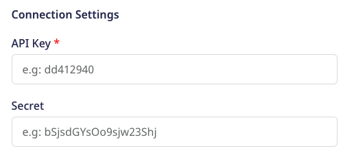

# Singular

[**Singular**](https://www.singular.net/) is a Marketing Intelligence Platform that transforms marketing data into accurate, granular and actionable insights to drive growth. By unifying marketing campaign data with attribution data, marketers can measure ROI from every touchpoint across multiple channels for a single source of truth.

RudderStack supports Singular as a destination to which you can send your event data seamlessly.

## Getting started

To send your events to Singular via RudderStack, you will first need to add it as a destination in the RudderStack dashboard. Before you get started, check if the source platform supports sending events to Singular by referring to the table below:

| **Connection Mode** | **Web**       | **Mobile**    | **Server** |
| :------------------ | :------------ | :------------ | :--------- |
| **Device mode**     | -             | **Supported** | -          |
| **Cloud mode**      | -             | -             | -          |

<div class="infoBlock">

To know more about the difference between cloud mode and device mode in RudderStack, read the <a href="https://rudderstack.com/docs/connections/rudderstack-connection-modes/">RudderStack connection modes</a> guide.
</div>

Once you have confirmed that the platform supports sending events to Singular, perform the steps below:

- From your [**RudderStack dashboard**](https://app.rudderstack.com/), add the source. Then, select **Singular** from the list of destinations.

<div class="infoBlock">

Follow our guide on <a href="https://rudderstack.com/docs/connections/adding-source-and-destination-rudderstack/">Adding a Source and Destination in RudderStack</a> for more information.
</div>

- Assign a name to your destination and click on **Next**. You should be able to see the following screen:



### Connection settings

To configure the destination, you will need to enter the following settings:

- **API Key**: To get this value, log into your Singular account and navigate to **Settings** - **SDK Keys**.
- **API Key**: To get this value, log into your Singular account and navigate to **Settings** - **SDK Keys**. This key is required for device-mode integrations with our iOS and Android SDKs.

## Adding device mode integration

To add Singular to your project, follow the steps below depending on your platform of integration.

### iOS

To add Singular to your iOS project, follow these steps:

* In your `Podfile`, add the following dependencies:

```ruby
pod 'Singular-SDK', '11.0.4'
pod 'Rudder-Singular', '1.0.0'
```

* After adding the dependencies followed by a `pod install` command, add the following imports to your `AppDelegate.m` file:

```objectivec
#import <Rudder/Rudder.h>
#import <RudderSingularFactory.h>
```

* Then, initialize your `RSClient` as shown:

```objectivec
RSConfigBuilder *configBuilder = [[RSConfigBuilder alloc] init];
[configBuilder withDataPlaneUrl:dataPlaneUrl];
[configBuilder withFactory:[RudderSingularFactory instance]];
RSClient *rudderClient = [RSClient getInstance:writeKey config:[configBuilder build]];
```

<div class="infoBlock">
  
  For more information, refer to the <a href="https://support.singular.net/hc/en-us/articles/360037950591-iOS-SDK-Basic-Integration?navigation_side_bar=true">Singular iOS documentation</a>.
</div>

### Android

To add Singular to your Android project, follow these steps:

* Open your `app/build.gradle` (Module: app) file and add the following under the `dependencies` section:

```groovy
implementation 'com.rudderstack.android.sdk:core:[1.0,2.0)'
implementation 'com.rudderstack.android.integration:singular:1.0.0'
implementation 'com.google.code.gson:gson:2.8.6'
```

* Then, add the Singular Maven plugin to your build script. To do so, add the following snippet into the `Gradle Scripts` section of your root `build.gradle`:

```groovy
buildscript {
    repositories {
        google()
        mavenCentral()
        maven { url 'https://maven.singular.net/' }
    }
    dependencies {
        classpath 'com.android.tools.build:gradle:7.1.2'
        classpath "org.jetbrains.kotlin:kotlin-gradle-plugin:1.6.10"
    }
}

allprojects {
    repositories {
        google()
        mavenCentral()
        maven { url 'https://maven.singular.net/' }
    }
}
```

* Add the following permissions, if not added already, to your `AndroidManifest.xml`:

```markup
<uses-permission android:name="android.permission.INTERNET"/>
<uses-permission android:name="android.permission.ACCESS_NETWORK_STATE"/>
```

* Finally, initialize the RudderStack SDK in your `Application` class' `onCreate()` method as shown:

```kotlin
// initializing Rudder SDK
val rudderClient = RudderClient.getInstance(
  this,
  WRITE_KEY,
  RudderConfig.Builder()
          .withDataPlaneUrl(DATA_PLANE_URL)
          .withFactory(SingularIntegrationFactory.FACTORY)
          .build()
  )
```
<div class="infoBlock">
  
  For more information, refer to the <a href="https://support.singular.net/hc/en-us/articles/360037581952-Android-SDK-Basic-Integration?navigation_side_bar=true">Singular Android documentation</a>.
</div>

## Implement SKAN support

The Singular SDK can control your SKAdnetwork integration. For details on how this works, see <a href="https://support.singular.net/hc/en-us/articles/360047454611">iOS SDK: Adding SKAdNetwork Support"</a>.

To let Singular control your SKAdNetwork integration, add the following code before the initialization of the Segment SDK:

```objectivec
[RudderSingularIntegration setSKANOptions:YES
        isManualSkanConversionManagementMode:YES
withWaitForTrackingAuthorizationWithTimeoutInterval:@0
        withConversionValueUpdatedHandler:^(NSInteger conversionValue){
    // Receive a callback whenever the Conversion Value is updated
    NSLog(@"Your SKAN handler %ld",conversionValue);
}];
```

## Identify

For the device-based destination, Singular’s SDK uses the identify method to map RudderStack User ID value to the Custom User ID.

A sample `identify` call looks like the following snippet:

'''kotlin
RudderClient.getInstance()?.identify("Android User")
```

## Track

### Tracking Custom Events

A custom `track` call lets you track custom events as they occur in your web application. Those calls will be sent to Singular and processed as custom post-install events and will be available in reporting & user-level exports.

A sample custom track call looks like the following snippet:

```kotlin
RudderClient.getInstance()?.track("Order Completed",
    RudderProperty()
        .putValue("affiliation", "affiliation_1")
        .putValue("shipping", "123")
        .putValue("tax", "124")
        .putValue("order_id", "234")
)
```

### Revenue Tracking

Singular will receive revenue tracking when an event containing the `revenue` property is sent (including zero value). You can optionally pass the `currency` (as an iso3 code). The default currency is `USD`.

A sample `revenue` track call looks like the following snippet:

```kotlin
RudderClient.getInstance()?.track("Order Completed",
    RudderProperty()
        .putValue("revenue", 1251)
        .putValue("currency", "INR")
)
```

## Screen

The `screen` method allows you to record whenever a user sees the mobile screen, along with any associated optional properties. This call is similar to the `page` call, but exclusive to your mobile device.

A sample `screen` call looks like the following code snippet:

```kotlin
RudderClient.getInstance()?.screen("Sample Screen Name",
            RudderProperty()
                .putValue("prop_key","prop_value"));
```

In the above snippet, RudderStack captures all the information related to the viewed screen, along with any additional info associated with that event.

<div class="infoBlock">

Note that the <code class="inline-code">screen</code> call will be sent to Singular as a custom event.
</div>

## Reset

The `reset` method calls will release the identity of the current user and create a new anonymous session. It should be called when the users log out.

A sample `reset` call for iOS is as shown:

```kotlin
RudderClient.getInstance()?.reset();
```

## Contact us

If you come across any issues while configuring Singular with RudderStack, you can [**contact us**](mailto:%20docs@rudderstack.com) or start a conversation in our [**Slack**](https://rudderstack.com/join-rudderstack-slack-community) community.
