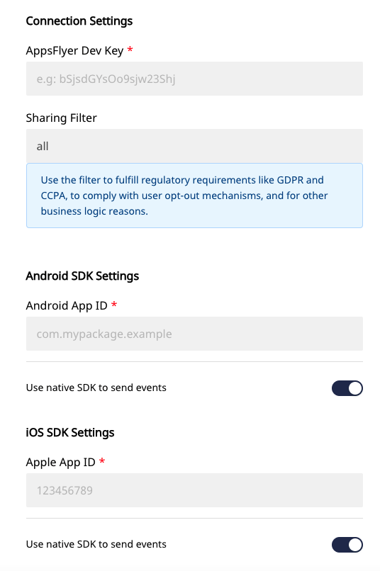

# AppsFlyer

[AppsFlyer](https://www.appsflyer.com/) is an industry-leading mobile attribution and marketing analytics platform, provided as a Software-as-a-Service \(SaaS\). It offers exciting features to understand your customers better, through intuitive dashboards, real-time data reports, and a unique deep linking technology.

RudderStack allows you to configure AppsFlyer as a destination and send your event data to it directly.

<div class="successBlock">

  **Find the open-source transformer code for this destination in our <a href="https://github.com/rudderlabs/rudder-transformer/tree/master/v0/destinations/af">GitHub repo</a>.**
</div>

## Getting Started

To enable sending data to AppsFlyer, you will first need to add it as a destination to the source from which you are sending your event data. Once the destination is enabled, events from our SDK will start flowing to AppsFlyer.

Before configuring your source and destination on the RudderStack, please verify if the source platform is supported by AppsFlyer, by referring to the table below:

| **Connection Mode** | **Web**       | **Mobile**    | **Server**    |
| :------------------ | :------------ | :------------ | :------------ |
| **Device mode**     | -             | **Supported** | -             |
| **Cloud mode**      | **Supported** | **Supported** | **Supported** |

<div class="infoBlock">

To know more about the difference between Cloud mode and Device mode in RudderStack, read the <a href="https://rudderstack.com/docs/connections/rudderstack-connection-modes/">RudderStack connection modes</a> guide.

</div>

Once you have confirmed that the platform supports sending events to AppsFlyer, perform the steps below:

- From your [RudderStack dashboard](https://app.rudderlabs.com/), add the source. From the list of destinations, select **AppsFlyer**.

<div class="infoBlock">

Please follow our guide on <a href="https://rudderstack.com/docs/connections/adding-source-and-destination-rudderstack/">How to Add a Source and Destination in RudderStack</a> to add a source and destination in RudderStack.

</div>

- Give a name to the destination and click on **Next**. You should then see the following screen:



- Enter the **AppsFlyer Dev Key**.
- **Sharing Filter** is set to `all` by default. For more information on this field please visit the AppsFlyer docs [here](https://support.appsflyer.com/hc/en-us/articles/207034486-Server-to-server-events-API-for-mobile-S2S-mobile-#sharing_filter-16)
- If you are setting up an **Android**, **iOS**, or **React Native SDK**, you must enter the respective **App ID** for each SDK.
  - **Android App ID** is the application id used in your `app/build.gradle` file
  - **Apple App ID** is the iTunes Application ID, and it is mandatory for iOS applications.
- By default, the `Use native SDK to send events` button will be toggles to on. If you would like to change this default behavior, select the toggle to choose between **Cloud Mode** and **Device Mode**.
- Click on **Next** to complete the configuration.

AppsFlyer should now be added and enabled as a destination in RudderStack.

## Adding AppsFlyer to your project

Depending on your platform of integration, follow these steps below to add AppsFlyer to your project:

<!--

To add AppsFlyer to your iOS project:

- Add the following line to your [CocoaPods](https://cocoapods.org/) `Podfile`

```ruby
pod 'Rudder-Appsflyer'
```

- After adding the dependency, you must register the `RudderAppsflyerFactory` with your `RudderClient` initialization as a `factory` of `RudderConfig`. To do this, run the following command to import the `RudderAppsflyerFactory.h` file in your `AppDelegate.m` file.

```objectivec
#import <Rudder-Appsflyer/RudderAppsflyerFactory.h>
```

- Then, change the SDK initialization to the following:

```objectivec
RSConfigBuilder *builder = [[RSConfigBuilder alloc] init];
[builder withDataPlaneUrl:DATA_PLANE_URL];
[builder withTrackLifecycleEvens:YES];
[builder withRecordScreenViews:YES];
[builder withFactory:[RudderAppsflyerFactory instance]];
[builder withLoglevel:RSLogLevelDebug];
[RSClient getInstance:WRITE_KEY config:[builder build]];
```




To add AppsFlyer to your Android project:

- Add the repository as shown:

```groovy
repositories {
    mavenCentral()
}
```

- Add the following line to your `app/build.gradle` file under `dependencies` section:

```groovy
implementation 'com.rudderstack.android.sdk:core:1.+'
implementation 'com.rudderstack.android.integration:appsflyer:1.+'

implementation 'com.appsflyer:af-android-sdk:6.+'
implementation 'com.android.installreferrer:installreferrer:2.+'
```

- Finally, change the initialization of your `RudderClient` in your `Application` class.

```kotlin
val rudderClient: RudderClient = RudderClient.getInstance(
    this,
    WRITE_KEY,
    RudderConfig.Builder()
        .withDataPlaneUrl(DATA_PLANE_URL)
        .withFactory(AppsFlyerIntegrationFactory.FACTORY)
        .build()
)
```




To add AppsFlyer to your ReactNative project:

Add the RudderStack-AppsFlyer module to your app using :

```bash
npm install @rudderstack/rudder-integration-appsflyer-react-native
// OR //
yarn add @rudderstack/rudder-integration-appsflyer-react-native
```

Import the module you added above and add it to your SDK initialization code in the following manner:

```typescript
import rudderClient from "@rudderstack/rudder-sdk-react-native"
import appsflyer from "@rudderstack/rudder-integration-appsflyer-react-native"

const config = {
  dataPlaneUrl: DATA_PLANE_URL,
  trackAppLifecycleEvents: true,
  withFactories: [appsflyer],
}
rudderClient.setup(WRITE_KEY, config)
```


 -->

<Tabs>
  <TabList>
    <Tab>iOS</Tab>
    <Tab>Android</Tab>
    <Tab>ReactNative</Tab>
  </TabList>
    <TabPanels>
      <TabPanel>
        To add AppsFlyer to your iOS project:
<ul>
<li>Add the following line to your <a href="https://cocoapods.org/">CocoaPods</a> <code class="inline-code">Podfile</code>
<span>

```ruby
pod 'Rudder-Appsflyer'
```
</span>
</li>
<li>After adding the dependency, you must register the <code class="inline-code">RudderAppsflyerFactory</code> with your <code class="inline-code">RudderClient</code> initialization as a <code class="inline-code">factory</code> of <code class="inline-code">RudderConfig</code>. To do this, run the following command to import the <code class="inline-code">RudderAppsflyerFactory.h</code> file in your <code class="inline-code">AppDelegate.m</code> file.
<span>

```objectivec
#import <Rudder-Appsflyer/RudderAppsflyerFactory.h>
```
</span>
</li>
<li>Then, change the SDK initialization to the following:
<span>

```objectivec
RSConfigBuilder *builder = [[RSConfigBuilder alloc] init];
[builder withDataPlaneUrl:DATA_PLANE_URL];
[builder withTrackLifecycleEvens:YES];
[builder withRecordScreenViews:YES];
[builder withFactory:[RudderAppsflyerFactory instance]];
[builder withLoglevel:RSLogLevelDebug];
[RSClient getInstance:WRITE_KEY config:[builder build]];
```
</span>
</li>
</ul>
      </TabPanel>
      <TabPanel>
        To add AppsFlyer to your Android project:
<ul>
<li>Add the repository as shown:
<span>

```groovy
repositories {
    mavenCentral()
}
```
</span>
</li>
<li>Add the following line to your <code class="inline-code">app/build.gradle</code> file under <code class="inline-code">dependencies</code> section:
<span>

```groovy
implementation 'com.rudderstack.android.sdk:core:1.+'
implementation 'com.rudderstack.android.integration:appsflyer:1.+'

implementation 'com.appsflyer:af-android-sdk:6.+'
implementation 'com.android.installreferrer:installreferrer:2.+'
```
</span>
</li>
<li>Finally, change the initialization of your <code class="inline-code">RudderClient</code> in your <code class="inline-code">Application</code> class.
<span>

```kotlin
val rudderClient: RudderClient = RudderClient.getInstance(
    this,
    WRITE_KEY,
    RudderConfig.Builder()
        .withDataPlaneUrl(DATA_PLANE_URL)
        .withFactory(AppsFlyerIntegrationFactory.FACTORY)
        .build()
)
```
</span>
</li>
</ul>
      </TabPanel>
      <TabPanel>
        To add AppsFlyer to your ReactNative project:
<ul>
<li>Add the RudderStack-AppsFlyer module to your app using :
<span>

```bash
npm install @rudderstack/rudder-integration-appsflyer-react-native
// OR //
yarn add @rudderstack/rudder-integration-appsflyer-react-native
```
</span>
</li>
<li>Import the module you added above and add it to your SDK initialization code in the following manner:
<span>

```typescript
import rudderClient from "@rudderstack/rudder-sdk-react-native"
import appsflyer from "@rudderstack/rudder-integration-appsflyer-react-native"
const config = {
  dataPlaneUrl: DATA_PLANE_URL,
  trackAppLifecycleEvents: true,
  withFactories: [appsflyer],
}
rudderClient.setup(WRITE_KEY, config)
```
</span>
</li>
</ul>
      </TabPanel>
    </TabPanels>
</Tabs>

## Cloud Mode

For all cloud mode calls, the `externalId` key must be included and must include the id, as well as the type of `appsFlyerExternalId` as shown below:

```javascript
"externalId": [
  {
    "id": "some_other2345_sample_external_id",
    "type": "appsflyerExternalId"
  }
]
```

We expect the `externalId` under `context`.

## Identify

The `identify` call from RudderStack sets the `userId` through the `setCustomerUserId` method from `AppsFlyerLib` .

RudderStack sets the `email` from `RudderTraits` to AppsFlyer using the `setUserEmails` method from the native SDK.

```objectivec
[[RSClient sharedInstance] identify:@"developer_user_id"
                                 traits:@{@"email": @"bar@foo.com"}];
```

## Track

The `track` call from RudderStack is mapped to the appropriate standard events of AppsFlyer wherever possible.

We map the events as per the following table:

| RudderStack Event           | AppsFlyer Event         |
| :-------------------------- | :---------------------- |
| `Products Searched`         | `af_search`             |
| `Product Viewed`            | `af_content_view`       |
| `Product List Viewed`       | `af_list_view`          |
| `Product Added to Wishlist` | `af_add_to_wishlist`    |
| `Product Added`             | `af_add_to_cart`        |
| `Checkout Started`          | `af_initiated_checkout` |
| `Order Completed`           | `af_purchase`           |
| `Product Removed`           | `remove_from_cart`      |

Also, for any event with a name not matching the table above, RudderStack makes the following changes to the event name:

- Convert the entire event name to lower case
- Replace `<space>` with `<underscore>`

After these steps, RudderStack passes the event to AppsFlyer via the native SDK, along with the `properties` for that event.

Along with the above event mapping, the event property mapping is done as well, as shown:

| RudderStack Property Name | AppsFlyer Property Name                                                                                                                                                                |
| :------------------------ | :------------------------------------------------------------------------------------------------------------------------------------------------------------------------------------- |
| `query`                   | `af_search_string`                                                                                                                                                                     |
| `price`                   | `af_price`                                                                                                                                                                             |
| `product_id`              | `af_content_id`                                                                                                                                                                        |
| `category`                | `af_content_type`                                                                                                                                                                      |
| `currency`                | `af_currency`                                                                                                                                                                          |
| `products`                | We formulate the list as per List View [specification](https://support.appsflyer.com/hc/en-us/articles/115005544169#verticals-list-view) and pass it to the property `af_content_list` |
| `quantity`                | `af_quantity`                                                                                                                                                                          |
| `order_id`                | `af_receipt_id`                                                                                                                                                                        |
| `revenue`                 | `af_revenue`                                                                                                                                                                           |

A Sample `track` call for an iOS application will look like the below.

```objectivec
[[RSClient sharedInstance] track:@"Accepted Terms of Service"
                          properties:@{
                                  @"foo": @"bar",
                              @"foo_int": @134
}];
```

## Screen

For all the `screen` calls from the SDK, RudderStack calls the `trackEvent` method of the AppsFlyer SDK with the `eventName` as `screen` . Then, all the properties are passed to AppsFlyer as is.

RudderStack performs the same task for the automatically recorded `screen` calls as well. For those calls, a Boolean property called `automatic` is obtained in the properties.

## Mobile SDK ID for Advertisers

#### Advertising ID

If the advertising ID is set according to the associated docs, RudderStack will utilize them appropriately for the AppsFlyer destination. They should be found in `context.device.advertisementId`

- For iOS: [Advertisement ID Documentation](https://rudderstack.com/docs/stream-sources/rudderstack-sdk-integration-guides/rudderstack-ios-sdk/#advertisement-id)
- For Android: [Advertisment ID Documentation](https://rudderstack.com/docs/stream-sources/rudderstack-sdk-integration-guides/rudderstack-android-sdk/#advertisement-id)

#### ATTrackingManager

If the `ATTrackingManager.trackingAuthorizationStatus` is passed appropriately according to [this documentation](https://rudderstack.com/docs/stream-sources/rudderstack-sdk-integration-guides/rudderstack-ios-sdk/#attrackingmanager-authorization-consent), RudderStack will utilize it for the AppsFlyer destination. It should be found in `context.device.attTrackingStatus`

## Error Messages

The following are possible error messages you may encounter.

#### `Invalid platform or required androidAppId or appleAppId missing`

This message will occur when either the `OS Name` is not set or your respective `appId` is not set. You can set the `appId` in your settings config \(see the **Getting Started** section above\). The `OS Name` should be set by the SDK automatically and it should be present at `context.os.name`

#### `Appsflyer id is not set. Rejecting the event`

This message will occur when the `appsflyerExternalId` is not set. Please refer to the **Cloud Mode** section above to see how to properly set the `appsflyerExternalId`.

## Debugging

We set the `logLevel` in AppsFlyer based on the `logLevel` set for the `RudderClient`. If it is set for `DEBUG` or more, RudderStack sets the `logLevel` to `VERBOSE` for AppsFlyer. For anything below that, RudderStack sets the `logLevel` to `NONE` for AppsFlyer.

## FAQs

### Where do I get the AppsFlyer Dev Key?

You can find the **AppsFlyer Dev Key** by logging into your AppsFlyer account and navigating to the **Apps Settings** page in your dashboard.

### Getting an error saying "Build input file cannot be found" for iOS device mode?

The latest AppsFlyer SDK requires XCode 12. Make sure to meet the requirement. You need to downgrade AppsFlyer SDK to build with a lower version of XCode. You can declare the version with the `pod` in your `Podfile`

```ruby
pod 'Rudder-Appsflyer',' 1.0.0'
```

### How do I get the `AppsFlyerId` to send events via Cloud mode from my mobile sources?

Depending on your platform of integration, include the following code snippet to get the `AppsFlyerId`:

<!--


```objectivec
#import <AppsFlyerLib/AppsFlyerLib.h>

NSString *appsflyerId = [AppsFlyerLib shared].getAppsFlyerUID;
```





```java
import com.appsflyer.AppsFlyerLib;

String appsFlyerId = AppsFlyerLib.getInstance().getAppsFlyerUID(this);
```





```javascript
import AppsFlyerIntegrationFactory from "@rudderstack/rudder-integration-appsflyer-react-native/src/bridge"

const appsFlyerId = await AppsFlyerIntegrationFactory.getAppsFlyerId()
```


 -->

<Tabs>
  <TabList>
    <Tab>iOS</Tab>
    <Tab>Android</Tab>
    <Tab>ReactNative</Tab>
  </TabList>
    <TabPanels>
      <TabPanel>
<span>

```objectivec
#import <AppsFlyerLib/AppsFlyerLib.h>
NSString *appsflyerId = [AppsFlyerLib shared].getAppsFlyerUID;
```
</span>
      </TabPanel>
      <TabPanel>
<span>

```java
import com.appsflyer.AppsFlyerLib;
String appsFlyerId = AppsFlyerLib.getInstance().getAppsFlyerUID(this);
```
</span>
      </TabPanel>
      <TabPanel>
<span>

```javascript
import AppsFlyerIntegrationFactory from "@rudderstack/rudder-integration-appsflyer-react-native/src/bridge"
const appsFlyerId = await AppsFlyerIntegrationFactory.getAppsFlyerId()
```
</span>
      </TabPanel>
    </TabPanels>
</Tabs>

<div class="infoBlock">

This works only if your source has a <a href="https://rudderstack.com/docs/connections/rudderstack-connection-modes/">device mode connection</a> with AppsFlyer i.e the AppsFlyer native SDK is loaded through RudderStack.

</div>

## Contact Us

If you come across any issues while configuring AppsFlyer with RudderStack, please feel free to [contact us](mailto:%20docs@rudderstack.com). You can also start a conversation on our [Slack](https://rudderstack.com/join-rudderstack-slack-community) channel; we will be happy to talk to you!
