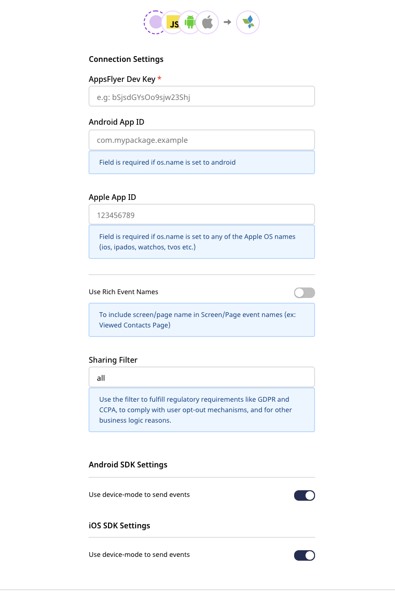
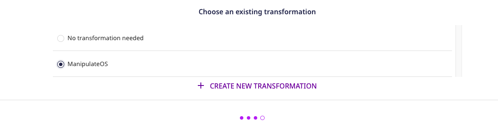
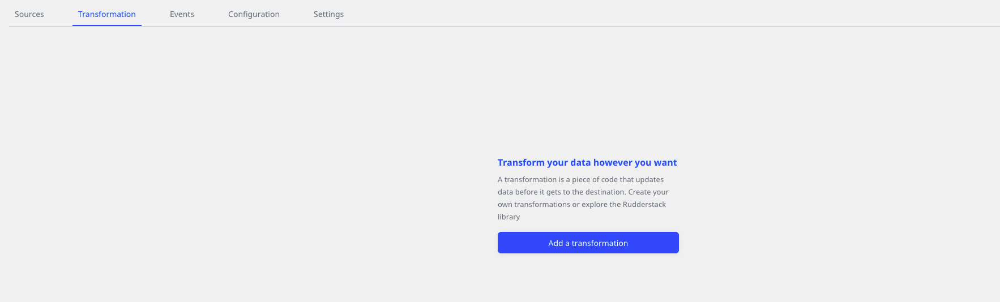

# AppsFlyer

[AppsFlyer](https://www.appsflyer.com/) is an industry-leading mobile attribution and marketing analytics platform, provided as a Software-as-a-Service \(SaaS\). It offers intuitive dashboards, real-time data reports, and a unique deep linking technology to understand your customers better. 

RudderStack supports AppsFlyer as a destination to which you can seamlessly send your customer data.

<div class="successBlock">

  Find the open-source transformer code for this destination in our <a href="https://github.com/rudderlabs/rudder-transformer/tree/master/v0/destinations/af">GitHub repository</a>.
</div>

## Getting started

Before configuring AppsFlyer as a destination in RudderStack, verify if the source platform is supported by AppsFlyer by referring to the table below:

| **Connection Mode** | **Web**       | **Mobile**    | **Server**    |
| :------------------ | :------------ | :------------ | :------------ |
| **Device mode**     | -             | **Supported** | -             |
| **Cloud mode**      | **Supported** | **Supported** | **Supported** |

<div class="infoBlock">

To know more about the difference between the cloud mode and device mode in RudderStack, refer to the <a href="https://rudderstack.com/docs/rudderstack-cloud/rudderstack-connection-modes/">RudderStack Connection Modes</a> guide.
</div>

<div class="successBlock">

It is recommended to use the the cloud mode to send events to AppsFlyer in the following scenarios:
<ul>
<li>If you want to use RudderStack's <a href="https://www.rudderstack.com/docs/transformations/">Transformations</a> feature</li> 
<li>If you want to send server-side events</li>
</ul>
</div>

Once you have confirmed that the platform supports sending events to AppsFlyer, perform the steps below:

1. From your [RudderStack dashboard](https://app.rudderstack.com/), add the source. From the list of destinations, select **AppsFlyer**.
2. Assign a name to the destination and click on **Next**. You should then see the following screen:



### Connection settings

The following connection settings are required to configure AppsFlyer as a destination in RudderStack:

- **AppsFlyer Dev Key**: Enter your AppsFlyer Dev key here.

<div class="infoBlock">

Refer to the <a href="#faqs">FAQs</a> section below for more information on obtaining the AppsFlyer dev key.
</div>

- **App ID**: Enter your Apple or Android app ID.

  - **Android App ID**: This the application ID used in your `app/build.gradle` file.

  - **Apple App ID**: This is the iTunes Application ID and it is mandatory for the iOS applications.

<div class="infoBlock">

If you are connecting a source other than <strong>Android</strong> or the <strong>Apple</strong> (iOS, watchOS, iPadOS, tvOS), you need to add a user transformation that adds the OS information required in the events.

Refer to the <a href="#connecting-appsflyer-to-non-androidios-sources">Connecting AppsFlyer to non-Android/iOS sources</a> section below for more information.
</div>


- **Sharing Filter**: By default, the value for this setting is set to `all`. You can use this setting to meet any regulatory requirements like GDPR and CCPA, complying with user opt-out mechanisms, and for any other business use-case.

<div class="infoBlock">

For more information on this field, refer to the <a href="https://support.appsflyer.com/hc/en-us/articles/207034486-Server-to-server-events-API-for-mobile-S2S-mobile-#sharing_filter-16">AppsFlyer Help Center</a> page.
</div>

- **Client-side Event Filtering**: This setting is applicable only if you are sending events to AppsFlyer via the device mode. 

<div class="infoBlock">
  
Refer to the <a href="https://www.rudderstack.com/docs/stream-sources/rudderstack-sdk-integration-guides/event-filtering/">Client-side Event Filtering</a> guide for more information on this setting.
</div>

- **Use native SDK to send events**: By default, this setting is enabled. To send events via the cloud mode or device mode, you can toggle this setting on or off.

<div class="warningBlock">
  
This setting is not applicable for the JavaScript (web) source as RudderStack does not support sending events to AppsFlyer via the web device mode. Refer to the connection modes table in the <a href="#getting-started">Getting started</a> section above for more information.
</div>

- Finally, click on **Next** to complete the configuration. AppsFlyer will be added and enabled as a destination in RudderStack.

## Adding AppsFlyer to your project

Depending on your integration platform, follow the steps to add AppsFlyer to your project:

<Tabs>
  <TabList>
    <Tab>iOS</Tab>
    <Tab>Android</Tab>
    <Tab>React Native</Tab>
    <Tab>Cordova</Tab>
  </TabList>
    <TabPanels>
      <TabPanel>
        To add AppsFlyer to your iOS project:
<ol>
<li>Add the following line to your <a href="https://cocoapods.org/">CocoaPods</a> <code class="inline-code">Podfile</code>:

<span>

```ruby
pod 'Rudder-Appsflyer'
```
</span>
</li>
<li>After adding the dependency, you need to register the <code class="inline-code">RudderAppsflyerFactory</code> with your <code class="inline-code">RudderClient</code> initialization as a <code class="inline-code">factory</code> of <code class="inline-code">RudderConfig</code>. To do this, run the following command to import the <code class="inline-code">RudderAppsflyerFactory.h</code> file in your <code class="inline-code">AppDelegate.m</code> file:

<span>

```objectivec
#import <Rudder-Appsflyer/RudderAppsflyerFactory.h>
```
</span>
</li>
<li>Starting from AppsFlyer iOS device mode version <code class="inline-code">2.0.0</code> and above, the RudderStack SDK <strong>does not</strong> automatically initialize the AppsFlyer SDK. You need to initialize the AppsFlyer SDK as shown:

<span>

```objectivec
#import <AppsFlyerLib/AppsFlyerLib.h>

[[AppsFlyerLib shared] setAppsFlyerDevKey:<devKey>];
[[AppsFlyerLib shared] setAppleAppID:<appleAppId>];
[AppsFlyerLib shared].isDebug = YES;
[[AppsFlyerLib shared] start];
```
</span>
</li>
<li>Then, change the iOS SDK initialization to the following:
<span>

```objectivec
RSConfigBuilder *builder = [[RSConfigBuilder alloc] init];
[builder withDataPlaneUrl:DATA_PLANE_URL];
[builder withTrackLifecycleEvens:YES];
[builder withRecordScreenViews:YES];
[builder withFactory:[RudderAppsflyerFactory instance]];
[builder withLoglevel:RSLogLevelDebug];
[RSClient getInstance:WRITE_KEY config:[builder build]];
```
</span>
</li>
</ol>
      </TabPanel>
      <TabPanel>
        To add AppsFlyer to your Android project:
<ol>
<li>Add the <code class="inline-code">mavenCentral()</code> repository, as shown:
<span>

```groovy
repositories {
    mavenCentral()
}
```
</span>
</li>
<li>Then, add the following lines to your <code class="inline-code">app/build.gradle</code> file under <code class="inline-code">dependencies</code>:
<span>

```groovy
implementation 'com.rudderstack.android.sdk:core:1.+'
implementation 'com.rudderstack.android.integration:appsflyer:1.+'

implementation 'com.appsflyer:af-android-sdk:6.+'
implementation 'com.android.installreferrer:installreferrer:2.+'
```
</span>
</li>
<li>Starting from AppsFlyer Android device mode version <code class="inline-code">2.0.0</code> and above, the RudderStack SDK <strong>does not</strong> automatically initialize the AppsFlyer SDK. You need to initialize the AppsFlyer SDK as shown:
<span>

```java
import com.appsflyer.AppsFlyerLib;
import com.appsflyer.AFLogger;

AppsFlyerLib.getInstance().init(DEV_KEY, null, this);
AppsFlyerLib.getInstance().setLogLevel(AFLogger.LogLevel.DEBUG);
AppsFlyerLib.getInstance().start(this);
```
</span>
</li>
<li>Finally, change the SDK initialization in your <code class="inline-code">Application</code> class, as shown:
<span>

```kotlin
val rudderClient: RudderClient = RudderClient.getInstance(
    this,
    WRITE_KEY,
    RudderConfig.Builder()
        .withDataPlaneUrl(DATA_PLANE_URL)
        .withFactory(AppsFlyerIntegrationFactory.FACTORY)
        .build()
)
```
</span>
</li>
</ol>
      </TabPanel>
      <TabPanel>
        To add AppsFlyer to your React Native project:
<ol>
<li>Add the RudderStack-AppsFlyer module to your app using the following command:
<span>

```bash
npm install @rudderstack/rudder-integration-appsflyer-react-native
// OR //
yarn add @rudderstack/rudder-integration-appsflyer-react-native
```
</span>
</li>
<strong>For AppsFlyer React Native device mode version less than 1.1.0, follow the below step:</strong>
<li>Import the module and add it to your SDK initialization code, as shown:
<span>

```typescript
import rudderClient from "@rudderstack/rudder-sdk-react-native"
import appsflyer from "@rudderstack/rudder-integration-appsflyer-react-native"
const config = {
  dataPlaneUrl: DATA_PLANE_URL,
  trackAppLifecycleEvents: true,
  withFactories: [appsflyer],
}
rudderClient.setup(WRITE_KEY, config)
```
</span>
</li>
  </ol>
        <ol start="2">
  <strong>For AppsFlyer React Native device mode version 1.1.0 or above, follow these steps:</strong>
<li>Initialize the AppsFlyer SDK as shown:
<span>

```typescript
import rc from '@rudderstack/rudder-sdk-react-native';
import appsflyer from 'rudder-integration-appsflyer-react-native'
import {
    setOptions
} from 'rudder-integration-appsflyer-react-native/src/appsflyer';

// Setting options for initializing the appsflyer sdk
setOptions({
    // dev key from the appsflyer dashboard
    "devKey": "<dev_key>",
    // whether we want to run the appsflyer SDK in the debug mode
    "isDebug": true,
    // whether we want to register for the listeners which would return the conversion data
    "onInstallConversionDataListener": true,
    // ID assigned by the Apple app store for any app which is either published or in the process of getting published
    "appleAppId": "<apple_app_id>",
    // whether we want to register for the listeners which would return the deeplink data
    "onDeepLinkListener": true
})

// Configuration object to be passed while initializing the Rudder React Native // SDK
const config = {
    dataPlaneUrl: DATA_PLANE_URL
        trackAppLifecycleEvents: true,
    // Passing appsflyer factory here, since we want to run appsflyer as a device 
    // mode destination.
    withFactories: [appsflyer]
};

// Finally, initializing the RudderStack React Native SDK
await rc.setup( WRITE_KEY , config);
```
</span>
As seen above, the properties <code class="inline-code">onInstallConversionDataListener</code> and <code class="inline-code">onDeepLinkListener</code> are set to <code class="inline-code">true</code> in the <code class="inline-code">setOptions</code> API to get access to the conversion as well as the attribution data.
</li>
<li>Then, register the callbacks with the listeners, as shown:
<span>

```typescript
import {
    onAppOpenAttribution,
    onAttributionFailure,
    onDeepLink,
    onInstallConversionData,
    onInstallConversionFailure
} from 'rudder-integration-appsflyer-react-native/src/appsflyer';

var onInstallConversionDataCanceller = onInstallConversionData((data) => {
    console.log("On Install Conversion Success data is ", data);
    if (JSON.parse(res.data.is_first_launch) == true) {
        if (res.data.af_status === 'Non-organic') {
            var media_source = res.data.media_source;
            var campaign = res.data.campaign;
            console.log('This is first launch and a Non-Organic install. Media source: ' + media_source + ' Campaign: ' + campaign);
        } else if (res.data.af_status === 'Organic') {
            console.log('This is first launch and a Organic Install');
        }
    } else {
        console.log('This is not first launch');
    }

})

var onAppOpenAttributionCanceller = onAppOpenAttribution((data) => {
    console.log("On App Open Attribution Success and the data is ", data);
    // write your own custom logic here
})

var onAttributionFailureCanceller = onAttributionFailure((data) => {
    console.log("On App Attribution Failure and the data is ", data);
    // write your own custom logic here
})

var onInstallConversionFailureCanceller = onInstallConversionFailure((data) => {
    console.log("On Install Conversion Failure data is ", data);
    // write your own custom logic here
})

var onDeepLinkCanceller = onDeepLink((data) => {
    console.log("On Deeplink data is ", data);
    // write your own custom logic here
})
```
</span>
</li>
<li>Depending on the React Native components you are using, you can trigger an appropriate method, for example:
    <ul>
    <li>If it's a class-based component, trigger the <code class="inline-code">remove()</code> method in <code class="inline-code">componentWillUnMount()</code>, as shown:
<span>

```typescript
import React, {
    Component
} from 'react';
import {
    AppState,
    Platform,
    StyleSheet,
    Text,
    View,
    Button
} from 'react-native';
import appsFlyer from 'react-native-appsflyer';

const options = {
    devKey: "********",
    isDebug: true,
    onInstallConversionData: true
};

if (Platform.OS === 'ios') {
    options.appId = "123456789";
}
this.onInstallConversionDataCanceller = appsFlyer.onInstallConversionData(
    data => {
        console.log("GCD");
        console.log(data);

    }
);

this.onAppOpenAttributionCanceller = appsFlyer.onAppOpenAttribution(
    data => {
        console.log("OAOA");
        console.log(data);
    }
);
appsFlyer.initSdk(options, (result) => {
    console.log(result);
}, (error) => {
    console.error(error);
});
type Props = {};
export default class App extends Component < Props > {

        componentWillUnmount() {
            if (onInstallConversionDataCanceller) {
                onInstallConversionDataCanceller();
                console.log('unregister onInstallConversionDataCanceller');
                onInstallConversionDataCanceller = null;
            }
            if (onAppOpenAttributionCanceller) {
                onAppOpenAttributionCanceller();
                console.log('unregister onAppOpenAttributionCanceller');
                onAppOpenAttributionCanceller = null;
            }
```
</span>
</li>
<li>If it's a functional component, trigger the <code class="inline-code">useEffect()</code> hook, as shown:
<span>

```typescript
import React, {useEffect, useState} from 'react';
import {AppState, SafeAreaView, Text, View} from 'react-native';
import appsFlyer from 'react-native-appsflyer';

var onInstallConversionDataCanceller = appsFlyer.onInstallConversionData(
    (res) => {
        if (JSON.parse(res.data.is_first_launch) == true) {
            if (res.data.af_status === 'Non-organic') {
                var media_source = res.data.media_source;
                var campaign = res.data.campaign;
                console.log('This is first launch and a Non-Organic install. Media source: ' + media_source + ' Campaign: ' + campaign);
            } else if (res.data.af_status === 'Organic') {
                console.log('This is first launch and a Organic Install');
            }
        } else {
            console.log('This is not first launch');
        }
    },
);

var onAppOpenAttributionCanceller = appsFlyer.onAppOpenAttribution((res) => {
    console.log(res);
});


appsFlyer.initSdk(
    {
        devKey: 'K2a*********99',
        isDebug: false,
        appId: '41******5',
    },
    (result) => {
        console.log(result);
    },
    (error) => {
        console.error(error);
    },
);

const Home = (props) => {

    useEffect(() => {
        return () => {
            // Optionaly remove listeners for deep link data if you no longer need them after componentWillUnmount
            if (onInstallConversionDataCanceller) {
              onInstallConversionDataCanceller();
              console.log('unregister onInstallConversionDataCanceller');
              onInstallConversionDataCanceller = null;
            }
            if (onAppOpenAttributionCanceller) {
              onAppOpenAttributionCanceller();
              console.log('unregister onAppOpenAttributionCanceller');
              onAppOpenAttributionCanceller = null;
            }
        };
    });

    return (                   
                {'App'}        
    );
};
```
</span>  
</li>
</ul>
</li>
<li>Finally, open <code class="inline-code">AppDelegate.m</code> in the <code class="inline-code">ios</code> folder of your app and include the following snippet:
<span>

```objectivec
#import "RudderIntegrationAppsflyerReactNative.h"

- (BOOL)application:(UIApplication *)application openURL:(NSURL *)url options:(NSDictionary *) options {
  [[AppsFlyerAttribution shared] handleOpenUrl:url options:options];
    return YES;
}

// Open URI-scheme for iOS 8 and below
- (BOOL)application:(UIApplication *)application openURL:(NSURL *)url sourceApplication:(NSString*)sourceApplication annotation:(id)annotation {
  [[AppsFlyerAttribution shared] handleOpenUrl:url sourceApplication:sourceApplication annotation:annotation];
  return YES;
}

// Open Universal Links
- (BOOL)application:(UIApplication *)application continueUserActivity:(NSUserActivity *)userActivity restorationHandler:(void (^)(NSArray * _Nullable))restorationHandler {
    [[AppsFlyerAttribution shared] continueUserActivity:userActivity restorationHandler:restorationHandler];
    return YES;
}
```
</span>
</li>
</ol>
      </TabPanel>
      <TabPanel>
        To add AppsFlyer to your Cordova project, follow these steps:
<ol>
<li>Navigate to the root folder of your application and run the following command:
<span>

```bash
cordova plugin add rudder-integration-appsflyer-cordova
```
</span>
</li>
<li>Add the platforms that you want to target for your app:
<span>

```bash
cordova platform add ios
cordova platform add android
```
</span>
</li>
<li>Run the following command to build the project for all the platforms:
<span>

```bash
cordova build
```
</span>
</li>
<li>Finally, add the following code in the <code class="inline-code">onDeviceReady()</code> function of your home page to initialize the SDK, as shown:
<span>

```javascript
RudderClient.initialize(WRITE_KEY , {
  dataPlaneUrl: DATA_PLANE_URL,
  factories: [RudderAppsflyerFactory]
})
```
</span>

<div class="infoBlock">

Make sure to use the <code class="inline-code">await</code> keyword with the <code class="inline-code">initialize</code> call.
</div>
</li>
</ol>
     </TabPanel>
    </TabPanels>
</Tabs>

## Connecting AppsFlyer to non-Android/iOS sources

AppsFlyer supports all the RudderStack sources in addition to Android and iOS. However, you will need to add a transformation to the destination by following these steps:

- Go to your [**RudderStack dashboard**](https://app.rudderstack.com/).

- In the left navigation bar, select **Transformations** followed by **New transformation**. 

- In the **Transformation Settings** window, assign a **Name** and **Description** for the transformation.

- Then, add the following function:

```javascript
export function transformEvent(event, metadata) {
  event.context.os = {
    name: "android",
    version: "8.1.0"
  };
  return event;
}
```

- Click on **Save** to save the transformation.

- Finally, configure your AppsFlyer destination and connect it to the transformation in the **Choose an existing transformation** window, as shown:



- If you have already configured your AppsFlyer destination, navigate to the **Transformation** option, as shown:



- Click on **Add a transformation** and select the transformation you created above.

## Sending events via the RudderStack cloud mode

<div class="warningBlock">

We recommend sending events to AppsFlyer via the <a href="https://www.rudderstack.com/docs/rudderstack-cloud/rudderstack-connection-modes/#cloud-mode">cloud mode</a> only in the following two scenarios:
<ul>
<li>To use RudderStack's <a href="https://www.rudderstack.com/docs/transformations/">Transformations</a> feature to transform your events</li> 
<li>To send server-side events</li>
</ul>
</div>

To send events to AppsFlyer, you need the AppsFlyer ID generated by the Appsflyer SDK that is integrated with your app.

<div class="warningBlock">

Refer to the <a href="#obtaining-the-appsflyer-id">Obtaining the AppsFlyer ID</a> section below for more information.
</div>

Once you obtain the AppsFlyer ID, you can send events to AppsFlyer via the cloud mode by including the `externalId` key within your events' `context`. The format of `externalId` is as shown:

```javascript
"externalId": [
  {
    "id": "AppsFlyer_ID",
    "type": "appsflyerExternalId"
  }
]
```

The following table lists the `externalId` fields:

| Field | Description|
| :----| :------------|
| `id` | Your AppsFlyer ID. |
| `type`| The type of `externalId`. This must always be set to `appsFlyerExternalId`. |

### Obtaining the AppsFlyer ID

As mentioned above, the AppsFlyer ID is generated by the Appsflyer SDK integrated with your app.

- If the AppsFlyer SDK is directly loaded on your app, refer to this [**AppsFlyer documentation**](https://support.appsflyer.com/hc/en-us/articles/207034486-Server-to-server-events-API-for-mobile-S2S-mobile-#fetching-the-appsflyer-id) to obtain the AppsFlyer ID.

- If your AppsFlyer SDK is loaded through RudderStack (device mode integration), then you can obtain the AppsFlyer ID by including the code snippet in your app, depending on your platform of integration:

<Tabs>
  <TabList>
    <Tab>iOS</Tab>
    <Tab>Android</Tab>
    <Tab>React Native</Tab>
  </TabList>
    <TabPanels>
      <TabPanel>
<span>

```objectivec
#import <AppsFlyerLib/AppsFlyerLib.h>
NSString *appsflyerId = [AppsFlyerLib shared].getAppsFlyerUID;
```
</span>
      </TabPanel>
      <TabPanel>
<span>

```java
import com.appsflyer.AppsFlyerLib;
String appsFlyerId = AppsFlyerLib.getInstance().getAppsFlyerUID(this);
```
</span>
      </TabPanel>
      <TabPanel>
<span>

```javascript
import AppsFlyerIntegrationFactory from "@rudderstack/rudder-integration-appsflyer-react-native/src/bridge"
const appsFlyerId = await AppsFlyerIntegrationFactory.getAppsFlyerId()
```
</span>
      </TabPanel>
    </TabPanels>
</Tabs>

## Identify

The `identify` call sets `userId` through the `setCustomerUserId` method of `AppsFlyerLib`.

<div class="infoBlock">

  RudderStack supports the <code class="inline-code">identify</code> calls only in the <a href="https://rudderstack.com/docs/rudderstack-cloud/rudderstack-connection-modes/#device-mode">device mode</a>.
</div>

RudderStack sets `email` from the event traits to AppsFlyer using the native SDK's `setUserEmails` method, as shown:

```objectivec
[[RSClient sharedInstance] identify:@"developer_user_id"
                                 traits:@{@"email": @"bar@foo.com"}];
```

## Track

RudderStack's `track` call is mapped to the standard AppsFlyer events wherever possible. 

The following table lists the event mapping from RudderStack to AppsFlyer:

| **RudderStack event**           | **AppsFlyer event**         |
| :-------------------------- | :---------------------- |
| `Products Searched`         | `af_search`             |
| `Product Viewed`            | `af_content_view`       |
| `Product List Viewed`       | `af_list_view`          |
| `Product Added to Wishlist` | `af_add_to_wishlist`    |
| `Product Added`             | `af_add_to_cart`        |
| `Checkout Started`          | `af_initiated_checkout` |
| `Order Completed`           | `af_purchase`           |
| `Product Removed`           | `remove_from_cart`      |

For any event not present in the above table, RudderStack makes the following changes to the event name before sending it to AppsFlyer via the native SDK:

- Converting the entire event name to lower case
- Replacing any space with an underscore

Along with the above event mapping, RudderStack also maps the event properties to the corresponding AppsFlyer event properties, as shown below:

| RudderStack property name | AppsFlyer property name                                                                                                                                                                |
| :------------------------ | :------------------------------------------------------------------------------------------------------------------------------------------------------------------------------------- |
| `query`                   | `af_search_string`                                                                                                                                                                     |
| `price`                   | `af_price`                                                                                                                                                                             |
| `product_id`              | `af_content_id`                                                                                                                                                                        |
| `category`                | `af_content_type`                                                                                                                                                                      |
| `currency`                | `af_currency`                                                                                                                                                                          |
| `products`                | RudderStack formulates this list as per the [**List View specification**](https://support.appsflyer.com/hc/en-us/articles/115005544169#event-structure) and passes it to the property `af_content_list`. |
| `quantity`                | `af_quantity`                                                                                                                                                                          |
| `order_id`                | `af_receipt_id`                                                                                                                                                                        |
| `revenue`                 | `af_revenue`                                                                                                                                                                           |

A sample `track` call for an iOS app is shown below:

```objectivec
[[RSClient sharedInstance] track:@"Accepted Terms of Service"
                          properties:@{
                                  @"foo": @"bar",
                              @"foo_int": @134
}];
```

## Screen

For all the `screen` calls sent from the SDK, RudderStack calls AppsFlyer's `trackEvent` method with `screen` as the event name. All the event properties are passed to AppsFlyer without any modification.

For the automatically recorded `screen` calls, RudderStack obtains a Boolean property called `automatic`.

## Advertising ID

RudderStack utilizes the advertising ID for the AppsFlyer destination if it is set as per the following specifications:

- For iOS: [**Advertisement ID documentation**](https://rudderstack.com/docs/stream-sources/rudderstack-sdk-integration-guides/rudderstack-ios-sdk/#advertisement-id)

- For Android: [**Advertisement ID documentation**](https://rudderstack.com/docs/stream-sources/rudderstack-sdk-integration-guides/rudderstack-android-sdk/#advertisement-id)

You can find the advertising ID in your event's `context.device.advertisementId`.

## ATTrackingManager

If the `ATTrackingManager.trackingAuthorizationStatus` is passed according to [**ATTrackingManager authorization consent**](https://rudderstack.com/docs/stream-sources/rudderstack-sdk-integration-guides/rudderstack-ios-sdk/#attrackingmanager-authorization-consent), RudderStack will utilize it for the AppsFlyer destination. 

You can find `trackingAuthorizationStatus` in your event's `context.device.attTrackingStatus`.

## Error messages

This section covers some of the possible error messages you may encounter while using this integration.

### Invalid platform / required androidAppId / appleAppId missing

This error occurs when either the `OS Name` or your respective App ID is not set. 

You can set the **App ID** in your [**settings**](https://rudderstack.com/docs/destinations/attribution/appsflyer/#getting-started). 

The SDK automatically sets the `OS Name` and it can be found in `context.os.name`.

### Appsflyer ID is not set. Rejecting the event.

This error occurs when the `appsflyerExternalId` is not set. Refer to the [**Sending events via the RudderStack cloud mode**](https://rudderstack.com/docs/destinations/attribution/appsflyer/#sending-events-via-the-rudderstack-cloud-mode) section for more information on setting the `appsflyerExternalId`.

## Debugging

RudderStack sets the `logLevel` in AppsFlyer based on the `logLevel` set for the `RudderClient`. If it is set to `DEBUG` or more, RudderStack sets the `logLevel` to `VERBOSE` for AppsFlyer. 

For anything below that, RudderStack sets the `logLevel` to `NONE` for AppsFlyer.

## FAQs

### Where do I get the AppsFlyer dev key?

You can find the **AppsFlyer Dev Key** by logging into your AppsFlyer account and navigating to the **Apps Settings** page in your dashboard. For more information, refer to this [**AppsFlyer Help Center**](https://support.appsflyer.com/hc/en-us/articles/211719806-App-settings-) page.

### I get an error saying "Build input file cannot be found" for iOS device mode. What should I do?

The latest AppsFlyer SDK requires XCode 12. Make sure you meet this requirement. You may have to downgrade your AppsFlyer SDK to build with a lower version of XCode. 

You can declare the `pod` version in your `Podfile` as shown:

```ruby
pod 'Rudder-Appsflyer',' 1.0.0'
```

### How do I get the AppsFlyer ID to send events from my mobile sources via the RudderStack cloud mode?

To send events to AppsFlyer via the cloud mode, you first need to obtain the AppsFlyer ID generated by the Appsflyer SDK.

You can get this ID by either directly loading the native AppsFlyer SDK on your app, or loading it via RudderStack (device mode integration).

In case of a device mode integration, include the following code snippet (depending on your platform of integration) in your app to get the AppsFlyer ID:

<Tabs>
  <TabList>
    <Tab>iOS</Tab>
    <Tab>Android</Tab>
    <Tab>React Native</Tab>
  </TabList>
    <TabPanels>
      <TabPanel>
<span>

```objectivec
#import <AppsFlyerLib/AppsFlyerLib.h>
NSString *appsflyerId = [AppsFlyerLib shared].getAppsFlyerUID;
```
</span>
      </TabPanel>
      <TabPanel>
<span>

```java
import com.appsflyer.AppsFlyerLib;
String appsFlyerId = AppsFlyerLib.getInstance().getAppsFlyerUID(this);
```
</span>
      </TabPanel>
      <TabPanel>
<span>

```javascript
import AppsFlyerIntegrationFactory from "@rudderstack/rudder-integration-appsflyer-react-native/src/bridge"
const appsFlyerId = await AppsFlyerIntegrationFactory.getAppsFlyerId()
```
</span>
      </TabPanel>
    </TabPanels>
</Tabs>

Once you obtain the AppsFlyer ID, you can send events via the cloud mode by by including the `externalId` key within your events' `context`. For more information, refer to the [**Sending events via the RudderStack cloud mode**](#sending-events-via-the-rudderstack-cloud-mode) section above.

## Contact us

For queries on any of the sections covered in this guide, you can [**contact us**](mailto:%20docs@rudderstack.com) or start a conversation in our [**Slack**](https://rudderstack.com/join-rudderstack-slack-community) community.
