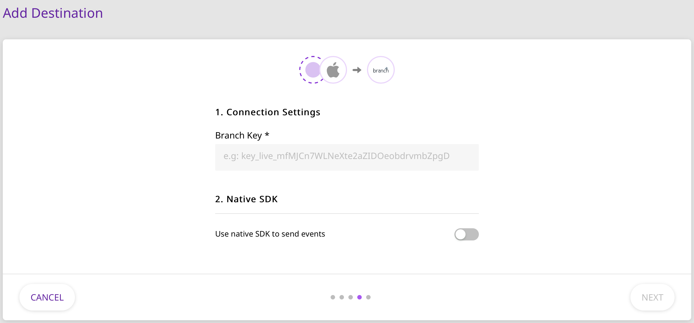

# Branch

[Branch.io](https://branch.io) is an industry leader in cross-platform attribution, mobile app measurement, and deep linking. Many top-ranking apps use Branch to increase their performance and revenue through better performance and engagement.

RudderStack supports sending events from RudderStack SDKs to Branch through our data plane via the S2S \(Server to Server\) connection mode. You can also opt for the device mode as well for Android and iOS. Branch SDK is wrapped inside Rudder SDK in case of device mode.

<div class="successBlock">

  **Find the open-source transformer code for this destination in our<a href="https://github.com/rudderlabs/rudder-transformer/tree/master/v0/destinations/branch">GitHub repo</a>.**
</div>

## Getting Started

Before getting started, please determine whether the platform you are sending your event data from is supported. Refer to the following table for more the supported source types and connection modes:

| **Connection Mode** | **Web** | **Mobile**    | **Server** |
| :------------------ | :------ | :------------ | :--------- |
| **Device mode**     | -       | **Supported** | -          |
| **Cloud mode**      | -       | **Supported** | -          |

<div class="infoBlock">

To know more about the difference between Cloud mode and Device mode in RudderStack, read the <a href="https://rudderstack.com/docs/rudderstack-cloud/rudderstack-connection-modes/">RudderStack connection modes</a> guide.

</div>

In order to start sending data to Branch, you will first need to add it as a destination to the source from which you are sending the event data.

<div class="infoBlock">

Please follow our guide on <a href="https://rudderstack.com/docs/connections/adding-source-and-destination-rudderstack/">How to Add a Source and Destination in RudderStack</a> to add a source and destination in RudderStack.

</div>

Please follow these steps once you have added a source in the RudderStack app:

- Once you have added the source, you will need to register on Branch and follow the required steps to complete the set up.
- You should then be able to access the Branch key from the settings page of your Branch [dashboard](https://dashboard.branch.io/#/settings).
- Enter your Branch key to complete the destination configuration as shown:

<span class="imageTitle">BranchIO Dashboard Settings</span>

<div class="warningBlock">

Please note that RudderStack does not support sending data to Branch on both device or cloud mode for the web.

</div>

## Adding device mode integration

Depending on the platform of integration follow the steps below to integrate with Device-mode.

<Tabs>
  <TabList>
    <Tab>iOS</Tab>
    <Tab>Android</Tab>
  </TabList>
    <TabPanels>
      <TabPanel>
<ul>
<li>Open the <code class="inline-code">Podfile</code> of your project and add the following line
<span>

```ruby
pod 'Rudder-Branch', '0.1.3'
```
</span>

followed by
<span>

```bash
$ pod install
```
</span>
</li>
<li>Finally change the SDK initialization with the following
<span>

```objectivec
RudderConfigBuilder *builder = [[RudderConfigBuilder alloc] init];
[builder withDataPlaneUrl:<DATA_PLANE_URL>];
[builder withFactory:[RudderBranchFactory instance]];
[builder withLoglevel:RudderLogLevelDebug];
[RudderClient getInstance:<WRITE_KEY> config:[builder build]];
```
</span>
</li>
</ul>
</TabPanel>
<TabPanel>
 Your Android project must be on <strong>version 5.0 (API level 21) or higher</strong> for RudderStack to be able to send events to Branch.

Once confirmed, follow these steps to add Branch to your Android project:
<ul>
<li>Open your <code class="inline-code">app/build.gradle</code> (Module: app) file, add the following
<span>

```groovy
repositories {
    mavenCentral()
}
```
</span>
</li>
<li>Add the following under <code class="inline-code">dependencies</code> section
<span>

```groovy
implementation 'com.rudderstack.android.sdk:core:1.0.1'
implementation 'com.rudderstack.android.integration:branch:0.1.3'

// branch SDK requirements
implementation 'io.branch.sdk.android:library:4.3.2'
implementation'com.android.installreferrer:installreferrer:1.1.2'
implementation 'com.google.firebase:firebase-appindexing:19.1.0'
implementation 'com.google.android.gms:play-services-ads:16+'
```
</span>
</li>
<li>Finally change the initialization of the SDK with the following
<span>

```kotlin
val rudderClient: RudderClient = RudderClient.getInstance(
    this,
    <WRITE_KEY>,
    RudderConfig.Builder()
        .withDataPlaneUrl(<DATA_PLANE_URL>)
        .withLogLevel(RudderLogger.RudderLogLevel.DEBUG)
        .withFactory(BranchIntegrationFactory.FACTORY)
        .build()
)
```
</span>
</li>
</ul>
      </TabPanel>
    </TabPanels>
</Tabs>


Now follow the instructions below to send events to Branch.

## Identify

The `identify` call associates a user to their actions and also captures the traits associated with that user. Some of captured information includes a unique user ID, as well as optional traits such as name, email, IP address, etc.

A sample identify call captured from the RudderStack iOS SDK would look like the following:

```objectivec
[[RudderClient sharedInstance] identify:@"developer_user_id"
                                 traits:@{@"foo": @"bar", @"foo1": @"bar1"}];
```

<div class="infoBlock">

Ideally, this call is made when the user registers to the app for the first time, or after the user logs into the app or updates their information.

</div>

## Track

The `track` call captures all the activities that the user performs, along with any other properties that are associated with those activities. Each of these activities or actions is considered by RudderStack as an **event**.

A sample `track` call looks like the following:

```objectivec
[[RudderClient sharedInstance] track:@"test_event"
                          properties:@{@"key":@"value", @"foo": @"bar"}]
```

For example, consider the following code snippet for a `track` event `Product Added` from your JavaScript SDK:

```javascript
rudderanalytics.track('Product Added', {
  cart_id: '1234',
  products: [
    {
       product_id: 'mobi1',
       name: "mobile name",
       brand: "brand name",
       variant: "4gb/8gb",
       price: "750$",
       quantity: "1",
       description: "Mobile phone description goes here",
    },
    {
       product_id: 'mobi2',
       name: "mobile name",
       brand: "brand name",
       variant: "16gb/32gb",
       price: "1000$",
       quantity: "1",
       description: "Mobile phone description goes here",
    }
  ]
});
```

All the trackable events in RudderStack are divided into three major Branch event categories:

- Commerce Events
- Content Events
- Lifecycle Events

The following table lists the mapping between the accepted names of the E-commerce events:

| RudderStack Event           | Branch Event        |
| :-------------------------- | :------------------ |
| `Product Added`             | `ADD_TO_CART`       |
| `Product Added to Wishlist` | `ADD_TO_WISHLIST`   |
| `Cart Viewed`               | `VIEW_CART`         |
| `Checkout Started`          | `INITIATE_PURCHASE` |
| `Payment Info Entered`      | `ADD_PAYMENT_INFO`  |
| `Order Completed`           | `ADD_PAYMENT_INFO`  |
| `Spend Credits`             | `SPEND_CREDITS`     |
| `Promotion Viewed`          | `VIEW_AD`           |
| `Promotion Clicked`         | `CLICK_AD`          |
| `Checkout Started`          | `PURCHASE`          |
| `Order Completed`           | `PURCHASE`          |
| `Reserve`                   | `RESERVE`           |

<div class="infoBlock">

RudderStack also maps the `Spend Credits` event to Branch's `SPEND_CREDITS`, although it is not directly a part of the E-commerce Events.

</div>

The following table lists the mapping between the accepted names of the Content events:

| RudderStack Event     | Branch Event      |
| :-------------------- | :---------------- |
| `Products Searched`   | `SEARCH`          |
| `Product Viewed`      | `VIEW_ITEM`       |
| `Product List Viewed` | `VIEW_ITEMS`      |
| `Product Reviewed`    | `RATE`            |
| `Product Shared`      | `SHARE`           |
| `Initiate Stream`     | `INITIATE_STREAM` |
| `Complete Stream`     | `COMPLETE_STREAM` |

<div class="infoBlock">

The above mentioned events are a part of the RudderStack Commerce events, but are mapped to Branch's Content Events.

</div>

RudderStack also supports mapping the following events even though they are not explicitly a part of the RudderStack Lifecycle Events:

| RudderStack Event       | Branch Event            |
| :---------------------- | :---------------------- |
| `Complete Registration` | `COMPLETE_REGISTRATION` |
| `Complete Tutorial`     | `COMPLETE_TUTORIAL`     |
| `Achieve Level`         | `ACHIEVE_LEVEL`         |
| `Unlock Achievement`    | `UNLOCK_ACHIEVEMENT`    |
| `Invite`                | `INVITE`                |
| `Login`                 | `LOGIN`                 |
| `Start Trial`           | `START_TRIAL`           |
| `Subscribe`             | `SUBSCRIBE`             |

The following table lists the mapping of the accepted property keys common to all events:

| RudderStack Property Key | Branch Property Key     |
| :----------------------- | :---------------------- |
| `title`                  | `$og_title`             |
| `description`            | `$og_description`       |
| `image_url`              | `$og_image_url`         |
| `canonical_identifier`   | `$canonical_identifier` |
| `publicly_indexable`     | `$publicly_indexable`   |
| `price`                  | `$price`                |
| `locally_indexable`      | `$locally_indexable`    |
| `quantity`               | `$quantity`             |
| `sku`                    | `$sku`                  |
| `name`                   | `$product_name`         |
| `brand`                  | `$product_brand`        |
| `category`               | `$product_category`     |
| `variant`                | `$product_variant`      |
| `rating_average`         | `$rating_average`       |
| `rating_count`           | `$rating_count`         |
| `rating_max`             | `$rating_max`           |
| `creating_timestamp`     | `$creation_timestamp`   |
| `exp_date`               | `$exp_date`             |
| `keywords`               | `$keywords`             |
| `address_street`         | `$address_street`       |
| `address_city`           | `$address_city`         |
| `address_region`         | `$address_region`       |
| `address_country`        | `$address_country`      |
| `address_postal_code`    | `$address_postal_code`  |
| `latitude`               | `$latitude`             |
| `longitude`              | `$longitude`            |
| `image_captions`         | `$image_captions`       |
| `condition`              | `$condition`            |

## FAQs

### Where can I get the Branch Key from?

You can retrieve the Branch key from the settings page of the [Branch dashboard](https://dashboard.branch.io/#/settings). For more information, please check the [Getting Started](https://rudderstack.com/docs/destinations/attribution/branchio#getting-started) section above.

## Contact Us

For queries on any of the sections covered in this guide, you can [**contact us**](mailto:%20docs@rudderstack.com) or start a conversation in our [**Slack**](https://rudderstack.com/join-rudderstack-slack-community) community.
