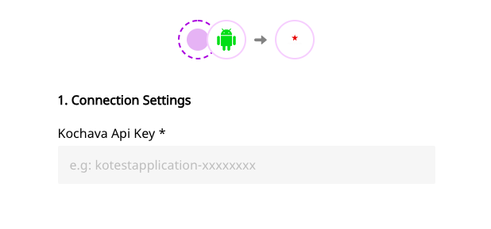

# Kochava

[Kochava](https://www.kochava.com/) is a leading mobile measurement and app analytics platform that offers unique dynamic deep linking, audience segmenting and data accessibility features for your business.

RudderStack allows you to send relevant events to Kochava through a S2S \(Server-to-Server\) integration with the platform.


**Find the open-source transformer code for this destination in our** [**GitHub repo**](https://github.com/rudderlabs/rudder-transformer/tree/master/v0/destinations/kochava)**.**


## Getting Started

Before configuring your source and destination on the RudderStack app, please check whether the platform you are working on is supported by Kochava. Refer the table below:

| **Connection Mode** | **Web** | **Mobile** | **Server** |
| :--- | :--- | :--- | :--- |
| **Device mode** | - | - | - |
| **Cloud mode** | - | **Supported** | - |


To know more about the difference between Cloud mode and Device mode in RudderStack, read the [RudderStack connection modes](https://docs.rudderstack.com/get-started/rudderstack-connection-modes) guide.


Once you have confirmed that the platform supports sending events to Kochava, perform the steps below:

* From your [RudderStack dashboard](https://app.rudderlabs.com/), add the source from which you want to send the event data.


Please follow our guide on [How to Add a Source and Destination in RudderStack](https://docs.rudderstack.com/how-to-guides/adding-source-and-destination-rudderstack) to add a source and destination in RudderStack.


* Once you have added the source, select Kochava from the list of destinations.
* In the **Connection Settings** page, please enter the relevant information in the fields shown in the following screen:



## Track

The `track` event captures information related to the actions performed by the user. For more information, refer to the the [RudderStack API Specification](https://docs.rudderstack.com/rudderstack-api-spec) documentation.

RudderStack transforms the following events to Kochava's Standard Events, as shown in the table below:

| RudderStack Event Name | Kochava Standard Event |
| :--- | :--- |
| `Product Added` | `Add to Cart` |
| `Add To Wishlist` | `Add to Wishlist` |
| `Checkout Started` | `Checkout Start` |
| `Order Completed` | `Purchase` |
| `Product Reviewed` | `Rating` |
| `Products Searched` | `Search` |


Rest of the events are sent to Kochava as custom events.



You can send an event with the name same as that of an Kochava's standard event to get perceived as `Standard Event` in Kochava.


A sample `track` event for sending event data to Kochava looks like the following code snippet:

```text
[[RudderClient sharedInstance] track:@"Product Added" properties:@{
@"price": @2.0, 
@"product_id": @"product_id_a", 
@"product_name": @"Product Name A"
}];
```

According to the table above, this will change the `Product Added` event to `Add to Cart` event in Kochava dashboard and pass the properties along with this.

## FAQs

### Where do I get the Kochava API Key?

In order to obtain the Kochava API key, please follow these steps:

1. [Log in to Kochava](https://go.kochava.com/session) and select the desired account and app for the specific campaign.
2. Under **Apps & Assets**, select **All Apps**
3. Click on the desired app for which you want the procure the API key
4. You will be able to see the API key under the title of the app, within the details.

For more information, please check the [Kochava support guide](https://support.kochava.com/reference-information/locating-an-app-guid/).

## Contact Us

If you come across any issues while configuring Kochava with RudderStack, please feel free to [contact us](mailto:%20docs@rudderstack.com). You can also start a conversation on our [Slack](https://resources.rudderstack.com/join-rudderstack-slack) channel; we will be happy to talk to you!

