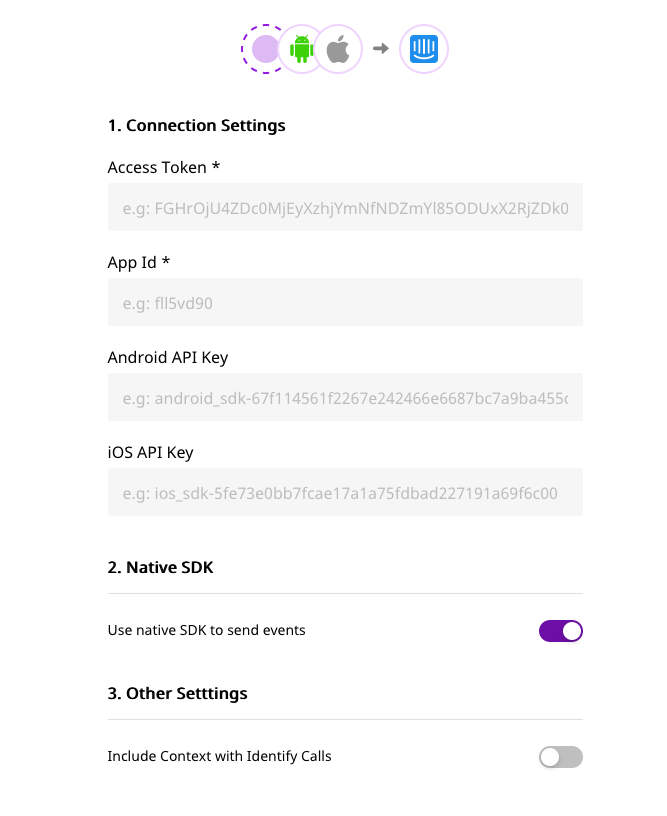

# Intercom

[Intercom](https://www.intercom.com) is an industry-leading, real-time business messaging platform, that allows you to bring together and manage all your customer life cycle activities on a single platform.

RudderStack allows you to send your event data from a variety of sources to Intercom through S2S and native SDKs by calling the relevant APIs.


**Please note that this documentation is written for Intercom v1.4.**



**Find the open-source transformer code for this destination in our **[**GitHub repo**](https://github.com/rudderlabs/rudder-transformer/tree/master/v0/destinations/intercom)**.**


## Getting Started

To enable sending events to Intercom, you will first need to add it as a destination to the source from which you are sending event data. Please check if the source platform is supported by Intercom by referring to the table below:

| **Connection Mode** | **Web**       | **Mobile**    | **Server** |
| ------------------- | ------------- | ------------- | ---------- |
| **Device mode**     | **Supported** | **Supported** | -          |
| **Cloud mode**      | **Supported** | -             | -          |


To know more about the difference between Cloud mode and Device mode in RudderStack, read the [RudderStack connection modes](https://docs.rudderstack.com/get-started/rudderstack-connection-modes) guide.


Once you have ascertained that the source platform is supported by Intercom, please follow these steps:

* From your [RudderStack dashboard](https://app.rudderlabs.com), add the source and select **Intercom** from the list of supported destinations.


Please follow our guide on [How to Add a Source and Destination in RudderStack](https://docs.rudderstack.com/how-to-guides/adding-source-and-destination-rudderstack) to add a source and destination in RudderStack.


* Give a name to the destination, and click on **Next**. You should then see the following screen:



Enter the relevant keys in the fields above by obtaining them from the following locations:

* **API Key**: This is required for all the S2S (Server to Server) events. This can be obtained by going to Intercom **Settings** - **Developers** - **Developer Hub** - \<Your App> - **Configure** - **Authentication**.
* **App ID**: This is required for sending events via `rudderanalytics.js` and mobile SDKs. You can get it from Intercom **Settings** - **Installation** - \<the desired platform> Alternatively, you can follow the instructions listed [here](https://www.intercom.com/help/en/articles/3539-where-can-i-find-my-workspace-id-app-id).
* **Android API Key & iOS API Key**: This is required for sending events from your mobile apps to Intercom. You can get it from Intercom **Settings** - **Installation** - \<the desired platform>

## **Adding Intercom to your project**

Depending on your platform of integration, follow the steps below to add Intercom to your project.



If this is the first time you are integrating our RudderStack Android SDK to your project, please refer to our [RudderStack Android SDK](https://docs.rudderstack.com/rudderstack-sdk-integration-guides/rudderstack-android-sdk) for more information.

To add the RudderStack Android SDK to your project, please follow these steps:

* In your app-level `build.gradle` file, add the following `repository`: 

```groovy
repositories {
    mavenCentral()
}
```

* After that add the following under `dependencies`

```groovy
// Rudder core sdk and intercom extension
implementation 'com.rudderstack.android.sdk:core:1.0.2'
implementation 'com.rudderstack.android.integration:intercom:0.1.1'

// intercom core sdk
implementation 'io.intercom.android:intercom-sdk-base:6.+'

// gson
implementation 'com.google.code.gson:gson:2.8.6'

// FCM
implementation 'com.google.firebase:firebase-messaging:20.2.0'
```

* Change the initialization of your RudderStack client with the following:

```kotlin
val rudderClient:RudderClient = RudderClient.getInstance(
    this,
    WRITE_KEY,
    RudderConfig.Builder()
        .withDataPlaneUrl(DATA_PLANE_URL)
        .withLogLevel(RudderLogger.RudderLogLevel.DEBUG) // optional
        .withFactory(IntercomIntegrationFactory.FACTORY)
        .build()
)
```



If this is the first time you are integrating our RudderStack iOS SDK to your project, please refer to our [RudderStack iOS SDK](https://docs.rudderstack.com/rudderstack-sdk-integration-guides/rudderstack-ios-sdk) for more information.

To add the RudderStack iOS SDK to your project, please follow these steps:

* Add the required pod followed by `  pod install  ` 

```ruby
pod 'Rudder-Intercom'
```

* Initialize the client: 

```objectivec
RSConfigBuilder *builder = [[RSConfigBuilder alloc] init];
[builder withDataPlaneUrl:DATA_PLANE_URL];
[builder withFactory:[RudderIntercomFactory instance]];
[builder withLoglevel:RSLogLevelDebug]; // optional
[RSClient getInstance:WRITE_KEY config:[builder build]];
```

* Add a **Privacy - Photo Library Usage Description** entry to your `Info.plist`.** **This is [required by Apple](https://developer.apple.com/library/content/qa/qa1937/\_index.html) for applications that can access the photo library.


Users will be prompted for the permission to access the photo library only when they tap the button to upload their image/s.




## Identify

The `identify` call captures the details about a visiting user. For more information, please refer to our [RudderStack API Specification](https://docs.rudderstack.com/rudderstack-api-spec) guide.

A sample`identify` call in RudderStack looks like the following code snippet:

```javascript
rudderanalytics.identify('tp4r23', {
  name: 'John Doe',
  email: 'john@doe.com',
  company: {
    id: 'company123',
    name: 'John Doe Inc.'
  },
  createdAt: 'Mon May 19 2019 18:34:24 GMT+0000 (UTC)'
});
```

The `identify` call can be used to :

* **Create / Update a user** : When you make an`identify` call, RudderStack creates or updates a user in Intercom using their [Users API](https://developers.intercom.com/reference#users). 
* **Remove users from a company** : To remove users from a company, you must pass `  remove: true  ` inside the company object.
* **Unsubscribe users** : To unsubscribe users from emails, `unsubscribedFromEmails: true` must be passed inside `context` object.


The **Last Seen** feature of the `identify` call has not been implemented yet. Please stay tuned!


The following RudderStack properties are matched to Intercom's properties -

| RudderStack Property | Intercom iOS Property | Intercom Android Property |
| -------------------- | --------------------- | ------------------------- |
| `traits.userId`      | `user_id`             | `user_id`                 |
| `traits.email`       | `email`               | `email`                   |
| `traits.name`        | `name`                | name                      |
| `traits.phone`       | `phone`               | `phone`                   |
| `traits.company`     | `company`             | `company`                 |
| `traits.createdAt`   | `signedUpAt`          | `signed_up_at`            |

### Collect Context

On enabling the **Collect Context** option in the RudderStack dashboard for Intercom, events are collected through the mobile libraries (if available).\
\
The collected events are : - `  device.type  `,  ` device.model`,  ` device.manufacturer`,  `  os.name,  `  `os.version` ,  ` app.name`, and `  app.version  `

## Track

The `track` call captures information related to the actions performed by the user, along with all the other properties associated with that action or event. For more information, please refer to our [RudderStack API Specification](https://docs.rudderstack.com/rudderstack-api-spec) guide.

The following code snippet is an example of a `track` call in RudderStack:

```javascript
rudderanalytics.track('Product bought', {
    order_ID: '140021222',
    category: 'shoes',
    product_name: 'sports_shoes',
    price: 199.95,
    currency: 'USD'
});
```


All the traits provided in the `track` call will be converted as per [Intercom's API](https://developers.intercom.com/intercom-api-reference/reference#event-metadata-types).


## Page

The `page` call contains information such as the URL or the web page visited by the user. For more information, please refer to our [RudderStack API Specification](https://docs.rudderstack.com/rudderstack-api-spec) guide.\
\
The `page` call works only through our `rudderanalytics.js` and is not supported by other sources. It works by triggering Intercom's `update` method, which looks for a list of new conversations that are open and should be displayed to the current user.

A sample `page` call in RudderStack looks like the following code snippet:

```javascript
rudderanalytics.page();
```

## Reset

The reset method resets the previously identified user and the related information. For more information, please refer to our [RudderStack API Specification](https://docs.rudderstack.com/rudderstack-api-spec) guide.



For Android, simply run the following command:

```kotlin
rudderClient.reset();
```



Run the following command to implement the `reset`method in your iOS project:

```objectivec
[[RSClient sharedInstance] reset];
```



## Implementing push notifications and deep linking

None of our SDKs support push notifications at this point of time. Refer to the [Intercom documentation](https://developers.intercom.com/installing-intercom/docs) for more information on how to set these features up for your project.

## FAQs

### How do I get the Intercom API key?

You can obtain the Intercom API key by logging into Intercom and navigating to **Settings** - **Developers** - **Developer Hub** - \<Your App> - **Configure** - **Authentication**. Please check the Getting Started section above for details.

## Contact Us

If you come across any issues while configuring Intercom with RudderStack, please feel free to [contact us](mailto:%20docs@rudderstack.com). You can also start a conversation on our [Slack](https://resources.rudderstack.com/join-rudderstack-slack) channel; we will be happy to talk to you!
