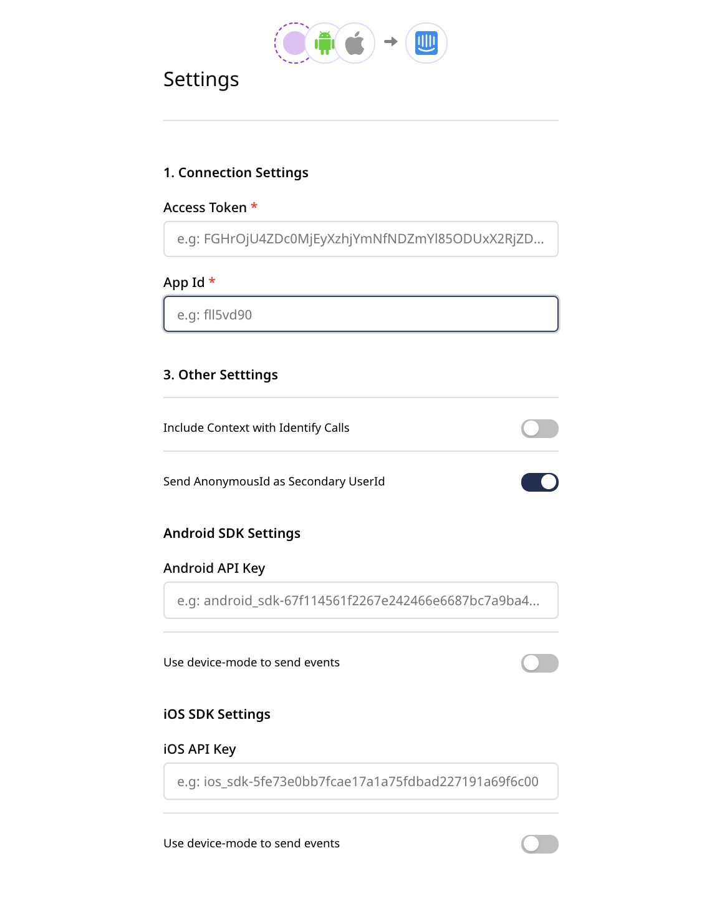

# Intercom

[**Intercom**](https://www.intercom.com/) is an industry-leading, real-time business messaging platform that lets you bring together and manage all your customer life cycle activities in a single platform.

RudderStack supports Intercom as a destination to which you can send your event data from a variety of sources.

<div class="warningBlock">

<strong>This documentation is written for Intercom API v1.4</strong>.
</div>

<div class="successBlock">

<strong>Find the open-source transformer code for this destination in our <a href="https://github.com/rudderlabs/rudder-transformer/tree/master/v0/destinations/intercom">GitHub repo</a>.</strong>
</div>

## Getting started

Before configuring Intercom as a destination in RudderStack, verify if the source platform is supported by Intercom by referring to the table below:

| **Connection Mode** | **Web**       | **Mobile**    | **Server**             |
| :------------------ | :------------ | :------------ | :--------------------- |
| **Device mode**     | **Supported** | **Supported** | -                      |
| **Cloud mode**      | **Supported** | -             | **Supported**          |

<div class="infoBlock">

To know more about the difference between cloud mode and device mode in RudderStack, refer to the <a href="https://rudderstack.com/docs/connections/rudderstack-connection-modes/">RudderStack connection modes</a> guide.
</div>

Once you have confirmed that your source platform supports sending events to Intercom, follow these steps:

* From your [**RudderStack dashboard**](https://app.rudderstack.com/), add the source. From the list of destinations, select **Intercom**.

<div class="infoBlock">
 
 Follow our guide on <a href="https://rudderstack.com/docs/connections/adding-source-and-destination-rudderstack/">Adding a Source and Destination in RudderStack</a> for more information.
</div>

* Assign a name to the destination and click on **Next**. You should then see the following screen:



### Connection settings

The connection settings required to configure Intercom as a destination in RudderStack are listed below:

- **API Key**: Enter your Intercom API key. You can obtain the key by going to your Intercom dashboard and navigating to **Settings** - **Developers** - **Developer Hub**. Then, go to your app and navigate to **Configure** - **Authentication**.

<div class="infoBlock">
 
For more information on obtaining the Intercom API key, refer to their <a href="https://help-desk-migration.com/help/get-intercom-api-access-token/">documentation</a>.
</div>

- **App ID**: This is required for the sending events via the web and mobile SDKs. You can get it from Intercom **Settings** - **Installation** and choosing your desired platform.

<div class="infoBlock">
 
For more information on obtaining the your Intercom app ID,  refer to their <a href="https://www.intercom.com/help/en/articles/3539-where-can-i-find-my-workspace-id-app-id">documentation</a>.
</div>

- **Android API Key** / **iOS API Key**: This is required for sending events from your mobile apps to Intercom. You can get it from Intercom **Settings** - **Installation** and selecting your desired platform.

- **Send AnonymousId as Secondary UserId**: Enable this option to send `anonymousId` as the user ID to Intercom when the `userId` is absent from the event payload.

<div class="successBlock">
 
This option is helpful for tracking anonymous users on your site.
</div>

## Adding device mode integration

Depending on your platform of integration, follow the steps below to add Intercom to your project:

<Tabs>
  <TabList>
    <Tab>Android</Tab>
    <Tab>iOS</Tab>
  </TabList>
    <TabPanels>
      <TabPanel>
        If this is the first time you are integrating our RudderStack Android SDK to your project, refer to our <a href="https://rudderstack.com/docs/stream-sources/rudderstack-sdk-integration-guides/rudderstack-android-sdk/">Android SDK documentation</a> for more information.<br/><br/>
       
Your Android project must be on <strong>version 5.0 (API level 21) or higher</strong> for RudderStack to be able to send events to Intercom.<br/>
Once confirmed, follow these steps to add Intercom to your Android project:

<ul>
<li>In your app-level <code class="inline-code">build.gradle</code> file, add the following <code class="inline-code">repository</code>:
<span>

```groovy
repositories {
    mavenCentral()
}
```
</span>
</li>
<li>Then, add the following under <code class="inline-code">dependencies</code>:
<span>

```groovy
// Rudder core sdk and intercom extension
implementation 'com.rudderstack.android.sdk:core:1.0.2'
implementation 'com.rudderstack.android.integration:intercom:0.1.1'

// intercom core sdk
implementation 'io.intercom.android:intercom-sdk-base:6.+'

// gson
implementation 'com.google.code.gson:gson:2.8.6'

// FCM
implementation 'com.google.firebase:firebase-messaging:20.2.0'
```
</span>
</li>
<li>Change the initialization of your RudderStack client with the following:
<span>

```kotlin
val rudderClient:RudderClient = RudderClient.getInstance(
    this,
    WRITE_KEY,
    RudderConfig.Builder()
        .withDataPlaneUrl(DATA_PLANE_URL)
        .withLogLevel(RudderLogger.RudderLogLevel.DEBUG) // optional
        .withFactory(IntercomIntegrationFactory.FACTORY)
        .build()
)
```
</span>
</li>
</ul>
      </TabPanel>
      <TabPanel>
        If this is the first time you are integrating our RudderStack iOS SDK to your project, refer to our <a href="https://rudderstack.com/docs/stream-sources/rudderstack-sdk-integration-guides/rudderstack-ios-sdk">iOS SDK documentation</a> for more information.

To add the RudderStack iOS SDK to your project, follow these steps:
<ul>
<li>Add the required pod followed by <code class="inline-code">pod install</code>:
<span>

```ruby
pod 'Rudder-Intercom'
```
</span>
</li>
<li>Initialize the client as follows:
<span>

```objectivec
RSConfigBuilder *builder = [[RSConfigBuilder alloc] init];
[builder withDataPlaneUrl:DATA_PLANE_URL];
[builder withFactory:[RudderIntercomFactory instance]];
[builder withLoglevel:RSLogLevelDebug]; // optional
[RSClient getInstance:WRITE_KEY config:[builder build]];
```
</span>
</li>
<li>Add a <strong>Privacy - Photo Library Usage Description</strong> entry to your <code class="inline-code">Info.plist</code>. This is <a href="https://developer.apple.com/library/content/qa/qa1937/_index.html">required by Apple</a> for applications that can access the photo library.

<div class="infoBlock">

  Users will be prompted for the permission to access the photo library only
  when they tap the button to upload their images.
</div>
</li>
</ul>
      </TabPanel>
    </TabPanels>
</Tabs>


## Identify

The `identify` call captures the details about a visiting user.

A sample`identify` call looks like the following code snippet:

```javascript
rudderanalytics.identify("tp4r23", {
  name: "John Doe",
  email: "john@doe.com",
  company: {
    id: "company123",
    name: "John Doe Inc.",
  },
  createdAt: "Mon May 19 2019 18:34:24 GMT+0000 (UTC)",
})
```

The `identify` call can be used to :

- Create/update a user: When you make an`identify` call, RudderStack creates or updates the user in Intercom using their [**Users API**](https://developers.intercom.com/reference#users).

- Remove users from a company: To remove users from a company, you must pass `remove: true` inside the company object.

- Unsubscribe users: To unsubscribe users from emails, `unsubscribedFromEmails: true` must be passed inside the `context` object.

<div class="infoBlock">

The <strong>Last Seen</strong> feature of the <code class="inline-code">identify</code> call has not been implemented yet. We will be implementing it soon - stay tuned!
</div>

The following RudderStack properties are matched to Intercom's properties -

| RudderStack Property | Intercom iOS Property | Intercom Android Property |
| :------------------- | :-------------------- | :------------------------ |
| `traits.userId`      | `user_id`             | `user_id`                 |
| `traits.email`       | `email`               | `email`                   |
| `traits.name`        | `name`                | `name`                |
| `traits.phone`       | `phone`               | `phone`                   |
| `traits.company`     | `company`             | `company`                 |
| `traits.createdAt`   | `signedUpAt`          | `signed_up_at`            |

### Collect Context option

On enabling the **Collect Context** option in the RudderStack dashboard, the events are collected through the mobile libraries \(if available\).

The collected events are as follows: 

- `device.type`
- `device.model`
- `device.manufacturer`
- `os.name`
- `os.version`
- `app.name`, and 
- `app.version`

## Track

The `track` call lets you record the customer events, i.e. the actions that they perform, along with any properties associated with them.

A sample `track` call is shown below:

```javascript
rudderanalytics.track("Product bought", {
  order_ID: "140021222",
  category: "shoes",
  product_name: "sports_shoes",
  price: 199.95,
  currency: "USD",
})
```

<div class="infoBlock">

All the traits provided in the <code class="inline-code">track</code> call will be converted as per <a href="https://developers.intercom.com/intercom-api-reference/reference#event-metadata-types">Intercom's API</a>.
</div>

## Page

The `page` call lets you record your website's page views with any additional relevant information about the viewed page. Many destinations require the `page` events to be called at least once every page load.


<div class="warningBlock">

The <code class="inline-code">page</code> call works only through the RudderStack web SDK <code class="inline-code">rudderanalytics.js</code> and is <strong>not supported</strong> by other sources. It works by triggering Intercom's <code class="inline-code">update</code> method, which looks for a list of new open conversations to be displayed to the current user.
</div>

A sample `page` call looks like the following code snippet:

```javascript
rudderanalytics.page()
```

## Reset

The reset method resets the previously identified user and the related information.

For Android, run the following command:

```kotlin
rudderClient.reset();
```
For iOS, run the following command to implement the <code class="inline-code">reset</code> method in your iOS project:

```objectivec
[[RSClient sharedInstance] reset];
```

## Implementing push notifications and deep linking

None of the RudderStack SDKs support push notifications at this point. Refer to the [**Intercom documentation**](https://developers.intercom.com/installing-intercom/docs) for more information on setting these features up for your project.

## FAQs

#### How do I get the Intercom API key?

You can obtain the Intercom API key by logging into Intercom and navigating to **Settings** - **Developers** - **Developer Hub**. Then, select your app and go to **Configure** - **Authentication**. 

<div class="infoBlock">
 
For more information on obtaining the Intercom API key, refer to their <a href="https://help-desk-migration.com/help/get-intercom-api-access-token/">documentation</a>.
</div>

#### What happens if both userId or email are missing in the identify/track calls?

For both `identify` and `track` calls, either `userId` or `email` is a mandatory field. In case both these fields are missing, RudderStack will drop the event.

We highly recommend enabling the <a href="https://rudderstack.com/docs/destinations/marketing/intercom/#connection-settings">Send AnonymousId as Secondary UserId</a> setting in your RudderStack dashboard in such scenarios, to avoid any event loss.

## Contact us

For queries on any of the sections covered in this guide, you can [**contact us**](mailto:%20docs@rudderstack.com) or start a conversation in our [**Slack**](https://rudderstack.com/join-rudderstack-slack-community) community.
