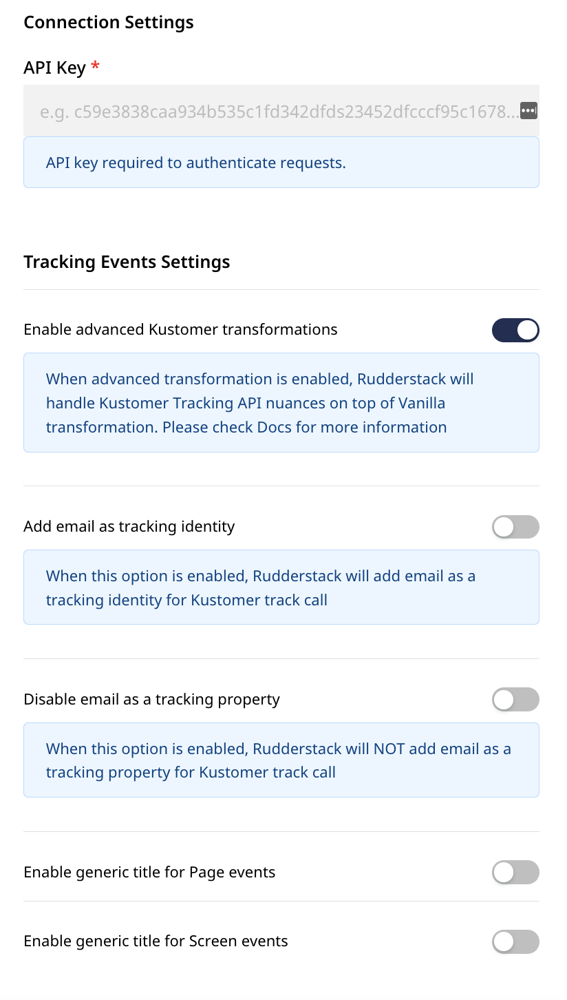

# Kustomer

[**Kustomer**](https://www.kustomer.com/) is a modern customer engagement platform designed for enterprises. It gives you a holistic view of your users and customer base, lets you provide best-in-class support, and engage with your customers through meaningful interactions.

You can now send your event data directly to Kustomer via RudderStack.


**Find the open-source transformer code for this destination in our** [**GitHub repo**](https://github.com/rudderlabs/rudder-transformer/tree/master/v0/destinations/kustomer)**.**


## Getting Started

Before configuring your source and destination on the RudderStack, verify if the platform you are sending the events from is supported by Kustomer by referring to the following table:

| **Connection Mode** | **Web** | **Mobile** | **Server** |
| :--- | :--- | :--- | :--- |
| **Device mode** | - | - | - |
| **Cloud mode** | **Supported** | **Supported** | **Supported** |


To know more about the difference between Cloud mode and Device mode in RudderStack, read the [**RudderStack connection modes**](https://docs.rudderstack.com/get-started/rudderstack-connection-modes) guide.


Once you have confirmed that the platform supports sending events to Kustomer, perform the steps below:

* From your [**RudderStack dashboard**](https://app.rudderstack.com/), add the source and Kustomer as a destination.


Follow our guide on [**How to Add a Source and Destination in RudderStack**](https://docs.rudderstack.com/how-to-guides/adding-source-and-destination-rudderstack) to add a source and destination in RudderStack.




## Configuration Settings

To successfully configure Kustomer as a destination, you will need to configure the following settings:

* **API Key:** Your API Key is an unique key generated for your Kustomer account. You can find it under **Settings** by navigating to **Security** - **API Keys**.
* **Enable advanced Kustomer transformations:** RudderStack handles the payload nuances for Kustomer if this option is enabled. Check the **Advanced Kustomer Transformations** section below for more information on this setting.
* **Add email as Tracking identity:** If this setting is enabled, Rudderstack adds the email as an identifier when making `track`/`page`/`screen` calls to Kustomer.
* **Disable email as a Tracking property:** If this option is enabled, Rudderstack will not add the email as a tracking property for the `track`/`page`/`screen` calls made to Kustomer.
* **Enable generic title for Page events:** Enable this option to track all the `page` events with a generic name `Web-Page-Viewed`.
* **Enable generic title for Screen events:** Enable this option to track all the `screen` events with a generic name `Screen-Viewed`.


The relevant `roles` \(`org.permission.customer.create`, `org.permission.customer.read`, `org.permission.customer.update`, `org.tracking`\) are required for an **API Key** to successfully access the Kustomer endpoints. Check the [**Kustomer docs**](https://support.kustomer.com/api-keys-SJs5YTIWX) for more information on how to do this.



All server-side destination requests require either a `anonymousId` or a `userId` in the payload.


## Kustomer Payload Restrictions

For `page`, `screen`, and `track` events being sent to Kustomer, there are restrictions on some of the components of the event payload.

### Event Name

The `event name` sent in the `page`, `screen`, and `track` events cannot include any spaces.

| **Event Name Example** | **Result** |
| :--- | :--- |
| `Cart Viewed` | Error |
| `Cart-Viewed` | Successful |
| `Cart_Viewed` | Successful |

### Meta Object

For `page`, `screen`, and `track` events, all of the data in the `properties` parameter will be sent to the Kustomer API through the `meta` object. However, there are certain restrictions in place on the key-value pairs within the `meta` object.

#### String Values

For the key-value pairs where the value is of the `string` type, the key must not end with the characters `Num` or `At`.

| String Key Name Example | Result |
| :--- | :--- |
| `{ product_nameNum: 'UNO' }` | Error |
| `{ product_nameAt: 'UNO' }` | Not Semantically Correct |
| `{ product_name: 'UNO' }` | Successful |

#### Date-time String Values

For key-value pairs where the value has a type of `date-time string`, the key must end with the characters `At`.

| Date-time String Key Name Example | Result |
| :--- | :--- |
| `{ purchased: '2020-02-02T00:23:09.544Z' }` | Not Semantically Correct |
| `{ purchasedAt: '2020-02-02T00:23:09.544Z' }` | Successful |

#### Number Values

For key-value pairs where the value has a type of `number`, the key must end with the characters `Num`.

| Number Key Name Example | Result |
| :--- | :--- |
| `{ revenue: 300 }` | Error |
| `{ revenueNum: 30 }` | Successful |

#### Object or Array Values

The values for all keys in the `meta` object must be **flat**, meaning they cannot be nested objects or arrays.


If you are using an advanced transformation, RudderStack will handle the nested objects, arrays, and Boolean and parse them to strings for compatibility with Kustomer.


| Value Example | Result |
| :--- | :--- |
| `{ items: { price: 32, name: 'dinner plate' } }` | Error |
| `{ items: [ 'dinner plate', 'fork', 'spoon' ] }` | Error |


For `track`, `page` and `screen` events, Kustomer supports only `number, string,`and `string` with `date-time (ISO)` format for custom event properties. Please refer to the [**official Kustomer Documentation**](https://apidocs.kustomer.com/#fe1b29a6-7f3c-40a7-8f54-973ecd0335e8) for more information on this.


## Advanced Kustomer Transformations

When the **Advanced Kustomer Transformation** option is enabled, RudderStack will update the payload as per Kustomer's requirements.

The following behaviour is expected:

| Event Name | With Advanced Transformation Enabled | Transformed? |
| :--- | :--- | :--- |
| `Order Completed` | `Order-Completed` | Yes |
| `OrderCompleted` | `OrderCompleted` | No |
| `Order-Completed` | `Order-Completed` | No |


The event names with whitespaces will be replaced with `-`.


| Event Property | Value | With Advanced Transformation Enabled | Transformed? |
| :--- | :--- | :--- | :--- |
| `income` | `500` | `incomeNum` | Yes |
| `income Num` | `500` | `income-Num` | Yes |
| `income-Num` | `500` | `income-Num` | No |
| `income_Num` | `500` | `income_Num` | No |


The event properties with numeric values will be appended with `Num` if not already present, while the whitespaces will be replaced with `-`.


| Event Property | Value | With Advanced Transformation Enabled | Transformed? |
| :--- | :--- | :--- | :--- |
| `created` | `'2020-02-02T00:23:09.544Z'` | `createdAt` | Yes |
| `created At` | `'2020-02-02T00:23:09.544Z'` | `created-At` | Yes |
| `created-At` | `'2020-02-02T00:23:09.544Z'` | `created-At` | No |
| `created_At` | `'2020-02-02T00:23:09.544Z'` | `created_At` | No |


The event properties with the date-time string values will be appended with `At` if not already present, while the whitespaces will be replaced with a `-`.


| Event Name | Value | With Advanced Transformation Enabled | Transformed? |
| :--- | :--- | :--- | :--- |
| `Cart Name` | `Test Cart` | `Cart-Name` | Yes |
| `CartName` | `Test Cart` | `CartName` | No |
| `Cart-Name` | `Test Cart` | `Cart-Name` | No |


For the event properties with `string` values, the whitespaces will be replaced with `-`.


## Page

The `page` call allows you to record information whenever a user sees a web page, along with its associated properties.

When you send a `page` event , RudderStack sends that event to Kustomer as a **"Web Page Viewed `Page Name`** event.

An example of a `page` call is shown below:

```javascript
rudderanalytics.page("Cart", "Cart-Viewed", {
  path: "/cart",
  referrer: "test.com",
  search: "term",
  title: "test_item",
  url: "http://test.in",
  kustomerSessionId: "kSession",
  kustomerTrackingId: "ktracking",
});
```


The `event name` must not include any spaces or the event will fail.


If the `kustomerSessionId` or `kustomerTrackingId` is included in `properties`, RudderStack will map it as `sessionId` and `trackingId` for that `page` event as per the [**Kustomer Tracking Event Reference**](https://apidocs.kustomer.com/#fe1b29a6-7f3c-40a7-8f54-973ecd0335e8).

## Screen

The `screen` method allows you to record whenever a user sees the mobile screen, along with any associated optional properties. This call is similar to the `page` call, but is exclusive to your mobile device.

When you send a `page` event , RudderStack sends that event to Kustomer as a **"Screen Viewed `Screen Name`** event.

A sample `screen` call looks like the following code snippet:

```text
[[RSClient sharedInstance] screen:@"Sample-Screen-Name" properties:@{@"prop_key" : @"prop_value"}];
```


The `event name` must not include any spaces or the event will fail.


If the `kustomerSessionId` or `kustomerTrackingId` is included in `properties`, RudderStack will map it as `sessionId` and `trackingId` for the `page` event as per the [**Kustomer Tracking Event Reference**](https://apidocs.kustomer.com/#fe1b29a6-7f3c-40a7-8f54-973ecd0335e8).

## Track

The `track` call allows you to capture any action that the user might perform, along with the properties associated with that action. Each action is considered to be an event. It is similar to `screen` event, and the user is by default associated with `userId` or `anonymousId`.

A sample `track` call looks like the following:

```javascript
rudderanalytics.track("Checked-Out", {
  Clicked_Rush_delivery_Button: true,
  total_value: 2000,
  revenue: 2000,
});
```


The `event name` must not include any spaces or the event will fail.


In the above snippet, RudderStack captures the information related to the `Checked Out` event along with any additional information about that event; in this case, the details of the `Checked out` event.

If the `kustomerSessionId` or `kustomerTrackingId` is included in `properties`, RudderStack will map it as `sessionId` and `trackingId` for the `page` event as per the [**Kustomer Tracking Event Reference**](https://apidocs.kustomer.com/#fe1b29a6-7f3c-40a7-8f54-973ecd0335e8).


For `track`, `page` and `screen` events, Kustomer supports only `number, string,`and `string` with `date-time` format for custom event properties. Refer to the [**official Kustomer Documentation**](https://apidocs.kustomer.com/#fe1b29a6-7f3c-40a7-8f54-973ecd0335e8) for more information on this.


## Identify

The `identify` call lets you associate a user with their actions and capture all the relevant traits about them. This information includes unique `userid` as well as any optional information such as `name`, `email`, etc.

A number of Rudderstack's special traits map to Kustomer’s standard user profile fields, as shown in the table below.

| **Kustomer** | **Rudderstack** | **Supported Type** |
| :--- | :--- | :--- |
| `name` | `name` or `firstName` and `lastName` | `string` |
| `externalId` | `userId` or `anonymousId` | `string` |
| `username` | `userName` | `string` |
| `company` | `company` | `string` |
| `signedUpAt` | `createdAt` | `string date-time` |
| `lastActivityAt` | `lastActivityAt` | `string date-time` |
| `lastCustomerActivityAt` | `lastCustomerActivityAt` | `string date-time` |
| `lastSeenAt` | `lastSeenAt` | `string date-time` |
| `avatarUrl` | `avatar` | `string` |
| `gender` | `gender` | `string` |
| `tags` | `tags` | `array` |
| `emails` | `emails` or `email` | `array` or `string` |
| `phones` | `phones` or `phone` | `array` or `string` |
| `socials` | `socials` | `array` |
| `birthdayAt` | `birthday` | `string date-time` |
| `urls` | `website` | `string` |
| `locations` | `address` | `string` or `object` |
| `locale` | `context.locale` | `string` |

For more information on the supported traits, check out the [**official Kustomer Documentation**](https://apidocs.kustomer.com/#07bd1072-4d4b-4875-b526-8369d711e811)

A sample `identify` call looks like the following:

```javascript
rudderanalytics.identify("userId", {
  email: "user@website.com",
  phone: "phone",
  birthday: "birthday",
  name: "full name",
  address: {
    street: "street",
    city: "city",
    state: "state",
    postalCode: "zip",
  },
  userName: "userName",
  company: "company",
  signedUpAt: "date-time",
  lastActivityAt: "date-time",
  lastCustomerActivityAt: "date-time",
  lastSeenAt: "date-time",
  avatar: "avatar-url",
  gender: "male",
  tags: ["tag1", "tag2"],
  locale: "en_US",
  website: "www.website.com",
  socials: [
    {
      verified: true,
      userid: "100",
      type: "twitter",
      username: "@twiiterHandle",
      url: "http://twitter.com/twitterhandle",
    },
    {
      verified: false,
      userid: "200",
      type: "facebook",
      username: "facebookhandle",
      url: "http://facebook.com/facebookhandle",
    },
  ],
});
```

An `identify` call with multiple `emails`, and `phones` along with an `address` with string `value` looks like the following:

```javascript
rudderanalytics.identify("userId", {
  emails: [
      {
        "type": "home",
        "email": "home@email.com"
      },
      {
        "type": "work",
        "email": "work@email.com"
      }
    ],
  phones: [
      {
        "type": "home",
        "phone": "+188890987"
      },
      {
        "type": "work",
        "phone": "+1676330984"
      }
    ],
  birthday: "21-02-1988",
  name: "Name Surname",
  address: "street city state zip"
  userName: "userName",
  company: "company"
  locale: "en_US",
  website: "www.website.com"
});
```


If a customer already exists, the new values will be updated for that user. RudderStack automatically maps the `userId` \(or `anoymousId`\) to the customer's `externalId` in Kustomer.



If you choose to send Customer's `id` in `context.externalId` \(example `context.externalId: [{type:kustomerId, id:uniqueId}]`\) RudderStack will skip looking-up the customer using `email`/`userId`/`anonymousId`and directly update the user information for that`id` with the new attributes.


## Contact Us

If you come across any issues while configuring Kustomer with RudderStack, please feel free to [**contact us**](mailto:docs@rudderstack.com). You can also start a conversation on our [**Slack**](https://resources.rudderstack.com/join-rudderstack-slack) channel; we will be happy to talk to you!

