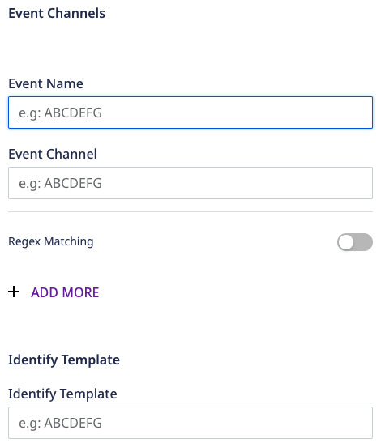
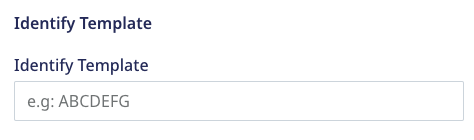
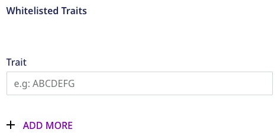
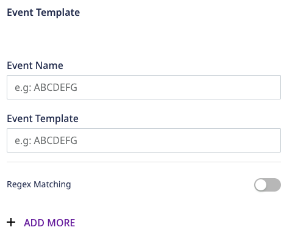
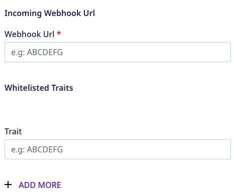
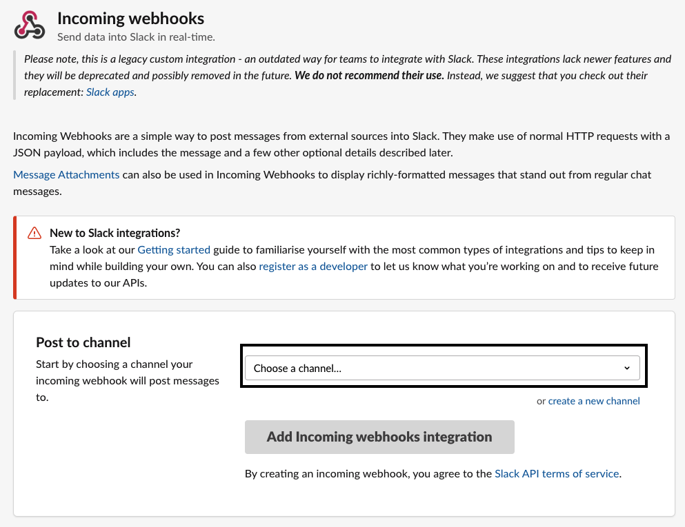
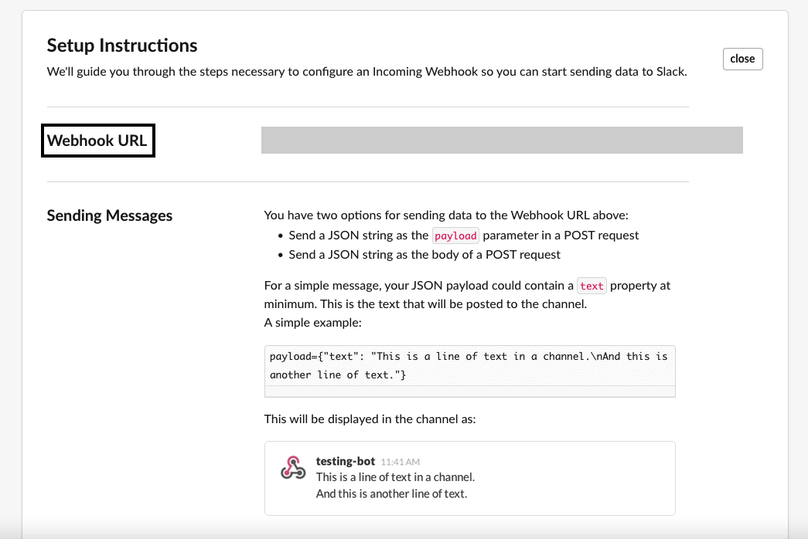

# Slack

[Slack](https://slack.com/intl/en-in/) is a popular business communication platform that lets you organize all your business-related chats by specific topics, groups, or direct messaging.

RudderStack supports Slack as a destination where you can send your event data seamlessly.

<div class="successBlock">

Find the open source transformer code for this destination in the <a href="https://github.com/rudderlabs/rudder-transformer/tree/master/v0/destinations/slack">GitHub repository</a>.
</div>

## Getting started

Before configuring Slack as a destination in RudderStack, verify if the source platform is supported by Slack by referring to the table below:

| **Connection Mode** | **Web**       | **Mobile**    | **Server**    |
| :------------------ | :------------ | :------------ | :------------ |
| **Device mode**     | -             | -             | -             |
| **Cloud** **mode**  | **Supported** | **Supported** | **Supported** |

<div class="infoBlock">

To know more about the difference between cloud mode and device mode in RudderStack, refer to the <a href="https://rudderstack.com/docs/rudderstack-cloud/rudderstack-connection-modes/">RudderStack Connection Modes</a> guide.
</div>

Once you have confirmed that the platform supports sending events to Slack, perform the steps below:

1. From your [RudderStack dashboard](https://app.rudderstack.com/), add the source. Then, from the list of destinations, select **Slack**.
2. Assign a name to the destination and click on **Next**.

### Connection settings

To successfully configure Slack as a destination, you will need to configure the following settings:

#### Event Channels



- **Event Name**: Enter the event name or the regex to match the RudderStack event name.
- **Event Channel**: Enter the name of the Slack channel where the event will be sent. You can specify `#channel_name` or `@user_name`.
- **Regex Matching**: Enable this setting if the event name in the first parameter is a regular expression.

<div class="warningBlock">

RudderStack adds the global <code class="inline-code">g</code> parameter implicitly. Hence, you need not add it with the regex.
</div>

#### Identify Template



**Identify Template**: Specify the template that you want the `identify` event to be transformed to before it is sent to Slack. The default template is shown below:

```
Identified {{name}} <traits_key1>:<traits_value1> <traits_key2>:<traits_value2> ....
```

Here, the traits key and value are the key-value pairs in the `traits` object of the [`identify`](https://rudderstack.com/docs/rudderstack-api/api-specification/rudderstack-spec/identify/#sample-payload) event payload. 

The `name` field in the template is determined from either of the following:

  - `traits.name`
  - `traits.firstName + traits.lastName`
  - `traits.username`
  - `properties.email`
  - `traits.email`
  - `User userId`
  - `Anonymous user anonymousId`

Note that only the traits listed in the **Whitelisted Traits** section are considered to be a part of the identify template. The rest of them are sent to Slack.
 


#### Event Templates



- **Event Name**: Enter the event name or the regex to match the RudderStack event name.                                                                     
- **Event Template**: Specify the template for the above event names matching the regex. The default template is as shown:
 
```
{{name}} did {{event}}
```

Here, `name` is determined in the same way as described in the [Identify Template](#identify-template) section above.

- **Regex Matching**:  Enable this setting if the event name is a regex in the first parameter.

#### Webhook URL



**Webhook URL:** Enter your Slack's [incoming webhook URL](https://my.slack.com/services/new/incoming-webhook/). 

To obtain the webhook URL, follow the below steps:

1. Click on your Slack workspace name, then go to **Administration** > **Manage Apps**.
2. Search for **Incoming webhooks** in the Slack app directory and add it to Slack by clicking on **Add to Slack**.
3. Select a channel where you want to post the messages forwarded by the webhook and click on **Add Incoming webhooks integration**.



4. Finally, copy the webhook URL and enter it in the RudderStack dashboard.



## Handlebar expressions

RudderStack supports [Handlebar expression](https://handlebarsjs.com/guide/expressions.html) by leveraging the `handlebars.js` library for including the variables into your dynamic Slack messages.

### Accessible Variables

The following table lists the variables you can select in your template messages:

| Handlebar Expression                     | Output                                                                  |
| :--------------------------------------- | :---------------------------------------------------------------------- |
| `{{name}}`                               | Identity of the user in the priority listed above.                   |
| `{{event}}`                              | Event name, that is, `product viewed` or `user login`.                    |
| `` or`{{properties.<key_1>}}` | Any of the property values from the event's properties object.           |
| `{{propertiesList}}`                     | JSON stringified version of your properties object. |
| `{{traits}}`                             | JSON stringified version of your traits object.     |
| `{{traitsList.<key_1>}}`                 | Any of the trait values from the event's traits object.                  |

### Escaped content

The values returned by the `{{variable}}` are HTML-escaped. For example, if a `variable` has a `&` in its value then it will be returned as `&amp;`. To avoid this behavior, you can use the **triple curly braces** instead of double, like `{{{variable}}}` instead of `{{variable}}`. This will stop the handlebars from escaping a value if there is one, as shown in the following example:

| Expression       | Variable         | Result               |
| :--------------- | :--------------- | :------------------- |
| `{{variable}}`   | `"Marcia & Jan"` | `"Marcia &amp; Jan"` |
| `{{{variable}}}` | `"Marcia & Jan"` | `"Marcia & Jan"`     |

<div class="infoBlock">
 
Refer to the <a href="https://handlebarsjs.com/guide/expressions.html#html-escaping">Handlebar document</a> for more information on the escaped content.
</div>

## Identify

The [`identify`](https://rudderstack.com/docs/rudderstack-api/api-specification/rudderstack-spec/identify/) call lets you identify a visiting user and associate them to their actions. It also lets you record the traits about them like their name, email address, etc.

A sample `identify` call for a template, like `Identified {{name}} with {{traits}}`, is as shown:

```javascript
rudderanalytics.identify("1hKOmRA4el9Zt1WSfVJIVo4GRlm", {
  name: "Alex Keener",
  email: "alex@example.com",
  country: "USA",
});
```

As a result, you will see this message `Identified Alex Keener with name: Alex Keener email: alex@example.com country: USA` in your configured Slack channel.

## Track

The [`track`](https://rudderstack.com/docs/rudderstack-api/api-specification/rudderstack-spec/track/) call lets you record the user events, that is, the actions your users perform, along with any properties associated with these actions.

A sample `track` call for a template, like `{{name}} performed {{event}} with {{properties.key1}} {{properties.key2}}` and the following track call, after being identified as above:

```javascript
rudderanalytics.track("test_event", {
  "key1": "test_val1",
  "key2": "test_val2",
  "key3": "test_val3"
})
```

As a result, you will see the message `Alex Keener performed test_event with test_val1 test_val2 test_val3` in your configured Slack channel.

## Contact us

For queries on any of the sections covered in this guide, you can [contact us](mailto:%20docs@rudderstack.com) or start a conversation in our [Slack](https://rudderstack.com/join-rudderstack-slack-community) community.
