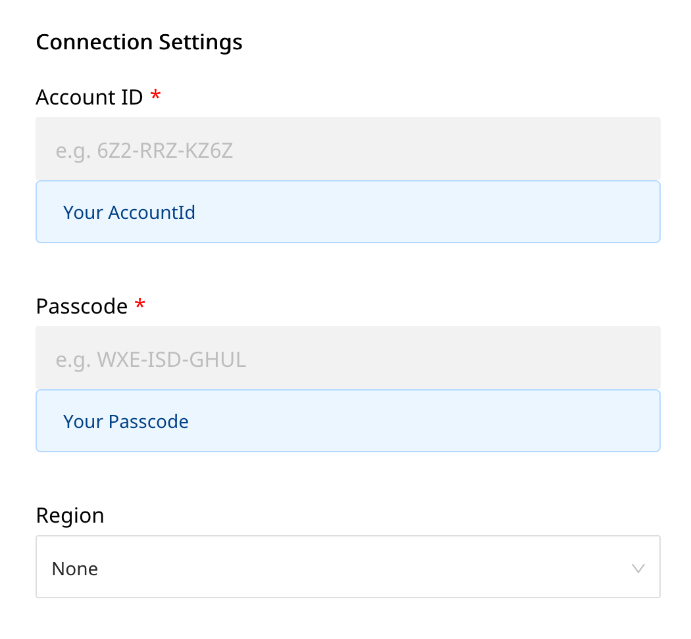

# Clevertap

[Clevertap](https://clevertap.com/) is a popular customer engagement and retention platform. Its in-app analytics and marketing capabilities allow you to get real-time insights into your customers and build valuable, long-term relationships with them. With Clevertap, you can easily your users' actions and understand how they are using your product. You can also segment users based on their behavior and run targeted campaigns to boost your user engagement and retention metrics.

You can now send your event data directly to Clevertap through RudderStack.


**Find the open-source transformer code for this destination in our** [**GitHub repo**](https://github.com/rudderlabs/rudder-transformer/tree/master/v0/destinations/clevertap)**.**


## Getting Started

Before configuring your source and destination on the RudderStack, please check whether the platform you are sending the events from is supported by Clevertap. Please refer the following table to do so:

| **Connection Mode** | **Web**       | **Mobile**    | **Server**    |
| :------------------ | :------------ | :------------ | :------------ |
| **Device mode**     | **Supported** | -             | -             |
| **Cloud mode**      | **Supported** | **Supported** | **Supported** |


To know more about the difference between Cloud mode and Device mode in RudderStack, read the [RudderStack connection modes](https://docs.rudderstack.com/get-started/rudderstack-connection-modes) guide.


Once you have confirmed that the platform supports sending events to Clevertap, perform the steps below:

- From your [RudderStack dashboard](https://app.rudderstack.com/), add the source and Clevertap as a destination.


Please follow our guide on [How to Add a Source and Destination in RudderStack](https://docs.rudderstack.com/how-to-guides/adding-source-and-destination-rudderstack) to add a source and destination in RudderStack.




## Clevertap Configuration Settings in RudderStack

To successfully configure Clevertap as a destination, you will need to configure the following settings:

- **Account ID:** Your account ID is an unique ID generated for your account. It can be found in your account in the **Settings** as your **Project ID**.
- **Passcode:** Your account passcode is an unique code generated for your account. It can be found in the **Settings** as **Passcode**.
- **Region:** Server Only: This is your dedicated Clevertap region.
- **Use Native SDK to send Events:** Enable this option if you want to send events using device mode.


Note: All server-side destination requests require either a `anonymousId` or a `userId` in the payload.


## Page

The `page` call allows you to record information whenever a user sees a web page, along with its associated properties.

When you send a `page` event , RudderStack sends that event to CleverTap as a **"Web Page Viewed `Page Name`** event.

An example of a `page` call is shown below:

```javascript
rudderanalytics.page("Cart", "Cart Viewed", {
  path: "/cart",
  referrer: "test.com",
  search: "term",
  title: "test_item",
  url: "http://test.in",
});
```

## Screen

The `screen` method allows you to record whenever a user sees the mobile screen, along with any associated optional properties. This call is similar to the `page` call, but is exclusive to your mobile device.

A sample `screen` call looks like the following code snippet:

```xcode
[[RSClient sharedInstance] screen:@"Sample Screen Name" properties:@{@"prop_key" : @"prop_value"}];
```

In the above snippet, RudderStack captures all the information related to the screen being viewed, along with any additional info associated with that screen view event. In Clevertap, the above `screen` call will be shown as - **"Screen Viewed: `Sample Screen Name` "** along with the properties.


Note that **`screen` calls are only supported in the RudderStack cloud mode** integration. To know more about the difference between Cloud mode and Device mode in RudderStack, read the [RudderStack connection modes](https://docs.rudderstack.com/get-started/rudderstack-connection-modes) guide.


## Track

The `track` call allows you to capture any action that the user might perform, along with the properties associated with that action. Each action is considered to be an event. It is similar to `screen` event, and the user is by default associated with `userId` or `anonymousId`.

A sample `track` call looks like the following:

```javascript
rudderanalytics.track("Checked Out", {
  Clicked_Rush_delivery_Button: true,
  total_value: 2000,
  Odered: ["T-Shirt", "jacket"],
  revenue: 2000,
});
```

In the above snippet, RudderStack captures the information related to the `Checked Out` event, along with any additional info about that event - in this case the details of the `Checked out` event.


To set a specific value to the `screen` or `track` type event, you need to pass the `event` related property in the `properties` field.


### Order Completed

When you track an event with the name `Order Completed` using the using Rudderstack's [e-commerce](https://docs.rudderstack.com/rudderstack-api-spec/rudderstack-ecommerce-events-specification/ordering#order-completed) tracking API , Rudderstack maps that event to CleverTap’s [Charged](https://developer.clevertap.com/docs/concepts-events#recording-customer-purchases) event.

A number of Rudderstack's specific fields map to CleverTap’s standard `Charged` event fields
| **Rudderstack** | **Clevertap** |
|---|---|
|`checkout_id` | `Charged ID`|
|`revenue` | `Amount` |
|`products` | `Items` |

A sample `Order Completed` event looks like the following:

```javascript
 rudderanalytics.track("Order Completed", {
      checkout_id: "12345",
      order_id: "1234",
      affiliation: "Apple Store",
      'Payment mode': "Credit Card",
      total: 20,
      revenue: 15.0,
      shipping: 22,
      tax: 1,
      discount: 1.5,
      coupon: "Games",
      currency: "USD",
      products: [
        {
          product_id: "123",
          sku: "G-32",
          name: "Monopoly",
          price: 14,
          quantity: 1,
          category: "Games",
          url: "https://www.website.com/product/path",
          image_url: "https://www.website.com/product/path.jpg",
        },
        {
          product_id: "345",
          sku: "F-32",
          name: "UNO",
          price: 3.45,
          quantity: 2,
          category: "Games",
        },
        {
          product_id: "125",
          sku: "S-32",
          name: "Ludo",
          price: 14,
          quantity: 7,
          category: "Games",
          brand: "Ludo King"
        },
      ],
    });
```


The `Order Completed` E-Commerce event is free flowing event, if you are setting extra fields for example: `discount`, `coupon` `currency` etc these will be automatically set to `Charged` event properties.


## Identify

The `identify` call lets you associate a user with their actions and capture all the relevant traits about them. This information includes unique `userid` as well as any optional information such as `name`, `email`, etc.

A number of Rudderstack's special traits map to CleverTap’s standard user profile fields, as shown in the table below. You will be required to pass the key on the left into Rudderstack and RudderStack will transform it to the key on the right before sending to CleverTap.

| **Rudderstack** | **Clevertap** |
|---|---|
|`name` | `Name`|
|`birthday` | `DOB` |
|`avatar` | `Photo` |
|`gender` | `Gender` |
|`phone` | `Phone` |
|`email` | `Email` |
|`employed` | `Employed` |
|`education` | `Education` |
|`married` | `Married` |
|`customerType` | `Customer Type` |

All other traits will be sent to CleverTap as custom attributes.

A sample `identify` call looks like the following:

```javascript
rudderanalytics.identify("userid", {
  name: "Name Surname",
  email: "name@website.com",
  phone: "phone",
  birthday: "birthday",
  gender: "M",
  avatar: "link to image",
  title: "Owner",
  organization: "Company",
  city: "Tokyo",
  region: "ABC",
  country: "JP",
  zip: "100-0001",
  Flagged: false,
  Residence: "Shibuya",
  MSG-email: false
});
```

In the above snippet, RudderStack captures relevant information about the user such as the `email`, `phone` as well as the associated traits of that user.


If a user already exists, the new values will be updated for that user. Rudderstack automatically maps the `userId` (or `anoymousId`) to Clevertap user's `identity`.



Profile properties `MSG-email`, `MSG-push`, `MSG-sms` and `MSG-whatsapp` are used to set the Do-Not-Disturb status for the user. Unless these are explicitly set to `false`, they are always `true`.

Example: To disable push notifications for a user, set `MSG-push` to `false`


## Contact Us

If you come across any issues while configuring Clevertap with RudderStack, please feel free to [contact us](mailto:docs@rudderstack.com). You can also start a conversation on our [Slack](https://resources.rudderstack.com/join-rudderstack-slack) channel; we will be happy to talk to you!
