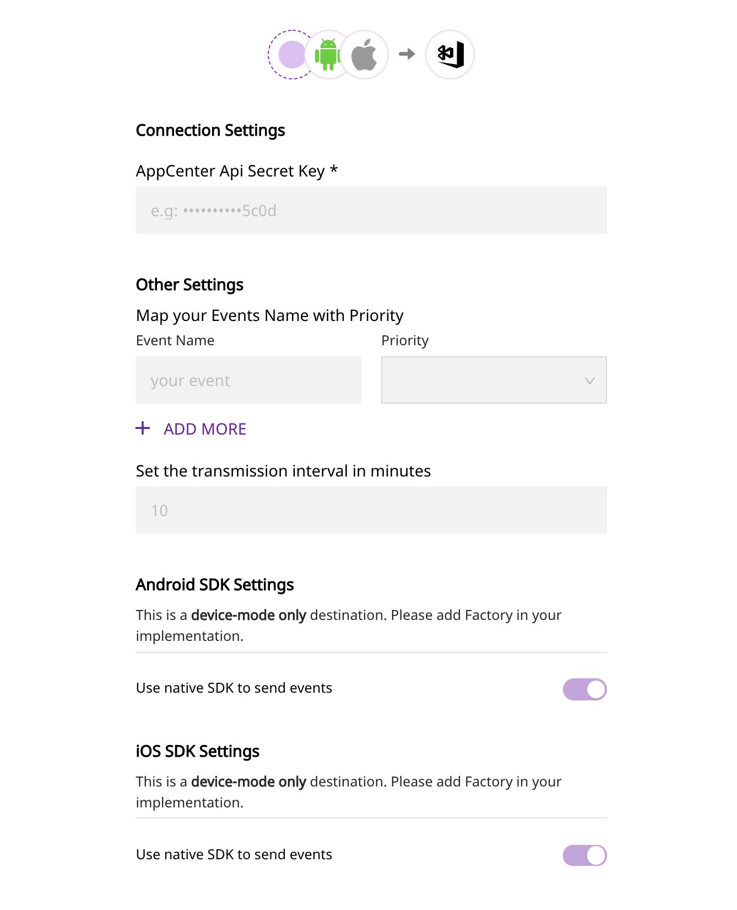

# Visual Studio App Center

[App Center](https://appcenter.ms/) is Microsoft's cross-platform build automation and management platform that lets you seamlessly manage your app's lifecycle. With App Center, you can easily manage and automate your builds, effectively test your apps in the cloud, and monitor their real-time usage with the help of crash data and analytics.

RudderStack lets you send your event data to App Center via its native web SDKs.

## Getting Started

Before configuring your source and destination on the RudderStack, please check whether the platform you are sending the events from is supported by App Center. Please refer the following table to do so:

| **Connection Mode** | **Web** | **Mobile**    | **Server** |
| :------------------ | :------ | :------------ | :--------- |
| **Device mode**     | -       | **Supported** | -          |
| **Cloud mode**      | -       | -             | -          |

<div class="infoBlock">

To know more about the difference between Cloud mode and Device mode in RudderStack, read the <a href="https://rudderstack.com/docs/rudderstack-connection-modes/">RudderStack connection modes</a> guide.

</div>

Once you have confirmed that the platform supports sending events to App Center, perform the steps below:

- From your [RudderStack dashboard](https://app.rudderstack.com/), add the source and select **App Center** from the list of destinations.

<div class="infoBlock">

Please follow our guide on <a href="https://rudderstack.com/docs/rudderstack-cloud/connections/">How to Add a Source and Destination in RudderStack</a> to add a source and destination in RudderStack.

</div>

- Name your destination, and click on **Next**. You should be able to see the following screen:

<span class="imageTitle">Connection settings for App Center destination</span>

- Enter the relevant details and click on **Next** to complete the setup. The **API Secret Key** can be found as **App Secret** on the **Getting Started** page or **Settings** page on the App Center portal.

<!--

Follow these steps to add App Center to your Android project:

- Add the following `dependencies` to your `app/build.gradle` file as shown:

```groovy
implementation 'com.rudderstack.android.sdk:core:1.+'
implementation 'com.rudderstack.android.integration:appcenter:1.0.0'
implementation 'com.google.code.gson:gson:2.8.6'
```

- Also add the App Center `analytics` depedencies to your `app/build.gradle` as shown below:

```groovy
def appCenterSdkVersion = '4.1.0'
implementation "com.microsoft.appcenter:appcenter-analytics:${appCenterSdkVersion}"
```

- Make sure that the `minSdkVersion` in your `app/build.gradle` is atleast `21`.

```groovy
defaultConfig {
  minSdkVersion 21
}
```

- Finally, change the initialization of your `RudderClient` in your `Application` class, as shown:

```kotlin
val rudderClient = RudderClient.getInstance(
    this,
    <YOUR_WRITE_KEY>,
    RudderConfig.Builder()
        .withDataPlaneUrl(<YOUR_DATA_PLANE_URL>)
        .withFactory(AppcenterIntegrationFactory.FACTORY)
        .build()
)
```




Follow these steps to add App Center to your iOS project:

- Go your `Podfile` and add the `Rudder-AppCenter` extension

```ruby
pod 'Rudder-AppCenter'
```

- After adding the dependency followed by `pod install` , you can add the imports to your `AppDelegate.m` file, as shown:

```objectivec
#import <RudderAppCenterFactory.h>
```

- Finally, change the initialization of your `RudderClient` as shown:

```objectivec
RSConfigBuilder *builder = [[RSConfigBuilder alloc] init];
[builder withDataPlaneUrl:<YOUR_DATA_PLANE_URL>];
[builder withFactory:[RudderAppCenterFactory instance]];
[RSClient getInstance:<YOUR_WRITE_KEY> config:[builder build]];
```

<div class="infoBlock">

The following requirements must be met to use App Center: Your iOS project is set up in Xcode 11 or later on macOS version 10.14.4 or later. You're targeting devices running on iOS 9.0 or later.

</div>




To add AppCenter to your React Native project:

Add the RudderStack-App Center module to your app using :

```bash
npm install @rudderstack/rudder-integration-appcenter-react-native
## OR ##
yarn add @rudderstack/rudder-integration-appcenter-react-native
```

<div class="infoBlock">

Make sure the <code class="inline-code">minSdkVersion</code> of your <code class="inline-code">build.gradle</code> in the root of <code class="inline-code">android</code> directory is atleast <code class="inline-code">21</code>

</div>

Run `pod install` inside the `ios` directory of your project adding `@rudderstack/rudder-integration-appcenter-react-native` to your project.

Import the module you added above and add it to your SDK initialization code as shown below:

```typescript
import rudderClient from "@rudderstack/rudder-sdk-react-native"
import appcenter from "@rudderstack/rudder-integration-appcenter-react-native"

const config = {
  dataPlaneUrl: DATA_PLANE_URL,
  trackAppLifecycleEvents: true,
  withFactories: [appcenter],
}
rudderClient.setup(WRITE_KEY, config)
```




To add AppCenter to your Flutter project, add the RudderStack-App Center module to your app by following these steps:

- Open `pubspec.yaml` and add `rudder_integration_appcenter_flutter` under `dependencies` section:

```groovy
dependencies:
  rudder_integration_appcenter_flutter: ^1.0.0
```

- Navigate to your application's root folder and install all the required dependencies as shown:

```bash
flutter pub get
```

- Import the module you added above and add it to your SDK initialization code as shown:

```typescript
import 'package:rudder_sdk_flutter/RudderClient.dart';
import 'package:rudder_sdk_flutter/RudderConfig.dart';
import 'package:rudder_integration_appcenter_flutter/Appcenter.dart';

RudderConfigBuilder builder = RudderConfigBuilder();
builder.withDataPlaneUrl(DATA_PLANE_URL);
builder.withTrackLifecycleEvents(true);
builder.withFactory(Appcenter());
RudderClient.getInstance(WRITE_KEY,
    config: builder.build());
```

<div class="infoBlock">

Make sure the <code class="inline-code">minSdkVersion</code> of your <code class="inline-code">build.gradle</code> in the root of <code class="inline-code">android</code> directory is atleast <code class="inline-code">21</code>.

</div>


 -->

<Tabs>
  <TabList>
    <Tab>Android</Tab>
    <Tab>iOS</Tab>
    <Tab>React Native</Tab>
    <Tab>Flutter</Tab>
    <Tab>Cordova</Tab>
  </TabList>
    <TabPanels>
      <TabPanel>
        Follow these steps to add App Center to your Android project:
<ul>
<li>Add the following <code class="inline-code">dependencies</code> to your <code class="inline-code">app/build.gradle</code> file as shown:
<span>

```groovy
implementation 'com.rudderstack.android.sdk:core:1.+'
implementation 'com.rudderstack.android.integration:appcenter:1.0.0'
implementation 'com.google.code.gson:gson:2.8.6'
```
</span>
</li>
<li>Also add the App Center <code class="inline-code">analytics</code> depedencies to your <code class="inline-code">app/build.gradle</code> as shown below:
<span>

```groovy
def appCenterSdkVersion = '4.1.0'
implementation "com.microsoft.appcenter:appcenter-analytics:${appCenterSdkVersion}"
```
</span>
</li>
<li>Make sure that the <code class="inline-code">minSdkVersion</code> in your <code class="inline-code">app/build.gradle</code> is atleast <code class="inline-code">21</code>.
<span>

```groovy
defaultConfig {
  minSdkVersion 21
}
```
</span>
</li>
<li>Finally, change the initialization of your <code class="inline-code">RudderClient</code> in your <code class="inline-code">Application</code> class, as shown:
<span>

```kotlin
val rudderClient = RudderClient.getInstance(
    this,
    <YOUR_WRITE_KEY>,
    RudderConfig.Builder()
        .withDataPlaneUrl(<YOUR_DATA_PLANE_URL>)
        .withFactory(AppcenterIntegrationFactory.FACTORY)
        .build()
)
```
</span>
</li>
</ul>
      </TabPanel>
      <TabPanel>
        Follow these steps to add App Center to your iOS project:
<ul>
<li>Go your <code class="inline-code">Podfile</code> and add the <code class="inline-code">Rudder-AppCenter</code> extension
<span>

```ruby
pod 'Rudder-AppCenter'
```
</span>
</li>
<li>After adding the dependency followed by <code class="inline-code">pod install</code> , you can add the imports to your <code class="inline-code">AppDelegate.m</code> file, as shown:
<span>

```objectivec
#import <RudderAppCenterFactory.h>
```
</span>
</li>
<li>Finally, change the initialization of your <code class="inline-code">RudderClient</code> as shown:
<span>

```objectivec
RSConfigBuilder *builder = [[RSConfigBuilder alloc] init];
[builder withDataPlaneUrl:<YOUR_DATA_PLANE_URL>];
[builder withFactory:[RudderAppCenterFactory instance]];
[RSClient getInstance:<YOUR_WRITE_KEY> config:[builder build]];
```
</span>
<div class="infoBlock">

The following requirements must be met to use App Center: Your iOS project is set up in Xcode 11 or later on macOS version 10.14.4 or later. You're targeting devices running on iOS 9.0 or later.
</div>
</li>
</ul>
      </TabPanel>
      <TabPanel>
        To add AppCenter to your React Native project:

Add the RudderStack-App Center module to your app using :
<span>

```bash
npm install @rudderstack/rudder-integration-appcenter-react-native
## OR ##
yarn add @rudderstack/rudder-integration-appcenter-react-native
```
</span>
<div class="infoBlock">

Make sure the <code class="inline-code">minSdkVersion</code> of your <code class="inline-code">build.gradle</code> in the root of <code class="inline-code">android</code> directory is atleast <code class="inline-code">21</code>
</div>

Run <code class="inline-code">pod install</code> inside the <code class="inline-code">ios</code> directory of your project adding <code class="inline-code">@rudderstack/rudder-integration-appcenter-react-native</code> to your project.

Import the module you added above and add it to your SDK initialization code as shown below:
<span>

```typescript
import rudderClient from "@rudderstack/rudder-sdk-react-native"
import appcenter from "@rudderstack/rudder-integration-appcenter-react-native"

const config = &#123;
  dataPlaneUrl: DATA_PLANE_URL,
  trackAppLifecycleEvents: true,
  withFactories: [appcenter],
&#125;
rudderClient.setup(WRITE_KEY, config)
```
</span>
  </TabPanel>
  <TabPanel>
        To add AppCenter to your Flutter project, add the RudderStack-App Center module to your app by following these steps:
<ul>
<li>Open <code class="inline-code">pubspec.yaml</code> and add <code class="inline-code">rudder_integration_appcenter_flutter</code> under <code class="inline-code">dependencies</code> section:
<span>

```groovy
dependencies:
  rudder_integration_appcenter_flutter: ^1.0.0
```
</span>
</li>
<li>Navigate to your application's root folder and install all the required dependencies as shown:
<span>

```bash
flutter pub get
```
</span>
</li>
<li>Import the module you added above and add it to your SDK initialization code as shown:
<span>

```typescript
import 'package:rudder_sdk_flutter/RudderClient.dart';
import 'package:rudder_sdk_flutter/RudderConfig.dart';
import 'package:rudder_integration_appcenter_flutter/Appcenter.dart';
RudderConfigBuilder builder = RudderConfigBuilder();
builder.withDataPlaneUrl(DATA_PLANE_URL);
builder.withTrackLifecycleEvents(true);
builder.withFactory(Appcenter());
RudderClient.getInstance(WRITE_KEY,
    config: builder.build());
```
</span>
<div class="infoBlock">

Make sure the <code class="inline-code">minSdkVersion</code> of your <code class="inline-code">build.gradle</code> in the root of <code class="inline-code">android</code> directory is atleast <code class="inline-code">21</code>.
</div>
</li>
</ul>
     </TabPanel>
       <TabPanel>
        To add App Center to your Cordova project, follow these steps:
<ul>
<li>Navigate to the root folder of your application and run the following command::
<span>

```bash
cordova plugin add rudder-integration-appcenter-cordova
```
</span>
</li>
<li>Add the platforms that you want to target for your app:
<span>

```bash
cordova platform add ios
cordova platform add android
```
</span>
</li>
<li>Run the following command to build the project for all the platforms:
<span>

```bash
cordova build
```
</span>
</li>
<li>Add the following code in the <code class="inline-code">onDeviceReady()</code> function of your home page to initialize the SDK, as shown:
<span>

```javascript
RudderClient.initialize(WRITE_KEY , {
  dataPlaneUrl: DATA_PLANE_URL,
  factories: [RudderAppCenterFactory]
})
```
</span>

<div class="infoBlock">

Make sure to use the <code class="inline-code">await</code> keyword with the <code class="inline-code">initialize</code> call.
</div>
</li>
</ul>
     </TabPanel>
   </TabPanels>
  </Tabs>

## Track

A `track` call lets you track custom events as they occur in your web application. For more information on the `track` call, please refer to the [RudderStack API Specification](https://rudderstack.com/docs/rudderstack-api/api-specification/rudderstack-spec/) documentation.

A sample `track` call looks like the following:

```objectivec
[[RSClient sharedInstance] track:@"Product Clicked" properties:@{
    @"product_id" : @"pr01",
    @"name" : @"Cadbury"
}];
```

<div class="infoBlock">

  The above track call is directly passed on to App Center via its
  <code class="inline-code">trackEvent</code>
  api in both the RudderStack <code class="inline-code">Android</code> & <code class="inline-code">
    iOS
  </code> SDKs.
</div>

The `eventProperties` object should only contain the values of type `String` and `Number`- the other property types will be simply ignored, if sent.

For example, if eventProperties is set as:

```javascript
{
  "colours": [
    "red",
    "black"
  ],
  "city": "varkala",
  "state": "kerala"
}
```

then it will be sent to App Center as:

```javascript
{
  "city": "varkala",
  "state": "kerala"
}
```

## Screen

The `screen` method allows you to record whenever a user sees the mobile screen, along with any associated optional properties. This call is similar to the `page` call, but is exclusive to your mobile device.

A sample `screen` call using the RudderStack Android SDK looks like the following code snippet:

```objectivec
[[RSClient sharedInstance] screen:@"Home" properties:@{
    @"category" : @"launcher"
}];
```

In the above snippet, RudderStack captures the information related to the screen being viewed, such as screen's name and category.

<div class="infoBlock">
The above <code class="inline-code">screen</code> call is directly passed on to App Center as a <code class="inline-code">track</code> event via its <code class="inline-code">trackEvent</code> API, with event name as <code class="inline-code">Viewed &#123;screen name&#125; screen</code> along with the its properties. The above example will be sent as a <code class="inline-code">track</code> event with name <code class="inline-code">Viewed MainActivity screen</code> along with its properties.

</div>

## Opt-in & Opt-out

Any users visting your app can express his consent over sending data to App Center and based on his consent you can either Opt in or Opt out that user's data from sending to App Center.

Please refer to the below section for more details on how to use this feature

<!--

Firstly import Appcenter's `Analytics` Module as shown below: \`\`groovy import com.microsoft.appcenter.analytics.Analytics;

Then add the below script just after the initialization of the Android SDK:
```kotlin
rudderClient.onIntegrationReady("App Center") {
    // have your own logic to get the user consent
    if (userConsent) {
        // enabling appcenter's analytics module
        Analytics.setEnabled(true);
    } else {
        // disabling appcenter's analytics module
        Analytics.setEnabled(false);
    }
}
```




Firstly import the Appcenter's `Analytics` Module as shown below:

```objectivec
@import AppCenterAnalytics;
```

Then add the below script just after the initialization of the iOS SDK:

```objectivec
if(userConsent)
{
    // enabling appcenter's analytics module
    [MSACAnalytics setEnabled:true];
}
else
{
    // disabling appcenter's analytics module
    [MSACAnalytics setEnabled:false];
}
```




Firstly import the `AppCenterIntegrationFactory` as shown below:

```javascript
import AppcenterIntegrationFactory from "@rudderstack/rudder-integration-appcenter-react-native/src/bridge"
```

Then add the below script just after the initalization of the React Native SDK:

```javascript
await rudderClient.registerCallback("App Center", () => {
  if (userconsent) {
    // enabling appcenter's analytics module
    AppcenterIntegrationFactory.enableAnalytics()
  } else {
    // disabling appcenter's analytics module
    AppcenterIntegrationFactory.disableAnalytics()
  }
})
```


 -->

<Tabs>
  <TabList>
    <Tab>Android</Tab>
    <Tab>iOS</Tab>
    <Tab>React Native</Tab>
  </TabList>
    <TabPanels>
      <TabPanel>
        Firstly import Appcenter's <code class="inline-code">Analytics</code> Module as shown below: <code class="inline-code">groovy import com.microsoft.appcenter.analytics.Analytics;</code>
<span>

Then add the below script just after the initialization of the Android SDK:
</span>
<span>

```kotlin
rudderClient.onIntegrationReady("App Center") {
    // have your own logic to get the user consent
    if (userConsent) {
        // enabling appcenter's analytics module
        Analytics.setEnabled(true);
    } else {
        // disabling appcenter's analytics module
        Analytics.setEnabled(false);
    }
}
````
</span>
      </TabPanel>
      <TabPanel>
        Firstly import the Appcenter's <code class="inline-code">Analytics</code> Module as shown below:
<span>

```objectivec
@import AppCenterAnalytics;
```
</span>
Then add the below script just after the initialization of the iOS SDK:
<span>

```objectivec
if(userConsent)
{
    // enabling appcenter's analytics module
    [MSACAnalytics setEnabled:true];
}
else
{
    // disabling appcenter's analytics module
    [MSACAnalytics setEnabled:false];
}
```
</span>
      </TabPanel>
      <TabPanel>
        Firstly import the <code class="inline-code">AppCenterIntegrationFactory</code> as shown below:
<span>

```javascript
import AppcenterIntegrationFactory from "@rudderstack/rudder-integration-appcenter-react-native/src/bridge"
```
</span>
Then add the below script just after the initalization of the React Native SDK:
<span>

```javascript
await rudderClient.registerCallback("App Center", () => {
  if (userconsent) {
    // enabling appcenter's analytics module
    AppcenterIntegrationFactory.enableAnalytics()
  } else {
    // disabling appcenter's analytics module
    AppcenterIntegrationFactory.disableAnalytics()
  }
})
```
</span>
      </TabPanel>
    </TabPanels>
</Tabs>


## FAQs

### How do I get the App Center API secret?

The **API Secret Key** can be found as **App Secret** on the **Getting Started** page or **Settings** page on your App Center portal.

### What is transmission interval?

The App Center SDK uploads logs in a batch of 50. If the SDK doesn't have 50 logs to send, it will still send logs after 3 seconds \(set by default\). There can be a maximum of 3 batches sent in parallel. In this case, this interval of 3 seconds is the **transmission interval**. Note that the value of this transmission interval must always be between 3 seconds and 86400 seconds \(one day\).

## Contact Us

If you come across any issues while configuring App Center with RudderStack, please feel free to [contact us](mailto:%20docs@rudderstack.com). You can also start a conversation in our [Slack](https://rudderstack.com/join-rudderstack-slack-community) community; we will be happy to talk to you!
