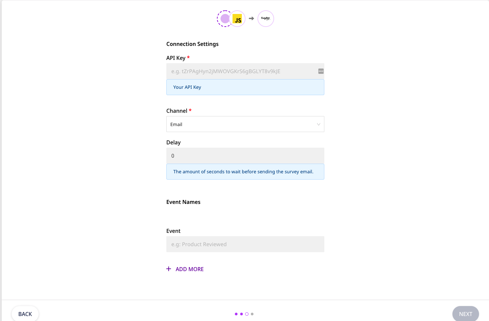

# Delighted

[**Delighted**](https://delighted.com/) is a popular customer feedback platform. It allows your teams to gather instant, invaluable, and actionable customer feedback to improve your processes and product.

RudderStack supports Delighted as a destination to which you can seamlessly send your customer data.


**Find the open-source transformer code for this destination in our** [**GitHub repo**](https://github.com/rudderlabs/rudder-transformer/tree/master/v0/destinations/delighted)**.**


## Getting Started

Before configuring your source and destination on the RudderStack, verify if the source platform is supported by Delighted by referring to the table below:

| **Connection Mode** | **Web**       | **Mobile**    | **Server**    |
| :------------------ | :------------ | :------------ | :------------ |
| **Device mode**     | -             | -             | -             |
| **Cloud** **mode**  | **Supported** | **Supported** | **Supported** |


To know more about the difference between Cloud mode and Device mode in RudderStack, read the [**RudderStack connection modes**](https://docs.rudderstack.com/get-started/rudderstack-connection-modes) guide.


Once you have confirmed that the source supports sending events to Delighted, follow these steps:

* From your [**RudderStack dashboard**](https://app.rudderstack.com/), add the source. From the list of destinations, select **Delighted**.


Follow our guide on [**How to Add a Source and Destination in RudderStack**](https://docs.rudderstack.com/how-to-guides/adding-source-and-destination-rudderstack) for more information.


* Give a name to the destination and click on **Next**. You should then see the following screen:



* Enter your Delighted **API Key**.


For more information on how to get your Delighted API key, refer to the Delighted [**docs**](https://app.delighted.com/docs/api).


* By default, the channel is set to **Email**. You can also select **SMS** from the dropdown.

* Set the **Delay** value (in seconds) here. By default it is set to **0**.

* To make a `track` call, enter the **Event Names** for which `track` call will be triggered.


If the RudderStack dashboard does not contain the **Event** for which the `track` call is triggered, RudderStack will throw an error.


* Finally, click on **Next**. Delighted will now be enabled as a destination in Rudderstack.

## Identify

The `identify` call lets you to add a user to your **People** [**List**](https://app.delighted.com/people). If the user already exists, RudderStack will update the user with the latest information. This includes `userId` as well as other additional properties related to user like name,phone number/email, channel, and the 'Last sent at' timestamp.

* The `userId` provided during the call must match the **Channel** type. The channel type can be either set from Rudderstack dashboard or you can send it via the `identify` call with the parameter `DelightedChannelType`.


The channel type set via the `identify` call will get a higher precedence.


* You can provide the user email or phone number. Both are not required at the same time, since one of the values will be set from the `userId`.

* You can also send the `last_sent_at` value with the call. Refer to the example below for more details.


`Last sent at` (in UNIX timestamp) is used to manually set the time a person was most recently sent a survey. This value will be used in the Delighted **Survey throttling** system. By default, Survey throttling is set to **1 month** in your project. Users added via the API who have already been sent a survey within this time period will not be sent another survey.


A sample `identify` call is as shown below:

```javascript
rudderanalytics.identify("name@surname.com", {
  name: "User",
  last_sent_at: "1624293839",
  phone_number: "+1234567890"},
  { externalId: [
    {
        type: "delightedChannelType",
        id: "sms"
    } 
  ]}
});
```

In this example, since the `userId` is already an email, you can provide the user's `phone_number` as well. Also, the `delightedChannelType` will override the **Channel Type** set in the RudderStack dashboard.


Except `userId`, all the other fields in the call are optional.


## Track

The `track` call lets you send the survey to the user added to the **People** [**List**](https://app.delighted.com/people) in your account. In addition to name, phone number/email,channel, and the 'Last sent at' timestamp, you can also add as many custom properties as you need.


If the user does not exist, you cannot make a `track` call. You need to first add the user in the People list via the `identify` call.


A sample `track` call is as shown below:

```javascript
rudderanalytics.track("Test", {
  delighted_email_subject: "Custom Email Subject.",
  customProperty: "Custom Value",
  delightedChannelType: "email"},
  { externalId: [
    {
        type: "delightedChannelType",
        id: "sms"
    } 
  ]}
});
```

In the above example, `Test` is the event name. Except the event name, all other fields are optional.


If you do not enter the **Event** name in the dashboard for which the `track` call is triggered, RudderStack will throw an error.


Delighted also provides some custom properties by itself. In the above example, `delighted_email_subject` sets the email subject of the survey to `Custom Email Subject`. Note that this change can be done from the Delighted website too. 

Some other default properties provided by Delighted are mentioned in the table below:

| **Delighted Property** | **Description** |
| :--- | :--- |
| `question_product_name` | Delighted shows this question in the survey. |
| `delighted_intro_message` | Delighted displays this message in the email subject. |
| `locale` | This property determines the localization (including language) of the survey experience. |

For more default properties, check out this Delighted [**support page**](https://help.delighted.com/article/577-special-properties).

In the example shown above, `customProperty` is the custom property field that you can set. Note that you must provide values for these custom fields, or else they will be dropped by Delighted.

## Alias

The `alias` call allows you to update the user's email or phone number. You need to set `previousId` as the current value and `userId` as the updated value.


The `previousId` and `userId` must be of the same type, i.e., either email or phone number.


A sample `alias` call is as shown below:

```javascript
rudderanalytics.alias("new@email.com", "old@email.com");
```

## Contact Us

If you come across any issues while configuring Delighted with RudderStack, feel free to [**contact us**](mailto:%20docs@rudderstack.com) or start a conversation on our [**Slack**](https://resources.rudderstack.com/join-rudderstack-slack) channel.
