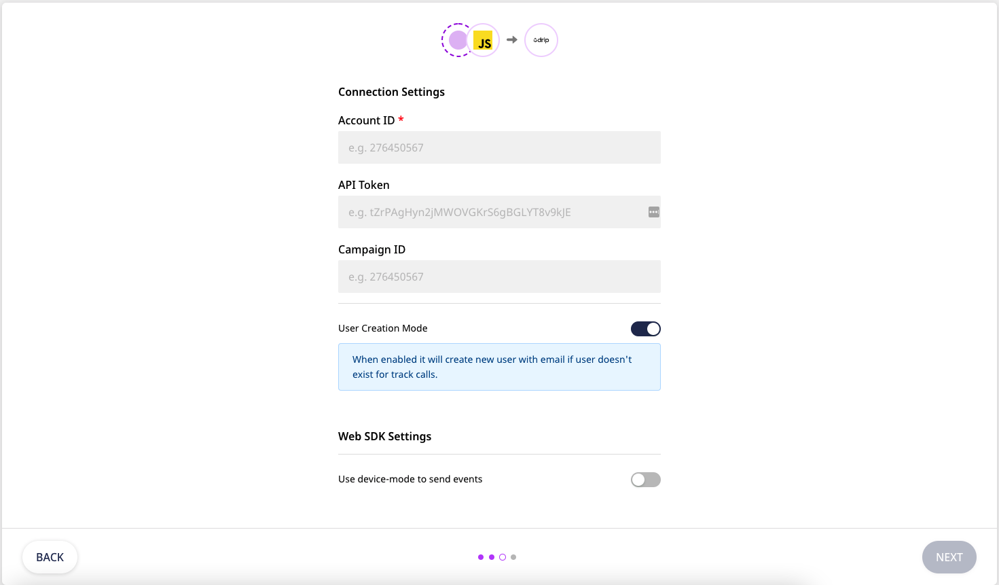

# Drip

[**Drip**](https://drip.com/) is a popular platform, which gathers and organizes customer data, then enables ecommerce retailers to use that data to make personalized omnichannel customer journeys at scale.

RudderStack supports Drip as a destination to which you can seamlessly send your customer data.

% hint style="success" %}
**Find the open-source transformer code for this destination in our** [**GitHub repo**](https://github.com/rudderlabs/rudder-transformer/tree/master/v0/destinations/drip)**.**


## Getting Started

Before configuring your source and destination on the RudderStack, verify if the source platform is supported by Drip by referring to the table below:

| **Connection Mode** | **Web** | **Mobile** | **Server** |
| :--- | :--- | :--- | :--- |
| **Device mode** | **Supported** | - | - |
| **Cloud** **mode** | **Supported** | **Supported** | **Supported** |


To know more about the difference between Cloud mode and Device mode in RudderStack, read the [**RudderStack connection modes**](https://docs.rudderstack.com/get-started/rudderstack-connection-modes) guide.


Once you have confirmed that the source supports sending events to Drip, follow these steps:

* From your [**RudderStack dashboard**](https://app.rudderstack.com/), add the source. From the list of destinations, select **Drip**.


Follow our guide on [**How to Add a Source and Destination in RudderStack**](https://docs.rudderstack.com/how-to-guides/adding-source-and-destination-rudderstack) for more information.


* Give a name to the destination and click on **Next**. You should then see the following screen:



* Enter your Drip **Account ID**.


To get your **Account ID**. click [here](https://www.getdrip.com/1809802/settings/general).


* Enter your **API Token**.


**API token** is required when using cloud mode. To get your Drip API token, click [here](https://www.getdrip.com/user/edit).


* Enter your **Campaign ID**. You can also send your Campaign Id via the `identify` call. Refer to the example below for more details.


If **Campaign ID** is provided, we will by default try to subscribe users. To get your campaign ID click [here](https://www.getdrip.com/1809802/campaigns). Click on your `Email Series`. Last part of the url is the campaign Id. e.g. https://www.getdrip.com/account_id/campaigns/campaign_id.
You can also send `Campaign Id` via call which will have higher precedence.


* **User Creation Mode** allows you to create the user with `email` for track call, if the user doesn't already exist.

* To send events via device mode , enable **Use device-mode to send events** .

* Finally, click on **Next**. Drip will now be enabled as a destination in Rudderstack.

## Identify

The `identify` call allows you to create a subscriber or update an already existing subscriber and associate the related information them. The information include `dripId` ,`email` , `name`  etc.

* If **Campaign ID** is provided then we will by default try to subscribe every user to this `campaign ID`. You can also send it via call, which will have higher precedence than the one in dashboard.


Either `dripId` or `email` is required for the call. If creating user then `email` must be provided, in case of updation either assigned `dripId` or `email` can be provided.


A sample `identify` call is as shown below:

```javascript
rudderanalytics.identify("user123",{
    email: "sampleuser@gmail.com",
    firstName: "Demo",
    lastName: "Example",
    tags:["tag1","tag2"],
    customFields: {
        "filter1": "filterval1"
    }
    },
    { externalId: [
            { 
                type: "dripCampaignId", id: "<your campaign id>" 
            },
            {
                type: "dripId", id: "<user's drip id>"
            }
    ]}
);
```
This table includes all the fields in `identify` call with their relative mapping :

| **Rudder Field** | **Drip Field** |
| :--- | :--- |
| newEmail | new_email |
| phone | phone |
| firstName/first_name/firstname | first_name |
| lastName/last_name/lastname | last_name |
| tags | tags |
| removeTags | remove_tags |
| status | status |
| initialStatus | initial_status |
| timezone | time_zone |
| country | country |
| city | city |
| zip | zip |
| euConsent | eu_consent |
| euConsentMessage | eu_consent_message |
| ip | ip_address |
| address | address1 |
| address2 | address2 |
| lifetimeValue | lifetime_value |
| prospect | prospect |
| baseLeadScore | base_lead_score |
| customFields | custom_fields |

When **Campaign ID** is provided, some extra fields can also be sent with the call. All the supported fields for `campaign` call are mentioned below :

| **Rudder Field** | **Drip Field** |
| :--- | :--- |
| doubleOptin | double_optin |
| startingEmailIndex | starting_email_index |
| reactivateIfRemoved | reactivate_if_removed |
| tags | tags |
| prospect | prospect |
| euConsent |eu_consent |
| euConsentMessage | eu_consent_message |
| baseLeadScore | base_lead_score |
| timezone | time_zone |

## Track

The track call lets you record an event associated to the user and associate relevant information regarding the event like `action`, `occurred_at` and also `custom field`.

* Either `id` or `email` must be provided.

`User Creation Mode` allows you to create a user with `email`, if user doesn't already exist. You can disable it if you don't want new users to be created.


If `dripId` is provided in call, then new users will not be created, even if `User Creation Mode` is enabled.


You can also create or update order, if the event name belongs to either of the special events:

* `order updated`
* `order completed`
* `order refunded`
* `order cancelled`
* `checkout started`
* `fulfilled`
* `order fulfilled`

A sample `track` call is as shown below:

```javascript
rudderanalytics.track("Event Name",{
    email: "sampleuser@gmail.com",
    affiliation: "custom_store",
    order_id: "123456",
    products:[
        {
            "name":"product_name",
            "price": 10.00
        }
    ]
    },
    { externalId: [
        {     
            type: "dripId", id: "<user's drip id>"
        } 
    ]}
);
```
A `track` call can contain following fields:

| **Rudder Field** | **Drip Field** |
| :--- | :--- |
| prospect | prospect |
| `custom_fields` | properties |
| occurred_at | occurred_at |

For `special events` mentioned above, following fields are also supported:

| **Rudder Field** | **Drip Field** |
| :--- | :--- |
| `affiliation` | provider |
| initial_status | initial_status |
| order_id | order_id |
| order_public_id | order_public_id |
| `total` | grand_total |
| `discount` | discounts |
| `tax` | total_taxes |
| total_fees | total_fees |
| `shipping` | total_shipping |
| refund_amount | refund_amount |
| currency | currency |
| order_url | order_url |
| billing_address | billing_address |
| shipping_address | shipping_address |
| occurred_at | occurred_at |
| `products` | items|

The last field in the above list i.e. `products` is an array of objects. The object can contain the following fields:

| **Rudder Field** | **Drip Field** |
| :--- | :--- |
| product_id | product_id |
| sku | sku |
| name | name |
| product_variant_id | product_variant_id |
| brand | brand |
| price | price |
| quantity | quantity |
| categories | categories |
| discounts | discounts |
| taxes | taxes |
| fees | fees |
| shipping | shipping |
| total | total |
| `url` | product_url |
| image_url | image_url |


The `products` field is not mandatory but if provided then each object must contain `name` and `price` field, else that object will be dropped. But track call will not be aborted.


## Contact Us

If you come across any issues while configuring Drip with RudderStack, feel free to [**contact us**](mailto:%20docs@rudderstack.com) or start a conversation on our [**Slack**](https://resources.rudderstack.com/join-rudderstack-slack) channel.

