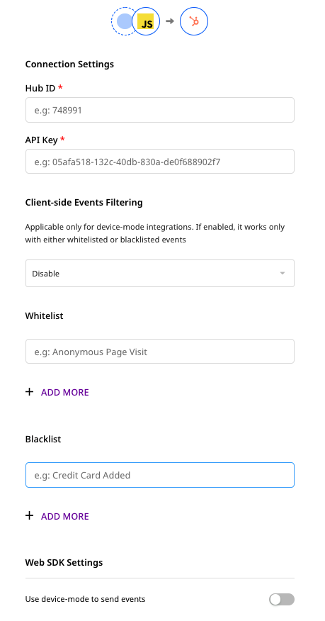
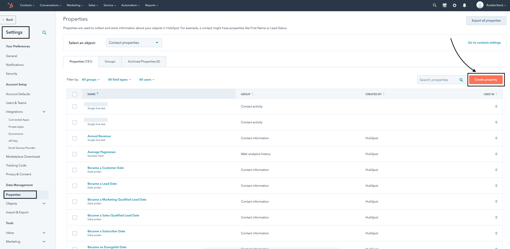

# HubSpot

[HubSpot](https://www.hubspot.com/) is a leading marketing and sales platform that helps you track leads as well as inbound marketing and sales.

RudderStack supports HubSpot as a destination where you can seamlessly send your event data.

<div class="successBlock">

Find the open-source transformer code for this destination in our <a href="https://github.com/rudderlabs/rudder-transformer/tree/master/v0/destinations/hs">GitHub repo</a>.
</div>

## Getting started

Before configuring HubSpot as a destination in RudderStack, verify if the source platform is supported by HubSpot by referring to the table below:

| **Connection Mode** | **Web**       | **Mobile**    | **Server**    |
| :------------------ | :------------ | :------------ | :------------ |
| **Device mode**     | **Supported** | -             | -             |
| **Cloud mode**      | **Supported** | **Supported** | **Supported** |

<div class="infoBlock">

To know more about the difference between cloud mode and device mode in RudderStack, refer to the <a href="https://rudderstack.com/docs/rudderstack-cloud/rudderstack-connection-modes/">RudderStack Connection Modes</a> guide.
</div>

Once you have confirmed that the source platform supports sending events to HubSpot, follow these steps:

1. From your [RudderStack dashboard](https://app.rudderstack.com/), add the source. Then, from the list of destinations, select **HubSpot**.

<div class="infoBlock">

Follow our guide on <a href="https://rudderstack.com/docs/connections/adding-source-and-destination-rudderstack/">Adding a Source and Destination in RudderStack</a> for more information.
</div>

2. Assign a name to the destination and click on **Next**. You should then see the following screen:



## Connection settings

To successfully configure HubSpot as a destination, you'll need to configure the following settings:

- **Hub ID**: Enter your HubSpot Hub ID. For more information on obtaining the Hub ID, refer to the [HubSpot support guide](https://knowledge.hubspot.com/account/manage-multiple-hubspot-accounts#identify-the-current-account-s-hub-id).
- **API Key**: Enter your HubSpot API key. For more information on obtaining the API key, refer to the [HubSpot support guide](https://knowledge.hubspot.com/integrations/how-do-i-get-my-hubspot-api-key).

<div class="warningBlock">

The HubSpot API Key is mandatory for sending the data to Hubspot via the RudderStack cloud mode.
</div>

### Client-side events filtering

<div class="infoBlock">

This option is applicable only if you're sending events to HubSpot via the web device mode. Refer to the <a href="https://www.rudderstack.com/docs/stream-sources/rudderstack-sdk-integration-guides/event-filtering/">Client-side Event Filtering</a> guide for more information on this feature.
</div>

### Web SDK settings

- **Use device mode to send events**: Enable this setting to send events via the [RudderStack device mode](https://www.rudderstack.com/docs/rudderstack-cloud/rudderstack-connection-modes/#device-mode).

<div class="infoBlock">

You can change the setting to enable or disable device mode to send events at any point. However, note that you will need to refresh your web page for the changes to reflect.
</div>

## Page

The `page` call lets you record your website's page views with any additional relevant information about the viewed page.

<Tabs>
  <TabList>
    <Tab>Cloud mode</Tab>
    <Tab>Device mode</Tab>
  </TabList>
    <TabPanels>
      <TabPanel>
        <div class="warningBlock">
        RudderStack does not support sending the <code class="inline-code">page</code> calls to HubSpot via the cloud mode.
        </div>
      </TabPanel>
      <TabPanel>
        To send the data to HubSpot, an initial <code class="inline-code">page</code> call is required. For more information on the <code class="inline-code">page</code> call, refer to our <a href="https://rudderstack.com/docs/rudderstack-api/api-specification/rudderstack-spec/">RudderStack API Specification</a> documentation.
      </TabPanel>
    </TabPanels>
</Tabs>


## Identify

RudderStack sends the `identify` call to create or update a contact in HubSpot. The user's email ID must be present in the `identify` call's `traits`.

<Tabs>
  <TabList>
    <Tab>Cloud mode</Tab>
    <Tab>Device mode</Tab>
  </TabList>
    <TabPanels>
      <TabPanel>
        In the cloud mode, the <code class="inline-code">identify</code> call will create or update a contact in HubSpot. You are not required to call <code class="inline-code">page</code> or <code class="inline-code">track</code> later in order to create the contact.
      </TabPanel>
      <TabPanel>
        In the device mode, you must call either <code class="inline-code">page</code> or <code class="inline-code">track</code> after the <code class="inline-code">identify</code> call to create a contact. The previously made <code class="inline-code">page</code> and <code class="inline-code">track</code> calls will automatically be associated with that contact once they are identified.
      </TabPanel>
    </TabPanels>
</Tabs>

A sample `identify` call is as shown:

```javascript
rudderanalytics.identify({
  firstName: "Tintin",
  city: "Brussels",
  country: "Belgium",
  phone: "1234567890",
  email: "tintin@twentiethcentury.com",
  custom_flavor: "chocolate",
  custom_date: 1574769933368,
  custom_date1: new Date("2019-10-14T11:15:53.296Z"),
})
```

### Special fields

HubSpot supports the following traits as special fields:

- `address`
- `city`
- `companyName`
- `email`
- `firstName`
- `lastName`
- `position`
- `phone`
- `zip`

### Custom properties

RudderStack supports sending custom properties to HubSpot via the `identify` call. These properties will update the `contact` property you have **already created** in HubSpot, as shown:



<div class="infoBlock">

Refer to the <a href="https://knowledge.hubspot.com/crm-setup/manage-your-properties">HubSpot Knowledge Base</a> for more information on creating custom properties.
</div>

When you provide any custom property in the event, RudderStack automatically converts the field name into the lower case and replaces any space with an underscore. This is because HubSpot does not accept properties in the upper case and spaces.

RudderStack then maps the field values present in the `traits` to the corresponding HubSpot custom property.

<div class="warningBlock">

HubSpot discards any property that does not exist and returns a <strong>400 Bad Request</strong> error.
</div>

### Dates

For sending properties of type `date`, send them as the epoch time or as a `date` object. RudderStack will convert it to the required HubSpot format (midnight UTC).

## Track

A `track` call lets you record various user actions and any properties associated with them.

To associate a `track` call with a user, you need to specify the user's `email` under `context.traits` . Additionally, RudderStack associates the `track` events with the same user after an `identify` request is successfully made.

A sample `track` event is as shown:

```javascript
rudderanalytics.track(
  "Purchase", {
    value: 30,
  }, {
    context: {
      traits: {
        firstname: "Tintin",
        city: "Brussels",
        country: "Belgium",
        phone: "1234567890",
        email: "tintin@twentiethcentury.com",
      },
    },
  }
)
```

### Revenue events

For the revenue events, a `value` or `revenue` key should be included in the event properties to be recorded in HubSpot.

## Screen

The `screen` call lets you record whenever your user views their mobile screen, with any additional information about the viewed screen.

If you have enabled screen views in your [Android](https://rudderstack.com/docs/stream-sources/rudderstack-sdk-integration-guides/rudderstack-android-sdk) or [iOS](https://rudderstack.com/docs/stream-sources/rudderstack-sdk-integration-guides/rudderstack-ios-sdk) app implementation, RudderStack will send this information to HubSpot.

RudderStack also forwards the `properties` you've passed along with the `screen` call without any changes.

A sample `screen` call sent via the iOS SDK is shown below:

```objectivec
[[RSClient sharedInstance] screen:@"Main"
            properties:@{@"prop_key" : @"prop_value"}];
```

## HubSpot custom objects

RudderStack supports sending the [HubSpot CRM custom object](https://developers.hubspot.com/docs/api/crm/crm-custom-objects) via the `identify` call. It expects an object named `hubspot` with the following properties:

- `contactId`
- `qualifiedName`
- `objects`

`objects` should be an array containing the objects with two properties - `objectId` and `objectType`. Also, `contactId` is the ID of your HubSpot contact. RudderStack associates the contact with the objects you provide in the `objects` array.

A sample `identify` call for HubSpot CRM custom object is shown below:

```javascript
rudderanalytics.identify("userId", {
  email: "name@domain.com",
  hubspot: {
    contactId: "512",
    qualifiedName: "p99688696_car",
    objects: [{
      objectId: "32921360",
      objectType: "car",
    }, ],
  },
})
```

## FAQs

### Where do I get the API Key and Hub ID for Hubspot?

You can get the API Key and Hub ID for Hubspot by logging into your [Hubspot account](https://app.hubspot.com/login/).

Refer to the following HubSpot guides for more details:

- [Obtaining the API Key](https://knowledge.hubspot.com/integrations/how-do-i-get-my-hubspot-api-key)
- [Obtaining the Hub ID](https://knowledge.hubspot.com/account/manage-multiple-hubspot-accounts#identify-the-current-account-s-hub-id)

### Can I use Hubspot website analytics?

Yes - RudderStack supports sending `page` calls in device mode which can be used for Hubspot website analytics.

## Contact us

For queries on any of the sections covered in this guide, you can [**contact us**](mailto:%20docs@rudderstack.com) or start a conversation in our [**Slack**](https://rudderstack.com/join-rudderstack-slack-community) community.
