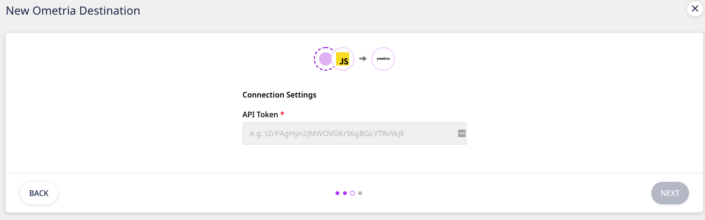

# Ometria

[**Ometria**](https://ometria.com/) is a customer data and marketing platform. It leverages AI-powered insights and cross-channel marketing to help you create personalized experiences for your customers throughout their product journey.

RudderStack supports Ometria as a destination to which you can seamlessly send your customer data.


**Find the open-source transformer code for this destination in our** [**GitHub repo**](https://github.com/rudderlabs/rudder-transformer/tree/master/v0/destinations/ometria)**.**


## Getting Started

Before configuring Ometria as a destination in RudderStack, verify if the source platform is supported by Ometria by referring to the table below:

| **Connection Mode** | **Web** | **Mobile** | **Server** |
| :--- | :--- | :--- | :--- |
| **Device mode** | - | - | - |
| **Cloud** **mode** | **Supported** | **Supported** | **Supported** |


To know more about the difference between Cloud mode and Device mode in RudderStack, read the [**RudderStack connection modes**](https://docs.rudderstack.com/get-started/rudderstack-connection-modes) guide.


Once you have confirmed that your source platform supports sending events to Ometria, follow these steps:

* From your [**RudderStack dashboard**](https://app.rudderstack.com/), add the source. From the list of destinations, select **Ometria**.


Follow our guide on [**Adding a Source and Destination in RudderStack**](https://docs.rudderstack.com/how-to-guides/adding-source-and-destination-rudderstack) for more information.


* Assign a name to the destination and click on **Next**. You should then see the following screen:



### Connection Settings

This section details the connection settings required to configure Ometria as a destination in RudderStack.

* Enter your Ometria **API Token**.


To get your API key go to your Ometria dashboard, navigate to **Settings**, and click on the **API Keys** tab.


* Under **Contact Settings**, you can choose the **Marketing Optin** status from the dropdown list. By default, it is set to **Explicitly Opted Out**. The different options are:

  * **Explicitly Opted In**: The customer is eligible for marketing
  * **Explicitly Opted Out**: The customer is not eligible for marketing
  * **Not Specified**: No option is specified


You can also pass this value in the `identify` call - refer to the **Identify** section below for more details. Note that the value set via the `identify` call will have a higher precedence.


* In the **SMS Channel Settings**, you can set **Allow Marketing** to **True** or **False**. This setting determines whether the contact is opted in or out for SMS marketing. By default, it is set to **False**.

* Set **Allow Transactional** to either **True** or **False**. This setting determines whether the contact is opted in or out for transactional SMSes. By default, it is set to **False**.


You can additionally set the values for **Allow Marketing** and **Allow Transactional** via the `identify` call - refer to the **Identify** section below for more details. Note that the value set via the `identify` call will have a higher precedence.


* Finally, click on **Next**. Ometria will now be enabled as a destination in RudderStack.

## Identify

The `identify` call lets you add a new contact or update an already existing contact in Ometria.


Note that `listingId` and `email` fields are the mandatory fields for the `identify` call.



For more information on the `identify` call, refer to the [**RudderStack Events Specification**](https://docs.rudderstack.com/rudderstack-api/api-specification/rudderstack-spec/identify) guide.


You can set the values for the **Marketing Optin**, **Allow Marketing**, and **Allow Transactional** fields from RudderStack dashboard. You can also send these values using an `integrations` object in the `identify` event payload, **which will have higher precedence**. The SMS channel fields `dt_updated_marketing` and `dt_updated_transactional` can also be passed using this object.


The `listingId` is the ID specific to a contact in a particular Ometria collection. Note that the `listingId` specified in the `integrations` object will have a higher precedence than the one present in the traits.

A sample `identify` call is as shown:

```javascript
rudderanalytics.identify(
  "userId",
  {
    listingId: "listingId123",
    email: "sampleuser@testmail.com",
    firstName: "Demo",
    lastName: "Example",
    phoneNumber: "+123451212260",
    custom_fields: {
      field1: "val1",
    }
  },
  {
    integrations: {
      Ometria: {
        marketingOptin: "EXPLICITLY_OPTEDIN",
        allow_marketing: "true",
        allow_transactional: "true",
      }
    }
  }
);
```

A few things to keep in mind while making the `identify` call:

* The `phoneNumber` field must follow the [**E.164**](https://en.wikipedia.org/wiki/E.164) format. Otherwise, it will be set to `null`.

* The `custom_fields` are mapped to the `properties` and will be the used in the `track` call too.

* If `custom_fields` is not provided, then RudderStack will create that object with extra fields. Note that these fields must be different from the ones mentioned in the mapping list mentioned in the **Identify Mapping** section below, i.e, the non-default fields.

* Inside the `integrations` object, you can additionally send two timestamps - `dt_updated_marketing` and `dt_updated_transactional`. These timestamps must follow the [**ISO-8601**](https://en.wikipedia.org/wiki/ISO_8601) format.

### Identify Mapping

The following table includes all `identify` fields with their relative mapping to the Ometria fields:

| **RudderStack Field**                      | **Ometria Field**        |
| :----------------------------------------- | :----------------------- |
| `userId` / `anonymousId`                   | `customer_id`            |
| `email`                                    | `email`                  |
| `listingId`                                | `id`                     |
| `firstName`/`first_name`/`firstname`       | `firstname`              |
| `middleName`/ `middle_name` / `middlename` | `middlename`             |
| `lastName`/`last_name`/`lastname`          | `lastname`               |
| `phoneNumber`                              | `phone_number`           |
| `collection`                               | `@collection`            |
| `prefix`                                   | `prefix`                 |
| `dateOfBirth`                              | `date_of_birth`          |
| `countryId`                                | `country_id`             |
| `timezone`                                 | `timezone`               |
| `timestampAcquired`                        | `timestamp_acquired`     |
| `timestampSubscribed`                      | `timestamp_subscribed`   |
| `timestampUnsubscribed`                    | `timestamp_unsubscribed` |
| `storeIds`                                 | `store_ids`              |
| `gender`                                   | `gender`                 |
| `removeFromLists`                          | `@remove_from_lists`     |
| `addToLists`                               | `@add_to_lists`          |
| `custom_fields`                            | `properties`             |
| `forceOptin`                               | `@force_optin`           |
| `merge`                                    | `@merge`                 |


In addition to the above fields, the customer name can also be sent using the `name` field. If the name consists of two words, then `firstname` and `lastname` will be automatically set.


## Track

The `track` call  lets you send custom events to Ometria. Note that `track` also supports the E-Commerce events and sends them using the **Ometria Order Object**.


Note that `userId` and `email` are the mandatory fields for the `track` call.


A sample `track` call for a custom event is as shown:

```javascript
rudderanalytics.track("Sample Event", {
  event_id: "sample123",
  timestamp: "2017-05-01T14:00:00Z",
  profile_id: "sample",
  custom_fields: {
    field1: "val1",
  },
});
```
A few things to note:

* The event name must be provided in the `track` call.

* The `custom_fields` property is mapped to the `properties` object in Ometria. If it is not provided, the non-default Ometria fields will be taken as custom fields.

* The `timestamp` field follows the [**ISO-8601**](https://en.wikipedia.org/wiki/ISO_8601) format. If it is not specified in the correct format, the call will be dropped - i.e., not be sent to Ometria.

### Ometria Custom Event

The following table includes all the RudderStack fields set as custom events in the `track` call, with their relative mapping to the Ometria fields:

| **RudderStack Field** | **Ometria Field**      |
| :-------------------- | :----------------      |
| `event_id`            | `id`                   |
| `timestamp`           | `timestamp`            |
| `custom_fields`       | `properties`           |
| `profile_id`          | `profile_id`           |
| `email`               | `identity_email`       |
| `userId / anonymousId`| `identity_account_id`  |

### E-Commerce Events

The `track` call also lets you record order-related information like `order_id`, `grandtotal`, `timestamp`, `currency`, etc.

RudderStack will create a `customer` object with `userId`, `email`, `firstname` and `lastname` from `context.traits`.


Note that `userId` and `email` are the mandatory fields for the `customer` object.


The supported `order` E-Commerce events are as listed below:

* `order completed` / `complete`/ `order complete`
* `order shipped` / `shipped`
* `order pending` / `pending`

A sample `track` call for an E-Commerce order event is as shown:

```javascript
rudderanalytics.track("order completed", {
  order_id: "order1",
  timestamp: "2017-05-01T14:00:00Z",
  currency: "usd",
  grand_total: 1,
  field1: "val1",
  products: [
    {
      product_id: "prod123",
      quantity: 4,
      subtotal: 10,
      variant_options:[
        {
          type: "size",
          id: "newid",
          label: "5"
        }
      ]
    }
  ]
});
```

A few things to note:

* Ometria requires the `currency` field to follow the [**ISO 4217**](https://en.wikipedia.org/wiki/ISO_4217) format. If it is invalid, the event will be **dropped**.

* If `custom_fields` is not provided, the non-default fields are taken as custom fields. In the above example, `field1` will be mapped as a `custom_fields`.

* The `products` field is **not mandatory**. However, if provided, each object should contain `product_id`, `quantity`, and either `subtotal` or `unit_price`. If either of these fields are absent, then that object will be dropped and the `track` call will be made.

* RudderStack will set the `status` field according to the event name. For instance, if event name is `order pending` status will be set to `pending`.

* The field `is_valid` is always set to true.

### Track Orders Mapping

The following table includes all the fields in `track` call for E-Commerce orders, with their relative mapping to the Ometria fields:

| **RudderStack Field**   | **Ometria Field**        |
| :---------------------- | :----------------------- |
| `order_id`              | `id`                     |
| `timestamp`             | `timestamp`              |
| `grand_total`           | `grand_total`            |
| `subtotal`              | `subtotal`               |
| `discount`              | `discount`               |
| `shipping`              | `shipping`               |
| `tax`                   | `tax`                    |
| `currency`              | `currency`               |
| `web_id`                | `web_id`                 |
| `ip_address`            | `ip_address`             |
| `timestampUnsubscribed` | `timestamp_unsubscribed` |
| `channel`               | `channel`                |
| `store`                 | `store`                  |
| `payment_method`        | `payment_method`         |
| `shipping_method`       | `shipping_method`        |
| `shipping_address`      | `shipping_address`       |
| `billing_address`       | `billing_address`        |
| `coupon_code`           | `coupon_code`            |
| `custom_fields`         | `properties`             |
| **`products`**          | `lineitems`              |


`shipping_address` and `billing_address` should be an object.


Note that **`products`** is an array of objects. Every object in this array can contain the following fields:

| **RudderStack Field** | **Ometria Field**     |
| :-------------------- | :-------------------- |
| `product_id`          | `product_id`          |
| `variant_id`          | `variant_id`          |
| `quantity`            | `quantity`            |
| `sku`                 | `sku`                 |
| `unit_price`          | `unit_price`          |
| `quantity_refunded`   | `quantity_refunded`   |
| `refunded`            | `refunded`            | 
| `subtotal`            | `subtotal`            |
| `tax`                 | `tax`                 |
| `total`               | `total`               |
| `discount`            | `discount`            |
| `is_on_sale`          | `is_on_sale`          |
| `totals`              | `totals`              |
| `properties`          | `properties`          |
| **`variant_options`** | **`variant_options`** |


Ometria expects that the `product_id` field must contain a valid product ID. To create a `Product`, use the [**Ometria Product endpoint**](https://api.ometria.com/v2/push).


Note that **`variant_options`** listed above is an array of objects. It is not a mandatory field. However, if provided, each object in this array **must** contain the following fields:

| **RudderStack Field** | **Ometria Field** |
| :-------------------- | :---------------- |
| `id`                  | `id`              |
| `type`                | `type`            |
| `label`               | `label`           |

## Contact Us

If you come across any issues while configuring or using Ometria with RudderStack, you can [**contact us**](mailto:%20docs@rudderstack.com) or start a conversation on our [**Slack**](https://resources.rudderstack.com/join-rudderstack-slack) channel.
