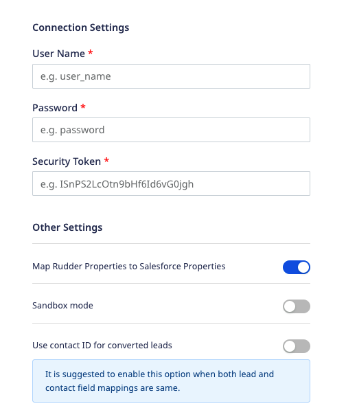

# Salesforce

[Salesforce](https://www.salesforce.com/) is an industry leader in enterprise CRM. It offers a suite of enterprise applications revolving around marketing automation, customer engagement and support, application development as well as analytics.

RudderStack lets you identify your leads in Salesforce without having to use the REST APIs.

<div class="successBlock">

Find the open-source transformer code for this destination in the <a href="https://github.com/rudderlabs/rudder-transformer/tree/master/v0/destinations/salesforce" target="_blank">GitHub repository</a> .
</div>

## Getting started

<div class="infoBlock">

It is recommended that you create a new Salesforce account to use with RudderStack. This will protect any confidential information present in your existing Salesforce account. However, this is <strong>entirely optional</strong>. You can also use your existing account to configure Salesforce as a destination.

To create a new account, go to <strong>Setup</strong> > <strong>Administration Setup</strong> > <strong>Users</strong> > <strong>New User</strong> and select <strong>System Administrator</strong> as the profile type. This should give RudderStack the required permissions to access the API.
</div>

Before configuring Salesforce as a destination in RudderStack, verify if the source platform is supported by referring to the table below:

| **Connection Mode** | **Web** | **Mobile** | **Server** |
| :--- | :--- | :--- | :--- |
| **Device mode** | - | - | - |
| **Cloud** **mode** | **Supported** | **Supported** | **Supported** |

<div class="infoBlock">

To know more about the difference between cloud mode and device mode in RudderStack, refer to the <a href="https://rudderstack.com/docs/connections/rudderstack-connection-modes/">RudderStack Connection Modes</a> guide.
</div>

Once you have confirmed that the source platform supports sending events to Salesforce, follow these steps:

1. From your [RudderStack dashboard](https://app.rudderstack.com/), add the source. Then, from the list of destinations, select **Salesforce**.

<div class="infoBlock">

Follow our guide on <a href="https://rudderstack.com/docs/connections/adding-source-and-destination-rudderstack/">Adding a Source and Destination in RudderStack</a> for more information.
</div>

2. Assign a name to your destination and click on **Next**.

### Connection settings

To configure Salesforce as a destination in RudderStack, you need to specify the following settings:



- **User Name**: Enter your Salesforce username in this field.
- **Password**: Enter the password associated with the Salesforce account.
- **Security Token**: Enter your Salesforce security token.

<div class="infoBlock">

For more information on the Salesforce security token, refer to the <a href="https://help.salesforce.com/s/articleView?id=sf.user_security_token.htm&language=en_US&r=https%3A%2F%2Fwww.google.com%2F&type=5" target="_blank">Salesforce Help</a> guide.
</div>

- **Map Rudder Properties to Salesforce Properties**: This setting is enabled by default and allows you to map the RudderStack event properties to the corresponding Salesforce fields.
- **Sandbox mode**: Enable this setting if you are using a Sandbox environment for the integration.

<div class="infoBlock">

For more information on the Salesforce Sandbox mode, refer to the <a href="https://help.salesforce.com/articleView?id=sf.deploy_sandboxes_parent.htm&type=5" target="_blank">Salesforce Help</a> guide.
</div>

- **Use contact ID for converted leads**: Enable this setting if both the lead and contact field mappings are the same. 

## Identify

RudderStack lets you get the leads from your website or mobile app into Salesforce through the [`identify`](https://www.rudderstack.com/docs/rudderstack-api/api-specification/rudderstack-spec/identify/) call.

### Identifying a potential lead

The following code snippet demonstrates a sample `identify` call in RudderStack:

```javascript
rudderanalytics.identify('userid', {
  name: 'Alex Keener',
  title: 'Mr.',
  email: 'alex@example.com',
  company: 'Google Inc.',
  phone: '+1-202-555-0146',
  rating: 'Hot',
  city: 'New Orleans',
  postalCode: '90002',
  country: 'US',
  street: 'Blue Gum Street',
  state: 'LA'
}, {
  'integrations': {
    'Salesforce': true
  }
});
```

This snippet identifies a unique user based on the `userid` and the associated traits passed in the `identify` call.

When the `identify` method is called, RudderStack checks if the lead already exists using the `email` property. If yes, the lead/contact is updated with the traits passed in the `identify` call. If not, a new lead is created in Salesforce.

<div class="infoBlock">
  
  When you make an <code class="inline-code">identify</code> call with a set of user traits, RudderStack will update the appropriate record in Salesforce depending on whether it is a lead or a contact using its lead or contact ID.
</div>

<div class="warningBlock">

It is mandatory to include <code class="inline-code">'Salesforce':true</code> in every Salesforce integration object. As Salesforce has strict API limits, this is required in order to prevent the users from hitting their limits. By default, RudderStack does not send <code class="inline-code">identify</code> calls to Salesforce. Hence, any <code class="inline-code">identify</code> call that does not include <code class="inline-code">'Salesforce':true</code> in its payload will be ignored.
</div>

### Updating custom fields in Salesforce

<div class="infoBlock">

If you wish to update custom fields in Salesforce using RudderStack, make sure that you first create those fields in Salesforce before sending the data through RudderStack. For more information, refer to the <a href="https://help.salesforce.com/articleView?id=sf.adding_fields.htm&type=5" target="_blank">Salesforce Help</a> guide.
</div>

As the [Salesforce Leads API](https://developer.salesforce.com/docs/atlas.en-us.api.meta/api/sforce_api_objects_lead.htm) requires`lastName` and `company` to be present, absence of either of these fields will result in RudderStack automatically appending the `'n/a'` to both the fields - even if they have been specified in some previous request.

For example, if you want to collect a custom trait in RudderStack named `newProp`, create a field label named `newProp`. This will generate an API name as `newProp__c`. RudderStack automatically appends the `__c` to any custom trait.

<div class="warningBlock">

<strong>Make sure you are consistent with your casing</strong>. If the custom fields are created in the camel case, then make sure sure that you send the traits to RudderStack in the camel case. If you're creating the custom fields in the snake case, make sure you send the traits in the same format.
</div>

## Updating Salesforce objects

You can create or update any [Salesforce object](https://developer.salesforce.com/docs/atlas.en-us.object_reference.meta/object_reference/sforce_api_objects_list.htm) using the `identify` event. To specify the object type, follow the schema below.

RudderStack looks for the key `externalId` under `context` and determines the Salesforce object type by removing the part `Salesforce-` from the field `type`. Further, it makes a `PATCH` request if there is an `id` present in the request to update the record. Otherwise, a new record is created.

You can pass multiple object types in a single request and RudderStack will create that many requests to Salesforce.

```javascript
rudderanalytics.identify('123456',
    {
      FirstName: "John",
      LastName: "Gibbs",
      Email: "john@peterson.com"
    },
    {
      externalId: [
        {
          type: "Salesforce-Contact",
          id: "sf-contact-id"
        }
      ]
    });
```

In the example above, RudderStack updates the `Contact` object in Salesforce with `id` as `sf-contact-id` and send the `traits` object to Salesforce.

<div class="infoBlock">

By default, RudderStack creates a <code class="inline-code">Lead</code> object in Salesforce and maps the <code class="inline-code">traits</code> to it, as mentioned above. For other objects, RudderStack does not modify the <code class="inline-code">traits</code>; they are sent to Salesforce as it is.
</div>

## Supported mappings

RudderStack supports and maps the event properties to several standard fields in Salesforce, as listed in the following table:

| RudderStack property | Salesforce standard field |
| :--- | :--- |
| `address.accuracy` / `accuracy` | `Accuracy` |
| `company.annualRevenue` | `AnnualRevenue` |
| `address.city` / `city` | `City` |
| `company.name` / `company` | `Company` |
| `address.country` / `country` | `Country` |
| `address.countryCode` / `countryCode` | `CountryCode` |
| `convertedAccountId` | `ConvertedAccountId` |
| `convertedContactId` | `ConvertedContactId` |
| `convertedDate` | `ConvertedDate` |
| `convertedOpportunityId` | `ConvertedOpportunityId` |
| `createdById` | `CreatedById` |
| `createdAt` / `createddate` | `CreatedDate` |
| `description` | `Description` |
| `email` | `Email` |
| `emailBouncedDate` | `EmailBouncedDate` |
| `emailBouncedReason` | `EmailBouncedReason` |
| `firstName` | `FirstName` |
| `geocodeAccuracy` | `GeocodeAccuracy` |
| `id` | `Id` |
| `company.industry` | `Industry` |
| `individualId` | `IndividualId` |
| `isConverted` | `IsConverted` |
| `isDeleted` | `IsDeleted` |
| `isUnreadByOwner` | `IsUnreadByOwner` |
| `jigsaw` | `Jigsaw` |
| `jigsawContactId` | `JigsawContactId` |
| `lastActivityDate` | `LastActivityDate` |
| `lastModifiedById` | `LastModifiedById` |
| `lastModifiedDate` | `LastModifiedDate` |
| `lastName` | `LastName` |
| `lastReferencedDate` | `LastReferencedDate` |
| `lastViewedDate` | `LastViewedDate` |
| `address.latitude` / `latitude` | `Latitude` |
| `LeadSource` | `LeadSource` |
| `address.longitude` / `longitude` | `Longitude` |
| `masterRecordId` | `MasterRecordId` |
| `name` | `Name` |
| `company.employee_count` | `NumberOfEmployees` |
| `ownerId` | `OwnerId` |
| `phone` | `Phone` |
| `photoUrl` | `PhotoUrl` |
| `address.postalCode` / `postalCode` | `PostalCode` |
| `rating` | `Rating` |
| `salutation` | `Salutation` |
| `address.state` / `state` | `State` |
| `address.stateCode` / `stateCode` | `StateCode` |
| `status` | `Status` |
| `address.street` / `street` | `Street` |
| `systemModstamp` | `SystemModstamp` |
| `title` | `Title` |
| `website` | `Website` |

## FAQ

### Which Salesforce Edition should I use to access the API?

Before connecting to the Salesforce API with RudderStack, make sure you are using the right Salesforce edition. You must have either the **Enterprise**, **Unlimited**, **Developer**, or **Performance** editions to access the API.

Follow this [Salesforce help article](https://help.salesforce.com/articleView?id=000326486&type=1&mode=1) for more information.

### Where do I obtain the Security Token?

You can find your security token under **Setup** > **Personal Setup** > **My Personal Information** > [Reset My Security Token](https://na15.salesforce.com/_ui/system/security/ResetApiTokenEdit).

### How do I check the number of Salesforce API calls left for the day?

To check the number of Salesforce API calls, go to **Setup** > **Administration Setup** > **Company Profile** > **Company Information**. You should then be able to see a field called **API Requests, Last 24 Hours**, which contains the number of API calls left for the day.

### What if I don't include `'Salesforce': true` in my `identify` call?

Salesforce has a very strict API limit. Moreover, RudderStack does not send any `identify` calls to Salesforce by default. If you don't include `'Salesforce':true` in your `identify` call payload, the call will be simply ignored.

## Contact us

For queries on any of the sections covered in this guide, you can [contact us](mailto:%20docs@rudderstack.com) or start a conversation in our [Slack](https://rudderstack.com/join-rudderstack-slack-community) community.
