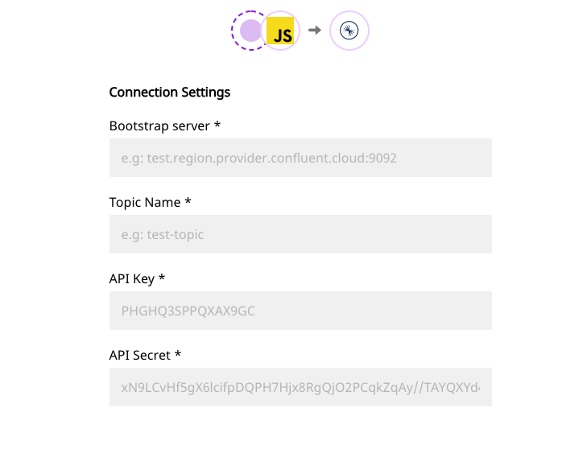

# Confluent Cloud

[Confluent Cloud](https://www.confluent.io/confluent-cloud/) is a cloud-native, fully-managed event streaming platform. Powered by Apache Kafka, it is simple, secure, and simplifies data ingestion and processing on all the major clouds. With Confluent Cloud, you can easily handle large-scale data workloads without compromising on performance.

RudderStack allows you to seamlessly configure Confluent Cloud as a destination to send your event data.


**Find the open-source transformer code for this destination in our** [**GitHub repo**](https://github.com/rudderlabs/rudder-transformer/tree/master/v0/destinations/confluent_cloud)**.**


## Configuring Confluent Cloud in RudderStack

To enable sending data to Confluent Cloud, you will first need to add it as a destination to the source you are sending your event data. Once the destination is enabled, events from RudderStack will start flowing to Confluent Cloud.

Before configuring your source and destination on [RudderStack](https://app.rudderstack.com/), check whether Confluent Cloud supports the platform you are working on by referring to the table below:

| **Connection Mode** | **Web** | **Mobile** | **Server** |
| :--- | :--- | :--- | :--- |
| **Device Mode** | - | - | - |
| **Cloud Mode** | **Supported** | **Supported** | **Supported** |


 To know more about the difference between Cloud mode and Device mode in RudderStack, read the [RudderStack connection modes](https://docs.rudderstack.com/get-started/rudderstack-connection-modes) guide.


Once you have confirmed that the platform supports sending events to Confluent Cloud, perform the steps mentioned below:

* Choose a source to which you would like to add Confluent Cloud as a destination.


Please follow our guide on [How to Add a Source and Destination in RudderStack](https://docs.rudderstack.com/how-to-guides/adding-source-and-destination-rudderstack) to add a source and destination in RudderStack.


* Select the destination as **Confluent Cloud**. Give your destination a name, and then click on **Next**.
* In the **Connection Settings**, ****fill the required fields with the relevant information and click **Next.**

The required fields are as follows:

* **Bootstrap server**: Enter your bootstrap server information here. This is in the format `hostname:`:`port` . You will get this information in your cluster settings.
* **Topic Name**: Enter the name of the Kafka topic in this field.
* **API Key**: This is the key you need to generate in the Confluent Cloud UI to give RudderStack the required API access. Enter the key in this field.
* **API Secret**: Enter the API Secret in this field - you can generate this in the Confluent Cloud UI.

## Partition Key

RudderStack uses `userId` as the partition key of a given message. 


If `userId` is not present in the payload, then `anonymousId` is used.


If you have a multi-partitioned topic, then the records of the same `userId` \(or `anonymousId` in the absence of `userId`\) will always go to the same partition.

## Contact Us

If you come across any issues while configuring Confluent Cloud with RudderStack, please feel free to [contact us](mailto:%20docs@rudderstack.com) or start a conversation on our [Slack](https://resources.rudderstack.com/join-rudderstack-slack) channel. We will be happy to help you.

