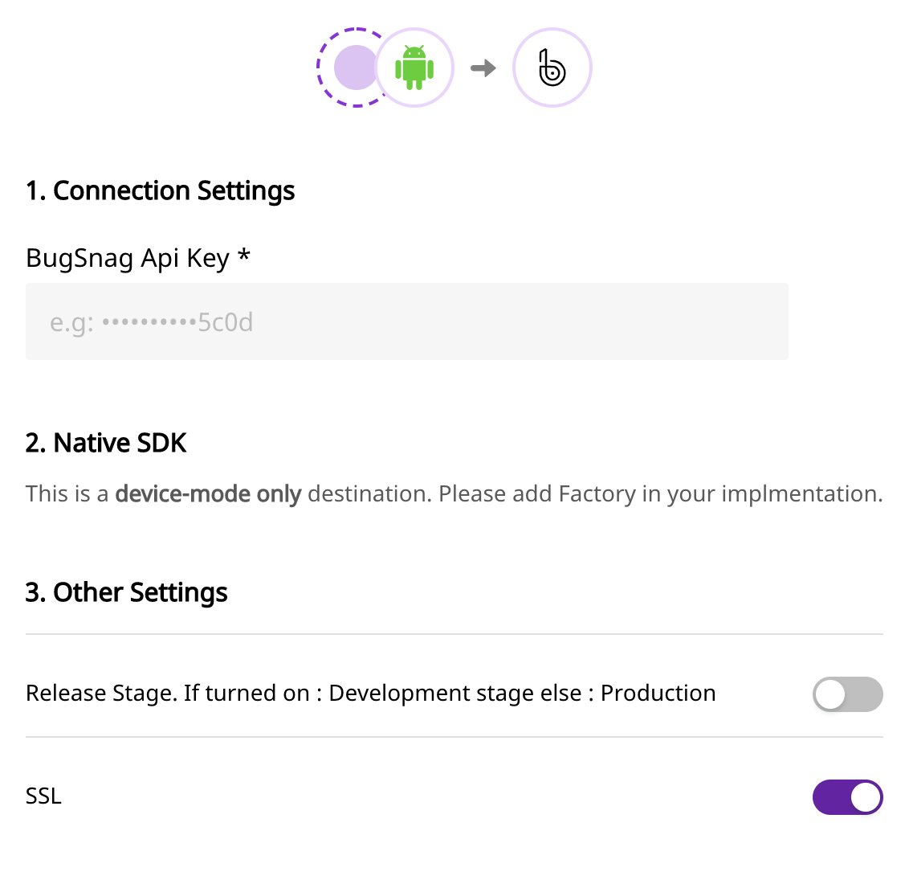

# Bugsnag

Bugsnag provides error reporting libraries for [every major software platform](https://docs.bugsnag.com/platforms/) which automatically detect and report errors in your applications, and capture diagnostic data required to help you reproduce and fix each error.

Bugsnag monitors application stability so you can make data-driven decisions on whether you should be building new features, or fixing bugs.

## Getting Started

To enable sending data when application crashes to Bugsnag, you will first need to add it as a destination to the source from which you are sending your event data. Once the destination is enabled, events from our SDK will start flowing to Bugsnag.

| **Connection Mode** | **Web**       | **Mobile**    | **Server** |
| :------------------ | :------------ | :------------ | :--------- |
| **Device mode**     | **Supported** | **Supported** | -          |
| **Cloud mode**      | -             | -             | -          |

<div class="infoBlock">

To know more about the difference between Cloud mode and Device mode in RudderStack, read the <a href="https://rudderstack.com/docs/connections/rudderstack-connection-modes/">RudderStack connection modes</a> guide.

</div>

Once you have confirmed that the platform supports sending events to Bugsnag, perform the steps below:

- From your [RudderStack dashboard](https://app.rudderlabs.com/), add the source. From the list of destinations, select **Bugsnag.**

<div class="infoBlock">

Please follow our guide on <a href="https://rudderstack.com/docs/connections/adding-source-and-destination-rudderstack/">How to Add a Source and Destination in RudderStack</a> to add a source and destination in RudderStack.

</div>

- Give a name to the destination and click on **Next**. You should then see the following screen:
<span class="imageTitle">Connection settings for Bugsnag</span>

- Add your API key to your connection settings. You can find your API key in your Bugsnag dashboard under “Settings”, which is located in the upper left-hand corner.
- Click on **Next** to complete the configuration. Bugsnag should now be added and enabled as a destination in RudderStack.

## Adding Bugsnag to your Mobile project

<!--

Please follow the steps below to add Bugsnag to your Android Project:

- Add the following `repository` to your `app/build.gradle` file.

```groovy
repositories {
    mavenCentral()
}
```

- After that, add the following `dependencies` in the same file:

```groovy
implementation 'com.rudderstack.android.sdk:core:1.0.1-beta.1'
implementation 'com.rudderstack.android.integration:bugsnag:0.1.0-beta.1'
```

- Finally, change the initialization of your `RudderClient` in your `Application` class

```kotlin
val rudderClient = RudderClient.getInstance(
    this,
    <YOUT_WRITE_KEY>,
    RudderConfig.Builder()
        .withDataPlaneUrl(<YOUR_DATA_PLANE_URL>)
        .withFactory(BugsnagIntegrationFactory.FACTORY)
        .build()
)
```




Follow these steps to add Bugsnag to your iOS project:

- Go your `Podfile` and add the `Rudder-Bugsnag` extension

```ruby
pod 'Rudder-Bugsnag', '0.1.0-beta.1'
```

- After adding the dependency followed by `pod install` , you can add the imports to your `AppDelegate.m` file as shown:

```objectivec
#import "RudderBugsnagFactory.h"
```

- Finally, change the initialization of your `RudderClient` as shown:

```objectivec
RudderConfigBuilder *builder = [[RudderConfigBuilder alloc] init];
[builder withDataPlaneUrl:<YOUR_DATA_PLANE_URL>];
[builder withFactory:[RudderBugsnagFactory instance]];
[RudderClient getInstance:<YOUR_WRITE_KEY> config:[builder build]];
```


-->

<Tabs>
  <TabList>
    <Tab>Android</Tab>
    <Tab>iOS</Tab>
  </TabList>
    <TabPanels>
      <TabPanel>
        Please follow the steps below to add Bugsnag to your Android Project:
<ul>
<li>Add the following <code class="inline-code">repository</code> to your <code class="inline-code">app/build.gradle</code> file.
<span>

```groovy
repositories {
    mavenCentral()
}
```
</span>
</li>
<li>After that, add the following <code class="inline-code">dependencies</code> in the same file:
<span>

```groovy
implementation 'com.rudderstack.android.sdk:core:1.0.1-beta.1'
implementation 'com.rudderstack.android.integration:bugsnag:0.1.0-beta.1'
```
</span>
</li>
<li>Finally, change the initialization of your <code class="inline-code">RudderClient</code> in your <code class="inline-code">Application</code> class
<span>

```kotlin
val rudderClient = RudderClient.getInstance(
    this,
    <YOUT_WRITE_KEY>,
    RudderConfig.Builder()
        .withDataPlaneUrl(<YOUR_DATA_PLANE_URL>)
        .withFactory(BugsnagIntegrationFactory.FACTORY)
        .build()
)
```
</span>
</li>
</ul>
      </TabPanel>
      <TabPanel>
        Follow these steps to add Bugsnag to your iOS project:
<ul>
<li>Go your <code class="inline-code">Podfile</code> and add the <code class="inline-code">Rudder-Bugsnag</code> extension
<span>

```ruby
pod 'Rudder-Bugsnag', '0.1.0-beta.1'
```
</span>
</li>
<li>After adding the dependency followed by <code class="inline-code">pod install</code> , you can add the imports to your <code class="inline-code">AppDelegate.m</code> file as shown:
<span>

```objectivec
#import "RudderBugsnagFactory.h"
```
</span>
</li>
<li>Finally, change the initialization of your <code class="inline-code">RudderClient</code> as shown:
<span>

```objectivec
RudderConfigBuilder *builder = [[RudderConfigBuilder alloc] init];
[builder withDataPlaneUrl:<YOUR_DATA_PLANE_URL>];
[builder withFactory:[RudderBugsnagFactory instance]];
[RudderClient getInstance:<YOUR_WRITE_KEY> config:[builder build]];
```
</span>
</li>
</ul>
      </TabPanel>
    </TabPanels>
</Tabs>

## Identify

The `identify` call lets you associate a user to their actions and capture all the relevant traits about them. This information includes a unique `userid` as well as any optional information such as name, email address, etc.

An example `identify` call from our JS source looks like this:

```javascript
rudderanalytics.identify("abc123", {
  name: "Foo Bar",
  email: "foo@bar.com",
});
```

Bugsnag will show you the `userId` and `traits` in the Users tab of each error.

## Error Reporting

Along with user-specific information, you can also use Bugsnag to track handled exceptions data to your dashboard using Bugsnag’s native methods. You can find the documentation for these functions [on their website](https://docs.bugsnag.com/platforms/browsers/#reporting-handled-exceptions).

## FAQ

#### Where do I find the API Key?

You can find your API Key on your Bugsnag [Project Settings page](https://bugsnag.com/dashboard).

#### What is meant by Release Stage?

You can distinguish errors that happen in different stages of your app’s release process e.g `production`, `development`, etc.

#### Do I need to use SSL?

You should definitely use SSL When Sending Data to Bugsnag specifically from JS source.

## Contact Us

If you come across any issues while configuring Bugsnag with RudderStack, please feel free to [contact us](mailto:%20docs@rudderstack.com) or start a conversation on our [Slack](https://rudderstack.com/join-rudderstack-slack-community) channel. We will be happy to help you.
