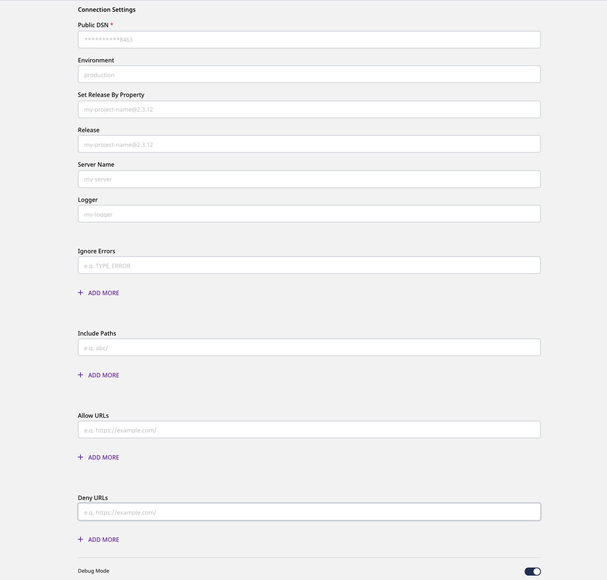

# Sentry

[**Sentry**](https://sentry.io/about/)Sentry is a popular error monitoring and reporting tool. It is open-source and enables you to monitor and track real-time errors and crashes in your app.

RudderStack supports Sentry as a destination to which you can send your event data directly.

## Getting Started

Before configuring Sentry as a destination in RudderStack, verify if Sentry supports the source platform you are sending the events from by referring to the following table:

| **Connection Mode** | **Web**       | **Mobile** | **Server** |
| :------------------ | :------------ | :--------- | :--------- |
| **Device mode**     | **Supported** | -          | -          |
| **Cloud mode**      | -             | -          | -          |


To know more about the difference between Cloud mode and Device mode in RudderStack, read the [**RudderStack connection modes**](https://docs.rudderstack.com/get-started/rudderstack-connection-modes) guide.


Once you have confirmed that the source platform supports sending events to Sentry, follow these steps:

* From your [**RudderStack dashboard**](https://app.rudderstack.com/), add the source. Then, select **Sentry** from the list of destinations.


Follow our guide on [**How to Add a Source and Destination in RudderStack**](https://docs.rudderstack.com/how-to-guides/adding-source-and-destination-rudderstack) for more information.


* Assign a name to the destination and click on **Next**. You will then see the following screen:



### Connection Settings

To successfully configure Sentry as a destination, configure the following settings:

* **Public DSN:** Enter the public DSN of your Sentry project here. **This a mandatory field**.


Refer to the [**FAQ**](#faq) section below for more information on getting your public DSN.


* **Environment:** Enter the value you want RudderStack to set as the environment configuration in your Sentry dashboard. For more information on the use of environments in Sentry, refer to their [**documentation**](https://docs.sentry.io/product/sentry-basics/environments/#creating-environments).


If you enter the value for the **Environment** field as a forward slash (`/`), new line character, space (` `), or the string `None`, Sentry will silently discard the environment configuration information without sending any error.


* **Set Release By Property:** This field helps you dynamically track the application version in Sentry. The property set here will be searched in the global window object. If found, RudderStack will use that particular version. Otherwise, the value set in the **Release** field will be used by default.


Suppose you've set the **Set Release By Property** field to the value `new_custom_version` and RudderStack finds `window.new_custom_version=2.4.5` in the `window` object. In this case, RudderStack will send the value `2.4.5` as the app version to Sentry. Otherwise, it will look for the value input in the **Release** field and send it as the app version.


* **Release:** This field is used for tracking your application's version in Sentry.

* **Server Name:** This option is used to track the host on which the client is running. You can enter the server name or even the Device ID in this field.

* **Logger:** The name you want Sentry to use as logger. For more information on Sentry's logging feature, refer to their [**docs**](https://docs.sentry.io/platforms/python/guides/logging/).

* **Ignore Errors:** This option refers to a list of error messages that you do not want Sentry to notify you. You can enter this list as a string or a regular expression.

* **Include Paths:** This field should contain the regex patterns of URLs that are part of the app in the stack trace. The other frames will appear as collapsed in the Sentry dashboard.

* **Allow URLs:** This is the list of the regex patterns or exact URL strings - errors from which need to be exclusively sent to Sentry. The URL of the actual JavaScript files should match the whitelist URLs.

* **Deny URLs:** This field refers to the list of regex patterns or exact URL strings for which the errors need to be ignored.

* **Debug Mode:** In debug mode, no events are sent to your Sentry instance. You can set this option to **true** or **false** to enable or disable this feature. By default, it is set to **false**.


## Identify

When an `identify` call is made, RudderStack calls [**`Sentry.setUser`**](https://docs.sentry.io/platforms/javascript/enriching-events/identify-user/) by passing the user traits.


RudderStack discards the `identify` call if none of the `userId`, `userName`, `email`, or `ip_address` is present. Atleast one of these four fields is needed to capture the user information. For more information, refer to the [**Sentry documentation**](https://docs.sentry.io/platforms/javascript/enriching-events/identify-user/).



RudderStack maps `userId` to `id` while setting the user in Sentry.


A sample `identify` call is as shown:

```javascript
rudderanalytics.identify("userid", {
  name: "Name",
  email: "name@website.com",
});
```

## FAQ

### How do I get the public DSN of my Sentry Project?

To get your public DSN, follow these steps:

* Log into your [**Sentry account**](https://sentry.io/auth/login/).
* In the left navigation bar, go to **Projects** .
* Click on the right-most settings icon. This will open the settings window.
* Click on **Client Keys (DSN)** under **SDK Setup**.
* Copy the DSN and use it in your RudderStack destination configuration.

## Contact Us

If you come across any issues while configuring or using Sentry with RudderStack, you can [**contact us**](mailto:docs@rudderstack.com) or start a conversation on our [**Slack**](https://resources.rudderstack.com/join-rudderstack-slack) channel.
