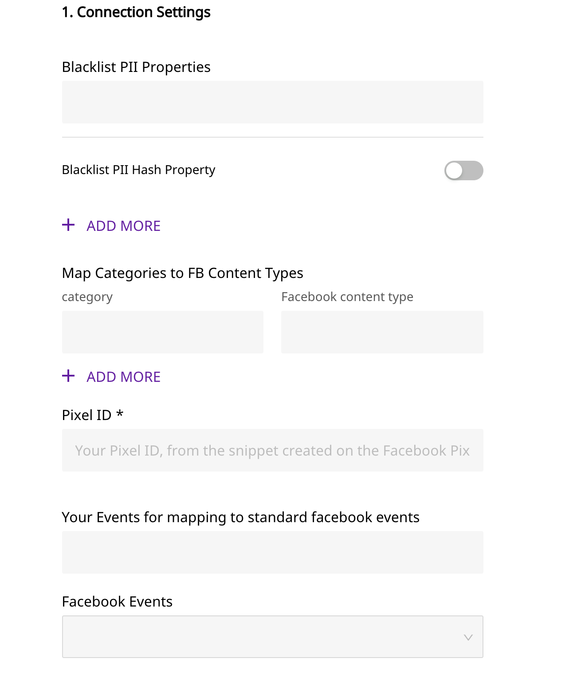
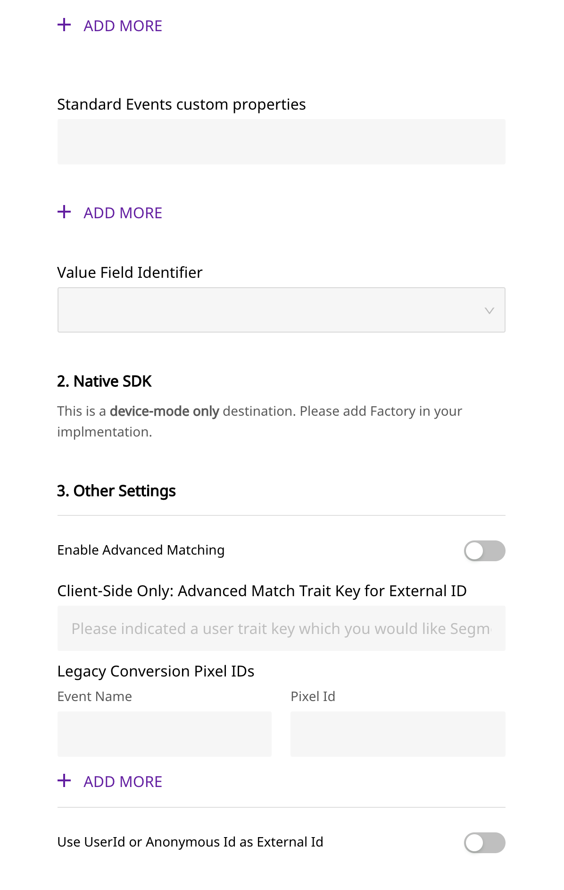
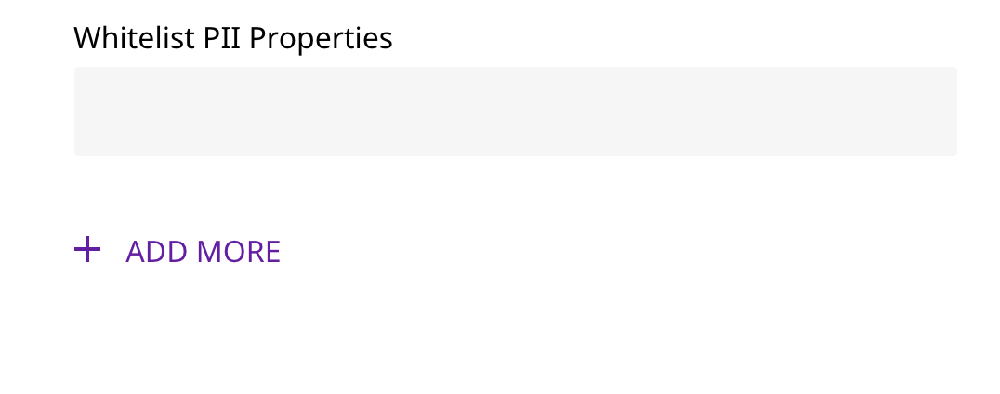

# Facebook Pixel

[Facebook Pixel](https://developers.facebook.com/docs/facebook-pixel/) is a simple JavaScript snippet that you can add to your website and track visitor activity as well as other important metrics. It allows you to measure and rudder audiences to build effective marketing and advertising campaigns.

You can now send your event data directly to Facebook Pixel through RudderStack.

## Getting Started

To enable sending your event data to Facebook Pixel, you will first need to add it as a destination to the source from which you are sending your event data.

Before configuring your source and destination on the RudderStack, please verify if the source platform is supported by Facebook Pixel, by referring to the table below:

| **Connection Mode** | **Web** | **Mobile** | **Server** |
| :--- | :--- | :--- | :--- |
| **Device mode** | **Supported** | - | - |
| **Cloud mode** | - | - | - |


To know more about the difference between Cloud mode and Device mode in RudderStack, read the [RudderStack connection modes](https://docs.rudderstack.com/get-started/rudderstack-connection-modes) guide.


Once you have confirmed that the platform supports sending events to Facebook, perform the steps below:

* From your [RudderStack dashboard](https://app.rudderlabs.com/), add the source. From the list of destinations, select **Facebook Pixel**.


Please follow our guide on [How to Add a Source and Destination in RudderStack](https://docs.rudderstack.com/how-to-guides/adding-source-and-destination-rudderstack) to add a source and destination in RudderStack.


* Give a name to the destination and click on **Next**. You should then see the following screen:







* Enter the **Pixel Id** \(required\)
* Click on **Next** to complete the configuration 

## Identify

In Facebook Pixel, the immediate updating of user properties via the `identify` call is not supported. If the advanced mapping setting is turned on in the dashboard, then the `identify` call will update Facebook Pixel with the user information.

The following snippet highlights the use of the `identify` call:

```javascript
rudderanalytics.identify("userId", userVars); // userVars is a JSON object
```

## Page

When the `page`call is made, the `track` event is sent as `PageView` to `fbq('track,'PageView')`. Any parameter sent to `rudderanalytics.page()` is ignored by RudderStack.

A sample `page` call is as shown:

```javascript
rudderanalytics.page();
```

## Track

The `track` call lets you track custom events as they occur in your web application. 

A sample call looks like the following code snippet:

```javascript
rudderanalytics.track("Product Added", {
    order_ID: "123",
    category: "boots",
    product_name: "yellow_cowboy_boots",
    price: 99.95,
    currency: "EUR",
    revenue: 2000,
    value: 3000,
    checkinDate: "Thu Mar 24 2018 17:46:45 GMT+0000 (UTC)"
});
```

In addition to the above call, a `contentType` in the integrations options can be available. If present, it will precede the default value or dashboard settings of `contentType`.

```javascript
rudderanalytics.track("Product Added", {
        order_ID: "123",
        category: "boots",
        product_name: "yellow_cowboy_boots",
        price: 99.95,
        currency: "EUR",
        revenue: 2000,
        value: 3000,
        checkinDate: "Thu Mar 24 2018 17:46:45 GMT+0000 (UTC)"
    },{
        'Facebook Pixel': { contentType: 'mycustomtype' }
    }
);
```

## Standard Events

In the dashboard, you have the option to **map your events to standard Facebook events**. RudderStack maps the events in the code and sends them to Facebook pixel as the standard event as specified. All the properties will be sent as the event properties.


Please go through our guide on [E-Commerce Event Specifications](https://docs.rudderstack.com/rudderstack-api-spec/rudderstack-ecommerce-events-specification) for more information


The mapping is done as follows in RudderStack:

| Rudder Event | Facebook Standard Event |
| :--- | :--- |
| `Product List Viewed` | `ViewContent` |
| `Product Viewed` | `ViewContent` |
| `Product Added` | `AddToCart` |
| `Order Completed` | `Purchase` |
| `Products Searched` | `Search` |
| `Checkout Started` | `InitiateCheckout` |

In Pixel, a currency for **Purchase** events is required to be specified. If not provided the default will be set to USD.

## Legacy Events

In the dashboard, the legacy conversion Pixel ids can be filled. The events which appear in the mapping are sent to Pixel with the mapped Pixel id. Conversion events only support currency and value as their event properties.

## Custom Events

Custom events are used to send any event that does not appear in any of the mappings. 

## Timestamps

Facebook Pixel uses ISO 8601 timestamp without the timezone information. 

Facebook expects them to be sent as : 

`"checkinDate", "checkoutDate", "departingArrivalDate", "departingDepartureDate", "returningArrivalDate", "returningDepartureDate", "travelEnd", "travelStart"`

## FAQs

**Where can i find the Pixel ID?**

The Facebook Pixel ID can be found in [Pixels tab in Facebook Ads Manager](https://www.facebook.com/ads/manager/pixel/facebook_pixel).

##  Contact Us

If you come across any issues while configuring Facebook Pixel with RudderStack, please feel free to [contact us](mailto:%20docs@rudderstack.com). You can also start a conversation on our [Slack](https://resources.rudderstack.com/join-rudderstack-slack) channel; we will be happy to talk to you!

