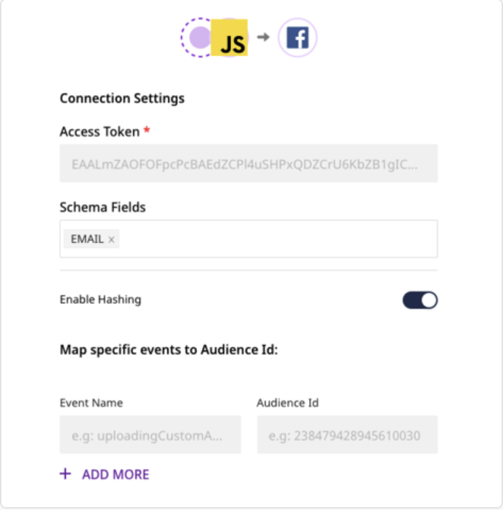
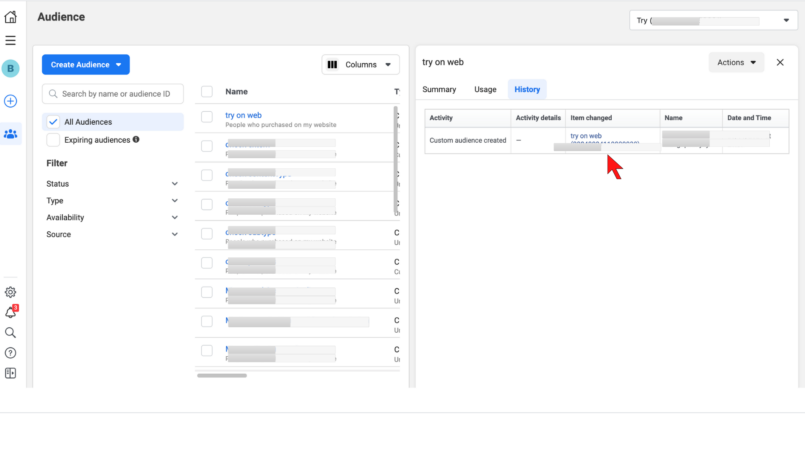
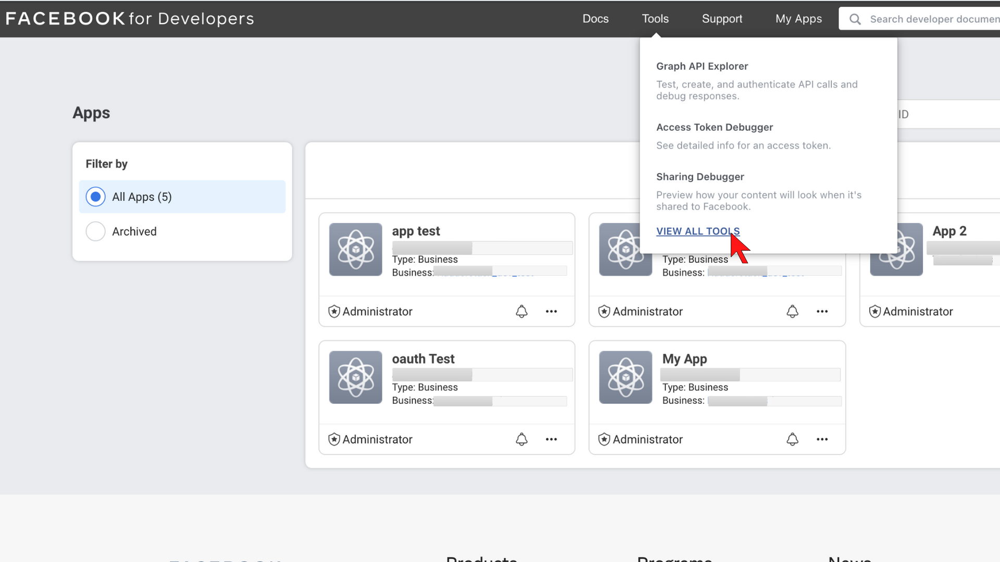
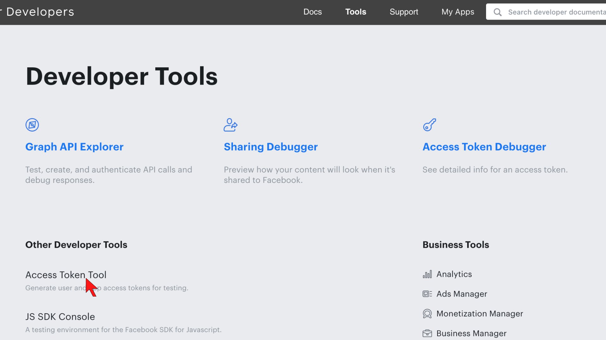
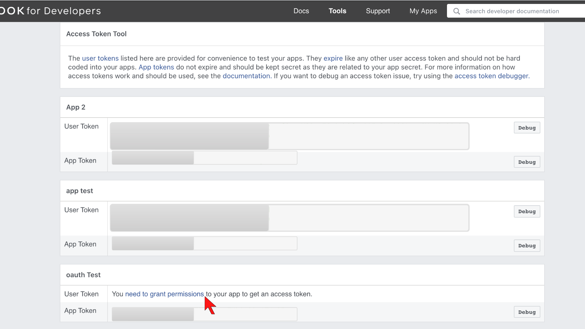

# Facebook Pixel

[Facebook Custom Audience](https://developers.facebook.com/docs/marketing-api/audiences/guides/custom-audiences) is a targeting option for Facebook advertising. It helps to find the audiences, who already knows about your business, in Facebook.

You can now send your customer data list directly for adding them to already created Facebook Custom Audience through RudderStack.

The user informations may include Email, Phone Number, Gender and many others. Find detailed information on Supported fields [here] (https://developers.facebook.com/docs/marketing-api/audiences/guides/custom-audiences#hash)



**Find the open-source transformer code for this destination in our** [**GitHub repo**](https://github.com/rudderlabs/rudder-transformer/tree/master/v0/destinations/fb_custom_audience)**.**


## Getting Started

To enable sending your event data to Facebook Custom Audience, you will first need to add it as a destination to the source from which you are sending your event data.

Before configuring your source and destination on the RudderStack, please verify if the source platform is supported by Facebook Pixel, by referring to the table below:

| **Connection Mode** | **Web** | **Mobile** | **Server** |
| :--- | :--- | :--- | :--- |
| **Device mode** | - | - | - |
| **Cloud mode** | **Supported** | **Supported** | **Supported** |


To know more about the difference between Cloud mode and Device mode in RudderStack, read the [RudderStack connection modes](https://docs.rudderstack.com/get-started/rudderstack-connection-modes) guide.


Once you have confirmed that the platform supports sending events to Facebook, perform the steps below:

* From your [RudderStack dashboard](https://app.rudderlabs.com/), add the source. From the list of destinations, select **Facebook Custom Audience**.


Please follow our guide on [How to Add a Source and Destination in RudderStack](https://docs.rudderstack.com/how-to-guides/adding-source-and-destination-rudderstack) to add a source and destination in RudderStack.


* Give a name to the destination and click on **Next**. You should then see the following screen:




The connection settings are:

* **Access Token** Enter the User Token of your business application set up for accessing the Marketing API in Facebook.

* **Schema Fields** Choose your schema fields (at least one) from the available options. This is a mandatory field. RudderStack expects each user information to consist of every schema field that has been chosen on the dashboard, in the same order. 


Any other information sent, without choosing the particular schema field on the dashboard will be ignored from our end. 


* **Map Specific Events To Audience ID**: In this section, enter the **Event Name(s)** you are going to use to send user data to Rudderstack \(for e.g.`uploadingCustomAudience`,`trimmingCustomAudience` etc.\). Also, enter the corresponding **Custom Audience ID(s)** to which the audiences will be added to or removed from.


More information on how to find your Access Token and Audienec ID can be found in our FAQs below.



You can only send `track` events, with the event names that you have specified in the dashboard.


* Some other important settings are: 

  * **Enable Hashing**: Facebook expects user data to be hash encoded using `SHA256`. Rudderstack will hash encode the user data only if this option is enabled.
  * **Disable Formatting**: Facebook has fixed data formats for all the allowed schema fields. While this option is enabled, Rudderstack will `not` perform the primary formatting of data sent by the user.
  
## The Updated Track Event Structure To Send User Data To Facebook Custom Audience

The `userListAdd` and `userListDelete` arrays containing the user data objects are expected inside the properties field of the track event.

You can send maximum `1100` user data in each of the above mentioned arrays in a single `track` event.

 * **userListAdd**: Enter the user data that needs to be added to the custom audience.
 * **userListDelete**: Enter the user data that needs to be deleted from the custom audience.
 * **sessionIdAdd**: Enter if you want to track the session for adding users to a custom audience. This is not a mandatory field. 
* **sessionIdDelete**: Enter if you want to track the session for removing users from a custom audience. This is not a mandatory   field. One `cannot` add or remove user using the same `session ID` value.



For adding the `session` information to any user addition or deletion operation, `session_id`, `batch_seq`, `last_batch_flag` fields are mandatorily expected from Facebook Marketing API. Although data additon and deletion operation is possible without explicitly specifying the session information.



 The following snippet shows an example of sending `track` event, with specified schema field data \(for e.g.`EMAIL`,`FN`\) in the [RudderStack dashboard](https://app.rudderstack.com/):


 ```javascript
rudderanalytics.track("USER_ADD", {

  "sessionIdAdd": 123,
  "sessionIdDelete":456,
  "batchSequence": 10,
  "lastBatchFlag": true,

  "userListAdd": [
        {
          "EMAIL": "name1@abc.com",
          "FN": "name1"
        },
        {
          "EMAIL": "name2@abc.com",
          "FN": "name2"
        }
      ],
      "userListDelete": [
        {
          "Email": "name3@abc.com",
          "FN": "name3"
        },
        {
          "Email": "name4@abc.com",
          "FN": "name4"
        }
      ]
});
```

## FAQs

**Where can I find the Custom Audience ID?**

To get your Custom Audience ID, go to your Facebook Ads Manager account. On the left navigation bar, select `Audiences`, choose the Ad account you have created the custom audience for. 


Click on the specific custom audience from the audience list. Click on **History** tab and you will find Audience ID under **Item Changed** column.




#### Where can I find the User Token For The Application?

In order to use the Facebook Marketing API, you need to generate an user access token. We recommend using the [Facebook Developer account](https://developers.facebook.com/) to do so, by following these steps:

* Log in with the specific Facebook account and click on **My APPS** tab.

* Create an app of `Business` type if not already created and set up your app with `Marketing API` as product

* Now click on the Tools tab , click on **Access Token Tool** Find your App listed below and click on `need to grant permissions ` on the **User Token** row.









For more information on how to use this access token, or to generate your access token via your own app, check out Facebook's [developer documentation](https://developers.facebook.com/docs/marketing-apis/overview/authentication).


##  Contact Us

If you come across any issues while configuring Facebook Custom Audience with RudderStack, please feel free to [contact us](mailto:%20docs@rudderstack.com). You can also start a conversation on our [Slack](https://resources.rudderstack.com/join-rudderstack-slack) channel; we will be happy to talk to you!


